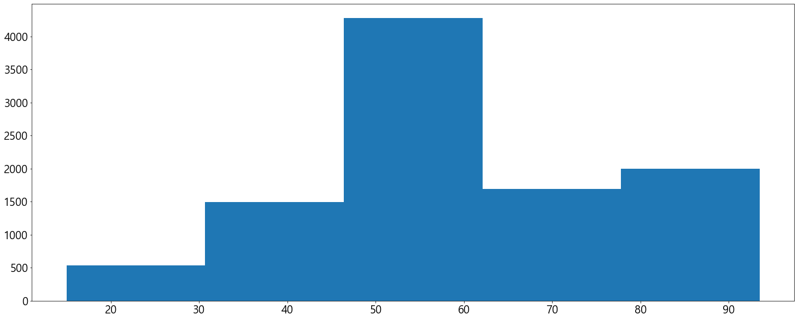
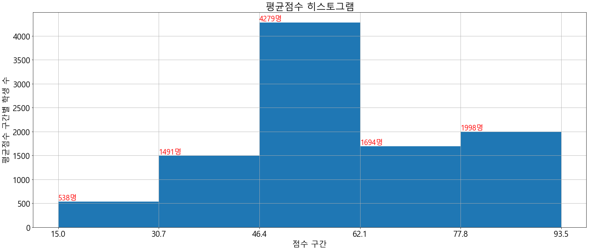

# 히스토그램

- 자료가 가질 수 있는 범위를 몇개의 **구간**으로 나누고 각 구간에 해당하는 값의 숫자 혹은 상대적 빈도를 표현하는 그래프


## 히스토그램 작성 과정
1. 자료의 갯수와 구간(최대값, 최소값)을 확인한다.
1. 자료를 몇 개의 구간으로 나눌지 분석가의 주관에 따라 결정한다.
    - 구간은 자료의 개수나 분포에 따라 달라져야 한다
    - 각 구간별로 5개 이상의 값이 들어가도록 하는 것이 좋다.
    - 너무 많은 구간을 나누지 않도록 해야 한다.(일반적으로 5~15 사이의 값)
1. Pyplot의 hist() 함수를 사용하여 히스토그램을 생성한다
    '''python
    n, bins, patches = pyplot.hist(값, 구간의_수)
    '''
    - n은 각 구간에 포함된 값의 갯수 혹은 빈도를 표현하는 리스트
    - bins는 각 구간별 경계값 리스트
    - patches는 각 구간을 그리는 matlplot 객체 리스트

## #01. 필요한 패키지 및 샘플 데이터 준비


```python
from pandas import DataFrame #모듈참조
from pandas import read_csv #모듈참조
from matplotlib import pyplot #모듈참조
#from sample import height #데이터참조
```


```python
# 성적표 데이터 -> 기술통계 수치값, 상자그림 확인을 위한 샘플 데이터
성적표csv=read_csv("http://itpaper.co.kr/demo/python/grade.csv",encoding="euc-kr")
성적표csv
```


<div>
<style scoped>
    .dataframe tbody tr th:only-of-type {
        vertical-align: middle;
    }

    .dataframe tbody tr th {
        vertical-align: top;
    }

    .dataframe thead th {
        text-align: right;
    }
</style>
<table border="1" class="dataframe">
  <thead>
    <tr style="text-align: right;">
      <th></th>
      <th>이름</th>
      <th>국어</th>
      <th>영어</th>
      <th>수학</th>
      <th>과학</th>
    </tr>
  </thead>
  <tbody>
    <tr>
      <td>0</td>
      <td>학생1</td>
      <td>98.0</td>
      <td>NaN</td>
      <td>88.0</td>
      <td>64.0</td>
    </tr>
    <tr>
      <td>1</td>
      <td>학생2</td>
      <td>88.0</td>
      <td>90.0</td>
      <td>62.0</td>
      <td>72.0</td>
    </tr>
    <tr>
      <td>2</td>
      <td>학생3</td>
      <td>92.0</td>
      <td>70.0</td>
      <td>NaN</td>
      <td>NaN</td>
    </tr>
    <tr>
      <td>3</td>
      <td>학생4</td>
      <td>63.0</td>
      <td>60.0</td>
      <td>31.0</td>
      <td>70.0</td>
    </tr>
    <tr>
      <td>4</td>
      <td>학생5</td>
      <td>100.0</td>
      <td>50.0</td>
      <td>NaN</td>
      <td>88.0</td>
    </tr>
    <tr>
      <td>...</td>
      <td>...</td>
      <td>...</td>
      <td>...</td>
      <td>...</td>
      <td>...</td>
    </tr>
    <tr>
      <td>9995</td>
      <td>학생9996</td>
      <td>63.0</td>
      <td>60.0</td>
      <td>55.0</td>
      <td>70.0</td>
    </tr>
    <tr>
      <td>9996</td>
      <td>학생9997</td>
      <td>21.0</td>
      <td>50.0</td>
      <td>55.0</td>
      <td>88.0</td>
    </tr>
    <tr>
      <td>9997</td>
      <td>학생9998</td>
      <td>98.0</td>
      <td>90.0</td>
      <td>88.0</td>
      <td>64.0</td>
    </tr>
    <tr>
      <td>9998</td>
      <td>학생9999</td>
      <td>88.0</td>
      <td>90.0</td>
      <td>62.0</td>
      <td>72.0</td>
    </tr>
    <tr>
      <td>9999</td>
      <td>학생10000</td>
      <td>92.0</td>
      <td>70.0</td>
      <td>75.0</td>
      <td>85.0</td>
    </tr>
  </tbody>
</table>
<p>10000 rows × 5 columns</p>
</div>


## #02성적표 데이터 전처리


```python
학생이름={}
for i, v in enumerate(list(성적표csv['이름'])):
    학생이름[i]=v
    
성적표df=성적표csv.rename(index=학생이름).drop('이름',axis=1)
성적표df
```


<div>
<style scoped>
    .dataframe tbody tr th:only-of-type {
        vertical-align: middle;
    }

    .dataframe tbody tr th {
        vertical-align: top;
    }

    .dataframe thead th {
        text-align: right;
    }
</style>
<table border="1" class="dataframe">
  <thead>
    <tr style="text-align: right;">
      <th></th>
      <th>국어</th>
      <th>영어</th>
      <th>수학</th>
      <th>과학</th>
    </tr>
  </thead>
  <tbody>
    <tr>
      <td>학생1</td>
      <td>98.0</td>
      <td>NaN</td>
      <td>88.0</td>
      <td>64.0</td>
    </tr>
    <tr>
      <td>학생2</td>
      <td>88.0</td>
      <td>90.0</td>
      <td>62.0</td>
      <td>72.0</td>
    </tr>
    <tr>
      <td>학생3</td>
      <td>92.0</td>
      <td>70.0</td>
      <td>NaN</td>
      <td>NaN</td>
    </tr>
    <tr>
      <td>학생4</td>
      <td>63.0</td>
      <td>60.0</td>
      <td>31.0</td>
      <td>70.0</td>
    </tr>
    <tr>
      <td>학생5</td>
      <td>100.0</td>
      <td>50.0</td>
      <td>NaN</td>
      <td>88.0</td>
    </tr>
    <tr>
      <td>...</td>
      <td>...</td>
      <td>...</td>
      <td>...</td>
      <td>...</td>
    </tr>
    <tr>
      <td>학생9996</td>
      <td>63.0</td>
      <td>60.0</td>
      <td>55.0</td>
      <td>70.0</td>
    </tr>
    <tr>
      <td>학생9997</td>
      <td>21.0</td>
      <td>50.0</td>
      <td>55.0</td>
      <td>88.0</td>
    </tr>
    <tr>
      <td>학생9998</td>
      <td>98.0</td>
      <td>90.0</td>
      <td>88.0</td>
      <td>64.0</td>
    </tr>
    <tr>
      <td>학생9999</td>
      <td>88.0</td>
      <td>90.0</td>
      <td>62.0</td>
      <td>72.0</td>
    </tr>
    <tr>
      <td>학생10000</td>
      <td>92.0</td>
      <td>70.0</td>
      <td>75.0</td>
      <td>85.0</td>
    </tr>
  </tbody>
</table>
<p>10000 rows × 4 columns</p>
</div>


```python
성적표df['평균'] =  성적표df.mean(axis=1)
성적표df
```


<div>
<style scoped>
    .dataframe tbody tr th:only-of-type {
        vertical-align: middle;
    }

    .dataframe tbody tr th {
        vertical-align: top;
    }

    .dataframe thead th {
        text-align: right;
    }
</style>
<table border="1" class="dataframe">
  <thead>
    <tr style="text-align: right;">
      <th></th>
      <th>국어</th>
      <th>영어</th>
      <th>수학</th>
      <th>과학</th>
      <th>평균</th>
    </tr>
  </thead>
  <tbody>
    <tr>
      <td>학생1</td>
      <td>98.0</td>
      <td>NaN</td>
      <td>88.0</td>
      <td>64.0</td>
      <td>83.333333</td>
    </tr>
    <tr>
      <td>학생2</td>
      <td>88.0</td>
      <td>90.0</td>
      <td>62.0</td>
      <td>72.0</td>
      <td>78.000000</td>
    </tr>
    <tr>
      <td>학생3</td>
      <td>92.0</td>
      <td>70.0</td>
      <td>NaN</td>
      <td>NaN</td>
      <td>81.000000</td>
    </tr>
    <tr>
      <td>학생4</td>
      <td>63.0</td>
      <td>60.0</td>
      <td>31.0</td>
      <td>70.0</td>
      <td>56.000000</td>
    </tr>
    <tr>
      <td>학생5</td>
      <td>100.0</td>
      <td>50.0</td>
      <td>NaN</td>
      <td>88.0</td>
      <td>79.333333</td>
    </tr>
    <tr>
      <td>...</td>
      <td>...</td>
      <td>...</td>
      <td>...</td>
      <td>...</td>
      <td>...</td>
    </tr>
    <tr>
      <td>학생9996</td>
      <td>63.0</td>
      <td>60.0</td>
      <td>55.0</td>
      <td>70.0</td>
      <td>62.000000</td>
    </tr>
    <tr>
      <td>학생9997</td>
      <td>21.0</td>
      <td>50.0</td>
      <td>55.0</td>
      <td>88.0</td>
      <td>53.500000</td>
    </tr>
    <tr>
      <td>학생9998</td>
      <td>98.0</td>
      <td>90.0</td>
      <td>88.0</td>
      <td>64.0</td>
      <td>85.000000</td>
    </tr>
    <tr>
      <td>학생9999</td>
      <td>88.0</td>
      <td>90.0</td>
      <td>62.0</td>
      <td>72.0</td>
      <td>78.000000</td>
    </tr>
    <tr>
      <td>학생10000</td>
      <td>92.0</td>
      <td>70.0</td>
      <td>75.0</td>
      <td>85.0</td>
      <td>80.500000</td>
    </tr>
  </tbody>
</table>
<p>10000 rows × 5 columns</p>
</div>


## #03히스토그램을 생성하기

1) 자료의 갯수를 센다


```python
count = len(성적표df['평균'])
print("자료의 수= ", count)
```

    자료의 수=  10000
    

2) 자료 내에서 최대/최소값을 찾는다

axis= 1을 지정하지 않을 경우 컬럼단위(세로방향)으로 집계한다


```python
max_value = 성적표df['평균'].max()
min_value = 성적표df['평균'].min()
print("최대값 = ", max_value)
print("최소값 = ", min_value)
```

    최대값 =  93.5
    최소값 =  15.0
    

3) 몇개 구간으로 나눌지 정한다


```python
step = 5
```

4) 히스토그램 생성하기<br>
그래프에 대한 한글 폰트, 글자크기, 그래픽 크기 설정


```python
pyplot.rcParams["font.family"] = 'Malgun Gothic'
pyplot.rcParams["font.size"] = 20
pyplot.rcParams["figure.figsize"] = (25,10)
```

데이터와 구간을 사용하여 히스토그램 작성하기


```python
n, bins, patches = pyplot.hist(성적표df['평균'], bins=step)
```





```python
n    #막대그래프의 높이(y축)
```


    array([ 538., 1491., 4279., 1694., 1998.])


```python
bins  #각각의 막대의 시작점과 끝점(x축)
```


    array([15. , 30.7, 46.4, 62.1, 77.8, 93.5])


- 15점~30.7점 : 538명
- 30.7점~46.4점 : 1491명
- 46.4점~62.1점 : 4279명
- 62.1점~77.8점 : 1694명
- 77.8점~93.5점 : 1998명

5) 히스토그램 보정하기


```python
# bins 리스트의 원소들을 소수점 둘째 자리에서 반올림
for i, v in enumerate(bins):
    bins[i] = round(v,1)
bins
```


    array([15. , 30.7, 46.4, 62.1, 77.8, 93.5])


```python
pyplot.hist(성적표df['평균'], bins=step)
pyplot.grid()
pyplot.xlabel('점수 구간')
pyplot.ylabel('평균점수 구간별 학생 수')
pyplot.title('평균점수 히스토그램')

# xticks(파라미터1,파라미터2)
# 첫번째 파라미터는 그래프의 x축 좌표 리스트
# 두번 재 파라미터는 각 좌표에 출력될 값에 대한 리스트
pyplot.xticks(bins,bins)

for i, v in enumerate(bins):
    if i < len(n):
        txt = "%d명" % n[i]
        pyplot.text(v, n[i], txt, fontsize=18, color ='#ff0000',
                    horizontalalignment='left', verticalalignment='bottom')

pyplot.show()

```





```python

```
