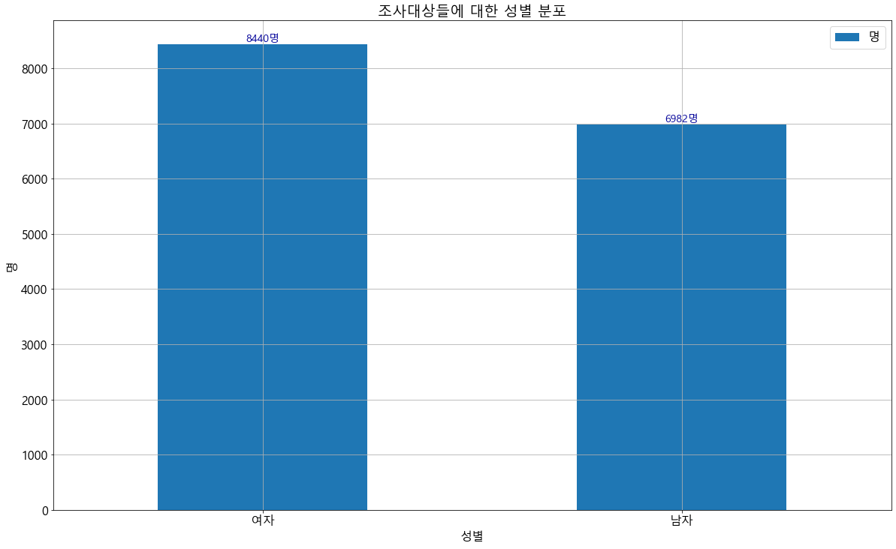
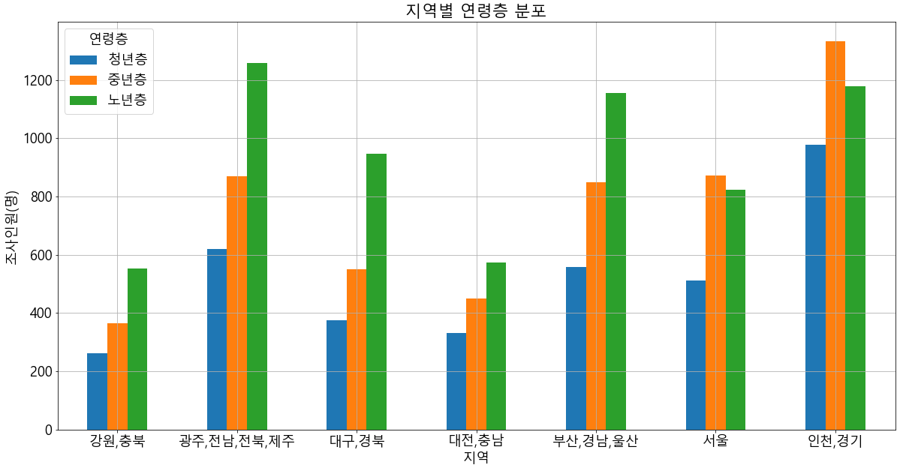

# 한국복지패널 데이터셋 분석하기

- https://www.koweps.re.kr:442
        
- 우리 나라의 각종 사회조사를 시행하고 데이터를 공개하는 사이트
- SAS라는 통계 분석 프로그램을 사용한 데이터 셋 파일을 제공
    - R로는 이 파일을 함수를 이용해 바로 불러올 수 있으나 Python은 불가능.
    - 예제에서 사용되는 데이터셋은 2017년도 조사 자료를 R에서 Excel형식으로 내보낸 파일임
    - 데이터셋의 각 변수명에 대한 의미는 http://itaper.co.kr/demo/python/codebook-excel.7z 참조

-----------------------
## #01. 필요한 패키지 및 샘플 데이터 가져오기


```python
import numpy
from pandas import DataFrame
from pandas import ExcelFile
from matplotlib import pyplot
```


```python
# 엑셀 파일을 원격으로 내려받아 데이터프레임으로 변환(다소 시간이 소요된다)
xlsx = ExcelFile("http://itpaper.co.kr/demo/python/dataset2017.xlsx")
df = xlsx.parse(xlsx.sheet_names[0])
```


```python
df.head()
```


<div>
<style scoped>
    .dataframe tbody tr th:only-of-type {
        vertical-align: middle;
    }

    .dataframe tbody tr th {
        vertical-align: top;
    }

    .dataframe thead th {
        text-align: right;
    }
</style>
<table border="1" class="dataframe">
  <thead>
    <tr style="text-align: right;">
      <th></th>
      <th>h12_id</th>
      <th>h12_ind</th>
      <th>h12_sn</th>
      <th>h12_merkey</th>
      <th>h_new</th>
      <th>h12_cobf</th>
      <th>p12_wgl</th>
      <th>p12_wsl</th>
      <th>p12_wgc</th>
      <th>p12_wsc</th>
      <th>...</th>
      <th>da12_326</th>
      <th>da12_327</th>
      <th>da12_328</th>
      <th>da12_6aq14</th>
      <th>da12_6aq15</th>
      <th>h12_pers_income1</th>
      <th>h12_pers_income2</th>
      <th>h12_pers_income3</th>
      <th>h12_pers_income4</th>
      <th>h12_pers_income5</th>
    </tr>
  </thead>
  <tbody>
    <tr>
      <td>0</td>
      <td>1</td>
      <td>1</td>
      <td>1</td>
      <td>10101</td>
      <td>0</td>
      <td>NaN</td>
      <td>953.482054</td>
      <td>0.286943</td>
      <td>948.140524</td>
      <td>0.285336</td>
      <td>...</td>
      <td>NaN</td>
      <td>NaN</td>
      <td>NaN</td>
      <td>NaN</td>
      <td>NaN</td>
      <td>NaN</td>
      <td>NaN</td>
      <td>NaN</td>
      <td>0</td>
      <td>NaN</td>
    </tr>
    <tr>
      <td>1</td>
      <td>2</td>
      <td>1</td>
      <td>1</td>
      <td>20101</td>
      <td>0</td>
      <td>NaN</td>
      <td>1238.891352</td>
      <td>0.372835</td>
      <td>1238.891352</td>
      <td>0.372835</td>
      <td>...</td>
      <td>NaN</td>
      <td>NaN</td>
      <td>NaN</td>
      <td>NaN</td>
      <td>NaN</td>
      <td>NaN</td>
      <td>NaN</td>
      <td>NaN</td>
      <td>0</td>
      <td>NaN</td>
    </tr>
    <tr>
      <td>2</td>
      <td>3</td>
      <td>1</td>
      <td>1</td>
      <td>30101</td>
      <td>0</td>
      <td>NaN</td>
      <td>1282.051947</td>
      <td>0.385824</td>
      <td>1282.051947</td>
      <td>0.385824</td>
      <td>...</td>
      <td>NaN</td>
      <td>NaN</td>
      <td>NaN</td>
      <td>NaN</td>
      <td>NaN</td>
      <td>NaN</td>
      <td>NaN</td>
      <td>NaN</td>
      <td>0</td>
      <td>NaN</td>
    </tr>
    <tr>
      <td>3</td>
      <td>4</td>
      <td>1</td>
      <td>1</td>
      <td>40101</td>
      <td>0</td>
      <td>NaN</td>
      <td>1066.327201</td>
      <td>0.320903</td>
      <td>1066.327201</td>
      <td>0.320903</td>
      <td>...</td>
      <td>NaN</td>
      <td>NaN</td>
      <td>NaN</td>
      <td>NaN</td>
      <td>NaN</td>
      <td>NaN</td>
      <td>3418.0</td>
      <td>NaN</td>
      <td>0</td>
      <td>NaN</td>
    </tr>
    <tr>
      <td>4</td>
      <td>4</td>
      <td>1</td>
      <td>1</td>
      <td>40101</td>
      <td>0</td>
      <td>NaN</td>
      <td>1390.617192</td>
      <td>0.418496</td>
      <td>1382.826774</td>
      <td>0.416151</td>
      <td>...</td>
      <td>NaN</td>
      <td>NaN</td>
      <td>NaN</td>
      <td>NaN</td>
      <td>NaN</td>
      <td>NaN</td>
      <td>NaN</td>
      <td>NaN</td>
      <td>0</td>
      <td>NaN</td>
    </tr>
  </tbody>
</table>
<p>5 rows × 1191 columns</p>
</div>


http://itpaper.co.kr/demo/python/dataset2017_fieldname.jpg<br>
http://itpaper.co.kr/demo/python/dataset2017_area.jpg<br>
http://itpaper.co.kr/demo/python/rsample.html


분석예제 1) 조사대상들에 대한 성별 분포


```python
# 데이터프레임 복제
cp=df.copy()
cp
```


<div>
<style scoped>
    .dataframe tbody tr th:only-of-type {
        vertical-align: middle;
    }

    .dataframe tbody tr th {
        vertical-align: top;
    }

    .dataframe thead th {
        text-align: right;
    }
</style>
<table border="1" class="dataframe">
  <thead>
    <tr style="text-align: right;">
      <th></th>
      <th>h12_id</th>
      <th>h12_ind</th>
      <th>h12_sn</th>
      <th>h12_merkey</th>
      <th>h_new</th>
      <th>h12_cobf</th>
      <th>p12_wgl</th>
      <th>p12_wsl</th>
      <th>p12_wgc</th>
      <th>p12_wsc</th>
      <th>...</th>
      <th>da12_326</th>
      <th>da12_327</th>
      <th>da12_328</th>
      <th>da12_6aq14</th>
      <th>da12_6aq15</th>
      <th>h12_pers_income1</th>
      <th>h12_pers_income2</th>
      <th>h12_pers_income3</th>
      <th>h12_pers_income4</th>
      <th>h12_pers_income5</th>
    </tr>
  </thead>
  <tbody>
    <tr>
      <td>0</td>
      <td>1</td>
      <td>1</td>
      <td>1</td>
      <td>10101</td>
      <td>0</td>
      <td>NaN</td>
      <td>953.482054</td>
      <td>0.286943</td>
      <td>948.140524</td>
      <td>0.285336</td>
      <td>...</td>
      <td>NaN</td>
      <td>NaN</td>
      <td>NaN</td>
      <td>NaN</td>
      <td>NaN</td>
      <td>NaN</td>
      <td>NaN</td>
      <td>NaN</td>
      <td>0</td>
      <td>NaN</td>
    </tr>
    <tr>
      <td>1</td>
      <td>2</td>
      <td>1</td>
      <td>1</td>
      <td>20101</td>
      <td>0</td>
      <td>NaN</td>
      <td>1238.891352</td>
      <td>0.372835</td>
      <td>1238.891352</td>
      <td>0.372835</td>
      <td>...</td>
      <td>NaN</td>
      <td>NaN</td>
      <td>NaN</td>
      <td>NaN</td>
      <td>NaN</td>
      <td>NaN</td>
      <td>NaN</td>
      <td>NaN</td>
      <td>0</td>
      <td>NaN</td>
    </tr>
    <tr>
      <td>2</td>
      <td>3</td>
      <td>1</td>
      <td>1</td>
      <td>30101</td>
      <td>0</td>
      <td>NaN</td>
      <td>1282.051947</td>
      <td>0.385824</td>
      <td>1282.051947</td>
      <td>0.385824</td>
      <td>...</td>
      <td>NaN</td>
      <td>NaN</td>
      <td>NaN</td>
      <td>NaN</td>
      <td>NaN</td>
      <td>NaN</td>
      <td>NaN</td>
      <td>NaN</td>
      <td>0</td>
      <td>NaN</td>
    </tr>
    <tr>
      <td>3</td>
      <td>4</td>
      <td>1</td>
      <td>1</td>
      <td>40101</td>
      <td>0</td>
      <td>NaN</td>
      <td>1066.327201</td>
      <td>0.320903</td>
      <td>1066.327201</td>
      <td>0.320903</td>
      <td>...</td>
      <td>NaN</td>
      <td>NaN</td>
      <td>NaN</td>
      <td>NaN</td>
      <td>NaN</td>
      <td>NaN</td>
      <td>3418.0</td>
      <td>NaN</td>
      <td>0</td>
      <td>NaN</td>
    </tr>
    <tr>
      <td>4</td>
      <td>4</td>
      <td>1</td>
      <td>1</td>
      <td>40101</td>
      <td>0</td>
      <td>NaN</td>
      <td>1390.617192</td>
      <td>0.418496</td>
      <td>1382.826774</td>
      <td>0.416151</td>
      <td>...</td>
      <td>NaN</td>
      <td>NaN</td>
      <td>NaN</td>
      <td>NaN</td>
      <td>NaN</td>
      <td>NaN</td>
      <td>NaN</td>
      <td>NaN</td>
      <td>0</td>
      <td>NaN</td>
    </tr>
    <tr>
      <td>...</td>
      <td>...</td>
      <td>...</td>
      <td>...</td>
      <td>...</td>
      <td>...</td>
      <td>...</td>
      <td>...</td>
      <td>...</td>
      <td>...</td>
      <td>...</td>
      <td>...</td>
      <td>...</td>
      <td>...</td>
      <td>...</td>
      <td>...</td>
      <td>...</td>
      <td>...</td>
      <td>...</td>
      <td>...</td>
      <td>...</td>
      <td>...</td>
    </tr>
    <tr>
      <td>15417</td>
      <td>9800</td>
      <td>7</td>
      <td>1</td>
      <td>98000701</td>
      <td>1</td>
      <td>NaN</td>
      <td>735.488155</td>
      <td>0.221339</td>
      <td>735.488155</td>
      <td>0.221339</td>
      <td>...</td>
      <td>NaN</td>
      <td>NaN</td>
      <td>NaN</td>
      <td>NaN</td>
      <td>NaN</td>
      <td>NaN</td>
      <td>979.0</td>
      <td>NaN</td>
      <td>0</td>
      <td>NaN</td>
    </tr>
    <tr>
      <td>15418</td>
      <td>9800</td>
      <td>7</td>
      <td>1</td>
      <td>98000701</td>
      <td>1</td>
      <td>NaN</td>
      <td>898.395613</td>
      <td>0.270365</td>
      <td>898.395613</td>
      <td>0.270365</td>
      <td>...</td>
      <td>NaN</td>
      <td>NaN</td>
      <td>NaN</td>
      <td>NaN</td>
      <td>NaN</td>
      <td>NaN</td>
      <td>NaN</td>
      <td>NaN</td>
      <td>0</td>
      <td>NaN</td>
    </tr>
    <tr>
      <td>15419</td>
      <td>9800</td>
      <td>7</td>
      <td>1</td>
      <td>98000701</td>
      <td>1</td>
      <td>NaN</td>
      <td>2686.353997</td>
      <td>0.808438</td>
      <td>2676.190322</td>
      <td>0.805379</td>
      <td>...</td>
      <td>NaN</td>
      <td>NaN</td>
      <td>NaN</td>
      <td>NaN</td>
      <td>NaN</td>
      <td>NaN</td>
      <td>868.0</td>
      <td>NaN</td>
      <td>0</td>
      <td>NaN</td>
    </tr>
    <tr>
      <td>15420</td>
      <td>9800</td>
      <td>7</td>
      <td>1</td>
      <td>98000701</td>
      <td>1</td>
      <td>NaN</td>
      <td>841.651153</td>
      <td>0.253288</td>
      <td>841.651153</td>
      <td>0.253288</td>
      <td>...</td>
      <td>NaN</td>
      <td>NaN</td>
      <td>NaN</td>
      <td>NaN</td>
      <td>NaN</td>
      <td>NaN</td>
      <td>518.0</td>
      <td>NaN</td>
      <td>0</td>
      <td>NaN</td>
    </tr>
    <tr>
      <td>15421</td>
      <td>9800</td>
      <td>7</td>
      <td>1</td>
      <td>98000701</td>
      <td>1</td>
      <td>NaN</td>
      <td>643.650245</td>
      <td>0.193702</td>
      <td>643.650245</td>
      <td>0.193702</td>
      <td>...</td>
      <td>NaN</td>
      <td>NaN</td>
      <td>NaN</td>
      <td>NaN</td>
      <td>NaN</td>
      <td>NaN</td>
      <td>NaN</td>
      <td>NaN</td>
      <td>0</td>
      <td>NaN</td>
    </tr>
  </tbody>
</table>
<p>15422 rows × 1191 columns</p>
</div>


```python
cp_ = cp.filter(['h12_g3','h12_g4','h12_g10','h12_g11','h12_eco9','p1202_8aq1','h12_reg7'])
cp_ = DataFrame(cp_)
cp_
```


<div>
<style scoped>
    .dataframe tbody tr th:only-of-type {
        vertical-align: middle;
    }

    .dataframe tbody tr th {
        vertical-align: top;
    }

    .dataframe thead th {
        text-align: right;
    }
</style>
<table border="1" class="dataframe">
  <thead>
    <tr style="text-align: right;">
      <th></th>
      <th>h12_g3</th>
      <th>h12_g4</th>
      <th>h12_g10</th>
      <th>h12_g11</th>
      <th>h12_eco9</th>
      <th>p1202_8aq1</th>
      <th>h12_reg7</th>
    </tr>
  </thead>
  <tbody>
    <tr>
      <td>0</td>
      <td>2</td>
      <td>1936</td>
      <td>2</td>
      <td>2</td>
      <td>NaN</td>
      <td>NaN</td>
      <td>1</td>
    </tr>
    <tr>
      <td>1</td>
      <td>2</td>
      <td>1945</td>
      <td>2</td>
      <td>2</td>
      <td>NaN</td>
      <td>NaN</td>
      <td>1</td>
    </tr>
    <tr>
      <td>2</td>
      <td>1</td>
      <td>1948</td>
      <td>2</td>
      <td>2</td>
      <td>NaN</td>
      <td>NaN</td>
      <td>1</td>
    </tr>
    <tr>
      <td>3</td>
      <td>1</td>
      <td>1942</td>
      <td>3</td>
      <td>1</td>
      <td>762.0</td>
      <td>108.9</td>
      <td>1</td>
    </tr>
    <tr>
      <td>4</td>
      <td>2</td>
      <td>1923</td>
      <td>2</td>
      <td>1</td>
      <td>NaN</td>
      <td>NaN</td>
      <td>1</td>
    </tr>
    <tr>
      <td>...</td>
      <td>...</td>
      <td>...</td>
      <td>...</td>
      <td>...</td>
      <td>...</td>
      <td>...</td>
      <td>...</td>
    </tr>
    <tr>
      <td>15417</td>
      <td>2</td>
      <td>1967</td>
      <td>1</td>
      <td>1</td>
      <td>952.0</td>
      <td>NaN</td>
      <td>5</td>
    </tr>
    <tr>
      <td>15418</td>
      <td>2</td>
      <td>1992</td>
      <td>5</td>
      <td>1</td>
      <td>NaN</td>
      <td>NaN</td>
      <td>5</td>
    </tr>
    <tr>
      <td>15419</td>
      <td>1</td>
      <td>1995</td>
      <td>5</td>
      <td>1</td>
      <td>521.0</td>
      <td>72.0</td>
      <td>5</td>
    </tr>
    <tr>
      <td>15420</td>
      <td>2</td>
      <td>1998</td>
      <td>5</td>
      <td>1</td>
      <td>432.0</td>
      <td>NaN</td>
      <td>5</td>
    </tr>
    <tr>
      <td>15421</td>
      <td>1</td>
      <td>2001</td>
      <td>0</td>
      <td>1</td>
      <td>NaN</td>
      <td>NaN</td>
      <td>5</td>
    </tr>
  </tbody>
</table>
<p>15422 rows × 7 columns</p>
</div>


```python
cp1 = cp_.filter(['h12_g3'])
cp1 = DataFrame(cp1)
cp1
```


<div>
<style scoped>
    .dataframe tbody tr th:only-of-type {
        vertical-align: middle;
    }

    .dataframe tbody tr th {
        vertical-align: top;
    }

    .dataframe thead th {
        text-align: right;
    }
</style>
<table border="1" class="dataframe">
  <thead>
    <tr style="text-align: right;">
      <th></th>
      <th>h12_g3</th>
    </tr>
  </thead>
  <tbody>
    <tr>
      <td>0</td>
      <td>2</td>
    </tr>
    <tr>
      <td>1</td>
      <td>2</td>
    </tr>
    <tr>
      <td>2</td>
      <td>1</td>
    </tr>
    <tr>
      <td>3</td>
      <td>1</td>
    </tr>
    <tr>
      <td>4</td>
      <td>2</td>
    </tr>
    <tr>
      <td>...</td>
      <td>...</td>
    </tr>
    <tr>
      <td>15417</td>
      <td>2</td>
    </tr>
    <tr>
      <td>15418</td>
      <td>2</td>
    </tr>
    <tr>
      <td>15419</td>
      <td>1</td>
    </tr>
    <tr>
      <td>15420</td>
      <td>2</td>
    </tr>
    <tr>
      <td>15421</td>
      <td>1</td>
    </tr>
  </tbody>
</table>
<p>15422 rows × 1 columns</p>
</div>


```python
cp1_=cp1.rename(columns={'h12_g3':'성별'})
cp1_
```


<div>
<style scoped>
    .dataframe tbody tr th:only-of-type {
        vertical-align: middle;
    }

    .dataframe tbody tr th {
        vertical-align: top;
    }

    .dataframe thead th {
        text-align: right;
    }
</style>
<table border="1" class="dataframe">
  <thead>
    <tr style="text-align: right;">
      <th></th>
      <th>성별</th>
    </tr>
  </thead>
  <tbody>
    <tr>
      <td>0</td>
      <td>2</td>
    </tr>
    <tr>
      <td>1</td>
      <td>2</td>
    </tr>
    <tr>
      <td>2</td>
      <td>1</td>
    </tr>
    <tr>
      <td>3</td>
      <td>1</td>
    </tr>
    <tr>
      <td>4</td>
      <td>2</td>
    </tr>
    <tr>
      <td>...</td>
      <td>...</td>
    </tr>
    <tr>
      <td>15417</td>
      <td>2</td>
    </tr>
    <tr>
      <td>15418</td>
      <td>2</td>
    </tr>
    <tr>
      <td>15419</td>
      <td>1</td>
    </tr>
    <tr>
      <td>15420</td>
      <td>2</td>
    </tr>
    <tr>
      <td>15421</td>
      <td>1</td>
    </tr>
  </tbody>
</table>
<p>15422 rows × 1 columns</p>
</div>


```python
#성별의 데이터 분포 확인
cp1_['성별'].value_counts()
```


    2    8440
    1    6982
    Name: 성별, dtype: int64


```python
# 성별값을 반환
cp1_['성별'] = numpy.where(cp1_['성별'] == 1,'남자','여자')
cp1_
```


<div>
<style scoped>
    .dataframe tbody tr th:only-of-type {
        vertical-align: middle;
    }

    .dataframe tbody tr th {
        vertical-align: top;
    }

    .dataframe thead th {
        text-align: right;
    }
</style>
<table border="1" class="dataframe">
  <thead>
    <tr style="text-align: right;">
      <th></th>
      <th>성별</th>
    </tr>
  </thead>
  <tbody>
    <tr>
      <td>0</td>
      <td>여자</td>
    </tr>
    <tr>
      <td>1</td>
      <td>여자</td>
    </tr>
    <tr>
      <td>2</td>
      <td>남자</td>
    </tr>
    <tr>
      <td>3</td>
      <td>남자</td>
    </tr>
    <tr>
      <td>4</td>
      <td>여자</td>
    </tr>
    <tr>
      <td>...</td>
      <td>...</td>
    </tr>
    <tr>
      <td>15417</td>
      <td>여자</td>
    </tr>
    <tr>
      <td>15418</td>
      <td>여자</td>
    </tr>
    <tr>
      <td>15419</td>
      <td>남자</td>
    </tr>
    <tr>
      <td>15420</td>
      <td>여자</td>
    </tr>
    <tr>
      <td>15421</td>
      <td>남자</td>
    </tr>
  </tbody>
</table>
<p>15422 rows × 1 columns</p>
</div>


```python
# 변환된 값에 의한 성별 데이터 분포를 데이터프레임으로 만들기
vcount = cp1_['성별'].value_counts()
type(vcount)
성별df = DataFrame(vcount)
성별df
```


<div>
<style scoped>
    .dataframe tbody tr th:only-of-type {
        vertical-align: middle;
    }

    .dataframe tbody tr th {
        vertical-align: top;
    }

    .dataframe thead th {
        text-align: right;
    }
</style>
<table border="1" class="dataframe">
  <thead>
    <tr style="text-align: right;">
      <th></th>
      <th>성별</th>
    </tr>
  </thead>
  <tbody>
    <tr>
      <td>여자</td>
      <td>8440</td>
    </tr>
    <tr>
      <td>남자</td>
      <td>6982</td>
    </tr>
  </tbody>
</table>
</div>


```python
#생성된 데이터 프레임의 컬럼이름 변경
성별df.rename(columns={'성별':'명'}, inplace = True)
성별df
```


<div>
<style scoped>
    .dataframe tbody tr th:only-of-type {
        vertical-align: middle;
    }

    .dataframe tbody tr th {
        vertical-align: top;
    }

    .dataframe thead th {
        text-align: right;
    }
</style>
<table border="1" class="dataframe">
  <thead>
    <tr style="text-align: right;">
      <th></th>
      <th>명</th>
    </tr>
  </thead>
  <tbody>
    <tr>
      <td>여자</td>
      <td>8440</td>
    </tr>
    <tr>
      <td>남자</td>
      <td>6982</td>
    </tr>
  </tbody>
</table>
</div>


```python
# 한글폰트, 그래픽 크기 설정
pyplot.rcParams["font.family"] = 'Malgun Gothic'
pyplot.rcParams["font.size"] = 16
pyplot.rcParams["figure.figsize"] = (20,12)


성별df.plot.bar(rot=0)
pyplot.grid()
pyplot.legend()
pyplot.title("조사대상들에 대한 성별 분포")
pyplot.xlabel("성별")
pyplot.ylabel("명")

# 그래프에 텍스트 표시하기
for i, v in enumerate(list(성별df['명'])):
    txt = "%d명" % v
    pyplot.text(i,v,txt, fontsize=14, color ='#000099',horizontalalignment='center',verticalalignment='bottom')
pyplot.show()
```





분석예제 2) 성별에 따른 월급 차이 분석


```python
cp2 = cp_.filter(['h12_g3','p1202_8aq1'])
cp2 = DataFrame(cp2)
cp2
```


<div>
<style scoped>
    .dataframe tbody tr th:only-of-type {
        vertical-align: middle;
    }

    .dataframe tbody tr th {
        vertical-align: top;
    }

    .dataframe thead th {
        text-align: right;
    }
</style>
<table border="1" class="dataframe">
  <thead>
    <tr style="text-align: right;">
      <th></th>
      <th>h12_g3</th>
      <th>p1202_8aq1</th>
    </tr>
  </thead>
  <tbody>
    <tr>
      <td>0</td>
      <td>2</td>
      <td>NaN</td>
    </tr>
    <tr>
      <td>1</td>
      <td>2</td>
      <td>NaN</td>
    </tr>
    <tr>
      <td>2</td>
      <td>1</td>
      <td>NaN</td>
    </tr>
    <tr>
      <td>3</td>
      <td>1</td>
      <td>108.9</td>
    </tr>
    <tr>
      <td>4</td>
      <td>2</td>
      <td>NaN</td>
    </tr>
    <tr>
      <td>...</td>
      <td>...</td>
      <td>...</td>
    </tr>
    <tr>
      <td>15417</td>
      <td>2</td>
      <td>NaN</td>
    </tr>
    <tr>
      <td>15418</td>
      <td>2</td>
      <td>NaN</td>
    </tr>
    <tr>
      <td>15419</td>
      <td>1</td>
      <td>72.0</td>
    </tr>
    <tr>
      <td>15420</td>
      <td>2</td>
      <td>NaN</td>
    </tr>
    <tr>
      <td>15421</td>
      <td>1</td>
      <td>NaN</td>
    </tr>
  </tbody>
</table>
<p>15422 rows × 2 columns</p>
</div>


```python
cp2_결측치여부 = cp2.isnull()
cp2_결측치여부
```


<div>
<style scoped>
    .dataframe tbody tr th:only-of-type {
        vertical-align: middle;
    }

    .dataframe tbody tr th {
        vertical-align: top;
    }

    .dataframe thead th {
        text-align: right;
    }
</style>
<table border="1" class="dataframe">
  <thead>
    <tr style="text-align: right;">
      <th></th>
      <th>h12_g3</th>
      <th>p1202_8aq1</th>
    </tr>
  </thead>
  <tbody>
    <tr>
      <td>0</td>
      <td>False</td>
      <td>True</td>
    </tr>
    <tr>
      <td>1</td>
      <td>False</td>
      <td>True</td>
    </tr>
    <tr>
      <td>2</td>
      <td>False</td>
      <td>True</td>
    </tr>
    <tr>
      <td>3</td>
      <td>False</td>
      <td>False</td>
    </tr>
    <tr>
      <td>4</td>
      <td>False</td>
      <td>True</td>
    </tr>
    <tr>
      <td>...</td>
      <td>...</td>
      <td>...</td>
    </tr>
    <tr>
      <td>15417</td>
      <td>False</td>
      <td>True</td>
    </tr>
    <tr>
      <td>15418</td>
      <td>False</td>
      <td>True</td>
    </tr>
    <tr>
      <td>15419</td>
      <td>False</td>
      <td>False</td>
    </tr>
    <tr>
      <td>15420</td>
      <td>False</td>
      <td>True</td>
    </tr>
    <tr>
      <td>15421</td>
      <td>False</td>
      <td>True</td>
    </tr>
  </tbody>
</table>
<p>15422 rows × 2 columns</p>
</div>


```python
# 각 열단위로 평균(strategy='mean')을 결측치(missing_values)에 지정
from sklearn.impute import SimpleImputer #sklearn은 tensorflow 보다 수학공식 일일히 안써도 되서 좋다. 그러나 속도가 tensorflow보다 느리다
정제규칙=SimpleImputer(missing_values=numpy.nan, strategy='mean')
정제규칙
```


    SimpleImputer(add_indicator=False, copy=True, fill_value=None,
                  missing_values=nan, strategy='mean', verbose=0)


```python
정제규칙_적용결과 = 정제규칙.fit_transform(cp2.values)
print(type(정제규칙_적용결과))
정제규칙_적용결과
```

    <class 'numpy.ndarray'>
    


    array([[  2.        , 257.95007322],
           [  2.        , 257.95007322],
           [  1.        , 257.95007322],
           ...,
           [  1.        ,  72.        ],
           [  2.        , 257.95007322],
           [  1.        , 257.95007322]])


```python
cp2_정제결과 = DataFrame(정제규칙_적용결과,index=cp2.index, columns=cp2.columns)
cp2_정제결과
```


<div>
<style scoped>
    .dataframe tbody tr th:only-of-type {
        vertical-align: middle;
    }

    .dataframe tbody tr th {
        vertical-align: top;
    }

    .dataframe thead th {
        text-align: right;
    }
</style>
<table border="1" class="dataframe">
  <thead>
    <tr style="text-align: right;">
      <th></th>
      <th>h12_g3</th>
      <th>p1202_8aq1</th>
    </tr>
  </thead>
  <tbody>
    <tr>
      <td>0</td>
      <td>2.0</td>
      <td>257.950073</td>
    </tr>
    <tr>
      <td>1</td>
      <td>2.0</td>
      <td>257.950073</td>
    </tr>
    <tr>
      <td>2</td>
      <td>1.0</td>
      <td>257.950073</td>
    </tr>
    <tr>
      <td>3</td>
      <td>1.0</td>
      <td>108.900000</td>
    </tr>
    <tr>
      <td>4</td>
      <td>2.0</td>
      <td>257.950073</td>
    </tr>
    <tr>
      <td>...</td>
      <td>...</td>
      <td>...</td>
    </tr>
    <tr>
      <td>15417</td>
      <td>2.0</td>
      <td>257.950073</td>
    </tr>
    <tr>
      <td>15418</td>
      <td>2.0</td>
      <td>257.950073</td>
    </tr>
    <tr>
      <td>15419</td>
      <td>1.0</td>
      <td>72.000000</td>
    </tr>
    <tr>
      <td>15420</td>
      <td>2.0</td>
      <td>257.950073</td>
    </tr>
    <tr>
      <td>15421</td>
      <td>1.0</td>
      <td>257.950073</td>
    </tr>
  </tbody>
</table>
<p>15422 rows × 2 columns</p>
</div>


```python

```


```python
분석예제 3) 나이에 따른 월급 평균의 변화
```


      File "<ipython-input-18-5879ecb9fa8f>", line 1
        분석예제 3) 나이에 따른 월급 평균의 변화
             ^
    SyntaxError: invalid syntax
    


```python
cp3 = cp_.filter(['h12_g3','h12_g4','p1202_8aq1'])
cp3 = DataFrame(cp3)
cp3
```


```python
cp3=cp3.rename(
    columns={'h12_g3':'성별','h12_g4':'나이','p1202_8aq1':'월급'})
cp3
```


```python
cp3_결측치여부 = cp3.isnull()
cp3_결측치여부
```


```python
# 각 열단위로 평균(strategy='mean')을 결측치(missing_values)에 지정
from sklearn.impute import SimpleImputer #sklearn은 tensorflow 보다 수학공식 일일히 안써도 되서 좋다. 그러나 속도가 tensorflow보다 느리다
정제규칙=SimpleImputer(missing_values=numpy.nan, strategy='mean')
정제규칙
```

cp3_정제규칙_적용결과 = 정제규칙.fit_transform(cp3.values)
print(type(cp3_정제규칙_적용결과))
cp3_정제규칙_적용결과


```python
cp3_정제규칙_적용결과 = 정제규칙.fit_transform(cp3.values)
print(type(cp3_정제규칙_적용결과))
cp3_정제규칙_적용결과
```


```python
cp3_정제결과 = DataFrame(cp3_정제규칙_적용결과,index=cp3.index, columns=cp3.columns)
cp3_정제결과
```


```python
cp3_정제결과 = cp3_정제결과.filter(['나이','월급'])
cp3_정제결과 = DataFrame(cp3_정제결과)
cp3_정제결과
```


```python
# x좌표를 의미할 리스트나 배열 생성
xpos = numpy.arange(len(cp3_정제결과))
xpos


# x좌표에 적용할 텍스트의 리스트 생성
xtext = list(cp3_정제결과.index)
xtext


```


```python
# 특정컬럼에 대해서만 시각화 하기
cp3_정제결과.plot(color='#ff0000')
pyplot.grid()
pyplot.legend()
pyplot.title("나이별 급여")
pyplot.xlabel("나이")
pyplot.ylabel("급여")
pyplot.xticks(xpos, xtext)
pyplot.show()
```


```python
분석예제 4) 연령대별 월급 평균 분포
```


```python

```


```python

```


```python

```


```python

```


```python

```


```python

```


```python

```


```python

```


```python

```


```python

```


```python

```


```python
분석예제 5) 연령대와 성별에 따른 월급 평균
```


```python
분석예제 6) 지역별 연령대 비율
```


```python

```


```python

```


```python

```

# <정답>

## 분석예제 1)조사대상들에 대한 성별 분포


```python
# 성별 컬럼만 추출
df_filter = df.filter(['h12_g3'])
df_filter
```


```python
# 성별 변수의 이름을 인식하기 쉬운 값으로 변경하기
df_filter.rename(columns={'h12_g3':'성별'}, inplace=True)
df_filter
```


```python
#성별의 데이터 타입 확인
df_filter['성별']
```


```python
#결측치 확인
df_filter.isna().sum()
```


```python
#성별의 데이터 분포 확인
df_filter['성별'].value_counts()
```


```python
# 성별값을 반환
df_filter['성별'] = numpy.where(df_filter['성별'] == 1,'남자','여자')
df_filter
```


```python
# 변환된 값에 의한 성별 데이터 분포를 데이터프레임으로 만들기
vcount = df_filter['성별'].value_counts()
type(vcount)
성별df = DataFrame(vcount)
성별df
```


```python
#생성된 데이터 프레임의 컬럼이름 변경
성별df.rename(columns={'성별':'명'}, inplace = True)
성별df
```


```python
# 비율순으로 정렬
성별df.sort_values('명',inplace=True)
성별df
```


```python
# 한글폰트, 그래픽 크기 설정
pyplot.rcParams["font.family"] = 'Malgun Gothic'
pyplot.rcParams["font.size"] = 16
pyplot.rcParams["figure.figsize"] = (20,12)


성별df.plot.bar(rot=0)
pyplot.grid()
pyplot.legend()
pyplot.title("조사대상들에 대한 성별 분포")
pyplot.xlabel("성별")
pyplot.ylabel("명")

# 그래프에 텍스트 표시하기
for i, v in enumerate(list(성별df['명'])):
    txt = "%d명" % v
    pyplot.text(i,v,txt, fontsize=14, color ='#000099',horizontalalignment='center',verticalalignment='bottom')
pyplot.show()
```

## 분석예제 2)성별에 따른 평균 월급 차이 분석

1단계-변수 검토 및 전처리


```python
# 성별과 월급 데이터만 추출
df_filter2 = df.filter(['h12_g3','p1202_8aq1'])
df_filter2
```


```python
# 변수 이름 변경하기
df_filter2.rename(columns={'h12_g3':'성별','p1202_8aq1':'월급'}, inplace=True)
df_filter2
```


```python
# 성별 항목 이름 부여
df_filter2['성별'] = numpy.where(df_filter2['성별'] == 1, '남자','여자')
df_filter2
```

2단계-데이터분포 확인
- 성별과 같은 문자열(charator) 데이터들은 value_counts()함수를 사용하여 데이터 빈도를 확인
- 월급과 같이 숫자 형식의 연속적 데이터는 describe() 함수로 요약 내용을 확인해야 한다


```python
df_filter2['성별'].value_counts()
```


```python
df_filter2['월급'].describe()
```

3단계-데이터정제

- 코드표에 의하면 월급 데이터의 경우 1~9998 사이의 값을 갖는다고 되어 있다
- 모름/무응답의 경우 9999로 저장되어 0인 경우는 데이터가 없는 상태이므로 이 두 상태를 이상치로 봐야 한다


```python
# 이상치 결측 처리
# ---> 0, 9999 둘 중 하나인 값을 결측치로 변경
df_filter2['월급'] = numpy.where(((df_filter2['월급'] < 1) | (df_filter2['월급'] > 9998)), numpy.nan, df_filter2['월급'])
df_filter2
```


```python
# 결측치 확인
df_filter2.isna().sum()
```


```python
# 결측치가 아닌 데이터만 걸러내기
df_tmp = df_filter2.dropna()
df_tmp
```


```python
# 성별로 그룹화 하여 그룹별 평균 구하기
성별_월급_평균표 = df_tmp.groupby('성별').mean()
성별_월급_평균표
```

4단계 -시각화

수치값을 모두 산정해 놓은 결과를 토대로 그래프를 만드는 경우 평균막대그래프를 사용


```python
# 한글폰트, 그래픽 크기 설정
pyplot.rcParams["font.family"] = 'Malgun Gothic'
pyplot.rcParams["font.size"] = 16
pyplot.rcParams["figure.figsize"] = (20,12)


성별_월급_평균표.plot.bar(rot=0)
pyplot.grid()
pyplot.legend()
pyplot.title("성별에 따른 평균 월급 차이 분석")
pyplot.xlabel("성별")
pyplot.ylabel("월급")

# 그래프에 텍스트 표시하기
for i, v in enumerate(list(성별_월급_평균표['월급'])):
    txt = "%d만원" % v
    pyplot.text(i,v,txt, fontsize=14, color ='#000099',horizontalalignment='center',verticalalignment='bottom')
pyplot.show()
```

## 분석예제 3)나이에 따른 월급 평균의 변화

1단계-데이터전처리


```python
# 태어난 년도, 월급에 대한 컬럼 추출
df_filter3 = df.filter(['h12_g4','p1202_8aq1'])
df_filter3
```


```python
# 컬럼이름 변경
df_filter3.rename(columns={'h12_g4':'태어난년도','p1202_8aq1':'월급'}, inplace =True)
df_filter3
```

나이에 대한 처리<br>
변수 검토하기


```python
# 결측치 확인
df_filter3['태어난년도'].isna().sum()
```

파생변수 만들기


```python
import datetime as dt
yy = dt.datetime.now().year
print(yy)
df_filter3['나이'] = yy - df_filter3['태어난년도'] + 1
df_filter3['나이'].describe()
```

월급에 대한 데이터 처리


```python
# 이상치 결측 처리
# ---> 0, 9999 둘 중 하나인 값을 결측치로 변경
df_filter3['월급'] = numpy.where(((df_filter3['월급'] < 1) | (df_filter3['월급'] > 9998)), numpy.nan, df_filter3['월급'])
df_filter3
```

### 2단계) 나이별 평균 월급 분석


```python
# 결측치가 아닌 데이터만 걸러내기
df_tmp = df_filter3.dropna() 
df_tmp
```


```python
# 나이별로 그룹화하여 그룹별 평균 구하기
나이_월급_평균표 = df_tmp.filter(['나이','월급']).groupby('나이').mean()
나이_월급_평균표
```

3단계)시각화


```python
# 한글폰트, 그래픽 크기 설정
pyplot.rcParams["font.family"] = 'Malgun Gothic'
pyplot.rcParams["font.size"] = 18
pyplot.rcParams["figure.figsize"] = (20,10)


나이_월급_평균표.plot()
pyplot.grid()
pyplot.legend()
pyplot.title("연령에 따른 평균 월급 변화")
pyplot.xlabel("나이")
pyplot.ylabel("평균월급")
```

## 분석예제 4) 연령대별 월급 평균 분포

연령대 분포


```python
# 태어난 년도 컬럼 추출
df_filter4 = df.filter(['h12_g4'])
df_filter4.rename(columns={'h12_g4':'태어난년도'}, inplace = True)
df_filter4
```


```python
df_filter4.isna().sum()
```


```python
df_filter4['나이'] = yy - df_filter4['태어난년도'] + 1
df_filter4
```


```python
#연령대
df_filter4['연령대'] = (df_filter4['나이'] // 10) * 10
df_filter4
```


```python
연령대분포 = DataFrame(df_filter4['연령대'].value_counts())
연령대분포
```


```python
연령대분포.sort_index(inplace=True)
연령대분포
```


```python
index_after = {}
for i in list(연령대분포.index):
    index_after[i] = '%d대' % i

연령대분포.rename(index=index_after, inplace=True)
연령대분포
```


```python
# 한글폰트, 그래픽 크기 설정
pyplot.rcParams["font.family"] = 'Malgun Gothic'
pyplot.rcParams["font.size"] = 18
pyplot.rcParams["figure.figsize"] = (20,10)


연령대분포.plot.bar(rot=0)
pyplot.grid()
pyplot.title("연령대 분포")
pyplot.xlabel("연령대")
pyplot.ylabel("명")

# 그래프에 텍스트 표시하기
for i, v in enumerate(list(연령대분포['연령대'])):
    txt = "%d명" % v
    pyplot.text(i,v,txt, fontsize=14, color ='#000099',horizontalalignment='center',verticalalignment='bottom')
pyplot.show()
```

연령대별 평균 월급 분포


```python
# 태어난 년도, 월급 컬럼 추출
df_filter5 = df.filter(['h12_g4','p1202_8aq1'])
df_filter5.rename(columns={'h12_g4':'태어난년도','p1202_8aq1':'월급'},inplace=True)
df_filter5
```


```python
df_filter5['나이'] = yy - df_filter5['태어난년도'] + 1
df_filter5
```


```python
#연령대
df_filter5['연령대'] = (df_filter5['나이'] // 10)*10
df_filter5.sort_values(['연령대','나이','월급'], inplace = True)
df_filter5
```


```python
df_filter5.isna().sum()
```


```python
df_filter5.dropna(inplace=True)
df_filter5.isna().sum()
```


```python
연령대별_평균급여 = df_filter5.filter(['연령대','월급']).groupby('연령대').mean()
연령대별_평균급여
```


```python
# 한글폰트, 그래픽 크기 설정
pyplot.rcParams["font.family"] = 'Malgun Gothic'
pyplot.rcParams["font.size"] = 18
pyplot.rcParams["figure.figsize"] = (20,10)


연령대별_평균급여.plot.bar(rot=0)
pyplot.grid()
pyplot.title("연령대별 평균급여")
pyplot.xlabel("연령대")
pyplot.ylabel("급여")

# 그래프에 텍스트 표시하기
for i, v in enumerate(list(연령대별_평균급여['월급'])):
    print(i)
    txt = "%d만원" % v
    pyplot.text(i,v,txt, fontsize=14, color ='#000099',horizontalalignment='center',verticalalignment='bottom')
pyplot.show()
```

## 분석예제 5) 연령대와 성별에 따른 월급 평균

성별과 연령대 분포


```python
# 성별과 태어난년도 데이터 추출
성별_태어난년도 = df.filter(['h12_g3','h12_g4'])
성별_태어난년도.rename(columns={'h12_g3':'성별','h12_g4':'태어난년도'}, inplace=True)
성별_태어난년도
```


```python
성별_태어난년도['연령대'] = (yy-성별_태어난년도['태어난년도']+1)//10*10
성별_태어난년도['성별'] = numpy.where(성별_태어난년도['성별'] == 1, '남자','여자')
성별_태어난년도

```


```python
연령대_성별_분포 = 성별_태어난년도.groupby(['성별','연령대'], as_index=False).count()
연령대_성별_분포.rename(columns={'태어난년도':'명'}, inplace=True)
연령대_성별_분포
```


```python
pivot_df = 연령대_성별_분포.pivot('연령대','성별','명')
pivot_df
```


```python
# 한글폰트, 그래픽 크기 설정
pyplot.rcParams["font.family"] = 'Malgun Gothic'
pyplot.rcParams["font.size"] = 18
pyplot.rcParams["figure.figsize"] = (20,10)


pivot_df.plot.bar(rot=0)
pyplot.grid()
pyplot.title("성별과 연령대별 분포")
pyplot.xlabel("연령대")
pyplot.ylabel("명")

pyplot.show()
```

성별과 연령대에 따른 평균 월급


```python
# 성별과 태어난년도, 월급 데이터 추출
filter_df = df.filter(['h12_g3','h12_g4','p1202_8aq1'])
filter_df.rename(columns={'h12_g3':'성별','h12_g4':'태어난년도','p1202_8aq1':'월급'},inplace=True)
filter_df
```


```python
filter_df['연령대'] = (yy-filter_df['태어난년도']+1)//10*10
filter_df['성별'] = numpy.where(filter_df['성별'] == 1, '남자','여자')
filter_df.drop('태어난년도', axis =1, inplace=True)
filter_df.dropna(inplace=True)
filter_df
```


```python
성별_연령대별_평균월급 = filter_df.groupby(['성별','연령대'], as_index=False).mean()
성별_연령대별_평균월급
```


```python
pivot_df = 성별_연령대별_평균월급.pivot('연령대','성별','월급')
pivot_df
```


```python
# 한글폰트, 그래픽 크기 설정
pyplot.rcParams["font.family"] = 'Malgun Gothic'
pyplot.rcParams["font.size"] = 18
pyplot.rcParams["figure.figsize"] = (20,10)


pivot_df.plot.bar(rot=0)
pyplot.grid()
pyplot.title("성별 연령대에 따른 평균 급여")
pyplot.xlabel("연령대")
pyplot.ylabel("급여(만원)")

pyplot.show()
```


```python
## 분석예제 6) 지역별 연령대 비율
```


```python
# 성별과 태어난년도 데이터 추출
지역년도 = df.filter(['h12_g4','h12_reg7'])
지역년도df = 지역년도.rename(columns={'h12_g4':'태어난년도','h12_reg7':'지역코드'})
지역년도df
```


<div>
<style scoped>
    .dataframe tbody tr th:only-of-type {
        vertical-align: middle;
    }

    .dataframe tbody tr th {
        vertical-align: top;
    }

    .dataframe thead th {
        text-align: right;
    }
</style>
<table border="1" class="dataframe">
  <thead>
    <tr style="text-align: right;">
      <th></th>
      <th>태어난년도</th>
      <th>지역코드</th>
    </tr>
  </thead>
  <tbody>
    <tr>
      <td>0</td>
      <td>1936</td>
      <td>1</td>
    </tr>
    <tr>
      <td>1</td>
      <td>1945</td>
      <td>1</td>
    </tr>
    <tr>
      <td>2</td>
      <td>1948</td>
      <td>1</td>
    </tr>
    <tr>
      <td>3</td>
      <td>1942</td>
      <td>1</td>
    </tr>
    <tr>
      <td>4</td>
      <td>1923</td>
      <td>1</td>
    </tr>
    <tr>
      <td>...</td>
      <td>...</td>
      <td>...</td>
    </tr>
    <tr>
      <td>15417</td>
      <td>1967</td>
      <td>5</td>
    </tr>
    <tr>
      <td>15418</td>
      <td>1992</td>
      <td>5</td>
    </tr>
    <tr>
      <td>15419</td>
      <td>1995</td>
      <td>5</td>
    </tr>
    <tr>
      <td>15420</td>
      <td>1998</td>
      <td>5</td>
    </tr>
    <tr>
      <td>15421</td>
      <td>2001</td>
      <td>5</td>
    </tr>
  </tbody>
</table>
<p>15422 rows × 2 columns</p>
</div>


```python
#년도에 대한 무응답 데이터 여부 확인
지역년도df.query('태어난년도 >= 9999')
```


<div>
<style scoped>
    .dataframe tbody tr th:only-of-type {
        vertical-align: middle;
    }

    .dataframe tbody tr th {
        vertical-align: top;
    }

    .dataframe thead th {
        text-align: right;
    }
</style>
<table border="1" class="dataframe">
  <thead>
    <tr style="text-align: right;">
      <th></th>
      <th>태어난년도</th>
      <th>지역코드</th>
    </tr>
  </thead>
  <tbody>
  </tbody>
</table>
</div>


```python
#결측치 확인
지역년도df.isna().sum()
```


    태어난년도    0
    지역코드     0
    dtype: int64


```python
#나이변수 추가
import datetime as dt
지역년도df['나이'] = dt.datetime.now().year - 지역년도df['태어난년도']+1
지역년도df
```


<div>
<style scoped>
    .dataframe tbody tr th:only-of-type {
        vertical-align: middle;
    }

    .dataframe tbody tr th {
        vertical-align: top;
    }

    .dataframe thead th {
        text-align: right;
    }
</style>
<table border="1" class="dataframe">
  <thead>
    <tr style="text-align: right;">
      <th></th>
      <th>태어난년도</th>
      <th>지역코드</th>
      <th>나이</th>
    </tr>
  </thead>
  <tbody>
    <tr>
      <td>0</td>
      <td>1936</td>
      <td>1</td>
      <td>84</td>
    </tr>
    <tr>
      <td>1</td>
      <td>1945</td>
      <td>1</td>
      <td>75</td>
    </tr>
    <tr>
      <td>2</td>
      <td>1948</td>
      <td>1</td>
      <td>72</td>
    </tr>
    <tr>
      <td>3</td>
      <td>1942</td>
      <td>1</td>
      <td>78</td>
    </tr>
    <tr>
      <td>4</td>
      <td>1923</td>
      <td>1</td>
      <td>97</td>
    </tr>
    <tr>
      <td>...</td>
      <td>...</td>
      <td>...</td>
      <td>...</td>
    </tr>
    <tr>
      <td>15417</td>
      <td>1967</td>
      <td>5</td>
      <td>53</td>
    </tr>
    <tr>
      <td>15418</td>
      <td>1992</td>
      <td>5</td>
      <td>28</td>
    </tr>
    <tr>
      <td>15419</td>
      <td>1995</td>
      <td>5</td>
      <td>25</td>
    </tr>
    <tr>
      <td>15420</td>
      <td>1998</td>
      <td>5</td>
      <td>22</td>
    </tr>
    <tr>
      <td>15421</td>
      <td>2001</td>
      <td>5</td>
      <td>19</td>
    </tr>
  </tbody>
</table>
<p>15422 rows × 3 columns</p>
</div>


```python
# 지역코드표 만들기
지역코드표df = DataFrame({'지역코드' :list(range(1,8)),'지역':['서울','인천,경기','부산,경남,울산','대구,경북','대전,충남','강원,충북','광주,전남,전북,제주']})
지역코드표df
```


<div>
<style scoped>
    .dataframe tbody tr th:only-of-type {
        vertical-align: middle;
    }

    .dataframe tbody tr th {
        vertical-align: top;
    }

    .dataframe thead th {
        text-align: right;
    }
</style>
<table border="1" class="dataframe">
  <thead>
    <tr style="text-align: right;">
      <th></th>
      <th>지역코드</th>
      <th>지역</th>
    </tr>
  </thead>
  <tbody>
    <tr>
      <td>0</td>
      <td>1</td>
      <td>서울</td>
    </tr>
    <tr>
      <td>1</td>
      <td>2</td>
      <td>인천,경기</td>
    </tr>
    <tr>
      <td>2</td>
      <td>3</td>
      <td>부산,경남,울산</td>
    </tr>
    <tr>
      <td>3</td>
      <td>4</td>
      <td>대구,경북</td>
    </tr>
    <tr>
      <td>4</td>
      <td>5</td>
      <td>대전,충남</td>
    </tr>
    <tr>
      <td>5</td>
      <td>6</td>
      <td>강원,충북</td>
    </tr>
    <tr>
      <td>6</td>
      <td>7</td>
      <td>광주,전남,전북,제주</td>
    </tr>
  </tbody>
</table>
</div>


```python
import pandas as pd
지역나이df = pd.merge(지역년도df,지역코드표df, how = 'outer')
지역나이df
```


<div>
<style scoped>
    .dataframe tbody tr th:only-of-type {
        vertical-align: middle;
    }

    .dataframe tbody tr th {
        vertical-align: top;
    }

    .dataframe thead th {
        text-align: right;
    }
</style>
<table border="1" class="dataframe">
  <thead>
    <tr style="text-align: right;">
      <th></th>
      <th>태어난년도</th>
      <th>지역코드</th>
      <th>나이</th>
      <th>지역</th>
    </tr>
  </thead>
  <tbody>
    <tr>
      <td>0</td>
      <td>1936</td>
      <td>1</td>
      <td>84</td>
      <td>서울</td>
    </tr>
    <tr>
      <td>1</td>
      <td>1945</td>
      <td>1</td>
      <td>75</td>
      <td>서울</td>
    </tr>
    <tr>
      <td>2</td>
      <td>1948</td>
      <td>1</td>
      <td>72</td>
      <td>서울</td>
    </tr>
    <tr>
      <td>3</td>
      <td>1942</td>
      <td>1</td>
      <td>78</td>
      <td>서울</td>
    </tr>
    <tr>
      <td>4</td>
      <td>1923</td>
      <td>1</td>
      <td>97</td>
      <td>서울</td>
    </tr>
    <tr>
      <td>...</td>
      <td>...</td>
      <td>...</td>
      <td>...</td>
      <td>...</td>
    </tr>
    <tr>
      <td>15417</td>
      <td>2003</td>
      <td>3</td>
      <td>17</td>
      <td>부산,경남,울산</td>
    </tr>
    <tr>
      <td>15418</td>
      <td>2006</td>
      <td>3</td>
      <td>14</td>
      <td>부산,경남,울산</td>
    </tr>
    <tr>
      <td>15419</td>
      <td>1984</td>
      <td>3</td>
      <td>36</td>
      <td>부산,경남,울산</td>
    </tr>
    <tr>
      <td>15420</td>
      <td>1984</td>
      <td>3</td>
      <td>36</td>
      <td>부산,경남,울산</td>
    </tr>
    <tr>
      <td>15421</td>
      <td>2014</td>
      <td>3</td>
      <td>6</td>
      <td>부산,경남,울산</td>
    </tr>
  </tbody>
</table>
<p>15422 rows × 4 columns</p>
</div>


```python
# 연령층을 구분하기 위한 나이의 구간을 설정하는 조건들을 리스트로 설정
conditions = [(지역나이df['나이'] < 30), (지역나이df['나이'] < 60), (지역나이df['나이'] >= 60)]

# 조건에 따라 부여될 값
level = ['청년층','중년층','노년층']

#조건에 따른 연령층 추가하기
지역나이df['연령층'] = numpy.select(conditions, level)
지역나이df
```


<div>
<style scoped>
    .dataframe tbody tr th:only-of-type {
        vertical-align: middle;
    }

    .dataframe tbody tr th {
        vertical-align: top;
    }

    .dataframe thead th {
        text-align: right;
    }
</style>
<table border="1" class="dataframe">
  <thead>
    <tr style="text-align: right;">
      <th></th>
      <th>태어난년도</th>
      <th>지역코드</th>
      <th>나이</th>
      <th>지역</th>
      <th>연령층</th>
    </tr>
  </thead>
  <tbody>
    <tr>
      <td>0</td>
      <td>1936</td>
      <td>1</td>
      <td>84</td>
      <td>서울</td>
      <td>노년층</td>
    </tr>
    <tr>
      <td>1</td>
      <td>1945</td>
      <td>1</td>
      <td>75</td>
      <td>서울</td>
      <td>노년층</td>
    </tr>
    <tr>
      <td>2</td>
      <td>1948</td>
      <td>1</td>
      <td>72</td>
      <td>서울</td>
      <td>노년층</td>
    </tr>
    <tr>
      <td>3</td>
      <td>1942</td>
      <td>1</td>
      <td>78</td>
      <td>서울</td>
      <td>노년층</td>
    </tr>
    <tr>
      <td>4</td>
      <td>1923</td>
      <td>1</td>
      <td>97</td>
      <td>서울</td>
      <td>노년층</td>
    </tr>
    <tr>
      <td>...</td>
      <td>...</td>
      <td>...</td>
      <td>...</td>
      <td>...</td>
      <td>...</td>
    </tr>
    <tr>
      <td>15417</td>
      <td>2003</td>
      <td>3</td>
      <td>17</td>
      <td>부산,경남,울산</td>
      <td>청년층</td>
    </tr>
    <tr>
      <td>15418</td>
      <td>2006</td>
      <td>3</td>
      <td>14</td>
      <td>부산,경남,울산</td>
      <td>청년층</td>
    </tr>
    <tr>
      <td>15419</td>
      <td>1984</td>
      <td>3</td>
      <td>36</td>
      <td>부산,경남,울산</td>
      <td>중년층</td>
    </tr>
    <tr>
      <td>15420</td>
      <td>1984</td>
      <td>3</td>
      <td>36</td>
      <td>부산,경남,울산</td>
      <td>중년층</td>
    </tr>
    <tr>
      <td>15421</td>
      <td>2014</td>
      <td>3</td>
      <td>6</td>
      <td>부산,경남,울산</td>
      <td>청년층</td>
    </tr>
  </tbody>
</table>
<p>15422 rows × 5 columns</p>
</div>


```python
# 그룹조회(확인용)
tmp = 지역나이df.filter(['지역','연령층','나이']).groupby(['지역','연령층']).count()
tmp
```


<div>
<style scoped>
    .dataframe tbody tr th:only-of-type {
        vertical-align: middle;
    }

    .dataframe tbody tr th {
        vertical-align: top;
    }

    .dataframe thead th {
        text-align: right;
    }
</style>
<table border="1" class="dataframe">
  <thead>
    <tr style="text-align: right;">
      <th></th>
      <th></th>
      <th>나이</th>
    </tr>
    <tr>
      <th>지역</th>
      <th>연령층</th>
      <th></th>
    </tr>
  </thead>
  <tbody>
    <tr>
      <td rowspan="3" valign="top">강원,충북</td>
      <td>노년층</td>
      <td>554</td>
    </tr>
    <tr>
      <td>중년층</td>
      <td>365</td>
    </tr>
    <tr>
      <td>청년층</td>
      <td>261</td>
    </tr>
    <tr>
      <td rowspan="3" valign="top">광주,전남,전북,제주</td>
      <td>노년층</td>
      <td>1258</td>
    </tr>
    <tr>
      <td>중년층</td>
      <td>870</td>
    </tr>
    <tr>
      <td>청년층</td>
      <td>621</td>
    </tr>
    <tr>
      <td rowspan="3" valign="top">대구,경북</td>
      <td>노년층</td>
      <td>947</td>
    </tr>
    <tr>
      <td>중년층</td>
      <td>551</td>
    </tr>
    <tr>
      <td>청년층</td>
      <td>376</td>
    </tr>
    <tr>
      <td rowspan="3" valign="top">대전,충남</td>
      <td>노년층</td>
      <td>573</td>
    </tr>
    <tr>
      <td>중년층</td>
      <td>451</td>
    </tr>
    <tr>
      <td>청년층</td>
      <td>331</td>
    </tr>
    <tr>
      <td rowspan="3" valign="top">부산,경남,울산</td>
      <td>노년층</td>
      <td>1155</td>
    </tr>
    <tr>
      <td>중년층</td>
      <td>850</td>
    </tr>
    <tr>
      <td>청년층</td>
      <td>559</td>
    </tr>
    <tr>
      <td rowspan="3" valign="top">서울</td>
      <td>노년층</td>
      <td>824</td>
    </tr>
    <tr>
      <td>중년층</td>
      <td>872</td>
    </tr>
    <tr>
      <td>청년층</td>
      <td>512</td>
    </tr>
    <tr>
      <td rowspan="3" valign="top">인천,경기</td>
      <td>노년층</td>
      <td>1180</td>
    </tr>
    <tr>
      <td>중년층</td>
      <td>1333</td>
    </tr>
    <tr>
      <td>청년층</td>
      <td>979</td>
    </tr>
  </tbody>
</table>
</div>


```python
지역별연령층df = 지역나이df.filter(['지역','연령층','나이']).groupby(['지역','연령층'], as_index=False).count()
지역별연령층df
```


<div>
<style scoped>
    .dataframe tbody tr th:only-of-type {
        vertical-align: middle;
    }

    .dataframe tbody tr th {
        vertical-align: top;
    }

    .dataframe thead th {
        text-align: right;
    }
</style>
<table border="1" class="dataframe">
  <thead>
    <tr style="text-align: right;">
      <th></th>
      <th>지역</th>
      <th>연령층</th>
      <th>나이</th>
    </tr>
  </thead>
  <tbody>
    <tr>
      <td>0</td>
      <td>강원,충북</td>
      <td>노년층</td>
      <td>554</td>
    </tr>
    <tr>
      <td>1</td>
      <td>강원,충북</td>
      <td>중년층</td>
      <td>365</td>
    </tr>
    <tr>
      <td>2</td>
      <td>강원,충북</td>
      <td>청년층</td>
      <td>261</td>
    </tr>
    <tr>
      <td>3</td>
      <td>광주,전남,전북,제주</td>
      <td>노년층</td>
      <td>1258</td>
    </tr>
    <tr>
      <td>4</td>
      <td>광주,전남,전북,제주</td>
      <td>중년층</td>
      <td>870</td>
    </tr>
    <tr>
      <td>5</td>
      <td>광주,전남,전북,제주</td>
      <td>청년층</td>
      <td>621</td>
    </tr>
    <tr>
      <td>6</td>
      <td>대구,경북</td>
      <td>노년층</td>
      <td>947</td>
    </tr>
    <tr>
      <td>7</td>
      <td>대구,경북</td>
      <td>중년층</td>
      <td>551</td>
    </tr>
    <tr>
      <td>8</td>
      <td>대구,경북</td>
      <td>청년층</td>
      <td>376</td>
    </tr>
    <tr>
      <td>9</td>
      <td>대전,충남</td>
      <td>노년층</td>
      <td>573</td>
    </tr>
    <tr>
      <td>10</td>
      <td>대전,충남</td>
      <td>중년층</td>
      <td>451</td>
    </tr>
    <tr>
      <td>11</td>
      <td>대전,충남</td>
      <td>청년층</td>
      <td>331</td>
    </tr>
    <tr>
      <td>12</td>
      <td>부산,경남,울산</td>
      <td>노년층</td>
      <td>1155</td>
    </tr>
    <tr>
      <td>13</td>
      <td>부산,경남,울산</td>
      <td>중년층</td>
      <td>850</td>
    </tr>
    <tr>
      <td>14</td>
      <td>부산,경남,울산</td>
      <td>청년층</td>
      <td>559</td>
    </tr>
    <tr>
      <td>15</td>
      <td>서울</td>
      <td>노년층</td>
      <td>824</td>
    </tr>
    <tr>
      <td>16</td>
      <td>서울</td>
      <td>중년층</td>
      <td>872</td>
    </tr>
    <tr>
      <td>17</td>
      <td>서울</td>
      <td>청년층</td>
      <td>512</td>
    </tr>
    <tr>
      <td>18</td>
      <td>인천,경기</td>
      <td>노년층</td>
      <td>1180</td>
    </tr>
    <tr>
      <td>19</td>
      <td>인천,경기</td>
      <td>중년층</td>
      <td>1333</td>
    </tr>
    <tr>
      <td>20</td>
      <td>인천,경기</td>
      <td>청년층</td>
      <td>979</td>
    </tr>
  </tbody>
</table>
</div>


```python
지역별연령층df.rename(columns={'나이':'조사인원'}, inplace=True)
지역별연령층df
```


<div>
<style scoped>
    .dataframe tbody tr th:only-of-type {
        vertical-align: middle;
    }

    .dataframe tbody tr th {
        vertical-align: top;
    }

    .dataframe thead th {
        text-align: right;
    }
</style>
<table border="1" class="dataframe">
  <thead>
    <tr style="text-align: right;">
      <th></th>
      <th>지역</th>
      <th>연령층</th>
      <th>조사인원</th>
    </tr>
  </thead>
  <tbody>
    <tr>
      <td>0</td>
      <td>강원,충북</td>
      <td>노년층</td>
      <td>554</td>
    </tr>
    <tr>
      <td>1</td>
      <td>강원,충북</td>
      <td>중년층</td>
      <td>365</td>
    </tr>
    <tr>
      <td>2</td>
      <td>강원,충북</td>
      <td>청년층</td>
      <td>261</td>
    </tr>
    <tr>
      <td>3</td>
      <td>광주,전남,전북,제주</td>
      <td>노년층</td>
      <td>1258</td>
    </tr>
    <tr>
      <td>4</td>
      <td>광주,전남,전북,제주</td>
      <td>중년층</td>
      <td>870</td>
    </tr>
    <tr>
      <td>5</td>
      <td>광주,전남,전북,제주</td>
      <td>청년층</td>
      <td>621</td>
    </tr>
    <tr>
      <td>6</td>
      <td>대구,경북</td>
      <td>노년층</td>
      <td>947</td>
    </tr>
    <tr>
      <td>7</td>
      <td>대구,경북</td>
      <td>중년층</td>
      <td>551</td>
    </tr>
    <tr>
      <td>8</td>
      <td>대구,경북</td>
      <td>청년층</td>
      <td>376</td>
    </tr>
    <tr>
      <td>9</td>
      <td>대전,충남</td>
      <td>노년층</td>
      <td>573</td>
    </tr>
    <tr>
      <td>10</td>
      <td>대전,충남</td>
      <td>중년층</td>
      <td>451</td>
    </tr>
    <tr>
      <td>11</td>
      <td>대전,충남</td>
      <td>청년층</td>
      <td>331</td>
    </tr>
    <tr>
      <td>12</td>
      <td>부산,경남,울산</td>
      <td>노년층</td>
      <td>1155</td>
    </tr>
    <tr>
      <td>13</td>
      <td>부산,경남,울산</td>
      <td>중년층</td>
      <td>850</td>
    </tr>
    <tr>
      <td>14</td>
      <td>부산,경남,울산</td>
      <td>청년층</td>
      <td>559</td>
    </tr>
    <tr>
      <td>15</td>
      <td>서울</td>
      <td>노년층</td>
      <td>824</td>
    </tr>
    <tr>
      <td>16</td>
      <td>서울</td>
      <td>중년층</td>
      <td>872</td>
    </tr>
    <tr>
      <td>17</td>
      <td>서울</td>
      <td>청년층</td>
      <td>512</td>
    </tr>
    <tr>
      <td>18</td>
      <td>인천,경기</td>
      <td>노년층</td>
      <td>1180</td>
    </tr>
    <tr>
      <td>19</td>
      <td>인천,경기</td>
      <td>중년층</td>
      <td>1333</td>
    </tr>
    <tr>
      <td>20</td>
      <td>인천,경기</td>
      <td>청년층</td>
      <td>979</td>
    </tr>
  </tbody>
</table>
</div>


```python
지역별연령층pv = 지역별연령층df.pivot('지역','연령층','조사인원')
지역별연령층pv
```


<div>
<style scoped>
    .dataframe tbody tr th:only-of-type {
        vertical-align: middle;
    }

    .dataframe tbody tr th {
        vertical-align: top;
    }

    .dataframe thead th {
        text-align: right;
    }
</style>
<table border="1" class="dataframe">
  <thead>
    <tr style="text-align: right;">
      <th>연령층</th>
      <th>노년층</th>
      <th>중년층</th>
      <th>청년층</th>
    </tr>
    <tr>
      <th>지역</th>
      <th></th>
      <th></th>
      <th></th>
    </tr>
  </thead>
  <tbody>
    <tr>
      <td>강원,충북</td>
      <td>554</td>
      <td>365</td>
      <td>261</td>
    </tr>
    <tr>
      <td>광주,전남,전북,제주</td>
      <td>1258</td>
      <td>870</td>
      <td>621</td>
    </tr>
    <tr>
      <td>대구,경북</td>
      <td>947</td>
      <td>551</td>
      <td>376</td>
    </tr>
    <tr>
      <td>대전,충남</td>
      <td>573</td>
      <td>451</td>
      <td>331</td>
    </tr>
    <tr>
      <td>부산,경남,울산</td>
      <td>1155</td>
      <td>850</td>
      <td>559</td>
    </tr>
    <tr>
      <td>서울</td>
      <td>824</td>
      <td>872</td>
      <td>512</td>
    </tr>
    <tr>
      <td>인천,경기</td>
      <td>1180</td>
      <td>1333</td>
      <td>979</td>
    </tr>
  </tbody>
</table>
</div>


```python
지역별연령층pv = 지역별연령층pv.reindex(columns=['청년층','중년층','노년층'])
지역별연령층pv
```


<div>
<style scoped>
    .dataframe tbody tr th:only-of-type {
        vertical-align: middle;
    }

    .dataframe tbody tr th {
        vertical-align: top;
    }

    .dataframe thead th {
        text-align: right;
    }
</style>
<table border="1" class="dataframe">
  <thead>
    <tr style="text-align: right;">
      <th>연령층</th>
      <th>청년층</th>
      <th>중년층</th>
      <th>노년층</th>
    </tr>
    <tr>
      <th>지역</th>
      <th></th>
      <th></th>
      <th></th>
    </tr>
  </thead>
  <tbody>
    <tr>
      <td>강원,충북</td>
      <td>261</td>
      <td>365</td>
      <td>554</td>
    </tr>
    <tr>
      <td>광주,전남,전북,제주</td>
      <td>621</td>
      <td>870</td>
      <td>1258</td>
    </tr>
    <tr>
      <td>대구,경북</td>
      <td>376</td>
      <td>551</td>
      <td>947</td>
    </tr>
    <tr>
      <td>대전,충남</td>
      <td>331</td>
      <td>451</td>
      <td>573</td>
    </tr>
    <tr>
      <td>부산,경남,울산</td>
      <td>559</td>
      <td>850</td>
      <td>1155</td>
    </tr>
    <tr>
      <td>서울</td>
      <td>512</td>
      <td>872</td>
      <td>824</td>
    </tr>
    <tr>
      <td>인천,경기</td>
      <td>979</td>
      <td>1333</td>
      <td>1180</td>
    </tr>
  </tbody>
</table>
</div>


```python
# 한글폰트, 그래픽 크기 설정
pyplot.rcParams["font.family"] = 'Malgun Gothic'
pyplot.rcParams["font.size"] = 18
pyplot.rcParams["figure.figsize"] = (20,10)

지역별연령층pv.plot.bar(rot=0)
pyplot.title("지역별 연령층 분포")
pyplot.grid()
pyplot.xlabel("지역")
pyplot.ylabel("조사인원(명)")

pyplot.show()

```





```python

```


```python

```


```python

```


```python

```


```python

```


```python

```
