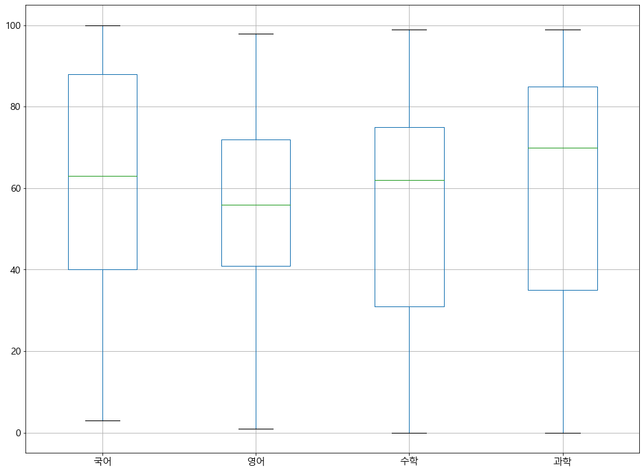
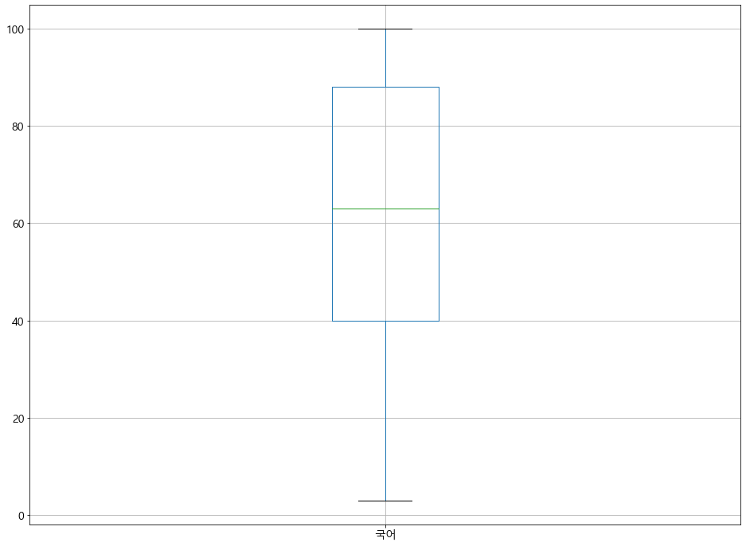

## 기술통계

- 자료를 그래프나숫자등으로 요약하는 통계적 행위 및 관련 방법<br>
- 데이터를 요약하고 시각화해서 잘 설명하는 것에 중점을 두며 데이터에 대해서 쉽게 설명하기 위해서 시각화를 많이 활용한다<br>
- 기술통계에서 기본적으로 사용하는 것
> 도수분포표<br>
> 히스토그램<br>
> 박스플롯(상자그림)<br>
- 이를 기반으로 사실을 객관적으로 확인하는 것을 중점으로 한다

## 기술통계 절차

1. 데이터의 전체 크기 확인<br>
- 행과 열의 수를 확인한다
2. 데이터의 형태 확인<br>
- 10만건의 데이터 전체를 출력하는 것은 매우 부담이 큰 처리이므로 상위 n건, 하위 n건의 일부만을 확인한다.
3. 집단의 특성을 잘 나타내는 요약 통계량을 확인한다<br>
- 평균,중앙값,표준편차,범위(최대값~최소값),사분위수 등을 확인한다<br>
4. 전체 데이터의 데이터 분포를 확인한다<br>
- 구간별 자료의 개수를 나타내는 표(=도수분포표)를 산정한다
- 도수 분포표를 그래프로 표현한 히스토그램을 확인한다

## 필요한 패키지 및 샘플 데이터 준비


```python
from pandas import DataFrame #모듈참조
from pandas import read_csv #모듈참조
from matplotlib import pyplot #모듈참조
#from sample import height #데이터참조
```


```python
# 학생키 데이터->도수분포와 히스토그램 확인을 위한 샘플 데이터
#학생키=DataFrame(height)
#학생키
```


```python
# 성적표 데이터 -> 기술통계 수치값, 상자그림 확인을 위한 샘플 데이터
성적표csv=read_csv("http://itpaper.co.kr/demo/python/grade.csv",encoding="euc-kr")
성적표csv
```


<div>
<style scoped>
    .dataframe tbody tr th:only-of-type {
        vertical-align: middle;
    }

    .dataframe tbody tr th {
        vertical-align: top;
    }

    .dataframe thead th {
        text-align: right;
    }
</style>
<table border="1" class="dataframe">
  <thead>
    <tr style="text-align: right;">
      <th></th>
      <th>이름</th>
      <th>국어</th>
      <th>영어</th>
      <th>수학</th>
      <th>과학</th>
    </tr>
  </thead>
  <tbody>
    <tr>
      <td>0</td>
      <td>학생1</td>
      <td>98.0</td>
      <td>NaN</td>
      <td>88.0</td>
      <td>64.0</td>
    </tr>
    <tr>
      <td>1</td>
      <td>학생2</td>
      <td>88.0</td>
      <td>90.0</td>
      <td>62.0</td>
      <td>72.0</td>
    </tr>
    <tr>
      <td>2</td>
      <td>학생3</td>
      <td>92.0</td>
      <td>70.0</td>
      <td>NaN</td>
      <td>NaN</td>
    </tr>
    <tr>
      <td>3</td>
      <td>학생4</td>
      <td>63.0</td>
      <td>60.0</td>
      <td>31.0</td>
      <td>70.0</td>
    </tr>
    <tr>
      <td>4</td>
      <td>학생5</td>
      <td>100.0</td>
      <td>50.0</td>
      <td>NaN</td>
      <td>88.0</td>
    </tr>
    <tr>
      <td>...</td>
      <td>...</td>
      <td>...</td>
      <td>...</td>
      <td>...</td>
      <td>...</td>
    </tr>
    <tr>
      <td>9995</td>
      <td>학생9996</td>
      <td>63.0</td>
      <td>60.0</td>
      <td>55.0</td>
      <td>70.0</td>
    </tr>
    <tr>
      <td>9996</td>
      <td>학생9997</td>
      <td>21.0</td>
      <td>50.0</td>
      <td>55.0</td>
      <td>88.0</td>
    </tr>
    <tr>
      <td>9997</td>
      <td>학생9998</td>
      <td>98.0</td>
      <td>90.0</td>
      <td>88.0</td>
      <td>64.0</td>
    </tr>
    <tr>
      <td>9998</td>
      <td>학생9999</td>
      <td>88.0</td>
      <td>90.0</td>
      <td>62.0</td>
      <td>72.0</td>
    </tr>
    <tr>
      <td>9999</td>
      <td>학생10000</td>
      <td>92.0</td>
      <td>70.0</td>
      <td>75.0</td>
      <td>85.0</td>
    </tr>
  </tbody>
</table>
<p>10000 rows × 5 columns</p>
</div>


성적표 데이터 전처리


```python
학생이름={}
for i, v in enumerate(list(성적표csv['이름'])):
    학생이름[i]=v
    
성적표df=성적표csv.rename(index=학생이름).drop('이름',axis=1)
성적표df
```


<div>
<style scoped>
    .dataframe tbody tr th:only-of-type {
        vertical-align: middle;
    }

    .dataframe tbody tr th {
        vertical-align: top;
    }

    .dataframe thead th {
        text-align: right;
    }
</style>
<table border="1" class="dataframe">
  <thead>
    <tr style="text-align: right;">
      <th></th>
      <th>국어</th>
      <th>영어</th>
      <th>수학</th>
      <th>과학</th>
    </tr>
  </thead>
  <tbody>
    <tr>
      <td>학생1</td>
      <td>98.0</td>
      <td>NaN</td>
      <td>88.0</td>
      <td>64.0</td>
    </tr>
    <tr>
      <td>학생2</td>
      <td>88.0</td>
      <td>90.0</td>
      <td>62.0</td>
      <td>72.0</td>
    </tr>
    <tr>
      <td>학생3</td>
      <td>92.0</td>
      <td>70.0</td>
      <td>NaN</td>
      <td>NaN</td>
    </tr>
    <tr>
      <td>학생4</td>
      <td>63.0</td>
      <td>60.0</td>
      <td>31.0</td>
      <td>70.0</td>
    </tr>
    <tr>
      <td>학생5</td>
      <td>100.0</td>
      <td>50.0</td>
      <td>NaN</td>
      <td>88.0</td>
    </tr>
    <tr>
      <td>...</td>
      <td>...</td>
      <td>...</td>
      <td>...</td>
      <td>...</td>
    </tr>
    <tr>
      <td>학생9996</td>
      <td>63.0</td>
      <td>60.0</td>
      <td>55.0</td>
      <td>70.0</td>
    </tr>
    <tr>
      <td>학생9997</td>
      <td>21.0</td>
      <td>50.0</td>
      <td>55.0</td>
      <td>88.0</td>
    </tr>
    <tr>
      <td>학생9998</td>
      <td>98.0</td>
      <td>90.0</td>
      <td>88.0</td>
      <td>64.0</td>
    </tr>
    <tr>
      <td>학생9999</td>
      <td>88.0</td>
      <td>90.0</td>
      <td>62.0</td>
      <td>72.0</td>
    </tr>
    <tr>
      <td>학생10000</td>
      <td>92.0</td>
      <td>70.0</td>
      <td>75.0</td>
      <td>85.0</td>
    </tr>
  </tbody>
</table>
<p>10000 rows × 4 columns</p>
</div>


---------------------------------------
## #01. 데이터의 전체 크기 확인


```python
# 데이터프레임의 전체 크기를 튜플로 조회
행,열=성적표df.shape
print("행의 크기=",행)
print("열의 크기=",열)
```

    행의 크기= 10000
    열의 크기= 4
    

---------------------------------------
## #02. 데이터의 일부만 확인하기

앞 부분의 5건만 확인


```python
성적표df.head()
```


<div>
<style scoped>
    .dataframe tbody tr th:only-of-type {
        vertical-align: middle;
    }

    .dataframe tbody tr th {
        vertical-align: top;
    }

    .dataframe thead th {
        text-align: right;
    }
</style>
<table border="1" class="dataframe">
  <thead>
    <tr style="text-align: right;">
      <th></th>
      <th>국어</th>
      <th>영어</th>
      <th>수학</th>
      <th>과학</th>
    </tr>
  </thead>
  <tbody>
    <tr>
      <td>학생1</td>
      <td>98.0</td>
      <td>NaN</td>
      <td>88.0</td>
      <td>64.0</td>
    </tr>
    <tr>
      <td>학생2</td>
      <td>88.0</td>
      <td>90.0</td>
      <td>62.0</td>
      <td>72.0</td>
    </tr>
    <tr>
      <td>학생3</td>
      <td>92.0</td>
      <td>70.0</td>
      <td>NaN</td>
      <td>NaN</td>
    </tr>
    <tr>
      <td>학생4</td>
      <td>63.0</td>
      <td>60.0</td>
      <td>31.0</td>
      <td>70.0</td>
    </tr>
    <tr>
      <td>학생5</td>
      <td>100.0</td>
      <td>50.0</td>
      <td>NaN</td>
      <td>88.0</td>
    </tr>
  </tbody>
</table>
</div>


뒷 부분의 5건만 확인


```python
성적표df.tail()
```


<div>
<style scoped>
    .dataframe tbody tr th:only-of-type {
        vertical-align: middle;
    }

    .dataframe tbody tr th {
        vertical-align: top;
    }

    .dataframe thead th {
        text-align: right;
    }
</style>
<table border="1" class="dataframe">
  <thead>
    <tr style="text-align: right;">
      <th></th>
      <th>국어</th>
      <th>영어</th>
      <th>수학</th>
      <th>과학</th>
    </tr>
  </thead>
  <tbody>
    <tr>
      <td>학생9996</td>
      <td>63.0</td>
      <td>60.0</td>
      <td>55.0</td>
      <td>70.0</td>
    </tr>
    <tr>
      <td>학생9997</td>
      <td>21.0</td>
      <td>50.0</td>
      <td>55.0</td>
      <td>88.0</td>
    </tr>
    <tr>
      <td>학생9998</td>
      <td>98.0</td>
      <td>90.0</td>
      <td>88.0</td>
      <td>64.0</td>
    </tr>
    <tr>
      <td>학생9999</td>
      <td>88.0</td>
      <td>90.0</td>
      <td>62.0</td>
      <td>72.0</td>
    </tr>
    <tr>
      <td>학생10000</td>
      <td>92.0</td>
      <td>70.0</td>
      <td>75.0</td>
      <td>85.0</td>
    </tr>
  </tbody>
</table>
</div>


---------------------------------------
## #03. 기술통계표 얻기

전체 컬럼에 대한 일괄 확인


```python
des=성적표df.describe()
des
```


<div>
<style scoped>
    .dataframe tbody tr th:only-of-type {
        vertical-align: middle;
    }

    .dataframe tbody tr th {
        vertical-align: top;
    }

    .dataframe thead th {
        text-align: right;
    }
</style>
<table border="1" class="dataframe">
  <thead>
    <tr style="text-align: right;">
      <th></th>
      <th>국어</th>
      <th>영어</th>
      <th>수학</th>
      <th>과학</th>
    </tr>
  </thead>
  <tbody>
    <tr>
      <td>count</td>
      <td>9932.000000</td>
      <td>9770.000000</td>
      <td>9705.000000</td>
      <td>9832.000000</td>
    </tr>
    <tr>
      <td>mean</td>
      <td>60.266512</td>
      <td>57.069908</td>
      <td>56.160330</td>
      <td>60.420972</td>
    </tr>
    <tr>
      <td>std</td>
      <td>27.876303</td>
      <td>23.391528</td>
      <td>25.402649</td>
      <td>28.826763</td>
    </tr>
    <tr>
      <td>min</td>
      <td>3.000000</td>
      <td>1.000000</td>
      <td>0.000000</td>
      <td>0.000000</td>
    </tr>
    <tr>
      <td>25%</td>
      <td>40.000000</td>
      <td>41.000000</td>
      <td>31.000000</td>
      <td>35.000000</td>
    </tr>
    <tr>
      <td>50%</td>
      <td>63.000000</td>
      <td>56.000000</td>
      <td>62.000000</td>
      <td>70.000000</td>
    </tr>
    <tr>
      <td>75%</td>
      <td>88.000000</td>
      <td>72.000000</td>
      <td>75.000000</td>
      <td>85.000000</td>
    </tr>
    <tr>
      <td>max</td>
      <td>100.000000</td>
      <td>98.000000</td>
      <td>99.000000</td>
      <td>99.000000</td>
    </tr>
  </tbody>
</table>
</div>


특정컬럼에 대한 확인 : 성적표df['국어'].describe()


```python
성적표df['국어'].describe()
```


    count    9932.000000
    mean       60.266512
    std        27.876303
    min         3.000000
    25%        40.000000
    50%        63.000000
    75%        88.000000
    max       100.000000
    Name: 국어, dtype: float64


### 기술통계값들을 개별적으로 얻기


```python
성적표df.count()
```


    국어    9932
    영어    9770
    수학    9705
    과학    9832
    dtype: int64


```python
성적표df.mean()
```


    국어    60.266512
    영어    57.069908
    수학    56.160330
    과학    60.420972
    dtype: float64


```python
성적표df.max()
```


    국어    100.0
    영어     98.0
    수학     99.0
    과학     99.0
    dtype: float64


```python
성적표df.min()
```


    국어    3.0
    영어    1.0
    수학    0.0
    과학    0.0
    dtype: float64


```python
성적표df.std()
```


    국어    27.876303
    영어    23.391528
    수학    25.402649
    과학    28.826763
    dtype: float64


```python
# 1사분위 수(25% 위치의 값)
성적표df.quantile(q=0.25)
```


    국어    40.0
    영어    41.0
    수학    31.0
    과학    35.0
    Name: 0.25, dtype: float64


```python
# 2사분위 수(50% 위치의 값)
성적표df.quantile(q=0.5)
```


    국어    63.0
    영어    56.0
    수학    62.0
    과학    70.0
    Name: 0.5, dtype: float64


```python
# 중앙값을 얻는 또 다른 방법
성적표df.median()
```


    국어    63.0
    영어    56.0
    수학    62.0
    과학    70.0
    dtype: float64


```python
# 3사분위 수(75% 위치의 값)
성적표df.quantile(q=0.75)
```


    국어    88.0
    영어    72.0
    수학    75.0
    과학    85.0
    Name: 0.75, dtype: float64


```python
# 응용 - 상위 10%에 들기 위해 취득해야 하는 과목별 점수
성적표df.quantile(q=0.9)
```


    국어    93.0
    영어    90.0
    수학    88.0
    과학    93.0
    Name: 0.9, dtype: float64


---------------------------------------
## #04. 기술통계표 얻기

- 기술통계값 중에서 최대,최소값과 사분위수를 시각화 한 그래프
- 내부적으로 matplotlib 패키지의 pyplot 객체를 사용한다

pyplot 객체 기본 환경 설정


```python
# 한글폰트, 그래픽 크기 설정
pyplot.rcParams["font.family"]='Malgun Gothic'    # 사용할 폰트이름 지정(맑은고딕)
pyplot.rcParams["font.size"]=14                   # 글자크기
pyplot.rcParams["figure.figsize"]=(16,12)         # 그래프의 가로,세로 크기
```

전체 데이터 프레임의 상자그램 생성


```python
성적표df.boxplot()
```


    <matplotlib.axes._subplots.AxesSubplot at 0x1b639173b48>





# 특정 컬럼만을 상자그림으로 표시


```python
# 표현할 컬럼이름들을 리스트로 지정(두 개 이상 가능함)
성적표df.boxplot(["국어"])

# 이미지 저장, dpi는 해상도 비율(기본값=100)
pyplot.savefig("국어점수분포.png", dpi=200)
```





```python

```
