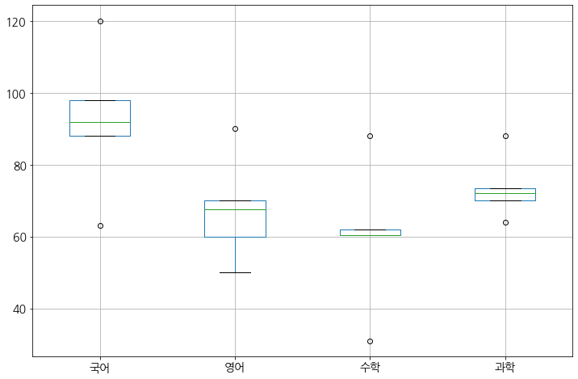

## 데이터정제

결측치나 이상치가 포함된 데이터를 삭제하거나 다른값으로 대체하는 처리

- 결측치 : 비어있는 값, DB에서의 Null과 비슷한의미
- 이상치 : 정상 범주에서 크게 벗어난 값.
    - 극단치:논리적으로 존재할 수 있지만 극단적으로 크거나 작은 값
        
데이터 수집 과정에서 오류가 발생될 수 있기 대문에, 현장에서 만들어진 실제 데이터에는 결측치나 이상치가 포함될 수 있다<br>
이러한 값들이 포함되어 있으면 분석 결과가 왜곡되기 때문에 분석에 앞서 결측치와 이상치를 제거하는 작업을 해야 한다
        
## 결측치 정제 방법
        
        
1. 결측치 소거법 : 결측치가 포함된 행이나 열을 통째로 삭제한다
-  데이터가 크고 결측치가 얼마 없는 경우에는 결측치를 제거하더라도 무리가 없다
-  데이터가 작고 결측치가 많은 경우 결측치를 제거하면 너무 많은 데이터가 손실 되기 때문에 오히려 분석 결과가 더 왜곡되는 문제가 발생한다
2. 결측치 대체법 : 결측치를 제거하는 대신 다른값을 채워 넣는 방법
- 데이터가 손실되어 분석결과가 왜곡되는 문제를 보완할 수 있다
- 결측치 대체법의 종류
           A. 평균이나 최대, 최소값을 같은 대표값을 구해 모든 결측치를 하나의 값으로 일괄 대체
           B. 통계 분석 기법으로 각 결측치의 예측값을 추정 해 대체

## #01.패키지 및 샘플 데이터 준비


```python
from pandas import DataFrame
from sample import grade_dic
from matplotlib import pyplot #모듈참조
from sklearn.impute import SimpleImputer #sklearn은 tensorflow 보다 수학공식 일일히 안써도 되서 좋다. 그러나 속도가 tensorflow보다 느리다
import numpy
```


```python
#데이터프레임 만들기
성적표 = DataFrame(grade_dic, index=['철수','영희','민철','수현','호영'])
성적표
```


<div>
<style scoped>
    .dataframe tbody tr th:only-of-type {
        vertical-align: middle;
    }

    .dataframe tbody tr th {
        vertical-align: top;
    }

    .dataframe thead th {
        text-align: right;
    }
</style>
<table border="1" class="dataframe">
  <thead>
    <tr style="text-align: right;">
      <th></th>
      <th>국어</th>
      <th>영어</th>
      <th>수학</th>
      <th>과학</th>
    </tr>
  </thead>
  <tbody>
    <tr>
      <td>철수</td>
      <td>98</td>
      <td>NaN</td>
      <td>88.0</td>
      <td>64.0</td>
    </tr>
    <tr>
      <td>영희</td>
      <td>88</td>
      <td>90.0</td>
      <td>62.0</td>
      <td>72.0</td>
    </tr>
    <tr>
      <td>민철</td>
      <td>92</td>
      <td>70.0</td>
      <td>NaN</td>
      <td>NaN</td>
    </tr>
    <tr>
      <td>수현</td>
      <td>63</td>
      <td>60.0</td>
      <td>31.0</td>
      <td>70.0</td>
    </tr>
    <tr>
      <td>호영</td>
      <td>120</td>
      <td>50.0</td>
      <td>NaN</td>
      <td>88.0</td>
    </tr>
  </tbody>
</table>
</div>


## #02.결측치 확인하기
1) 각 데이터의 결측치여부 확인
- 각 열에 대해 결측치가 아닐 경우 False, 결측치는 True로 표시됨
- isna() 함수도 같은 기능


```python
결측치여부 = 성적표.isnull()
결측치여부
```


<div>
<style scoped>
    .dataframe tbody tr th:only-of-type {
        vertical-align: middle;
    }

    .dataframe tbody tr th {
        vertical-align: top;
    }

    .dataframe thead th {
        text-align: right;
    }
</style>
<table border="1" class="dataframe">
  <thead>
    <tr style="text-align: right;">
      <th></th>
      <th>국어</th>
      <th>영어</th>
      <th>수학</th>
      <th>과학</th>
    </tr>
  </thead>
  <tbody>
    <tr>
      <td>철수</td>
      <td>False</td>
      <td>True</td>
      <td>False</td>
      <td>False</td>
    </tr>
    <tr>
      <td>영희</td>
      <td>False</td>
      <td>False</td>
      <td>False</td>
      <td>False</td>
    </tr>
    <tr>
      <td>민철</td>
      <td>False</td>
      <td>False</td>
      <td>True</td>
      <td>True</td>
    </tr>
    <tr>
      <td>수현</td>
      <td>False</td>
      <td>False</td>
      <td>False</td>
      <td>False</td>
    </tr>
    <tr>
      <td>호영</td>
      <td>False</td>
      <td>False</td>
      <td>True</td>
      <td>False</td>
    </tr>
  </tbody>
</table>
</div>


2) 각 열별로 결측치 수 파악하기
- isnull()함수로 도출된 데이터프레임의 열별로 합계를 수행하면 True는 1, False는 0으로 계산되어 진다


```python
결측치합계 = 결측치여부.sum()
결측치합계
```


    국어    0
    영어    1
    수학    2
    과학    1
    dtype: int64


## #03.결측치 소거
1) 결측치가 포함된 모든 행 삭제
- 원본은 변화 없음, 삭제결과 리턴됨
- inplace=True 파라미터를 적용할 경우 리턴값 없이 원본에 즉시 반영됨

행에 포함된 값 중 하나라도 결측치인 경우 삭제


```python
na1=성적표.dropna()
na1
```


<div>
<style scoped>
    .dataframe tbody tr th:only-of-type {
        vertical-align: middle;
    }

    .dataframe tbody tr th {
        vertical-align: top;
    }

    .dataframe thead th {
        text-align: right;
    }
</style>
<table border="1" class="dataframe">
  <thead>
    <tr style="text-align: right;">
      <th></th>
      <th>국어</th>
      <th>영어</th>
      <th>수학</th>
      <th>과학</th>
    </tr>
  </thead>
  <tbody>
    <tr>
      <td>영희</td>
      <td>88</td>
      <td>90.0</td>
      <td>62.0</td>
      <td>72.0</td>
    </tr>
    <tr>
      <td>수현</td>
      <td>63</td>
      <td>60.0</td>
      <td>31.0</td>
      <td>70.0</td>
    </tr>
  </tbody>
</table>
</div>


행에 포함된 모든 값이 결측치인 경우 삭제
->삭제될 가능성이 매우 적다


```python
na2=성적표.dropna(how='all')
na2
```


<div>
<style scoped>
    .dataframe tbody tr th:only-of-type {
        vertical-align: middle;
    }

    .dataframe tbody tr th {
        vertical-align: top;
    }

    .dataframe thead th {
        text-align: right;
    }
</style>
<table border="1" class="dataframe">
  <thead>
    <tr style="text-align: right;">
      <th></th>
      <th>국어</th>
      <th>영어</th>
      <th>수학</th>
      <th>과학</th>
    </tr>
  </thead>
  <tbody>
    <tr>
      <td>철수</td>
      <td>98</td>
      <td>NaN</td>
      <td>88.0</td>
      <td>64.0</td>
    </tr>
    <tr>
      <td>영희</td>
      <td>88</td>
      <td>90.0</td>
      <td>62.0</td>
      <td>72.0</td>
    </tr>
    <tr>
      <td>민철</td>
      <td>92</td>
      <td>70.0</td>
      <td>NaN</td>
      <td>NaN</td>
    </tr>
    <tr>
      <td>수현</td>
      <td>63</td>
      <td>60.0</td>
      <td>31.0</td>
      <td>70.0</td>
    </tr>
    <tr>
      <td>호영</td>
      <td>120</td>
      <td>50.0</td>
      <td>NaN</td>
      <td>88.0</td>
    </tr>
  </tbody>
</table>
</div>


2) 결측치가 포함된 모든 열
- 원본은 변화 없음, 삭제결과 리턴됨
- inplace=True 파라미터를 적용할 경우 리턴값 없이 원본에 즉시 반영됨

열에 포함된 값 중 하나라도 결측치인 경우 삭제


```python
na3=성적표.dropna(axis=1)
na3
```


<div>
<style scoped>
    .dataframe tbody tr th:only-of-type {
        vertical-align: middle;
    }

    .dataframe tbody tr th {
        vertical-align: top;
    }

    .dataframe thead th {
        text-align: right;
    }
</style>
<table border="1" class="dataframe">
  <thead>
    <tr style="text-align: right;">
      <th></th>
      <th>국어</th>
    </tr>
  </thead>
  <tbody>
    <tr>
      <td>철수</td>
      <td>98</td>
    </tr>
    <tr>
      <td>영희</td>
      <td>88</td>
    </tr>
    <tr>
      <td>민철</td>
      <td>92</td>
    </tr>
    <tr>
      <td>수현</td>
      <td>63</td>
    </tr>
    <tr>
      <td>호영</td>
      <td>120</td>
    </tr>
  </tbody>
</table>
</div>


열에 포함된 모든 값이 결측치인 경우 삭제
->삭제될 가능성이 매우 적다


```python
na4=성적표.dropna(how='all',axis=1)
na4
```


<div>
<style scoped>
    .dataframe tbody tr th:only-of-type {
        vertical-align: middle;
    }

    .dataframe tbody tr th {
        vertical-align: top;
    }

    .dataframe thead th {
        text-align: right;
    }
</style>
<table border="1" class="dataframe">
  <thead>
    <tr style="text-align: right;">
      <th></th>
      <th>국어</th>
      <th>영어</th>
      <th>수학</th>
      <th>과학</th>
    </tr>
  </thead>
  <tbody>
    <tr>
      <td>철수</td>
      <td>98</td>
      <td>NaN</td>
      <td>88.0</td>
      <td>64.0</td>
    </tr>
    <tr>
      <td>영희</td>
      <td>88</td>
      <td>90.0</td>
      <td>62.0</td>
      <td>72.0</td>
    </tr>
    <tr>
      <td>민철</td>
      <td>92</td>
      <td>70.0</td>
      <td>NaN</td>
      <td>NaN</td>
    </tr>
    <tr>
      <td>수현</td>
      <td>63</td>
      <td>60.0</td>
      <td>31.0</td>
      <td>70.0</td>
    </tr>
    <tr>
      <td>호영</td>
      <td>120</td>
      <td>50.0</td>
      <td>NaN</td>
      <td>88.0</td>
    </tr>
  </tbody>
</table>
</div>


## #04.결측치 대체
1) 대표값으로 대체하기
- 원본은 변화 없음, 삭제결과 리턴됨
- inplace=True 파라미터를 적용할 경우 리턴값 없이 원본에 즉시 반영됨


```python
대표값_대체=성적표.fillna(value=50)
대표값_대체
```


<div>
<style scoped>
    .dataframe tbody tr th:only-of-type {
        vertical-align: middle;
    }

    .dataframe tbody tr th {
        vertical-align: top;
    }

    .dataframe thead th {
        text-align: right;
    }
</style>
<table border="1" class="dataframe">
  <thead>
    <tr style="text-align: right;">
      <th></th>
      <th>국어</th>
      <th>영어</th>
      <th>수학</th>
      <th>과학</th>
    </tr>
  </thead>
  <tbody>
    <tr>
      <td>철수</td>
      <td>98</td>
      <td>50.0</td>
      <td>88.0</td>
      <td>64.0</td>
    </tr>
    <tr>
      <td>영희</td>
      <td>88</td>
      <td>90.0</td>
      <td>62.0</td>
      <td>72.0</td>
    </tr>
    <tr>
      <td>민철</td>
      <td>92</td>
      <td>70.0</td>
      <td>50.0</td>
      <td>50.0</td>
    </tr>
    <tr>
      <td>수현</td>
      <td>63</td>
      <td>60.0</td>
      <td>31.0</td>
      <td>70.0</td>
    </tr>
    <tr>
      <td>호영</td>
      <td>120</td>
      <td>50.0</td>
      <td>50.0</td>
      <td>88.0</td>
    </tr>
  </tbody>
</table>
</div>


2) 통계분석 기법으로 대체하기

결측치를 정제할 규칙 정의
- startegy옵션 : mean=평균, median=중앙값, most_frequent : 최빈값(가장 많이 관측되는 수)


```python
# 각 열단위로 평균(strategy='mean')을 결측치(missing_values)에 지정
정제규칙=SimpleImputer(missing_values=numpy.nan, strategy='mean')
정제규칙
```


    SimpleImputer(add_indicator=False, copy=True, fill_value=None,
                  missing_values=nan, strategy='mean', verbose=0)


정의된 규칙을 데이터프레임의 값들만 추출해서 적용<br>
규칙이 적용된 2차배열이 반환된다


```python
정제규칙_적용결과 = 정제규칙.fit_transform(성적표.values)
print(type(정제규칙_적용결과))
정제규칙_적용결과
```

    <class 'numpy.ndarray'>
    


    array([[ 98.        ,  67.5       ,  88.        ,  64.        ],
           [ 88.        ,  90.        ,  62.        ,  72.        ],
           [ 92.        ,  70.        ,  60.33333333,  73.5       ],
           [ 63.        ,  60.        ,  31.        ,  70.        ],
           [120.        ,  50.        ,  60.33333333,  88.        ]])


적용된 규칙으로 새로운 데이터 프레임 생성<br>
원본 데이터 프레임에서 인덱스 이름과 컬럼이름을 가져와 적용해 준다


```python
정제결과 = DataFrame(정제규칙_적용결과,index=성적표.index, columns=성적표.columns)
정제결과
```


<div>
<style scoped>
    .dataframe tbody tr th:only-of-type {
        vertical-align: middle;
    }

    .dataframe tbody tr th {
        vertical-align: top;
    }

    .dataframe thead th {
        text-align: right;
    }
</style>
<table border="1" class="dataframe">
  <thead>
    <tr style="text-align: right;">
      <th></th>
      <th>국어</th>
      <th>영어</th>
      <th>수학</th>
      <th>과학</th>
    </tr>
  </thead>
  <tbody>
    <tr>
      <td>철수</td>
      <td>98.0</td>
      <td>67.5</td>
      <td>88.000000</td>
      <td>64.0</td>
    </tr>
    <tr>
      <td>영희</td>
      <td>88.0</td>
      <td>90.0</td>
      <td>62.000000</td>
      <td>72.0</td>
    </tr>
    <tr>
      <td>민철</td>
      <td>92.0</td>
      <td>70.0</td>
      <td>60.333333</td>
      <td>73.5</td>
    </tr>
    <tr>
      <td>수현</td>
      <td>63.0</td>
      <td>60.0</td>
      <td>31.000000</td>
      <td>70.0</td>
    </tr>
    <tr>
      <td>호영</td>
      <td>120.0</td>
      <td>50.0</td>
      <td>60.333333</td>
      <td>88.0</td>
    </tr>
  </tbody>
</table>
</div>


## #05.이상치(극단치) 정제
극단치 제거를 위해 먼저 어디까지를 정상 범위로 볼 것인가를 정해야 한다
1. 논리적으로 판단하여 정하기
- 예를 들어 성인의 몸무게가 50~150Kg를 벗어나는 경우는 상당히 드물 것으로 판단하고 이 범위를 벗어나면 극단치로 간주하는 것이다
2. 통계적인 기준을 이용하기
- 상하위 0.3% 또는 +-3 표준편차에 해당할 만큼 극단적으로 크거나 낮으면 극단치로 간주하는 방법

1) 이상치 존재 여부 확인하기를 위해 상자그림 표시


```python
# 앞에서 1차적으로 정제한 결과를 복사해서 진행
성적표정제=정제결과.copy()

pyplot.rcParams["font.family"] = 'NanumGothic'
pyplot.rcParams["font.size"] = 14
pyplot.rcParams["figure.figsize"] = (12,8)
성적표정제.boxplot()
pyplot.show()
```





2) 이상치를 결측치로 변경하기

국어점수에 대한 이상치 필터링 --> 직관적으로 판단하여 100점 이상 나올 수 없는 점수를 이상치로 판단


```python
이상치데이터 = 성적표정제.query('국어>100')
이상치데이터
```


<div>
<style scoped>
    .dataframe tbody tr th:only-of-type {
        vertical-align: middle;
    }

    .dataframe tbody tr th {
        vertical-align: top;
    }

    .dataframe thead th {
        text-align: right;
    }
</style>
<table border="1" class="dataframe">
  <thead>
    <tr style="text-align: right;">
      <th></th>
      <th>국어</th>
      <th>영어</th>
      <th>수학</th>
      <th>과학</th>
    </tr>
  </thead>
  <tbody>
    <tr>
      <td>호영</td>
      <td>120.0</td>
      <td>50.0</td>
      <td>60.333333</td>
      <td>88.0</td>
    </tr>
  </tbody>
</table>
</div>


필터링 된 이상치 데이터에 대한 인덱스 호출


```python
이상치인덱스 = list(이상치데이터.index)
이상치인덱스
```


    ['호영']


이상치를 갖는 인덱스에 대한 국어 점수를 결측치로 변경


```python
for i in 이상치인덱스:
    성적표정제.loc[i,'국어']=numpy.nan

성적표정제
```


<div>
<style scoped>
    .dataframe tbody tr th:only-of-type {
        vertical-align: middle;
    }

    .dataframe tbody tr th {
        vertical-align: top;
    }

    .dataframe thead th {
        text-align: right;
    }
</style>
<table border="1" class="dataframe">
  <thead>
    <tr style="text-align: right;">
      <th></th>
      <th>국어</th>
      <th>영어</th>
      <th>수학</th>
      <th>과학</th>
    </tr>
  </thead>
  <tbody>
    <tr>
      <td>철수</td>
      <td>98.0</td>
      <td>67.5</td>
      <td>88.000000</td>
      <td>64.0</td>
    </tr>
    <tr>
      <td>영희</td>
      <td>88.0</td>
      <td>90.0</td>
      <td>62.000000</td>
      <td>72.0</td>
    </tr>
    <tr>
      <td>민철</td>
      <td>92.0</td>
      <td>70.0</td>
      <td>60.333333</td>
      <td>73.5</td>
    </tr>
    <tr>
      <td>수현</td>
      <td>63.0</td>
      <td>60.0</td>
      <td>31.000000</td>
      <td>70.0</td>
    </tr>
    <tr>
      <td>호영</td>
      <td>NaN</td>
      <td>50.0</td>
      <td>60.333333</td>
      <td>88.0</td>
    </tr>
  </tbody>
</table>
</div>


3) 변경된 결측치 정제<br>
결측치를 정제할 규칙 정의


```python
# 결측치에 대해 평균점수 부여
정제규칙=SimpleImputer(missing_values=numpy.nan, strategy='mean')
정제규칙
```


    SimpleImputer(add_indicator=False, copy=True, fill_value=None,
                  missing_values=nan, strategy='mean', verbose=0)


Dataframe의 값에 대해 규칙 적용


```python
성적표정제결과 = 정제규칙.fit_transform(성적표정제.values)
성적표정제결과
```


    array([[98.        , 67.5       , 88.        , 64.        ],
           [88.        , 90.        , 62.        , 72.        ],
           [92.        , 70.        , 60.33333333, 73.5       ],
           [63.        , 60.        , 31.        , 70.        ],
           [85.25      , 50.        , 60.33333333, 88.        ]])


적용된 규칙으로 새로운 데이터 프레임 완성


```python
성적표완성 = DataFrame(성적표정제결과,index=성적표.index, columns=성적표.columns)
성적표완성
# Loc['호영','국어'] 의 값이 NaN에서 평균값인 82.25로 바뀌었음
```


<div>
<style scoped>
    .dataframe tbody tr th:only-of-type {
        vertical-align: middle;
    }

    .dataframe tbody tr th {
        vertical-align: top;
    }

    .dataframe thead th {
        text-align: right;
    }
</style>
<table border="1" class="dataframe">
  <thead>
    <tr style="text-align: right;">
      <th></th>
      <th>국어</th>
      <th>영어</th>
      <th>수학</th>
      <th>과학</th>
    </tr>
  </thead>
  <tbody>
    <tr>
      <td>철수</td>
      <td>98.00</td>
      <td>67.5</td>
      <td>88.000000</td>
      <td>64.0</td>
    </tr>
    <tr>
      <td>영희</td>
      <td>88.00</td>
      <td>90.0</td>
      <td>62.000000</td>
      <td>72.0</td>
    </tr>
    <tr>
      <td>민철</td>
      <td>92.00</td>
      <td>70.0</td>
      <td>60.333333</td>
      <td>73.5</td>
    </tr>
    <tr>
      <td>수현</td>
      <td>63.00</td>
      <td>60.0</td>
      <td>31.000000</td>
      <td>70.0</td>
    </tr>
    <tr>
      <td>호영</td>
      <td>85.25</td>
      <td>50.0</td>
      <td>60.333333</td>
      <td>88.0</td>
    </tr>
  </tbody>
</table>
</div>


```python

```
