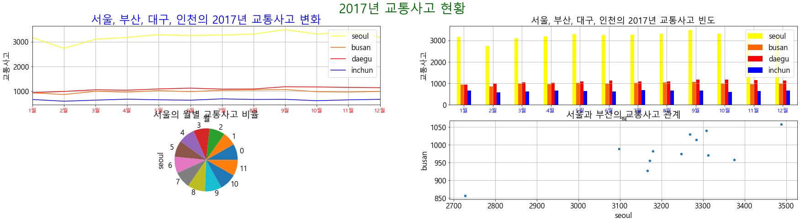

## 서브플롯

matplotlib를 사용하여 하나의 그래픽 영역을 나누어 두 개 이상의 시각화 결과물을 표현할 수 있다

-------------------------------
## 필요한 패키지 및 샘플 데이터 가져오기


```python
import numpy
from pandas import DataFrame
from matplotlib import pyplot
from sample import traffic
```


```python
df = DataFrame(traffic)
df
```


<div>
<style scoped>
    .dataframe tbody tr th:only-of-type {
        vertical-align: middle;
    }

    .dataframe tbody tr th {
        vertical-align: top;
    }

    .dataframe thead th {
        text-align: right;
    }
</style>
<table border="1" class="dataframe">
  <thead>
    <tr style="text-align: right;">
      <th></th>
      <th>seoul</th>
      <th>busan</th>
      <th>daegu</th>
      <th>inchun</th>
      <th>month</th>
    </tr>
  </thead>
  <tbody>
    <tr>
      <td>0</td>
      <td>3166</td>
      <td>927</td>
      <td>933</td>
      <td>655</td>
      <td>1월</td>
    </tr>
    <tr>
      <td>1</td>
      <td>2728</td>
      <td>857</td>
      <td>982</td>
      <td>586</td>
      <td>2월</td>
    </tr>
    <tr>
      <td>2</td>
      <td>3098</td>
      <td>988</td>
      <td>1049</td>
      <td>629</td>
      <td>3월</td>
    </tr>
    <tr>
      <td>3</td>
      <td>3172</td>
      <td>955</td>
      <td>1032</td>
      <td>669</td>
      <td>4월</td>
    </tr>
    <tr>
      <td>4</td>
      <td>3284</td>
      <td>1014</td>
      <td>1083</td>
      <td>643</td>
      <td>5월</td>
    </tr>
    <tr>
      <td>5</td>
      <td>3247</td>
      <td>974</td>
      <td>1117</td>
      <td>627</td>
      <td>6월</td>
    </tr>
    <tr>
      <td>6</td>
      <td>3268</td>
      <td>1029</td>
      <td>1076</td>
      <td>681</td>
      <td>7월</td>
    </tr>
    <tr>
      <td>7</td>
      <td>3308</td>
      <td>1040</td>
      <td>1080</td>
      <td>657</td>
      <td>8월</td>
    </tr>
    <tr>
      <td>8</td>
      <td>3488</td>
      <td>1058</td>
      <td>1174</td>
      <td>662</td>
      <td>9월</td>
    </tr>
    <tr>
      <td>9</td>
      <td>3312</td>
      <td>971</td>
      <td>1163</td>
      <td>606</td>
      <td>10월</td>
    </tr>
    <tr>
      <td>10</td>
      <td>3375</td>
      <td>958</td>
      <td>1146</td>
      <td>641</td>
      <td>11월</td>
    </tr>
    <tr>
      <td>11</td>
      <td>3179</td>
      <td>982</td>
      <td>1135</td>
      <td>663</td>
      <td>12월</td>
    </tr>
  </tbody>
</table>
</div>


-------------------
## #01.pyplot 객채의 전역 환경 설정


```python
# 한글폰트, 그래픽 크기 설정
pyplot.rcParams["font.family"] = 'Malgun Gothic'
pyplot.rcParams["font.size"] = 16
pyplot.rcParams["figure.figsize"] = (20,10)
```

------------------
## #02.서브플롯 영역 나누기


```python
fig = pyplot.figure()             # 영역을 나눌 수 있는 객체 생성
ax1 = fig.add_subplot(2,3,1)      #2행 3열의 영역 중에서 첫 번째 영역
ax2 = fig.add_subplot(2,3,2)      #2행 3열의 영역 중에서 두 번째 영역
ax3 = fig.add_subplot(2,3,3)      #2행 3열의 영역 중에서 세 번째 영역
ax4 = fig.add_subplot(2,3,4)      #2행 3열의 영역 중에서 네 번째 영역
ax5 = fig.add_subplot(2,3,5)      #2행 3열의 영역 중에서 다섯 번째 영역
ax6 = fig.add_subplot(2,3,6)      #2행 3열의 영역 중에서 여섯 번째 영역
pyplot.show()
```


------------------------------
## #03. 서브플롯에 그래프 그리기

add_subplot() 함수를 통해 리턴받은 객체 각각의 그래프 생성 함수에게 ax 파라미터로 지정한다


```python
fig = pyplot.figure()             # 영역을 나눌 수 있는 객체 생성
ax1 = fig.add_subplot(2,2,1)      #2행 2열의 영역 중에서 첫 번째 영역
ax2 = fig.add_subplot(2,2,2)      #2행 2열의 영역 중에서 두 번째 영역
ax3 = fig.add_subplot(2,2,3)      #2행 2열의 영역 중에서 세 번째 영역
ax4 = fig.add_subplot(2,2,4)      #2행 2열의 영역 중에서 네 번째 영역


# 첫 번째
df.plot(ax = ax1)

# 두 번째
df.plot.bar(ax = ax2)

# 세 번째
df['seoul'].plot.pie(ax = ax3)

# 네 번째
df.plot.scatter(x='seoul', y='busan', ax = ax4)

pyplot.show()
```


------------------------------
## #04. 서브플롯에 그래프 그리기(꾸미기)

세부 항목들을 조정하여 꾸미기


```python
fig = pyplot.figure()             # 영역을 나눌 수 있는 객체 생성
ax1 = fig.add_subplot(2,2,1)      #2행 2열의 영역 중에서 첫 번째 영역
ax2 = fig.add_subplot(2,2,2)      #2행 2열의 영역 중에서 두 번째 영역
ax3 = fig.add_subplot(2,2,3)      #2행 2열의 영역 중에서 세 번째 영역
ax4 = fig.add_subplot(2,2,4)      #2행 2열의 영역 중에서 네 번째 영역

# 전체 제목
fig.suptitle('2017년 교통사고 현황', fontsize=28, color='#006600')

# 첫 번째
df.plot(ax = ax1, color=['#ffff00','#ff6600','#ff0000','#0000ff'])
ax1.title.set_text("서울, 부산, 대구, 인천의 2017년 교통사고 변화")
ax1.title.set_fontsize(24)
ax1.title.set_color('#ff0000')
ax1.grid()
ax1.set_xticks(list(range(0,12)))
ax1.set_xticklabels(list(df['month']), fontsize=12, color='#ff0000')
ax1.set(xlabel='월', ylabel ='교통사고')

# 두 번째
df.plot.bar(ax = ax2, rot=0, color=['#ffff00','#ff6600','#ff0000','#0000ff'])
ax2.title.set_text("서울, 부산, 대구, 인천의 2017년 교통사고 빈도")
ax1.title.set_fontsize(24)
ax1.title.set_color('#0000ff')
ax2.grid()
ax2.set_xticks(list(range(0,12)))
ax2.set_xticklabels(list(df['month']), fontsize=12, color = '#0000ff')
ax2.set(xlabel='월', ylabel ='교통사고')


# 세 번째
df['seoul'].plot.pie(ax = ax3)
ax3.title.set_text("서울의 월별 교통사고 비율")
ax3.grid()


# 네 번째
df.plot.scatter(x='seoul', y='busan', ax = ax4)
ax4.title.set_text("서울과 부산의 교통사고 관계")
ax4.grid()

pyplot.show()
```





```python
fig = pyplot.figure()             # 영역을 나눌 수 있는 객체 생성
ax1 = fig.add_subplot(2,2,1)      #2행 2열의 영역 중에서 첫 번째 영역
ax2 = fig.add_subplot(2,2,2)      #2행 2열의 영역 중에서 두 번째 영역
ax3 = fig.add_subplot(2,2,3)      #2행 2열의 영역 중에서 세 번째 영역
ax4 = fig.add_subplot(2,2,4)      #2행 2열의 영역 중에서 네 번째 영역

# 전체 제목
fig.suptitle('2017년 교통사고 현황', fontsize=28, color='#006600')

# 각 그래프 간의 가로(wspace), 세로(hspace) 간격 지정 : 지정하지 않으면 그래프간 글자가 겹침 
fig.subplots_adjust(wspace=0.3, hspace=0.3)                    # 추가

# 첫 번째
df.plot(ax = ax1, color=['#ffff00','#ff6600','#ff0000','#0000ff'])
ax1.title.set_text("서울, 부산, 대구, 인천의 2017년 교통사고 변화")
ax1.title.set_fontsize(24)
ax1.title.set_color('#ff0000')
ax1.grid()
ax1.set_xticks(list(range(0,12)))
ax1.set_xticklabels(list(df['month']), fontsize=12, color='#ff0000')
ax1.set(xlabel='월', ylabel ='교통사고')
ax1.set_xlim([-0.5,11.5])            #추가
ax1.set_ylim([0,3500])               #추가

# 두 번째
df.plot.bar(ax = ax2, rot=0, color=['#ffff00','#ff6600','#ff0000','#0000ff'])
ax2.title.set_text("서울, 부산, 대구, 인천의 2017년 교통사고 빈도")
ax2.title.set_fontsize(24)
ax2.title.set_color('#0000ff')
ax2.grid()
ax2.set_xticks(list(range(0,12)))
ax2.set_xticklabels(list(df['month']), fontsize=12, color = '#0000ff')
ax2.set(xlabel='월', ylabel ='교통사고')


# 세 번째
df['seoul'].plot.pie(ax = ax3, labels=df['month'],autopct="%0.1f%%",textprops={'color':"#000000",'fontsize':12},explode=[0.0,0.0,0.0,0.0,0.0,0.0,0.0,0.0,1.0,0.0,0.0,0.0])   #추가
ax3.title.set_text("서울의 월별 교통사고 비율")
ax3.grid()
ax3.set(ylabel=None)                                                     #추가
ax3.legend(labels=df['month'], title='범주', bbox_to_anchor=(1.0,0.92))  #추가

# 네 번째
df.plot.scatter(x='seoul', y='busan', ax = ax4, color='#ff6600',marker='X',label='교통사고')   # 추가
ax4.title.set_text("서울과 부산의 교통사고 관계")
ax4.grid()
ax4.set(xlabel='서울',ylabel='부산')                                                     #추가


pyplot.show()
```


-------------------------------------
## #05. 상자그림에 대한 서브 플롯


```python
# 한글폰트, 그래픽 크기 설정
pyplot.rcParams["font.family"] = 'Malgun Gothic'
pyplot.rcParams["font.size"] = 16
pyplot.rcParams["figure.figsize"] = (30,7)
```


```python
fig = pyplot.figure()             # 영역을 나눌 수 있는 객체 생성
ax1 = fig.add_subplot(1,4,1)      #1행 4열의 영역 중에서 첫 번째 영역
ax2 = fig.add_subplot(1,4,2)      #1행 4열의 영역 중에서 두 번째 영역
ax3 = fig.add_subplot(1,4,3)      #1행 4열의 영역 중에서 세 번째 영역
ax4 = fig.add_subplot(1,4,4)      #1행 4열의 영역 중에서 네 번째 영역

df.boxplot(['seoul'], ax=ax1)
df.boxplot(['busan'], ax=ax2)
df.boxplot(['daegu'], ax=ax3)
df.boxplot(['inchun'], ax=ax4)

pyplot.show()
```


```python

```


```python

```


```python

```


```python

```


```python

```


```python

```


```python

```
