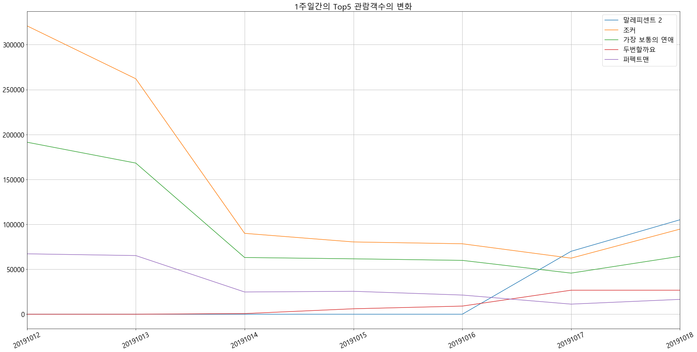

```python
## 크롤링해가는건 법적 문제지만 오픈API제공하는 곳에서 가져가는 것은 문제 없음 보통 JSON으로 제공
```

# 영화진흥위원회 Open API 연동

http://www.kobis.or.kr/kobisopenapi/homepg/main/main.do에 회원가입 후 키를 발급받아야함

## #01. 필요한 패키지 가져오기


```python
import requests
import json
import datetime as dt
from pandas import DataFrame
from matplotlib import pyplot
```

## #02. 키발급받기


```python
api_key = "df36d207deaf66f09778fe5ba53b49e5"
```

## #03. 접근할 URL 만들기


```python
url_tpl ="http://www.kobis.or.kr/kobisopenapi/webservice/rest/boxoffice/searchDailyBoxOfficeList.json?key={key}&targetDt={date}"
```

연동에 필요한 하루 전 날짜 문자열 만들기


```python
today = dt.datetime.now()                         # 오늘날짜
delta = dt.timedelta(days=-1)                     # 하루 전을 의미하는 timedelta객체 
yesterday = today + delta                         # 오늘 날짜와 timedelta 연산
yesterday_str = yesterday.strftime("%Y%m%d")      # yyyymmdd 형식 문자열로 변환
yesterday_str
```


    '20191018'


최종접속주소 : 보통 API통신 하는 곳에서 인풋값을 넣을땐 제공주소 후 ? 뒤에 인풋 파라미터를 넣는다(?키=값&키=값&키=값 형태)


```python
api_url = url_tpl.format(key=api_key,date=yesterday_str)
api_url
```


    'http://www.kobis.or.kr/kobisopenapi/webservice/rest/boxoffice/searchDailyBoxOfficeList.json?key=df36d207deaf66f09778fe5ba53b49e5&targetDt=20191018'


## #04. API접근하기


```python
user_agent = "Mozilla/5.0 (Windows NT 10.0; Win64; x64) AppleWebKit/537.36 (KHTML, like Gecko) Chrome/77.0.3865.120 Safari/537.36"

session = requests.Session()
session.headers.update({'User-agent':user_agent, 'referer':None})

r = session.get(api_url)

if r.status_code != 200:
    print("[%d Error] $s" % (r.status_code, r.reason))
    quit()
    

r.encoding = "utf-8"
r.text    
```


    '{"boxOfficeResult":{"boxofficeType":"일별 박스오피스","showRange":"20191018~20191018","dailyBoxOfficeList":[{"rnum":"1","rank":"1","rankInten":"0","rankOldAndNew":"OLD","movieCd":"20191589","movieNm":"말레피센트 2","openDt":"2019-10-17","salesAmt":"915685170","salesShare":"31.0","salesInten":"337742340","salesChange":"58.4","salesAcc":"1505526000","audiCnt":"105104","audiInten":"35083","audiChange":"50.1","audiAcc":"176245","scrnCnt":"1043","showCnt":"4762"},{"rnum":"2","rank":"2","rankInten":"0","rankOldAndNew":"OLD","movieCd":"20199950","movieNm":"조커","openDt":"2019-10-02","salesAmt":"831954460","salesShare":"28.2","salesInten":"320314150","salesChange":"62.6","salesAcc":"36877935170","audiCnt":"94682","audiInten":"32277","audiChange":"51.7","audiAcc":"4253386","scrnCnt":"931","showCnt":"3892"},{"rnum":"3","rank":"3","rankInten":"0","rankOldAndNew":"OLD","movieCd":"20195920","movieNm":"가장 보통의 연애","openDt":"2019-10-02","salesAmt":"571274120","salesShare":"19.3","salesInten":"197357620","salesChange":"52.8","salesAcc":"19918393070","audiCnt":"64447","audiInten":"18697","audiChange":"40.9","audiAcc":"2341782","scrnCnt":"756","showCnt":"3118"},{"rnum":"4","rank":"4","rankInten":"0","rankOldAndNew":"OLD","movieCd":"20185361","movieNm":"두번할까요","openDt":"2019-10-17","salesAmt":"232304630","salesShare":"7.9","salesInten":"20222280","salesChange":"9.5","salesAcc":"588932830","audiCnt":"26746","audiInten":"9","audiChange":"0","audiAcc":"72967","scrnCnt":"645","showCnt":"2489"},{"rnum":"5","rank":"5","rankInten":"0","rankOldAndNew":"OLD","movieCd":"20184483","movieNm":"퍼펙트맨","openDt":"2019-10-02","salesAmt":"136248820","salesShare":"4.6","salesInten":"48464700","salesChange":"55.2","salesAcc":"9424527070","audiCnt":"16530","audiInten":"5281","audiChange":"46.9","audiAcc":"1132969","scrnCnt":"445","showCnt":"970"},{"rnum":"6","rank":"6","rankInten":"0","rankOldAndNew":"OLD","movieCd":"20191183","movieNm":"제미니 맨","openDt":"2019-10-09","salesAmt":"61186000","salesShare":"2.1","salesInten":"23239160","salesChange":"61.2","salesAcc":"3097863820","audiCnt":"8310","audiInten":"3420","audiChange":"69.9","audiAcc":"362843","scrnCnt":"377","showCnt":"644"},{"rnum":"7","rank":"7","rankInten":"0","rankOldAndNew":"OLD","movieCd":"20194223","movieNm":"너를 만난 여름","openDt":"2019-10-16","salesAmt":"32060600","salesShare":"1.1","salesInten":"4085100","salesChange":"14.6","salesAcc":"97567200","audiCnt":"3549","audiInten":"-37","audiChange":"-1","audiAcc":"11164","scrnCnt":"162","showCnt":"526"},{"rnum":"8","rank":"8","rankInten":"6","rankOldAndNew":"OLD","movieCd":"20193601","movieNm":"장사리 : 잊혀진 영웅들","openDt":"2019-09-25","salesAmt":"14139780","salesShare":"0.5","salesInten":"5838880","salesChange":"70.3","salesAcc":"8904322090","audiCnt":"2451","audiInten":"1083","audiChange":"79.2","audiAcc":"1124541","scrnCnt":"51","showCnt":"57"},{"rnum":"9","rank":"9","rankInten":"2","rankOldAndNew":"OLD","movieCd":"20197141","movieNm":"와일드 로즈","openDt":"2019-10-17","salesAmt":"13893500","salesShare":"0.5","salesInten":"1771600","salesChange":"14.6","salesAcc":"45842400","audiCnt":"1895","audiInten":"138","audiChange":"7.9","audiAcc":"6137","scrnCnt":"151","showCnt":"301"},{"rnum":"10","rank":"10","rankInten":"0","rankOldAndNew":"NEW","movieCd":"20191845","movieNm":"난폭한 기록","openDt":"2019-07-11","salesAmt":"9435000","salesShare":"0.3","salesInten":"9435000","salesChange":"100","salesAcc":"82289090","audiCnt":"1887","audiInten":"1887","audiChange":"100","audiAcc":"12040","scrnCnt":"6","showCnt":"14"}]}}'


## #05.API의 응답결과를 데이터프레임으로 변환

1) 딕셔너리로 변환


```python
daily_boxoffice_dict = json.loads(r.text)
daily_boxoffice_dict
```


    {'boxOfficeResult': {'boxofficeType': '일별 박스오피스',
      'showRange': '20191018~20191018',
      'dailyBoxOfficeList': [{'rnum': '1',
        'rank': '1',
        'rankInten': '0',
        'rankOldAndNew': 'OLD',
        'movieCd': '20191589',
        'movieNm': '말레피센트 2',
        'openDt': '2019-10-17',
        'salesAmt': '915685170',
        'salesShare': '31.0',
        'salesInten': '337742340',
        'salesChange': '58.4',
        'salesAcc': '1505526000',
        'audiCnt': '105104',
        'audiInten': '35083',
        'audiChange': '50.1',
        'audiAcc': '176245',
        'scrnCnt': '1043',
        'showCnt': '4762'},
       {'rnum': '2',
        'rank': '2',
        'rankInten': '0',
        'rankOldAndNew': 'OLD',
        'movieCd': '20199950',
        'movieNm': '조커',
        'openDt': '2019-10-02',
        'salesAmt': '831954460',
        'salesShare': '28.2',
        'salesInten': '320314150',
        'salesChange': '62.6',
        'salesAcc': '36877935170',
        'audiCnt': '94682',
        'audiInten': '32277',
        'audiChange': '51.7',
        'audiAcc': '4253386',
        'scrnCnt': '931',
        'showCnt': '3892'},
       {'rnum': '3',
        'rank': '3',
        'rankInten': '0',
        'rankOldAndNew': 'OLD',
        'movieCd': '20195920',
        'movieNm': '가장 보통의 연애',
        'openDt': '2019-10-02',
        'salesAmt': '571274120',
        'salesShare': '19.3',
        'salesInten': '197357620',
        'salesChange': '52.8',
        'salesAcc': '19918393070',
        'audiCnt': '64447',
        'audiInten': '18697',
        'audiChange': '40.9',
        'audiAcc': '2341782',
        'scrnCnt': '756',
        'showCnt': '3118'},
       {'rnum': '4',
        'rank': '4',
        'rankInten': '0',
        'rankOldAndNew': 'OLD',
        'movieCd': '20185361',
        'movieNm': '두번할까요',
        'openDt': '2019-10-17',
        'salesAmt': '232304630',
        'salesShare': '7.9',
        'salesInten': '20222280',
        'salesChange': '9.5',
        'salesAcc': '588932830',
        'audiCnt': '26746',
        'audiInten': '9',
        'audiChange': '0',
        'audiAcc': '72967',
        'scrnCnt': '645',
        'showCnt': '2489'},
       {'rnum': '5',
        'rank': '5',
        'rankInten': '0',
        'rankOldAndNew': 'OLD',
        'movieCd': '20184483',
        'movieNm': '퍼펙트맨',
        'openDt': '2019-10-02',
        'salesAmt': '136248820',
        'salesShare': '4.6',
        'salesInten': '48464700',
        'salesChange': '55.2',
        'salesAcc': '9424527070',
        'audiCnt': '16530',
        'audiInten': '5281',
        'audiChange': '46.9',
        'audiAcc': '1132969',
        'scrnCnt': '445',
        'showCnt': '970'},
       {'rnum': '6',
        'rank': '6',
        'rankInten': '0',
        'rankOldAndNew': 'OLD',
        'movieCd': '20191183',
        'movieNm': '제미니 맨',
        'openDt': '2019-10-09',
        'salesAmt': '61186000',
        'salesShare': '2.1',
        'salesInten': '23239160',
        'salesChange': '61.2',
        'salesAcc': '3097863820',
        'audiCnt': '8310',
        'audiInten': '3420',
        'audiChange': '69.9',
        'audiAcc': '362843',
        'scrnCnt': '377',
        'showCnt': '644'},
       {'rnum': '7',
        'rank': '7',
        'rankInten': '0',
        'rankOldAndNew': 'OLD',
        'movieCd': '20194223',
        'movieNm': '너를 만난 여름',
        'openDt': '2019-10-16',
        'salesAmt': '32060600',
        'salesShare': '1.1',
        'salesInten': '4085100',
        'salesChange': '14.6',
        'salesAcc': '97567200',
        'audiCnt': '3549',
        'audiInten': '-37',
        'audiChange': '-1',
        'audiAcc': '11164',
        'scrnCnt': '162',
        'showCnt': '526'},
       {'rnum': '8',
        'rank': '8',
        'rankInten': '6',
        'rankOldAndNew': 'OLD',
        'movieCd': '20193601',
        'movieNm': '장사리 : 잊혀진 영웅들',
        'openDt': '2019-09-25',
        'salesAmt': '14139780',
        'salesShare': '0.5',
        'salesInten': '5838880',
        'salesChange': '70.3',
        'salesAcc': '8904322090',
        'audiCnt': '2451',
        'audiInten': '1083',
        'audiChange': '79.2',
        'audiAcc': '1124541',
        'scrnCnt': '51',
        'showCnt': '57'},
       {'rnum': '9',
        'rank': '9',
        'rankInten': '2',
        'rankOldAndNew': 'OLD',
        'movieCd': '20197141',
        'movieNm': '와일드 로즈',
        'openDt': '2019-10-17',
        'salesAmt': '13893500',
        'salesShare': '0.5',
        'salesInten': '1771600',
        'salesChange': '14.6',
        'salesAcc': '45842400',
        'audiCnt': '1895',
        'audiInten': '138',
        'audiChange': '7.9',
        'audiAcc': '6137',
        'scrnCnt': '151',
        'showCnt': '301'},
       {'rnum': '10',
        'rank': '10',
        'rankInten': '0',
        'rankOldAndNew': 'NEW',
        'movieCd': '20191845',
        'movieNm': '난폭한 기록',
        'openDt': '2019-07-11',
        'salesAmt': '9435000',
        'salesShare': '0.3',
        'salesInten': '9435000',
        'salesChange': '100',
        'salesAcc': '82289090',
        'audiCnt': '1887',
        'audiInten': '1887',
        'audiChange': '100',
        'audiAcc': '12040',
        'scrnCnt': '6',
        'showCnt': '14'}]}}


2) 데이터프레임으로 변환


```python
daily_boxoffice_df = DataFrame(daily_boxoffice_dict['boxOfficeResult']['dailyBoxOfficeList'])
daily_boxoffice_df                               
```


<div>
<style scoped>
    .dataframe tbody tr th:only-of-type {
        vertical-align: middle;
    }

    .dataframe tbody tr th {
        vertical-align: top;
    }

    .dataframe thead th {
        text-align: right;
    }
</style>
<table border="1" class="dataframe">
  <thead>
    <tr style="text-align: right;">
      <th></th>
      <th>rnum</th>
      <th>rank</th>
      <th>rankInten</th>
      <th>rankOldAndNew</th>
      <th>movieCd</th>
      <th>movieNm</th>
      <th>openDt</th>
      <th>salesAmt</th>
      <th>salesShare</th>
      <th>salesInten</th>
      <th>salesChange</th>
      <th>salesAcc</th>
      <th>audiCnt</th>
      <th>audiInten</th>
      <th>audiChange</th>
      <th>audiAcc</th>
      <th>scrnCnt</th>
      <th>showCnt</th>
    </tr>
  </thead>
  <tbody>
    <tr>
      <td>0</td>
      <td>1</td>
      <td>1</td>
      <td>0</td>
      <td>OLD</td>
      <td>20191589</td>
      <td>말레피센트 2</td>
      <td>2019-10-17</td>
      <td>915685170</td>
      <td>31.0</td>
      <td>337742340</td>
      <td>58.4</td>
      <td>1505526000</td>
      <td>105104</td>
      <td>35083</td>
      <td>50.1</td>
      <td>176245</td>
      <td>1043</td>
      <td>4762</td>
    </tr>
    <tr>
      <td>1</td>
      <td>2</td>
      <td>2</td>
      <td>0</td>
      <td>OLD</td>
      <td>20199950</td>
      <td>조커</td>
      <td>2019-10-02</td>
      <td>831954460</td>
      <td>28.2</td>
      <td>320314150</td>
      <td>62.6</td>
      <td>36877935170</td>
      <td>94682</td>
      <td>32277</td>
      <td>51.7</td>
      <td>4253386</td>
      <td>931</td>
      <td>3892</td>
    </tr>
    <tr>
      <td>2</td>
      <td>3</td>
      <td>3</td>
      <td>0</td>
      <td>OLD</td>
      <td>20195920</td>
      <td>가장 보통의 연애</td>
      <td>2019-10-02</td>
      <td>571274120</td>
      <td>19.3</td>
      <td>197357620</td>
      <td>52.8</td>
      <td>19918393070</td>
      <td>64447</td>
      <td>18697</td>
      <td>40.9</td>
      <td>2341782</td>
      <td>756</td>
      <td>3118</td>
    </tr>
    <tr>
      <td>3</td>
      <td>4</td>
      <td>4</td>
      <td>0</td>
      <td>OLD</td>
      <td>20185361</td>
      <td>두번할까요</td>
      <td>2019-10-17</td>
      <td>232304630</td>
      <td>7.9</td>
      <td>20222280</td>
      <td>9.5</td>
      <td>588932830</td>
      <td>26746</td>
      <td>9</td>
      <td>0</td>
      <td>72967</td>
      <td>645</td>
      <td>2489</td>
    </tr>
    <tr>
      <td>4</td>
      <td>5</td>
      <td>5</td>
      <td>0</td>
      <td>OLD</td>
      <td>20184483</td>
      <td>퍼펙트맨</td>
      <td>2019-10-02</td>
      <td>136248820</td>
      <td>4.6</td>
      <td>48464700</td>
      <td>55.2</td>
      <td>9424527070</td>
      <td>16530</td>
      <td>5281</td>
      <td>46.9</td>
      <td>1132969</td>
      <td>445</td>
      <td>970</td>
    </tr>
    <tr>
      <td>5</td>
      <td>6</td>
      <td>6</td>
      <td>0</td>
      <td>OLD</td>
      <td>20191183</td>
      <td>제미니 맨</td>
      <td>2019-10-09</td>
      <td>61186000</td>
      <td>2.1</td>
      <td>23239160</td>
      <td>61.2</td>
      <td>3097863820</td>
      <td>8310</td>
      <td>3420</td>
      <td>69.9</td>
      <td>362843</td>
      <td>377</td>
      <td>644</td>
    </tr>
    <tr>
      <td>6</td>
      <td>7</td>
      <td>7</td>
      <td>0</td>
      <td>OLD</td>
      <td>20194223</td>
      <td>너를 만난 여름</td>
      <td>2019-10-16</td>
      <td>32060600</td>
      <td>1.1</td>
      <td>4085100</td>
      <td>14.6</td>
      <td>97567200</td>
      <td>3549</td>
      <td>-37</td>
      <td>-1</td>
      <td>11164</td>
      <td>162</td>
      <td>526</td>
    </tr>
    <tr>
      <td>7</td>
      <td>8</td>
      <td>8</td>
      <td>6</td>
      <td>OLD</td>
      <td>20193601</td>
      <td>장사리 : 잊혀진 영웅들</td>
      <td>2019-09-25</td>
      <td>14139780</td>
      <td>0.5</td>
      <td>5838880</td>
      <td>70.3</td>
      <td>8904322090</td>
      <td>2451</td>
      <td>1083</td>
      <td>79.2</td>
      <td>1124541</td>
      <td>51</td>
      <td>57</td>
    </tr>
    <tr>
      <td>8</td>
      <td>9</td>
      <td>9</td>
      <td>2</td>
      <td>OLD</td>
      <td>20197141</td>
      <td>와일드 로즈</td>
      <td>2019-10-17</td>
      <td>13893500</td>
      <td>0.5</td>
      <td>1771600</td>
      <td>14.6</td>
      <td>45842400</td>
      <td>1895</td>
      <td>138</td>
      <td>7.9</td>
      <td>6137</td>
      <td>151</td>
      <td>301</td>
    </tr>
    <tr>
      <td>9</td>
      <td>10</td>
      <td>10</td>
      <td>0</td>
      <td>NEW</td>
      <td>20191845</td>
      <td>난폭한 기록</td>
      <td>2019-07-11</td>
      <td>9435000</td>
      <td>0.3</td>
      <td>9435000</td>
      <td>100</td>
      <td>82289090</td>
      <td>1887</td>
      <td>1887</td>
      <td>100</td>
      <td>12040</td>
      <td>6</td>
      <td>14</td>
    </tr>
  </tbody>
</table>
</div>


## #06. 데이터 전처리

사용할 컬럼만 추출


```python
tmp_df = daily_boxoffice_df.filter(['movieNm','audiCnt'])
tmp_df
```


<div>
<style scoped>
    .dataframe tbody tr th:only-of-type {
        vertical-align: middle;
    }

    .dataframe tbody tr th {
        vertical-align: top;
    }

    .dataframe thead th {
        text-align: right;
    }
</style>
<table border="1" class="dataframe">
  <thead>
    <tr style="text-align: right;">
      <th></th>
      <th>movieNm</th>
      <th>audiCnt</th>
    </tr>
  </thead>
  <tbody>
    <tr>
      <td>0</td>
      <td>말레피센트 2</td>
      <td>105104</td>
    </tr>
    <tr>
      <td>1</td>
      <td>조커</td>
      <td>94682</td>
    </tr>
    <tr>
      <td>2</td>
      <td>가장 보통의 연애</td>
      <td>64447</td>
    </tr>
    <tr>
      <td>3</td>
      <td>두번할까요</td>
      <td>26746</td>
    </tr>
    <tr>
      <td>4</td>
      <td>퍼펙트맨</td>
      <td>16530</td>
    </tr>
    <tr>
      <td>5</td>
      <td>제미니 맨</td>
      <td>8310</td>
    </tr>
    <tr>
      <td>6</td>
      <td>너를 만난 여름</td>
      <td>3549</td>
    </tr>
    <tr>
      <td>7</td>
      <td>장사리 : 잊혀진 영웅들</td>
      <td>2451</td>
    </tr>
    <tr>
      <td>8</td>
      <td>와일드 로즈</td>
      <td>1895</td>
    </tr>
    <tr>
      <td>9</td>
      <td>난폭한 기록</td>
      <td>1887</td>
    </tr>
  </tbody>
</table>
</div>


인덱스 이름 지정


```python
name_dict = {}
for i, v in enumerate(list(tmp_df['movieNm'])):
    name_dict[i] = v
    
daily_rank_df = tmp_df.rename(index=name_dict, columns ={'audiCnt':'관람객'})
daily_rank_df.drop('movieNm', axis=1, inplace=True)
daily_rank_df
```


<div>
<style scoped>
    .dataframe tbody tr th:only-of-type {
        vertical-align: middle;
    }

    .dataframe tbody tr th {
        vertical-align: top;
    }

    .dataframe thead th {
        text-align: right;
    }
</style>
<table border="1" class="dataframe">
  <thead>
    <tr style="text-align: right;">
      <th></th>
      <th>관람객</th>
    </tr>
  </thead>
  <tbody>
    <tr>
      <td>말레피센트 2</td>
      <td>105104</td>
    </tr>
    <tr>
      <td>조커</td>
      <td>94682</td>
    </tr>
    <tr>
      <td>가장 보통의 연애</td>
      <td>64447</td>
    </tr>
    <tr>
      <td>두번할까요</td>
      <td>26746</td>
    </tr>
    <tr>
      <td>퍼펙트맨</td>
      <td>16530</td>
    </tr>
    <tr>
      <td>제미니 맨</td>
      <td>8310</td>
    </tr>
    <tr>
      <td>너를 만난 여름</td>
      <td>3549</td>
    </tr>
    <tr>
      <td>장사리 : 잊혀진 영웅들</td>
      <td>2451</td>
    </tr>
    <tr>
      <td>와일드 로즈</td>
      <td>1895</td>
    </tr>
    <tr>
      <td>난폭한 기록</td>
      <td>1887</td>
    </tr>
  </tbody>
</table>
</div>


dtype 처리


```python
daily_rank_df['관람객'] #dtype이 float 혹은 int여야 숫자처리 가능
```


    말레피센트 2          105104
    조커                94682
    가장 보통의 연애         64447
    두번할까요             26746
    퍼펙트맨              16530
    제미니 맨              8310
    너를 만난 여름           3549
    장사리 : 잊혀진 영웅들      2451
    와일드 로즈             1895
    난폭한 기록             1887
    Name: 관람객, dtype: object


```python
import pandas as pd
daily_rank_df['관람객'] = daily_rank_df['관람객'].apply(pd.to_numeric)
daily_rank_df['관람객']
```


    말레피센트 2          105104
    조커                94682
    가장 보통의 연애         64447
    두번할까요             26746
    퍼펙트맨              16530
    제미니 맨              8310
    너를 만난 여름           3549
    장사리 : 잊혀진 영웅들      2451
    와일드 로즈             1895
    난폭한 기록             1887
    Name: 관람객, dtype: int64


```python
#그래프 만들기 : 관람객 수에 대한 내림차순 정렬은 ==> daily_rank_df.sort_values('관람객', inplace=True, ascending=True)
pyplot.rcParams["font.family"] = 'Malgun Gothic'
pyplot.rcParams["font.size"] = 18
pyplot.rcParams["figure.figsize"] = (32,16)

# 전체 컬럼에 대한 시각화
daily_rank_df.plot.barh()
pyplot.grid()
pyplot.title("%s 박스오피스 순위" % yesterday_str)
pyplot.legend()
pyplot.show()
pyplot.close()
```


```python
## #07. 영화별 1주간의 관람객 수 추이
```


```python
# 결과를 누적할 빈 DataFrame 이 빈걸로 안 닦고 아래를 계속 실행하면 같은게 계속 merge 되서 _x,_y 등등이 붙는다
total_df = DataFrame()
total_df
```


<div>
<style scoped>
    .dataframe tbody tr th:only-of-type {
        vertical-align: middle;
    }

    .dataframe tbody tr th {
        vertical-align: top;
    }

    .dataframe thead th {
        text-align: right;
    }
</style>
<table border="1" class="dataframe">
  <thead>
    <tr style="text-align: right;">
      <th></th>
    </tr>
  </thead>
  <tbody>
  </tbody>
</table>
</div>


```python
for i in range(-7,0):
    #print(i)
    delta = dt.timedelta(days=i)                   # i일 전 날짜를 계산하기 위한 단위 생성
    targetday = today + delta                      # 날짜 계산
    targetday_str = targetday.strftime("%Y%m%d")   # 날짜 형식 문자열
    print(targetday_str)

    # 날짜별로 접근할 URL 만들기
    api_url = url_tpl.format(key=api_key, date=targetday_str)
    print(api_url)
    
    # API 가져오기
    r = session.get(api_url)

    if r.status_code != 200:
        print("[%d Error] $s" % (r.status_code, r.reason))
        quit()
    
    # 연동 결과를 딕셔너리로 변환
    r.encoding = "utf-8"
    daily_boxoffice_dict = json.loads(r.text)
    
    # 딕셔너리를 DataFram으로 변환
    daily_boxoffice_df = DataFrame(daily_boxoffice_dict['boxOfficeResult']['dailyBoxOfficeList'])
    print(daily_boxoffice_df)
    
    # 사용할 컬럼만 추출
    tmp_df = daily_boxoffice_df.filter(['movieNm','audiCnt'])

    # 영화제목을 인덱스로 지정
    name_dict = {}
    for i, v in enumerate(list(tmp_df['movieNm'])):
        name_dict[i] = v
    
    # 컬럼 이름은 조회날짜로 지정
    daily_rank_df = tmp_df.rename(index=name_dict, columns ={'audiCnt': targetday_str})
    daily_rank_df.drop('movieNm', axis=1, inplace=True)
    print(daily_rank_df)
    #print("-"*50)
    
    total_df = pd.merge(total_df, daily_rank_df, left_index=True, right_index=True,how='outer')
    
#반복문 종료 후 수집 결과 확인
total_df
```

    20191012
    http://www.kobis.or.kr/kobisopenapi/webservice/rest/boxoffice/searchDailyBoxOfficeList.json?key=df36d207deaf66f09778fe5ba53b49e5&targetDt=20191012
      rnum rank rankInten rankOldAndNew   movieCd               movieNm  \
    0    1    1         0           OLD  20199950                    조커   
    1    2    2         0           OLD  20195920             가장 보통의 연애   
    2    3    3         0           OLD  20191183                 제미니 맨   
    3    4    4         0           OLD  20184483                  퍼펙트맨   
    4    5    5         0           OLD  20193601         장사리 : 잊혀진 영웅들   
    5    6    6        11           OLD  20197691          잃어버린 세계를 찾아서   
    6    7    7        15           OLD  20196380               몬스터 하우스   
    7    8    8        15           OLD  20195941      소피와 드래곤: 마법책의 비밀   
    8    9    9        -3           OLD  20184243                판소리 복서   
    9   10   10        -1           OLD  20199446  원스 어폰 어 타임... 인 할리우드   
    
           openDt    salesAmt salesShare  salesInten salesChange     salesAcc  \
    0  2019-10-02  2829447390       46.7  1217434870        75.5  31182239870   
    1  2019-10-02  1678122800       27.7   740431650          79  15997849700   
    2  2019-10-09   603861700       10.0   291415620        93.3   2098191760   
    3  2019-10-02   585451140        9.7   287101850        96.2   8059601330   
    4  2019-09-25    72537780        1.2    18013990          33   8740894900   
    5  2019-10-09    34158620        0.6    30301920       785.7    100693420   
    6  2019-10-03    33097300        0.5    30573200      1211.3    435082400   
    7  2019-10-02    30531220        0.5    28127320      1170.1    671976290   
    8  2019-10-09    30825640        0.5    14743240        91.7    115655940   
    9  2019-09-25    17049480        0.3     6674140        64.3   2196708910   
    
      audiCnt audiInten audiChange  audiAcc scrnCnt showCnt  
    0  320933    136110       73.6  3585406    1312    6594  
    1  191430     82644         76  1878669    1036    4862  
    2   68540     31830       86.7   242732     757    2934  
    3   67225     32047       91.1   968285     719    2308  
    4    8892      1161         15  1101895     305     545  
    5    4429      3946        817    13032     263     331  
    6    4071      3726       1080    54500     130     184  
    7    3879      3536     1030.9    86377     191     250  
    8    3606      1628       82.3    14178     297     490  
    9    1853       729       64.9   268764      47      69  
                         20191012
    조커                     320933
    가장 보통의 연애              191430
    제미니 맨                   68540
    퍼펙트맨                    67225
    장사리 : 잊혀진 영웅들            8892
    잃어버린 세계를 찾아서             4429
    몬스터 하우스                  4071
    소피와 드래곤: 마법책의 비밀         3879
    판소리 복서                   3606
    원스 어폰 어 타임... 인 할리우드     1853
    20191013
    http://www.kobis.or.kr/kobisopenapi/webservice/rest/boxoffice/searchDailyBoxOfficeList.json?key=df36d207deaf66f09778fe5ba53b49e5&targetDt=20191013
      rnum rank rankInten rankOldAndNew   movieCd           movieNm      openDt  \
    0    1    1         0           OLD  20199950                조커  2019-10-02   
    1    2    2         0           OLD  20195920         가장 보통의 연애  2019-10-02   
    2    3    3         1           OLD  20184483              퍼펙트맨  2019-10-02   
    3    4    4        -1           OLD  20191183             제미니 맨  2019-10-09   
    4    5    5         0           OLD  20193601     장사리 : 잊혀진 영웅들  2019-09-25   
    5    6    6         2           OLD  20195941  소피와 드래곤: 마법책의 비밀  2019-10-02   
    6    7    7        -1           OLD  20197691      잃어버린 세계를 찾아서  2019-10-09   
    7    8    8        -1           OLD  20196380           몬스터 하우스  2019-10-03   
    8    9    9         0           OLD  20184243            판소리 복서  2019-10-09   
    9   10   10         1           OLD  20196671             쿵푸 보이  2019-10-09   
    
         salesAmt salesShare  salesInten salesChange     salesAcc audiCnt  \
    0  2309157550       44.4  -520289840       -18.4  33491397420  262025   
    1  1475361890       28.3  -202760910       -12.1  17473211590  168199   
    2   572253390       11.0   -13197750        -2.3   8631854720   65274   
    3   522055640       10.0   -81806060       -13.5   2620247400   59404   
    4    70180350        1.3    -2357430        -3.2   8811075250    8570   
    5    36411600        0.7     5880380        19.3    708387890    4509   
    6    35391700        0.7     1233080         3.6    136085120    4478   
    7    34237800        0.7     1140500         3.4    469320200    4112   
    8    21870460        0.4    -8955180       -29.1    137526400    2649   
    9    14287440        0.3     1113280         8.5     66658920    1806   
    
      audiInten audiChange  audiAcc scrnCnt showCnt  
    0    -58908      -18.4  3847431    1309    6471  
    1    -23231      -12.1  2046868    1033    4809  
    2     -1951       -2.9  1033559     718    2302  
    3     -9136      -13.3   302136     741    2793  
    4      -322       -3.6  1110465     308     534  
    5       630       16.2    90886     193     253  
    6        49        1.1    17510     268     331  
    7        41          1    58612     127     184  
    8      -957      -26.5    16827     290     461  
    9       126        7.5     8464     191     211  
                     20191013
    조커                 262025
    가장 보통의 연애          168199
    퍼펙트맨                65274
    제미니 맨               59404
    장사리 : 잊혀진 영웅들        8570
    소피와 드래곤: 마법책의 비밀     4509
    잃어버린 세계를 찾아서         4478
    몬스터 하우스              4112
    판소리 복서               2649
    쿵푸 보이                1806
    20191014
    http://www.kobis.or.kr/kobisopenapi/webservice/rest/boxoffice/searchDailyBoxOfficeList.json?key=df36d207deaf66f09778fe5ba53b49e5&targetDt=20191014
      rnum rank rankInten rankOldAndNew   movieCd        movieNm      openDt  \
    0    1    1         0           OLD  20199950             조커  2019-10-02   
    1    2    2         0           OLD  20195920      가장 보통의 연애  2019-10-02   
    2    3    3         0           OLD  20184483           퍼펙트맨  2019-10-02   
    3    4    4         0           OLD  20191183          제미니 맨  2019-10-09   
    4    5    5        16           OLD  20188750   나쁜 녀석들: 더 무비  2019-09-11   
    5    6    6        -1           OLD  20193601  장사리 : 잊혀진 영웅들  2019-09-25   
    6    7    7         0           NEW  20190280         날씨의 아이  2019-10-30   
    7    8    8         0           NEW  20191029       82년생 김지영  2019-10-23   
    8    9    9         0           OLD  20184243         판소리 복서  2019-10-09   
    9   10   10         0           NEW  20185361          두번할까요  2019-10-17   
    
        salesAmt salesShare   salesInten salesChange     salesAcc audiCnt  \
    0  742508230       42.3  -1566649320       -67.8  34233905650   90015   
    1  516558390       29.4   -958803500         -65  17989769980   63129   
    2  200213430       11.4   -372039960         -65   8832068150   24759   
    3  139482930        7.9   -382572710       -73.3   2759730330   17159   
    4   21073000        1.2     18017420       589.7  39520100504    4137   
    5   20651380        1.2    -49528970       -70.6   8831726630    2842   
    6   23066000        1.3     23066000         100     42177000    2673   
    7   14274000        0.8     14274000         100     17482000    1586   
    8    8326960        0.5    -13543500       -61.9    145853360    1070   
    9    5117000        0.3      5117000         100     33445000     731   
    
      audiInten audiChange  audiAcc scrnCnt showCnt  
    0   -172010      -65.6  3937446    1205    5910  
    1   -105070      -62.5  2109997     972    4534  
    2    -40515      -62.1  1058318     668    2226  
    3    -42245      -71.1   319295     668    2447  
    4      3804     1142.3  4567533      52      62  
    5     -5728      -66.8  1113307     273     484  
    6      2673        100     4672       8       9  
    7      1586        100     1987       5       8  
    8     -1579      -59.6    17897     243     373  
    9       731        100     4348       4       4  
                  20191014
    조커               90015
    가장 보통의 연애        63129
    퍼펙트맨             24759
    제미니 맨            17159
    나쁜 녀석들: 더 무비      4137
    장사리 : 잊혀진 영웅들     2842
    날씨의 아이            2673
    82년생 김지영          1586
    판소리 복서            1070
    두번할까요              731
    20191015
    http://www.kobis.or.kr/kobisopenapi/webservice/rest/boxoffice/searchDailyBoxOfficeList.json?key=df36d207deaf66f09778fe5ba53b49e5&targetDt=20191015
      rnum rank rankInten rankOldAndNew   movieCd        movieNm      openDt  \
    0    1    1         0           OLD  20199950             조커  2019-10-02   
    1    2    2         0           OLD  20195920      가장 보통의 연애  2019-10-02   
    2    3    3         0           OLD  20184483           퍼펙트맨  2019-10-02   
    3    4    4         0           OLD  20191183          제미니 맨  2019-10-09   
    4    5    5         5           OLD  20185361          두번할까요  2019-10-17   
    5    6    6         0           OLD  20193601  장사리 : 잊혀진 영웅들  2019-09-25   
    6    7    7        -2           OLD  20188750   나쁜 녀석들: 더 무비  2019-09-11   
    7    8    8         0           OLD  20191029       82년생 김지영  2019-10-23   
    8    9    9         0           OLD  20184243         판소리 복서  2019-10-09   
    9   10   10        10           OLD  20195081      디어 마이 프렌드  2019-10-09   
    
        salesAmt salesShare salesInten salesChange     salesAcc audiCnt audiInten  \
    0  657805240       38.9  -84702990       -11.4  34891710890   80441     -9574   
    1  498414740       29.5  -18143650        -3.5  18488184720   61659     -1470   
    2  200486580       11.9     273150         0.1   9032554730   25523       764   
    3  136625760        8.1   -2857170          -2   2896356090   17244        85   
    4   35872000        2.1   30755000         601     69317000    6072      5341   
    5   25266320        1.5    4614940        22.3   8856992950    3708       866   
    6   15075280        0.9   -5997720       -28.5  39535175784    2872     -1265   
    7   13527000        0.8    -747000        -5.2     31009000    1503       -83   
    8    9169460        0.5     842500        10.1    155022820    1299       229   
    9    5210800        0.3    2517800        93.5     86357100     776       434   
    
      audiChange  audiAcc scrnCnt showCnt  
    0      -10.6  4017887    1218    5891  
    1       -2.3  2171656     990    4546  
    2        3.1  1083841     677    2217  
    3        0.5   336539     690    2424  
    4      730.6    10420      43      43  
    5       30.5  1117015     286     487  
    6      -30.6  4570405      68      76  
    7       -5.2     3490       5       5  
    8       21.4    19196     245     362  
    9      126.9    10716      97     147  
                  20191015
    조커               80441
    가장 보통의 연애        61659
    퍼펙트맨             25523
    제미니 맨            17244
    두번할까요             6072
    장사리 : 잊혀진 영웅들     3708
    나쁜 녀석들: 더 무비      2872
    82년생 김지영          1503
    판소리 복서            1299
    디어 마이 프렌드          776
    20191016
    http://www.kobis.or.kr/kobisopenapi/webservice/rest/boxoffice/searchDailyBoxOfficeList.json?key=df36d207deaf66f09778fe5ba53b49e5&targetDt=20191016
      rnum rank rankInten rankOldAndNew   movieCd        movieNm      openDt  \
    0    1    1         0           OLD  20199950             조커  2019-10-02   
    1    2    2         0           OLD  20195920      가장 보통의 연애  2019-10-02   
    2    3    3         0           OLD  20184483           퍼펙트맨  2019-10-02   
    3    4    4         0           OLD  20191183          제미니 맨  2019-10-09   
    4    5    5         0           OLD  20185361          두번할까요  2019-10-17   
    5    6    6         0           OLD  20193601  장사리 : 잊혀진 영웅들  2019-09-25   
    6    7    7         0           NEW  20194223       너를 만난 여름  2019-10-16   
    7    8    8         0           NEW  20190280         날씨의 아이  2019-10-30   
    8    9    9        21           OLD  20183407            버티고  2019-10-16   
    9   10   10        -2           OLD  20191029       82년생 김지영  2019-10-23   
    
        salesAmt salesShare salesInten salesChange     salesAcc audiCnt audiInten  \
    0  642629510       39.0  -15175730        -2.3  35534340400   78412     -2029   
    1  485017730       29.5  -13397010        -2.7  18973202450   59929     -1730   
    2  167939400       10.2  -32547180       -16.2   9200494130   21349     -4174   
    3  102374890        6.2  -34250870       -25.1   2998730980   13104     -4140   
    4   75228850        4.6   39356850       109.7    144545850    9064      2992   
    5   24888460        1.5    -377860        -1.5   8881881410    3707        -1   
    6   16888400        1.0   16888400         100     37531100    1974      1974   
    7   17748000        1.1   17748000         100     59925000    1972      1972   
    8   12716380        0.8   10421380       454.1     33705380    1573      1318   
    9    9234000        0.6   -4293000       -31.7     40243000    1026      -477   
    
      audiChange  audiAcc scrnCnt showCnt  
    0       -2.5  4096299    1149    5512  
    1       -2.8  2231585     983    4354  
    2      -16.4  1105190     677    1895  
    3        -24   349643     639    1759  
    4       49.3    19484     505    1307  
    5          0  1120722     246     404  
    6        100     4029     132     264  
    7        100     6644       7       7  
    8      516.9     3907     273     486  
    9      -31.7     4516       4       4  
                  20191016
    조커               78412
    가장 보통의 연애        59929
    퍼펙트맨             21349
    제미니 맨            13104
    두번할까요             9064
    장사리 : 잊혀진 영웅들     3707
    너를 만난 여름          1974
    날씨의 아이            1972
    버티고               1573
    82년생 김지영          1026
    20191017
    http://www.kobis.or.kr/kobisopenapi/webservice/rest/boxoffice/searchDailyBoxOfficeList.json?key=df36d207deaf66f09778fe5ba53b49e5&targetDt=20191017
      rnum rank rankInten rankOldAndNew   movieCd    movieNm      openDt  \
    0    1    1         0           NEW  20191589    말레피센트 2  2019-10-17   
    1    2    2        -1           OLD  20199950         조커  2019-10-02   
    2    3    3        -1           OLD  20195920  가장 보통의 연애  2019-10-02   
    3    4    4         1           OLD  20185361      두번할까요  2019-10-17   
    4    5    5        -2           OLD  20184483       퍼펙트맨  2019-10-02   
    5    6    6        -2           OLD  20191183      제미니 맨  2019-10-09   
    6    7    7         0           OLD  20194223   너를 만난 여름  2019-10-16   
    7    8    8         0           OLD  20190280     날씨의 아이  2019-10-30   
    8    9    9         3           OLD  20184243     판소리 복서  2019-10-09   
    9   10   10         0           OLD  20191029   82년생 김지영  2019-10-23   
    
        salesAmt salesShare  salesInten salesChange     salesAcc audiCnt  \
    0  577942830       28.1   577942830         100    589840830   70021   
    1  511640310       24.9  -130989200       -20.4  36045980710   62405   
    2  373916500       18.2  -111101230       -22.9  19347118950   45750   
    3  212082350       10.3   136853500       181.9    356628200   26737   
    4   87784120        4.3   -80155280       -47.7   9288278250   11249   
    5   37946840        1.8   -64428050       -62.9   3036677820    4890   
    6   27975500        1.4    11087100        65.6     65506600    3586   
    7   28276000        1.4    10528000        59.3     88201000    3180   
    8   11182700        0.5     5758920       106.2    171629300    2159   
    9   17966000        0.9     8732000        94.6     58209000    2017   
    
      audiInten audiChange  audiAcc scrnCnt showCnt  
    0     70021        100    71141     987    4540  
    1    -16007      -20.4  4158704     874    3711  
    2    -14179      -23.7  2277335     698    2904  
    3     17673        195    46221     658    2585  
    4    -10100      -47.3  1116439     421     894  
    5     -8214      -62.7   354533     358     624  
    6      1612       81.7     7615     160     547  
    7      1208       61.3     9824      15      15  
    8      1401      184.8    22113      50      62  
    9       991       96.6     6533       9       9  
              20191017
    말레피센트 2      70021
    조커           62405
    가장 보통의 연애    45750
    두번할까요        26737
    퍼펙트맨         11249
    제미니 맨         4890
    너를 만난 여름      3586
    날씨의 아이        3180
    판소리 복서        2159
    82년생 김지영      2017
    20191018
    http://www.kobis.or.kr/kobisopenapi/webservice/rest/boxoffice/searchDailyBoxOfficeList.json?key=df36d207deaf66f09778fe5ba53b49e5&targetDt=20191018
      rnum rank rankInten rankOldAndNew   movieCd        movieNm      openDt  \
    0    1    1         0           OLD  20191589        말레피센트 2  2019-10-17   
    1    2    2         0           OLD  20199950             조커  2019-10-02   
    2    3    3         0           OLD  20195920      가장 보통의 연애  2019-10-02   
    3    4    4         0           OLD  20185361          두번할까요  2019-10-17   
    4    5    5         0           OLD  20184483           퍼펙트맨  2019-10-02   
    5    6    6         0           OLD  20191183          제미니 맨  2019-10-09   
    6    7    7         0           OLD  20194223       너를 만난 여름  2019-10-16   
    7    8    8         6           OLD  20193601  장사리 : 잊혀진 영웅들  2019-09-25   
    8    9    9         2           OLD  20197141         와일드 로즈  2019-10-17   
    9   10   10         0           NEW  20191845         난폭한 기록  2019-07-11   
    
        salesAmt salesShare salesInten salesChange     salesAcc audiCnt audiInten  \
    0  915685170       31.0  337742340        58.4   1505526000  105104     35083   
    1  831954460       28.2  320314150        62.6  36877935170   94682     32277   
    2  571274120       19.3  197357620        52.8  19918393070   64447     18697   
    3  232304630        7.9   20222280         9.5    588932830   26746         9   
    4  136248820        4.6   48464700        55.2   9424527070   16530      5281   
    5   61186000        2.1   23239160        61.2   3097863820    8310      3420   
    6   32060600        1.1    4085100        14.6     97567200    3549       -37   
    7   14139780        0.5    5838880        70.3   8904322090    2451      1083   
    8   13893500        0.5    1771600        14.6     45842400    1895       138   
    9    9435000        0.3    9435000         100     82289090    1887      1887   
    
      audiChange  audiAcc scrnCnt showCnt  
    0       50.1   176245    1043    4762  
    1       51.7  4253386     931    3892  
    2       40.9  2341782     756    3118  
    3          0    72967     645    2489  
    4       46.9  1132969     445     970  
    5       69.9   362843     377     644  
    6         -1    11164     162     526  
    7       79.2  1124541      51      57  
    8        7.9     6137     151     301  
    9        100    12040       6      14  
                  20191018
    말레피센트 2         105104
    조커               94682
    가장 보통의 연애        64447
    두번할까요            26746
    퍼펙트맨             16530
    제미니 맨             8310
    너를 만난 여름          3549
    장사리 : 잊혀진 영웅들     2451
    와일드 로즈            1895
    난폭한 기록            1887
    


<div>
<style scoped>
    .dataframe tbody tr th:only-of-type {
        vertical-align: middle;
    }

    .dataframe tbody tr th {
        vertical-align: top;
    }

    .dataframe thead th {
        text-align: right;
    }
</style>
<table border="1" class="dataframe">
  <thead>
    <tr style="text-align: right;">
      <th></th>
      <th>20191012</th>
      <th>20191013</th>
      <th>20191014</th>
      <th>20191015</th>
      <th>20191016</th>
      <th>20191017</th>
      <th>20191018</th>
    </tr>
  </thead>
  <tbody>
    <tr>
      <td>82년생 김지영</td>
      <td>NaN</td>
      <td>NaN</td>
      <td>1586</td>
      <td>1503</td>
      <td>1026</td>
      <td>2017</td>
      <td>NaN</td>
    </tr>
    <tr>
      <td>가장 보통의 연애</td>
      <td>191430</td>
      <td>168199</td>
      <td>63129</td>
      <td>61659</td>
      <td>59929</td>
      <td>45750</td>
      <td>64447</td>
    </tr>
    <tr>
      <td>나쁜 녀석들: 더 무비</td>
      <td>NaN</td>
      <td>NaN</td>
      <td>4137</td>
      <td>2872</td>
      <td>NaN</td>
      <td>NaN</td>
      <td>NaN</td>
    </tr>
    <tr>
      <td>난폭한 기록</td>
      <td>NaN</td>
      <td>NaN</td>
      <td>NaN</td>
      <td>NaN</td>
      <td>NaN</td>
      <td>NaN</td>
      <td>1887</td>
    </tr>
    <tr>
      <td>날씨의 아이</td>
      <td>NaN</td>
      <td>NaN</td>
      <td>2673</td>
      <td>NaN</td>
      <td>1972</td>
      <td>3180</td>
      <td>NaN</td>
    </tr>
    <tr>
      <td>너를 만난 여름</td>
      <td>NaN</td>
      <td>NaN</td>
      <td>NaN</td>
      <td>NaN</td>
      <td>1974</td>
      <td>3586</td>
      <td>3549</td>
    </tr>
    <tr>
      <td>두번할까요</td>
      <td>NaN</td>
      <td>NaN</td>
      <td>731</td>
      <td>6072</td>
      <td>9064</td>
      <td>26737</td>
      <td>26746</td>
    </tr>
    <tr>
      <td>디어 마이 프렌드</td>
      <td>NaN</td>
      <td>NaN</td>
      <td>NaN</td>
      <td>776</td>
      <td>NaN</td>
      <td>NaN</td>
      <td>NaN</td>
    </tr>
    <tr>
      <td>말레피센트 2</td>
      <td>NaN</td>
      <td>NaN</td>
      <td>NaN</td>
      <td>NaN</td>
      <td>NaN</td>
      <td>70021</td>
      <td>105104</td>
    </tr>
    <tr>
      <td>몬스터 하우스</td>
      <td>4071</td>
      <td>4112</td>
      <td>NaN</td>
      <td>NaN</td>
      <td>NaN</td>
      <td>NaN</td>
      <td>NaN</td>
    </tr>
    <tr>
      <td>버티고</td>
      <td>NaN</td>
      <td>NaN</td>
      <td>NaN</td>
      <td>NaN</td>
      <td>1573</td>
      <td>NaN</td>
      <td>NaN</td>
    </tr>
    <tr>
      <td>소피와 드래곤: 마법책의 비밀</td>
      <td>3879</td>
      <td>4509</td>
      <td>NaN</td>
      <td>NaN</td>
      <td>NaN</td>
      <td>NaN</td>
      <td>NaN</td>
    </tr>
    <tr>
      <td>와일드 로즈</td>
      <td>NaN</td>
      <td>NaN</td>
      <td>NaN</td>
      <td>NaN</td>
      <td>NaN</td>
      <td>NaN</td>
      <td>1895</td>
    </tr>
    <tr>
      <td>원스 어폰 어 타임... 인 할리우드</td>
      <td>1853</td>
      <td>NaN</td>
      <td>NaN</td>
      <td>NaN</td>
      <td>NaN</td>
      <td>NaN</td>
      <td>NaN</td>
    </tr>
    <tr>
      <td>잃어버린 세계를 찾아서</td>
      <td>4429</td>
      <td>4478</td>
      <td>NaN</td>
      <td>NaN</td>
      <td>NaN</td>
      <td>NaN</td>
      <td>NaN</td>
    </tr>
    <tr>
      <td>장사리 : 잊혀진 영웅들</td>
      <td>8892</td>
      <td>8570</td>
      <td>2842</td>
      <td>3708</td>
      <td>3707</td>
      <td>NaN</td>
      <td>2451</td>
    </tr>
    <tr>
      <td>제미니 맨</td>
      <td>68540</td>
      <td>59404</td>
      <td>17159</td>
      <td>17244</td>
      <td>13104</td>
      <td>4890</td>
      <td>8310</td>
    </tr>
    <tr>
      <td>조커</td>
      <td>320933</td>
      <td>262025</td>
      <td>90015</td>
      <td>80441</td>
      <td>78412</td>
      <td>62405</td>
      <td>94682</td>
    </tr>
    <tr>
      <td>쿵푸 보이</td>
      <td>NaN</td>
      <td>1806</td>
      <td>NaN</td>
      <td>NaN</td>
      <td>NaN</td>
      <td>NaN</td>
      <td>NaN</td>
    </tr>
    <tr>
      <td>판소리 복서</td>
      <td>3606</td>
      <td>2649</td>
      <td>1070</td>
      <td>1299</td>
      <td>NaN</td>
      <td>2159</td>
      <td>NaN</td>
    </tr>
    <tr>
      <td>퍼펙트맨</td>
      <td>67225</td>
      <td>65274</td>
      <td>24759</td>
      <td>25523</td>
      <td>21349</td>
      <td>11249</td>
      <td>16530</td>
    </tr>
  </tbody>
</table>
</div>


2) 데이터 전처리

수집된 관람객 수가 문자열이므로 숫자 형식으로 변호나해야 한다


```python
column_list = list(total_df.columns)
column_list
```


    ['20191012',
     '20191013',
     '20191014',
     '20191015',
     '20191016',
     '20191017',
     '20191018']


```python
for i, v in enumerate(column_list):
    total_df[v] = total_df[v].apply(pd.to_numeric)
    print(total_df[v])
    print("-"*50)                      
```

    82년생 김지영                     NaN
    가장 보통의 연애               191430.0
    나쁜 녀석들: 더 무비                 NaN
    난폭한 기록                       NaN
    날씨의 아이                       NaN
    너를 만난 여름                     NaN
    두번할까요                        NaN
    디어 마이 프렌드                    NaN
    말레피센트 2                      NaN
    몬스터 하우스                   4071.0
    버티고                          NaN
    소피와 드래곤: 마법책의 비밀          3879.0
    와일드 로즈                       NaN
    원스 어폰 어 타임... 인 할리우드      1853.0
    잃어버린 세계를 찾아서              4429.0
    장사리 : 잊혀진 영웅들             8892.0
    제미니 맨                    68540.0
    조커                      320933.0
    쿵푸 보이                        NaN
    판소리 복서                    3606.0
    퍼펙트맨                     67225.0
    Name: 20191012, dtype: float64
    --------------------------------------------------
    82년생 김지영                     NaN
    가장 보통의 연애               168199.0
    나쁜 녀석들: 더 무비                 NaN
    난폭한 기록                       NaN
    날씨의 아이                       NaN
    너를 만난 여름                     NaN
    두번할까요                        NaN
    디어 마이 프렌드                    NaN
    말레피센트 2                      NaN
    몬스터 하우스                   4112.0
    버티고                          NaN
    소피와 드래곤: 마법책의 비밀          4509.0
    와일드 로즈                       NaN
    원스 어폰 어 타임... 인 할리우드         NaN
    잃어버린 세계를 찾아서              4478.0
    장사리 : 잊혀진 영웅들             8570.0
    제미니 맨                    59404.0
    조커                      262025.0
    쿵푸 보이                     1806.0
    판소리 복서                    2649.0
    퍼펙트맨                     65274.0
    Name: 20191013, dtype: float64
    --------------------------------------------------
    82년생 김지영                 1586.0
    가장 보통의 연애               63129.0
    나쁜 녀석들: 더 무비             4137.0
    난폭한 기록                      NaN
    날씨의 아이                   2673.0
    너를 만난 여름                    NaN
    두번할까요                     731.0
    디어 마이 프렌드                   NaN
    말레피센트 2                     NaN
    몬스터 하우스                     NaN
    버티고                         NaN
    소피와 드래곤: 마법책의 비밀            NaN
    와일드 로즈                      NaN
    원스 어폰 어 타임... 인 할리우드        NaN
    잃어버린 세계를 찾아서                NaN
    장사리 : 잊혀진 영웅들            2842.0
    제미니 맨                   17159.0
    조커                      90015.0
    쿵푸 보이                       NaN
    판소리 복서                   1070.0
    퍼펙트맨                    24759.0
    Name: 20191014, dtype: float64
    --------------------------------------------------
    82년생 김지영                 1503.0
    가장 보통의 연애               61659.0
    나쁜 녀석들: 더 무비             2872.0
    난폭한 기록                      NaN
    날씨의 아이                      NaN
    너를 만난 여름                    NaN
    두번할까요                    6072.0
    디어 마이 프렌드                 776.0
    말레피센트 2                     NaN
    몬스터 하우스                     NaN
    버티고                         NaN
    소피와 드래곤: 마법책의 비밀            NaN
    와일드 로즈                      NaN
    원스 어폰 어 타임... 인 할리우드        NaN
    잃어버린 세계를 찾아서                NaN
    장사리 : 잊혀진 영웅들            3708.0
    제미니 맨                   17244.0
    조커                      80441.0
    쿵푸 보이                       NaN
    판소리 복서                   1299.0
    퍼펙트맨                    25523.0
    Name: 20191015, dtype: float64
    --------------------------------------------------
    82년생 김지영                 1026.0
    가장 보통의 연애               59929.0
    나쁜 녀석들: 더 무비                NaN
    난폭한 기록                      NaN
    날씨의 아이                   1972.0
    너를 만난 여름                 1974.0
    두번할까요                    9064.0
    디어 마이 프렌드                   NaN
    말레피센트 2                     NaN
    몬스터 하우스                     NaN
    버티고                      1573.0
    소피와 드래곤: 마법책의 비밀            NaN
    와일드 로즈                      NaN
    원스 어폰 어 타임... 인 할리우드        NaN
    잃어버린 세계를 찾아서                NaN
    장사리 : 잊혀진 영웅들            3707.0
    제미니 맨                   13104.0
    조커                      78412.0
    쿵푸 보이                       NaN
    판소리 복서                      NaN
    퍼펙트맨                    21349.0
    Name: 20191016, dtype: float64
    --------------------------------------------------
    82년생 김지영                 2017.0
    가장 보통의 연애               45750.0
    나쁜 녀석들: 더 무비                NaN
    난폭한 기록                      NaN
    날씨의 아이                   3180.0
    너를 만난 여름                 3586.0
    두번할까요                   26737.0
    디어 마이 프렌드                   NaN
    말레피센트 2                 70021.0
    몬스터 하우스                     NaN
    버티고                         NaN
    소피와 드래곤: 마법책의 비밀            NaN
    와일드 로즈                      NaN
    원스 어폰 어 타임... 인 할리우드        NaN
    잃어버린 세계를 찾아서                NaN
    장사리 : 잊혀진 영웅들               NaN
    제미니 맨                    4890.0
    조커                      62405.0
    쿵푸 보이                       NaN
    판소리 복서                   2159.0
    퍼펙트맨                    11249.0
    Name: 20191017, dtype: float64
    --------------------------------------------------
    82년생 김지영                     NaN
    가장 보통의 연애                64447.0
    나쁜 녀석들: 더 무비                 NaN
    난폭한 기록                    1887.0
    날씨의 아이                       NaN
    너를 만난 여름                  3549.0
    두번할까요                    26746.0
    디어 마이 프렌드                    NaN
    말레피센트 2                 105104.0
    몬스터 하우스                      NaN
    버티고                          NaN
    소피와 드래곤: 마법책의 비밀             NaN
    와일드 로즈                    1895.0
    원스 어폰 어 타임... 인 할리우드         NaN
    잃어버린 세계를 찾아서                 NaN
    장사리 : 잊혀진 영웅들             2451.0
    제미니 맨                     8310.0
    조커                       94682.0
    쿵푸 보이                        NaN
    판소리 복서                       NaN
    퍼펙트맨                     16530.0
    Name: 20191018, dtype: float64
    --------------------------------------------------
    

3) 데이터 정제

결측치의 경우 관람객이 0이라는 의미이므로 0으로 대체


```python
week_box_office_df = total_df.fillna(0)
week_box_office_df
```


<div>
<style scoped>
    .dataframe tbody tr th:only-of-type {
        vertical-align: middle;
    }

    .dataframe tbody tr th {
        vertical-align: top;
    }

    .dataframe thead th {
        text-align: right;
    }
</style>
<table border="1" class="dataframe">
  <thead>
    <tr style="text-align: right;">
      <th></th>
      <th>20191012</th>
      <th>20191013</th>
      <th>20191014</th>
      <th>20191015</th>
      <th>20191016</th>
      <th>20191017</th>
      <th>20191018</th>
    </tr>
  </thead>
  <tbody>
    <tr>
      <td>82년생 김지영</td>
      <td>0.0</td>
      <td>0.0</td>
      <td>1586.0</td>
      <td>1503.0</td>
      <td>1026.0</td>
      <td>2017.0</td>
      <td>0.0</td>
    </tr>
    <tr>
      <td>가장 보통의 연애</td>
      <td>191430.0</td>
      <td>168199.0</td>
      <td>63129.0</td>
      <td>61659.0</td>
      <td>59929.0</td>
      <td>45750.0</td>
      <td>64447.0</td>
    </tr>
    <tr>
      <td>나쁜 녀석들: 더 무비</td>
      <td>0.0</td>
      <td>0.0</td>
      <td>4137.0</td>
      <td>2872.0</td>
      <td>0.0</td>
      <td>0.0</td>
      <td>0.0</td>
    </tr>
    <tr>
      <td>난폭한 기록</td>
      <td>0.0</td>
      <td>0.0</td>
      <td>0.0</td>
      <td>0.0</td>
      <td>0.0</td>
      <td>0.0</td>
      <td>1887.0</td>
    </tr>
    <tr>
      <td>날씨의 아이</td>
      <td>0.0</td>
      <td>0.0</td>
      <td>2673.0</td>
      <td>0.0</td>
      <td>1972.0</td>
      <td>3180.0</td>
      <td>0.0</td>
    </tr>
    <tr>
      <td>너를 만난 여름</td>
      <td>0.0</td>
      <td>0.0</td>
      <td>0.0</td>
      <td>0.0</td>
      <td>1974.0</td>
      <td>3586.0</td>
      <td>3549.0</td>
    </tr>
    <tr>
      <td>두번할까요</td>
      <td>0.0</td>
      <td>0.0</td>
      <td>731.0</td>
      <td>6072.0</td>
      <td>9064.0</td>
      <td>26737.0</td>
      <td>26746.0</td>
    </tr>
    <tr>
      <td>디어 마이 프렌드</td>
      <td>0.0</td>
      <td>0.0</td>
      <td>0.0</td>
      <td>776.0</td>
      <td>0.0</td>
      <td>0.0</td>
      <td>0.0</td>
    </tr>
    <tr>
      <td>말레피센트 2</td>
      <td>0.0</td>
      <td>0.0</td>
      <td>0.0</td>
      <td>0.0</td>
      <td>0.0</td>
      <td>70021.0</td>
      <td>105104.0</td>
    </tr>
    <tr>
      <td>몬스터 하우스</td>
      <td>4071.0</td>
      <td>4112.0</td>
      <td>0.0</td>
      <td>0.0</td>
      <td>0.0</td>
      <td>0.0</td>
      <td>0.0</td>
    </tr>
    <tr>
      <td>버티고</td>
      <td>0.0</td>
      <td>0.0</td>
      <td>0.0</td>
      <td>0.0</td>
      <td>1573.0</td>
      <td>0.0</td>
      <td>0.0</td>
    </tr>
    <tr>
      <td>소피와 드래곤: 마법책의 비밀</td>
      <td>3879.0</td>
      <td>4509.0</td>
      <td>0.0</td>
      <td>0.0</td>
      <td>0.0</td>
      <td>0.0</td>
      <td>0.0</td>
    </tr>
    <tr>
      <td>와일드 로즈</td>
      <td>0.0</td>
      <td>0.0</td>
      <td>0.0</td>
      <td>0.0</td>
      <td>0.0</td>
      <td>0.0</td>
      <td>1895.0</td>
    </tr>
    <tr>
      <td>원스 어폰 어 타임... 인 할리우드</td>
      <td>1853.0</td>
      <td>0.0</td>
      <td>0.0</td>
      <td>0.0</td>
      <td>0.0</td>
      <td>0.0</td>
      <td>0.0</td>
    </tr>
    <tr>
      <td>잃어버린 세계를 찾아서</td>
      <td>4429.0</td>
      <td>4478.0</td>
      <td>0.0</td>
      <td>0.0</td>
      <td>0.0</td>
      <td>0.0</td>
      <td>0.0</td>
    </tr>
    <tr>
      <td>장사리 : 잊혀진 영웅들</td>
      <td>8892.0</td>
      <td>8570.0</td>
      <td>2842.0</td>
      <td>3708.0</td>
      <td>3707.0</td>
      <td>0.0</td>
      <td>2451.0</td>
    </tr>
    <tr>
      <td>제미니 맨</td>
      <td>68540.0</td>
      <td>59404.0</td>
      <td>17159.0</td>
      <td>17244.0</td>
      <td>13104.0</td>
      <td>4890.0</td>
      <td>8310.0</td>
    </tr>
    <tr>
      <td>조커</td>
      <td>320933.0</td>
      <td>262025.0</td>
      <td>90015.0</td>
      <td>80441.0</td>
      <td>78412.0</td>
      <td>62405.0</td>
      <td>94682.0</td>
    </tr>
    <tr>
      <td>쿵푸 보이</td>
      <td>0.0</td>
      <td>1806.0</td>
      <td>0.0</td>
      <td>0.0</td>
      <td>0.0</td>
      <td>0.0</td>
      <td>0.0</td>
    </tr>
    <tr>
      <td>판소리 복서</td>
      <td>3606.0</td>
      <td>2649.0</td>
      <td>1070.0</td>
      <td>1299.0</td>
      <td>0.0</td>
      <td>2159.0</td>
      <td>0.0</td>
    </tr>
    <tr>
      <td>퍼펙트맨</td>
      <td>67225.0</td>
      <td>65274.0</td>
      <td>24759.0</td>
      <td>25523.0</td>
      <td>21349.0</td>
      <td>11249.0</td>
      <td>16530.0</td>
    </tr>
  </tbody>
</table>
</div>


어제 날짜를 기준으로 상위 5개 영화만 추출


```python
result_df = week_box_office_df.sort_values('20191018', ascending=False).head(5)
result_df
```


<div>
<style scoped>
    .dataframe tbody tr th:only-of-type {
        vertical-align: middle;
    }

    .dataframe tbody tr th {
        vertical-align: top;
    }

    .dataframe thead th {
        text-align: right;
    }
</style>
<table border="1" class="dataframe">
  <thead>
    <tr style="text-align: right;">
      <th></th>
      <th>20191012</th>
      <th>20191013</th>
      <th>20191014</th>
      <th>20191015</th>
      <th>20191016</th>
      <th>20191017</th>
      <th>20191018</th>
    </tr>
  </thead>
  <tbody>
    <tr>
      <td>말레피센트 2</td>
      <td>0.0</td>
      <td>0.0</td>
      <td>0.0</td>
      <td>0.0</td>
      <td>0.0</td>
      <td>70021.0</td>
      <td>105104.0</td>
    </tr>
    <tr>
      <td>조커</td>
      <td>320933.0</td>
      <td>262025.0</td>
      <td>90015.0</td>
      <td>80441.0</td>
      <td>78412.0</td>
      <td>62405.0</td>
      <td>94682.0</td>
    </tr>
    <tr>
      <td>가장 보통의 연애</td>
      <td>191430.0</td>
      <td>168199.0</td>
      <td>63129.0</td>
      <td>61659.0</td>
      <td>59929.0</td>
      <td>45750.0</td>
      <td>64447.0</td>
    </tr>
    <tr>
      <td>두번할까요</td>
      <td>0.0</td>
      <td>0.0</td>
      <td>731.0</td>
      <td>6072.0</td>
      <td>9064.0</td>
      <td>26737.0</td>
      <td>26746.0</td>
    </tr>
    <tr>
      <td>퍼펙트맨</td>
      <td>67225.0</td>
      <td>65274.0</td>
      <td>24759.0</td>
      <td>25523.0</td>
      <td>21349.0</td>
      <td>11249.0</td>
      <td>16530.0</td>
    </tr>
  </tbody>
</table>
</div>


4) 시각화

막대그래프


```python
#그래프 만들기
pyplot.rcParams["font.family"] = 'Malgun Gothic'
pyplot.rcParams["font.size"] = 18
pyplot.rcParams["figure.figsize"] = (32,16)

# 전체 컬럼에 대한 시각화
result_df.plot.bar(rot=45)
pyplot.grid()
pyplot.title("1주일간의 Top5 관람객수의 변화")
pyplot.legend()
pyplot.show()
pyplot.close()
```


```python
#그래프 만들기
pyplot.rcParams["font.family"] = 'Malgun Gothic'
pyplot.rcParams["font.size"] = 18
pyplot.rcParams["figure.figsize"] = (32,16)

# 전체 컬럼에 대한 시각화
result_df.T.plot(rot=25)
pyplot.grid()
pyplot.title("1주일간의 Top5 관람객수의 변화")
pyplot.legend()
pyplot.show()
pyplot.close()
```





## 공공데이터 포털 자료 좋음 : 노가다 좀 해야 함
## 카카오개발자 사이트 좋음 
<카카오>

REST API 키(내가 로긴해서 발급받은 것임)
30a761afcc79bb6ade8491698aa45b78

이미지검색
https://dapi.kakao.com/v2/search/image


```python

```


```python

```


```python

```


```python

```


```python

```


```python

```
