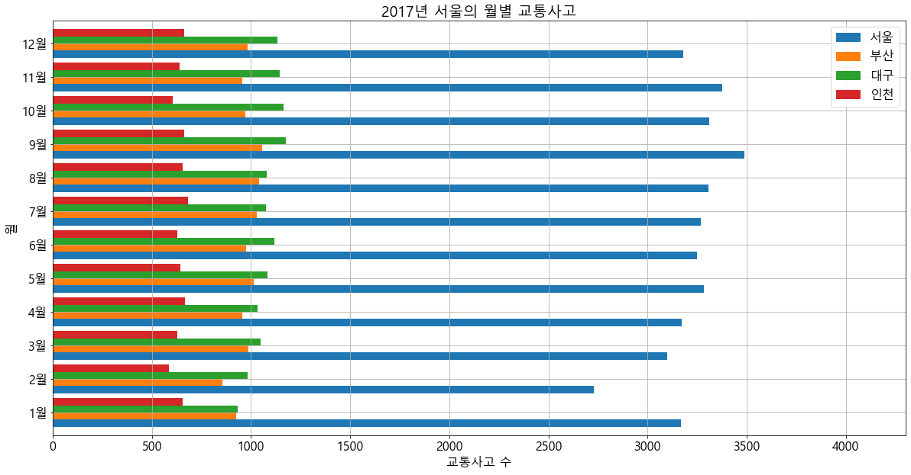

# #네이버 뉴스 수집(2)

컨텐츠로 접근할 수 있는 웹 페이지의 주소들을 수집하고 그 목록을 리스트로 정의.

리스트에 대해 반복문을 수행하면서 컨텐츠 수집

## #01. 필요한 모듈 참조


```python
import requests  # -> 웹페이지 요청 모듈
import os       # -> 날짜 처리 모듈
import datetime as dt # ->날짜 처리 모듈
from bs4 import BeautifulSoup # -> 웹페이지 소스코드 분석 모듈
from pandas import DataFrame
```

-----------------------------------------
## #02. 수집 준비

### 1)접속을 수행하기 위한 session 객체 생성


```python
# 접속 세션 만들기
user_agent = "Mozilla/5.0 (Windows NT 10.0; Win64; x64) AppleWebKit/537.36 (KHTML, like Gecko) Chrome/77.0.3865.120 Safari/537.36"

session = requests.Session()
session.headers.update({'User-agent':user_agent, 'referer':None})
```

### 2)접근할 페이지 주소(네이버 메인 뉴스)


```python
content_url = "https://news.naver.com"
```

### 3)수집된 기사들이 텍스트로 저장될 폴더 생성


```python
# 뉴스 기사가 저장될 폴더이름 구성
datetime = dt.datetime.now().strftime("%y%m%d_%H%M%S")
dirname = "%s_%s" % ('뉴스기사', datetime)

# 뉴스기사를 텍스트 파일로 저장할 폴더 만들기
if not os.path.exists(dirname):
    os.mkdir(dirname)
```

## #03.컨텐츠의 주소들을 수집하기

1) 네이버 뉴스 메인 소스코드 가져오기


```python
r = session.get(content_url)

#-> 결과확인
if r.status_code != 200:
    print("%d 에러가 발생했습니다." % r.status_code)
    # 즉시 종료 --> jupyter가 재시작됨
    quit()
    
r.encoding = "euc-kr"
r.text
```


    '\n\n\n\n\n\n\n\n\n\n\n\t\n\t\t\n\t\n\t\n\n\n<!DOCTYPE HTML>\n<html lang="ko">\n<head>\n<meta charset="euc-kr">\n<meta http-equiv="X-UA-Compatible" content="IE=edge">\n<meta name="referrer" contents="always">\n<meta http-equiv="refresh" content="600" />\n<meta name="viewport" content="width=1106" />\n\r\n    \r\n    \r\n    \r\n    \r\n    \r\n    \r\n    \r\n    \r\n    \r\n    \r\n    \r\n    \r\n    \r\n    \r\n    \r\n    \r\n    \r\n    \r\n\r\n<meta property="og:title"       content="네이버 뉴스">\r\n<meta property="og:type"        content="website">\r\n<meta property="og:url"         content="http://news.naver.com/main/home.nhn">\r\n<meta property="og:image"       content="https://ssl.pstatic.net/static.news/image/news/ogtag/navernews_200x200_20160804.png"/>\r\n<meta property="og:description" content="정치, 경제, 사회, 생활/문화, 세계, IT/과학 등 언론사별, 분야별 뉴스 기사 제공">\r\n<meta property="og:article:author"\tcontent="네이버"/>\r\n\r\n<meta name="twitter:card"\t\tcontent="summary">\r\n<meta name="twitter:title"\t\tcontent="네이버 뉴스">\r\n<meta name="twitter:site"       content="네이버 뉴스">\r\n<meta name="twitter:creator"    content="네이버 뉴스">\r\n<meta name="twitter:image"\t\tcontent="https://ssl.pstatic.net/static.news/image/news/ogtag/navernews_200x200_20160804.png">\r\n<meta name="twitter:description" content="정치, 경제, 사회, 생활/문화, 세계, IT/과학 등 언론사별, 분야별 뉴스 기사 제공">\r\n\n<title>네이버 뉴스</title>\n<link rel="shortcut icon" type="image/x-icon" href="https://ssl.pstatic.net/static.news/image/news/2014/favicon/favicon.ico" />\r\n\r\n\r\n\r\n\t\r\n\t\r\n\t\r\n\n\n\t\n\t\n\t\t<link rel="stylesheet" type="text/css" href="https://ssl.pstatic.net/static.news/pnews/resources/20191030_165315/css/common.css"/>\n\t\t<link rel="stylesheet" type="text/css" href="https://ssl.pstatic.net/static.news/pnews/resources/20191030_165315/css/news.css"/>\n\t\t\n\t\t\n\t\n\t\n\n\n\r\n\r\n\r\n\r\n<script type="text/javascript" src="https://ssl.pstatic.net/static.news/pnews/resources/20191030_165315/js/news.jindo.js" charset="euc-kr"></script>\r\n\r\n\r\n\n\n<script type="text/javascript" src="https://ssl.pstatic.net/static.news/pnews/resources/20191030_165315/js/news.jquery.js" charset="utf-8"></script>\n\n\n\n\n\n\t\n\t\t\n\t\t\n\t\t\n\t\n\t\n\t\n\t\n\t\n\t\n\t\n\t\n\t\n\t\n\t\n\t\n\t\n\t\n\t\n\t\n\t\n\t\n\t\n\t\n\t\n\t\n\t\n\t\t\n\t\n\t\n\n\n\n\n\n\n<script type="text/javascript">\ndocument.domain=\'naver.com\';\nvar _MAIN_NEWS_MENU_ID=\'home\';\nvar _MAIN_NEWS_SECTION_ID=\'100\';\nvar ccsrv=\'cc.naver.com\';\nvar g_ssc=\'news.home\';\nwindow.nsc = g_ssc; \nvar gnb_service=\'news\';\nvar gnb_logout=encodeURIComponent(location.href);\nvar gnb_template=\'gnb_utf8\';\nvar gnb_brightness = 1;\nvar gnb_one_naver = 1;\nvar gnb_searchbox=\'on\';\nvar gnb_shortnick=\'on\';\n\nvar gnb_timestamp = "Sat Nov 02 14:50:50 KST 2019";\n</script>\n\n\n\n\n<script type="text/javascript" src="https://ssl.pstatic.net/static.news/pnews/resources/20191030_165315/js/news.service.js" charset="euc-kr"></script>\n\n\n\n\n\n</head>\n\n<body class="chrome">\n\t<div id="wrap">\n\t\t\n\t\t<div id="da_base"></div>\n\t\t<div id="da_stake"></div>\n\t\t\r\n\r\n\r\n<div id="header" class="header">\r\n\t\r\n\t<div id="u_skip">\r\n\t\t<a href="#lnb" tabindex="1"><span>메인 메뉴로 바로가기</span></a>\r\n\t\t<a href="#main_content" tabindex="2"><span>본문으로 바로가기</span></a>\r\n\t</div>\r\n\t\r\n\r\n\t<div class="snb_area">\r\n\t\t<div class="snb_inner">\r\n\t\t\t<div class="gnb_wrap">\r\n   <!-- GNB 마크업 -->\r\n   <div id="gnb"></div>\r\n   <!-- //GNB 마크업 -->\r\n</div>\r\n\t\t\t\r\n\r\n\r\n<div id="snb_wrap">\r\n    <h1>\r\n        <a href="https://www.naver.com/" class="h_logo nclicks(STA.naver)"><span class="blind">NAVER</span></a>\r\n        <a href="/" class="h_news nclicks(STA.news)"><span class="blind">뉴스</span></a>\r\n    </h1>\r\n    <ul class="snb_related_service">\r\n        <li><span class="snb_bdr"></span><a href="https://entertain.naver.com/home" class="nclicks(STA.enter)"></a></li>\n<li><span class="snb_bdr"></span><a href="https://sports.news.naver.com" class="nclicks(STA.sports)"></a></li>\n<li><span class="snb_bdr"></span><a href="https://newsstand.naver.com" class="nclicks(STA.newsstand)"></a></li>\n<li><span class="snb_bdr"></span><a href="https://weather.naver.com" class="nclicks(STA.weather)"></a></li>\n\n\r\n        \r\n    </ul>\r\n</div>\r\n\t\t</div>\r\n\t</div>\r\n\t<div class="lnb_area">\r\n\t\t<div class="lnb_inner">\r\n\t\t\t\r\n\r\n\r\n\r\n\r\n\r\n\r\n<div id="lnb" class="lnb_menu">\r\n\t<ul>\r\n\t\t<li class="lnb_menu_home on"><a href="/main/home.nhn" class="nclicks(LNB.home)"><span class="tx">뉴스홈</span> <span class="blind">선택됨</span></a></li>\r\n\t\t<li><a href="/main/list.nhn?mode=LSD&mid=sec&sid1=001" class="nclicks(LNB.flash)"><span class="tx">속보</span></a></li>\r\n\t\t<li><a href="/main/main.nhn?mode=LSD&mid=shm&sid1=100" class="nclicks(LNB.pol)"><span class="tx">정치</span> </a></li>\r\n\t\t<li><a href="/main/main.nhn?mode=LSD&mid=shm&sid1=101" class="nclicks(LNB.eco)"><span class="tx">경제</span> </a></li>\r\n\t\t<li><a href="/main/main.nhn?mode=LSD&mid=shm&sid1=102" class="nclicks(LNB.soc)"><span class="tx">사회</span> </a></li>\r\n\t\t<li><a href="/main/main.nhn?mode=LSD&mid=shm&sid1=103" class="nclicks(LNB.lif)"><span class="tx">생활/문화</span> </a></li>\r\n\t\t<li><a href="/main/main.nhn?mode=LSD&mid=shm&sid1=104" class="nclicks(LNB.wor)"><span class="tx">세계</span> </a></li>\r\n\t\t<li><a href="/main/main.nhn?mode=LSD&mid=shm&sid1=105" class="nclicks(LNB.sci)"><span class="tx">IT/과학</span> </a></li>\r\n\t\t<li><a href="/main/opinion/home.nhn" class="nclicks(LNB.opi)"><span class="tx">오피니언</span> </a></li>\r\n\t\t<li><a href="/main/photo/index.nhn?mid=pho" class="nclicks(LNB.pho)"><span class="tx">포토</span> </a></li>\r\n\t\t<li><a href="/main/tv/index.nhn?mid=tvh" class="nclicks(LNB.tv)"><span class="tx">TV</span> </a></li>\r\n\t\t<li><a href="/main/ranking/popularDay.nhn?mid=etc&sid1=111" class="nclicks(LNB.ranking)"><span class="tx">랭킹뉴스</span> </a></li>\r\n\t</ul>\r\n\t<form name="lnb_searchForm" id="lnb.searchForm" method="get" action="https://search.naver.com/search.naver" target="_blank" accept-charset="UTF-8">\r\n\t\t<fieldset>\r\n\t\t\t<legend>뉴스 검색</legend>\r\n\t\t\t<input type="text" title="뉴스 검색" name="query" accesskey="s" class="text_index" style="ime-mode:active;"/>\r\n\t\t\t<input type="hidden" name="where" value="news">\r\n\t\t\t<input type="hidden" name="ie" value="utf8">\r\n\t\t\t<input type="hidden" name="sm" value="nws_hty">\r\n\t\t\t<button type="submit" class="btn_search_lnb nclicks(LNB.search)"><span class="tx"><span class="blind">검색</span></span></button>\r\n\t\t</fieldset>\r\n\t</form>\r\n</div>\r\n\t\t</div>\r\n\t</div>\r\n\r\n\t\r\n\r\n\r\n\r\n</div>\n\t\t<div class="home_timelate">\n<div class="ht_head">\n<ul class="ht_tabmnu">\n<li id="ht_tabmnu_0" >\n<a href="#" title="신문 헤드라인">신문 헤드라인<span class="ht_ico"></span></a>\n</li>\n<li id="ht_tabmnu_1" >\n<a href="#" title="저녁 방송 뉴스">저녁 방송 뉴스<span class="ht_ico"></span></a>\n</li>\n</ul>\n<ul class="lnb_side" tabindex="0">\n<li>\n<a href="https://news.naver.com/main/factcheck/main.nhn" class="nclicks(nct.right1)"\ntitle="팩트체크"\n>팩트체크\n</a>\n</li>\n<li>\n<a href="https://media.naver.com/channel/settings.nhn  " class="nclicks(nct.right2)"\ntitle="언론사 구독 "\ntarget="_blank">언론사 구독\n</a>\n</li>\n<li>\n<a href="https://news.naver.com/main/officeList.nhn" class="nclicks(nct.right3)"\ntitle="언론사 뉴스"\n>언론사 뉴스\n</a>\n</li>\n<li class="end">\n<a href="https://newslibrary.naver.com/search/searchByDate.nhn" class="nclicks(nct.right4)"\ntitle="라이브러리"\ntarget="_blank">라이브러리\n</a>\n</li>\n</ul>\n</div>\n<div id="paperHeadlineRolling" class="ht_comp ht_paperheadline" style="display: none;">\n<h3 class="blind">신문 헤드라인</h3>\n<ul class="ht_ph_lst" style="display: none;">\n<!-- 헤드라인 데이터 동적삽입 <li> -->\n</ul>\n<div class="ht_nodata_all" style="display: none;">발행된 종이신문이 없거나 신문게재 정보가 입력되지 않았습니다.</div>\n<div class="ht_navi">\n<a href="javascript:;" class="ht_btn_prev nclicks(opt.prev)"><span class="ht_ico"></span><span class="blind">이전</span></a>\n<a href="javascript:;" class="ht_btn_next nclicks(opt.next)"><span class="ht_ico"></span><span class="blind">다음</span></a>\n<a href="javascript:;" class="ht_btn_fold nclicks(opt.open)"><span class="ht_btn_box"><span class="ht_btn_ico"></span><span class="blind">접기</span></span></a>\n</div>\n</div>\n<div id="eveningNewsRolling" class="ht_comp ht_eveningnews" style="display: none;">\n<h3 class="blind">저녁 방송 뉴스</h3>\n<ul class="ht_ph_lst">\n<!-- 저녁방송뉴스 동적삽입 <li> -->\n</ul>\n<div class="ht_navi">\n<a href="javascript:;" class="ht_btn_prev nclicks(opt.prev);"><span class="ht_ico"></span><span class="blind">이전</span></a>\n<a href="javascript:;" class="ht_btn_next nclicks(opt.next)"><span class="ht_ico"></span><span class="blind">다음</span></a>\n<a href="javascript:;" class="ht_btn_fold nclicks(opt.open)"><span class="ht_btn_box"><span class="ht_btn_ico"></span><span class="blind">접기</span></span></a>\n</div>\n</div>\n<script type="text/javascript">\n_oTopComponentData = {\n"open" : "N",\n"target" : "headlineList",\n"headlineList" : [\n{\n"officeId" : "008",\n"officeName" : "머니투데이",\n"logoUrl" : "",\n"thumbnail" : "",\n"title" : "",\n"summary" : "",\n"publishDate" : ""\n},\n{\n"officeId" : "044",\n"officeName" : "코리아헤럴드",\n"logoUrl" : "",\n"thumbnail" : "",\n"title" : "",\n"summary" : "",\n"publishDate" : ""\n},\n{\n"officeId" : "009",\n"officeName" : "매일경제",\n"logoUrl" : "",\n"thumbnail" : "https://imgnews.pstatic.net/image/origin/009/2019/11/01/4456153.jpg?type=nf80_54",\n"title" : "`-14%` 망가진 수출…쌓이는 공장매물",\n"summary" : "3년9개월만에 지난달 최대 감소…11개월째 마이너스 반도체 32%↓·석유화학 22%↓ 수출기지였던 구미산단 영세업체 가동률 34% 그쳐 ◆ \\\'-14%\\\' 수출 쇼크 ◆ 전자부품 업체들이 몰려 있는 경북 구미국가산업단지",\n"publishDate" : "20191102"\n},\n{\n"officeId" : "081",\n"officeName" : "서울신문",\n"logoUrl" : "",\n"thumbnail" : "",\n"title" : "",\n"summary" : "",\n"publishDate" : ""\n},\n{\n"officeId" : "022",\n"officeName" : "세계일보",\n"logoUrl" : "",\n"thumbnail" : "https://imgnews.pstatic.net/image/origin/022/2019/11/02/3410932.jpg?type=nf80_54",\n"title" : "北 “초대형 방사포 성공” 靑 “위중한 위협 아니다”",\n"summary" : "정의용, 평가절하… 안이함 드러내 / 상중도발 비판엔 “발인 직후” 응수 / 北 발사간격 크게 단축… 성능 보완 / 전문가 “요격미사일 보유량 늘려야” 북한의 초대형 방사포가 지난달 31일 평안남도 순천 일대의 이동",\n"publishDate" : "20191102"\n},\n{\n"officeId" : "014",\n"officeName" : "파이낸셜뉴스",\n"logoUrl" : "",\n"thumbnail" : "https://imgnews.pstatic.net/image/origin/014/2019/11/01/4320393.jpg?type=nf80_54",\n"title" : "수출 11개월째 곤두박질…정부는 \\"바닥 지났다\\"",\n"summary" : "대외 불확실성이 계속되며 우리나라 수출이 11개월 연속 감소했다. 감소폭은 3년9개월 만에 최대였다. 정부는 우리 수출이 이달부터 서서히 회복해 내년 1·4분기께는 상승 전환할 것으로 보고 있다. 산업통상자원부는 올",\n"publishDate" : "20191102"\n},\n{\n"officeId" : "023",\n"officeName" : "조선일보",\n"logoUrl" : "",\n"thumbnail" : "",\n"title" : "정의용 \\"北미사일 위중한 위협 아니다\\"",\n"summary" : "국가안보 책임자가 北감싸기 美 \\"동맹 위협\\" 日 \\"안보리 위반\\"… 국제사회는 잇달아 강력 규탄 정의용 청와대 국가안보실장은 1일 청와대에 대한 국회 국정감사에서 \\"북한이 개발하는 미사일 능력은 우리 안보에 위중한 위",\n"publishDate" : "20191102"\n},\n{\n"officeId" : "005",\n"officeName" : "국민일보",\n"logoUrl" : "",\n"thumbnail" : "https://imgnews.pstatic.net/image/origin/005/2019/11/02/1255122.jpg?type=nf80_54",\n"title" : "北 신형 전술무기 4종 세트 완성…  靑 “인내해야” 美 “심각한 위협”",\n"summary" : "북한이 한반도 전역을 타격할 수 있는 ‘신형 단거리 4종 세트’를 완성 단계로 끌어올린 것으로 보인다. 이에 미국 정부는 “태평양 지역의 위협이 될 것”이라고 우려한 반면, 청와대는 “우리 안보에 위중한 위협은 안 ",\n"publishDate" : "20191102"\n},\n{\n"officeId" : "011",\n"officeName" : "서울경제",\n"logoUrl" : "",\n"thumbnail" : "https://imgnews.pstatic.net/image/origin/011/2019/11/01/3644600.jpg?type=nf80_54",\n"title" : "4년새 성장성 절반 뚝···지방銀 \\\'시련의 계절\\\'",\n"summary" : "[서울경제] 그동안 지역 기업에 특화된 영업방식과 지역민의 높은 충성도로 승승장구하던 지방은행이 지방경제 침체, 핀테크 확산, 정부 정책 유탄 등으로 코너에 몰리고 있다. 성장성을 보여주는 총자산증가율이 4년 새 반",\n"publishDate" : "20191102"\n},\n{\n"officeId" : "025",\n"officeName" : "중앙일보",\n"logoUrl" : "",\n"thumbnail" : "",\n"title" : "",\n"summary" : "",\n"publishDate" : ""\n},\n{\n"officeId" : "018",\n"officeName" : "이데일리",\n"logoUrl" : "",\n"thumbnail" : "",\n"title" : "",\n"summary" : "",\n"publishDate" : ""\n},\n{\n"officeId" : "015",\n"officeName" : "한국경제",\n"logoUrl" : "",\n"thumbnail" : "https://imgnews.pstatic.net/image/origin/015/2019/11/01/4234623.jpg?type=nf80_54",\n"title" : "한국 3% vs 미국 21%…高수익에 목마른 개미들, 해외주식 \\\'환승\\\'",\n"summary" : "개인투자자 K씨는 요즘 해외 주식에 푹 빠져 있다. 목돈이 생길 때마다 국내 우량주를 저축하듯 사모았지만 올초부터 관심주가 달라졌다. 애플 페이스북 등 미국 주식으로 눈을 돌렸다. 증권사 홈트레이딩시스템(HTS)을 ",\n"publishDate" : "20191102"\n},\n{\n"officeId" : "028",\n"officeName" : "한겨레",\n"logoUrl" : "",\n"thumbnail" : "https://imgnews.pstatic.net/image/origin/028/2019/11/01/2473352.jpg?type=nf80_54",\n"title" : "정부, 노후 화물차 12월부터 수도권 운행 제한",\n"summary" : "정부가 미세먼지의 주범 가운데 하나로 꼽힌 노후 화물차와 노후 건설기계의 운행·사용 제한과 함께 공공기간 차량 2부제 등을 내용으로 하는 미세먼지 특별대책을 확정했다. 지난 9월 국가기후환경회의에서 제안한 미세먼지 ",\n"publishDate" : "20191102"\n},\n{\n"officeId" : "016",\n"officeName" : "헤럴드경제",\n"logoUrl" : "",\n"thumbnail" : "",\n"title" : "",\n"summary" : "",\n"publishDate" : ""\n},\n{\n"officeId" : "029",\n"officeName" : "디지털타임스",\n"logoUrl" : "",\n"thumbnail" : "",\n"title" : "",\n"summary" : "",\n"publishDate" : ""\n},\n{\n"officeId" : "353",\n"officeName" : "중앙SUNDAY",\n"logoUrl" : "",\n"thumbnail" : "",\n"title" : "미세먼지 대책 낮잠, 올 겨울엔 대책없다",\n"summary" : "1일 고농도 미세먼지가 전국을 덮쳤다. 중국발 황사 영향으로 공기가 탁해지면서 전국 곳곳에서 초미세먼지와 미세먼지 농도가 올가을 들어 최고 수준으로 치솟았다. 청명한 가을 하늘은 사라졌다. 이런 가운데 이낙연 국무총",\n"publishDate" : "20191102"\n},\n{\n"officeId" : "277",\n"officeName" : "아시아경제",\n"logoUrl" : "",\n"thumbnail" : "",\n"title" : "",\n"summary" : "",\n"publishDate" : ""\n},\n{\n"officeId" : "021",\n"officeName" : "문화일보",\n"logoUrl" : "",\n"thumbnail" : "",\n"title" : "",\n"summary" : "",\n"publishDate" : ""\n},\n{\n"officeId" : "469",\n"officeName" : "한국일보",\n"logoUrl" : "",\n"thumbnail" : "https://imgnews.pstatic.net/image/origin/469/2019/11/01/436395.jpg?type=nf80_54",\n"title" : "법무부 ‘檢 타다 기소 방침’ 국토부에 안 알렸다",\n"summary" : "[부처 간 불통이 키운 ‘타다 사태’] 법무부 “檢에 한두 달 연기 요청” 檢 “한 달 연기 요청 받아” 국토부 “사전통보ㆍ협의 없었다”檢이 법령해석 의견 구했을 땐 뒷짐 차량 호출 서비스 ‘타다’ 기소를 둘러싸고 ",\n"publishDate" : "20191102"\n},\n{\n"officeId" : "020",\n"officeName" : "동아일보",\n"logoUrl" : "",\n"thumbnail" : "https://imgnews.pstatic.net/image/origin/020/2019/11/02/3250941.jpg?type=nf80_54",\n"title" : "北, 2년전 이미 쐈는데… 靑 “이동식 ICBM 못쏴”",\n"summary" : "정의용 안보실장 국감 발언 논란… 南겨냥 초대형 방사포엔 “위협 안돼” 정의용 청와대 국가안보실장이 북한의 지난달 31일 초대형 방사포 발사와 관련해 “북한이 개발하는 미사일은 우리 안보의 위중한 위협이 된다고 보기",\n"publishDate" : "20191102"\n},\n{\n"officeId" : "032",\n"officeName" : "경향신문",\n"logoUrl" : "",\n"thumbnail" : "https://imgnews.pstatic.net/image/origin/032/2019/11/01/2972373.jpg?type=nf80_54",\n"title" : "‘독도 소방헬기 추락’ 실종자 추정 시신 1구 발견",\n"summary" : "ㆍ31일 응급환자 육지 이송 중 사고 ㆍ소방구조대·보호자 등 7명 탑승 ㆍ섬 남쪽 수심 72m 지점 기체 발견 독도 인근 해상에서 지난달 31일 응급환자와 소방대원 등 7명을 태우고 육지로 가던 소방헬기가 바다에 추",\n"publishDate" : "20191102"\n},\n{\n"officeId" : "030",\n"officeName" : "전자신문",\n"logoUrl" : "",\n"thumbnail" : "",\n"title" : "",\n"summary" : "",\n"publishDate" : ""\n}\n]\n,\n"liveTvList" : [\n{\n"officeId" : "422",\n"articleId" : "0000399348",\n"sectionId" : "74f",\n"logoUrl" : "",\n"officeName" : "연합뉴스TV",\n"title" : "추락 헬기는 2016년 도입 유로콥터 EC-225",\n"newsKey" : "74f",\n"thumbnail" : "",\n"summary" : "[뉴스리뷰] [앵커] 독도 해상에서 추락한 소방헬기는 국내에 도입된지 3년 반 정도 지난 프랑스제 EC-225 기종입니다. 과거 노르웨이에서 부품 균열로 추락사고를 내 10여명이 희생된 사례가 있는 것으로 파악됐습니",\n"onairStatus" : "REPLAY",\n"nextLiveTime" : ""\n},\n{\n"officeId" : "449",\n"articleId" : "0000180463",\n"sectionId" : "74b",\n"logoUrl" : "",\n"officeName" : "채널A",\n"title" : "7명 탑승 소방헬기 독도 해상 추락…수심 72m 지점 동체 발견",\n"newsKey" : "74b",\n"thumbnail" : "",\n"summary" : "여러분 안녕하십니까. 오늘 뉴스에이는 어젯밤 추락한 소방 헬기 수색 상황부터 알아보겠습니다. 응급환자를 후송하기 위해 출동했다가 독도 인근 바다에 추락한 헬기에는 소방대원과 부상자 등 7명이 타고 있었는데요, 실종자",\n"onairStatus" : "REPLAY",\n"nextLiveTime" : ""\n},\n{\n"officeId" : "437",\n"articleId" : "0000223284",\n"sectionId" : "742",\n"logoUrl" : "",\n"officeName" : "JTBC",\n"title" : "7명 탄 헬기 독도 해상 추락…수심 72m 동체서 시신 1구 발견",\n"newsKey" : "742",\n"thumbnail" : "",\n"summary" : "[앵커] 어젯(31일)밤 독도 인근에서 소방 구조 헬기가 바다에 추락했습니다. 고기를 잡다 다친 어민을 병원으로 옮기던 중이었는데, 헬기에는 환자와 구조대원 등 7명이 타고 있었습니다. 사고가 난 곳은 수심 72m의",\n"onairStatus" : "REPLAY",\n"nextLiveTime" : ""\n},\n{\n"officeId" : "056",\n"articleId" : "0010759509",\n"sectionId" : "355",\n"logoUrl" : "",\n"officeName" : "KBS",\n"title" : "7명 탄 소방헬기 독도 해상 추락…실종자 1명 발견",\n"newsKey" : "355",\n"thumbnail" : "",\n"summary" : "[앵커] 어젯밤(31일) 독도 인근 해상에서 응급환자를 태운 소방헬기가 바다에 추락했습니다. 독도에서 이륙한 지 불과 2분만이었습니다. 환자와 보호자, 소방대원 등 모두 7명이 타고 있었습니다. 이제 사고가 난 지 ",\n"onairStatus" : "REPLAY",\n"nextLiveTime" : ""\n},\n{\n"officeId" : "214",\n"articleId" : "0000990648",\n"sectionId" : "370",\n"logoUrl" : "",\n"officeName" : "MBC",\n"title" : "독도 앞바다 추락 헬기 \\\'동체\\\' 확인…실종자는?",\n"newsKey" : "370",\n"thumbnail" : "",\n"summary" : "[뉴스데스크]◀ 앵커 ▶ 여러분, 안녕하십니까. 어젯밤, 대구를 출발해서 독도에 있는 응급 환자를 실은 뒤에 병원으로 이송하려던 소방 헬기가 이륙 직후에 추락했습니다. 추락 지점은 독도에서 불과 600미터 떨어진 바",\n"onairStatus" : "REPLAY",\n"nextLiveTime" : ""\n},\n{\n"officeId" : "057",\n"articleId" : "0001392885",\n"sectionId" : "74e",\n"logoUrl" : "",\n"officeName" : "MBN",\n"title" : "김주하 앵커가 전하는 11월 1일 종합뉴스 주요뉴스",\n"newsKey" : "74e",\n"thumbnail" : "",\n"summary" : "▶ \\\'독도 추락 헬기\\\' 동체·실종자 1명 발견 어젯밤 독도 인근 해상에서 응급환자를 태우고 이륙 2분 만에 추락한 소방헬기의 동체가 14시간 만에 발견됐습니다. 내부에서 실종자 7명 중 1명으로 추정되는 시신도 발견",\n"onairStatus" : "REPLAY",\n"nextLiveTime" : ""\n},\n{\n"officeId" : "055",\n"articleId" : "0000769372",\n"sectionId" : "371",\n"logoUrl" : "",\n"officeName" : "SBS",\n"title" : "오늘의 주요뉴스",\n"newsKey" : "371",\n"thumbnail" : "",\n"summary" : "1. 어젯(31일)밤 독도 인근에서 추락한 119 소방헬기의 동체가 수심 72m 지점에서 발견됐습니다. 추락 헬기에는 민간인 환자 1명을 포함해 조종사와 소방대원 등 모두 7명이 탑승하고 있었습니다. 추락 원인은 아",\n"onairStatus" : "REPLAY",\n"nextLiveTime" : ""\n},\n{\n"officeId" : "448",\n"articleId" : "0000285384",\n"sectionId" : "750",\n"logoUrl" : "",\n"officeName" : "TV조선",\n"title" : "72m 해저서 소방헬기 동체 확인…실종자 추정 시신 1구 발견",\n"newsKey" : "750",\n"thumbnail" : "",\n"summary" : "[앵커] 오늘 뉴스나인은 독도 앞 바다 소방 헬기 추락 소식 속보부터 자세히 살펴 보겠습니다. 추락 현장 부근 바다에서는 오늘 하루종일 수색작업이 진행됐고, 헬기 동체와 실종자로 추정되는 시신 1구가 발견됐습니다. ",\n"onairStatus" : "REPLAY",\n"nextLiveTime" : ""\n},\n{\n"officeId" : "052",\n"articleId" : "0001360986",\n"sectionId" : "751",\n"logoUrl" : "",\n"officeName" : "YTN",\n"title" : "[날씨] 밤사이 미세먼지 호전...아침 쌀쌀·낮 선선",\n"newsKey" : "751",\n"thumbnail" : "",\n"summary" : "또다시 찾아온 황사와 중국발 스모그에 오늘 마음 놓고 바깥 활동하기 힘들었습니다. 미세먼지가 하늘을 뒤덮으면서 마치 뿌연 장막을 친 듯한 느낌이 들었는데 다행히 밤사이 미세먼지 상황이 호전되겠고 내일은 충청과 전북,",\n"onairStatus" : "REPLAY",\n"nextLiveTime" : ""\n}\n]\n};\n</script>\n</div>\n\n\r\n<script type="text/javascript">\r\n\t// page onload 시에 home timelate에서 사용하는 스크립트를 초기화 시켜준다.\r\n\tjindo.$Fn(function(){\r\n\t\ttry {\r\n\t\t\tnews.home.TopTimelate.Controller.init(_oTopComponentData);\r\n\t\t} catch (e) { }\r\n\t}).attach(window, "load");\r\n</script>\n\t\t<div class="main_space"></div>\n\n\t\t<div id="container" class="main">\n\t\t\t<hr>\n\t\t\t<div id="main_content" class="main_content main_content_new">\n\t\t\t\t<div class="main_content_inner _content_inner">\n\t\t\t\t\t<div class="main_component droppable" id="today_main_news">\n            <div class="com_header">\n                <h4 class="tit_h4 tit_main1"><strong>헤드라인 뉴스</strong><i class="hdline_title_icon_beta">beta</i></h4>\n                <p class="news_info_txt">헤드라인 뉴스와 각 기사묶음 타이틀은 기사 내용을 기반으로 <strong>자동 추출</strong>됩니다.</p>\n            </div>\n            <!-- [D] 구형: .com_list.com_list_headline, 이시각주요뉴스:.newsnow, 헤드라인뉴스:.hdline_news -->\n            <div class="hdline_news">\n                <div class="hdline_flick">\n                    <div class="hdline_flick_item" style="display:block">\n                        <a href="/main/read.nhn?mode=LSD&mid=shm&sid1=102&oid=001&aid=0011185359" class="lnk_hdline_main_article nclicks(\'mai.image\', \'880000D8_000000000000000011185359\', \'airsGParam\', \'0\', \'news_qm_v2.0\', \'9jCu7TRTk3eDne8E\')">\n                            \n                            <div class="hdline_flick_mask">\n                                <p class="hdline_flick_tit">속도 내는 &#39;독도 추락헬기&#39; 실종자 수색&hellip;동체 인…</p>\n                            </div>\n                        </a>\n                        \n                            <a href="/main/clusterArticles.nhn?id=c_201911011520_00000004&mode=LSD&mid=shm&oid=001&aid=0011185359" class="lnk_hdline_cluster_more nclicks(\'mai.clu\', \'880000D8_000000000000000011185359\', \'airsGParam\', \'0\', \'news_qm_v2.0\', \'9jCu7TRTk3eDne8E\')">\n                                <span class="blind">관련기사 개수</span>\n                                <span class="cluster_more_icon_num">101</span>\n                            </a>\n                        \n                    </div>\n\n                    <div class="hdline_flick_item" style="display:none">\n                        <a href="/main/read.nhn?mode=LSD&mid=shm&sid1=102&oid=081&aid=0003040581" class="lnk_hdline_main_article nclicks(\'mai.image\', \'880000D1_000000000000000003040581\', \'airsGParam\', \'0\', \'news_qm_v2.0\', \'9jCu7TRTk3eDne8E\')">\n                            \n                            <div class="hdline_flick_mask">\n                                <p class="hdline_flick_tit">&lsquo;화성 실종 초등생&rsquo; 30년만의 수색에 아버지 울…</p>\n                            </div>\n                        </a>\n                        \n                            <a href="/main/clusterArticles.nhn?id=c_201910311900_00000003&mode=LSD&mid=shm&oid=081&aid=0003040581" class="lnk_hdline_cluster_more nclicks(\'mai.clu\', \'880000D1_000000000000000003040581\', \'airsGParam\', \'0\', \'news_qm_v2.0\', \'9jCu7TRTk3eDne8E\')">\n                                <span class="blind">관련기사 개수</span>\n                                <span class="cluster_more_icon_num">59</span>\n                            </a>\n                        \n                    </div>\n\n                    <div class="hdline_flick_navi">\n                        <button type="button" class="flick_btn_prev nclicks(mai.prev)" disabled="disabled" onclick="prevRecommend(); "><span class="blind">이전기사</span></button><button type="button" class="flick_btn_next nclicks(mai.next)" onclick="nextRecommend(); "><span class="blind">다음기사</span></button>\n                    </div> <!--[D] 버튼 비활성: disabled 속성 추가 -->\n                </div>\n\n                <ul class="hdline_article_list">\n                    \n                        \n                            <li>\n                                <div class="hdline_article_tit">\n                                    <a href="/main/read.nhn?mode=LSD&mid=shm&sid1=100&oid=055&aid=0000769494" class="lnk_hdline_article nclicks(\'mai.text1\', \'8800011C_000000000000000000769494\', \'airsGParam\', \'0\', \'news_qm_v2.0\', \'9jCu7TRTk3eDne8E\')">\n                                         &quot;참 안타깝다&quot; 금태섭, 이자스민 응원하며 민주당에 쓴소리[Pick]\n                                    </a>\n                                </div>\n                                <div class="hdline_cluster_more">\n                                    <a href="/main/clusterArticles.nhn?id=c_201911011800_00000135&mode=LSD&mid=shm&oid=055&aid=0000769494" class="lnk_hdline_cluster_more nclicks(\'mai.clu\', \'8800011C_000000000000000000769494\', \'airsGParam\', \'0\', \'news_qm_v2.0\', \'9jCu7TRTk3eDne8E\')">\n                                        <span class="blind">관련기사 개수</span>\n                                        <span class="cluster_more_icon_num">45</span>\n                                    </a>\n                                </div>\n                            </li>\n                        \n                        \n                    \n                        \n                            <li>\n                                <div class="hdline_article_tit">\n                                    <a href="/main/read.nhn?mode=LSD&mid=shm&sid1=102&oid=422&aid=0000399430" class="lnk_hdline_article nclicks(\'mai.text1\', \'08138262_000000000000000000399430\', \'airsGParam\', \'0\', \'news_qm_v2.0\', \'9jCu7TRTk3eDne8E\')">\n                                        무인잠수정 정밀 탐색&hellip;&quot;시신 3구 발견&quot;\n                                    </a>\n                                </div>\n                                <div class="hdline_cluster_more">\n                                    <a href="/main/clusterArticles.nhn?id=c_201911021350_00000001&mode=LSD&mid=shm&oid=422&aid=0000399430" class="lnk_hdline_cluster_more nclicks(\'mai.clu\', \'08138262_000000000000000000399430\', \'airsGParam\', \'0\', \'news_qm_v2.0\', \'9jCu7TRTk3eDne8E\')">\n                                        <span class="blind">관련기사 개수</span>\n                                        <span class="cluster_more_icon_num">22</span>\n                                    </a>\n                                </div>\n                            </li>\n                        \n                        \n                    \n                        \n                            <li>\n                                <div class="hdline_article_tit">\n                                    <a href="/main/read.nhn?mode=LSD&mid=shm&sid1=104&oid=018&aid=0004507090" class="lnk_hdline_article nclicks(\'mai.text1\', \'880000E7_000000000000000004507090\', \'airsGParam\', \'0\', \'news_qm_v2.0\', \'9jCu7TRTk3eDne8E\')">\n                                        베트남, 냉동 컨테이너 비극에 큰 충격&hellip;&ldquo;인신매매는 심각한 범죄&rdquo;\n                                    </a>\n                                </div>\n                                <div class="hdline_cluster_more">\n                                    <a href="/main/clusterArticles.nhn?id=c_201911020020_00000024&mode=LSD&mid=shm&oid=018&aid=0004507090" class="lnk_hdline_cluster_more nclicks(\'mai.clu\', \'880000E7_000000000000000004507090\', \'airsGParam\', \'0\', \'news_qm_v2.0\', \'9jCu7TRTk3eDne8E\')">\n                                        <span class="blind">관련기사 개수</span>\n                                        <span class="cluster_more_icon_num">32</span>\n                                    </a>\n                                </div>\n                            </li>\n                        \n                        \n                    \n                        \n                            <li>\n                                <div class="hdline_article_tit">\n                                    <a href="/main/read.nhn?mode=LSD&mid=shm&sid1=100&oid=469&aid=0000436526" class="lnk_hdline_article nclicks(\'mai.text1\', \'88156f75_000000000000000000436526\', \'airsGParam\', \'0\', \'news_qm_v2.0\', \'9jCu7TRTk3eDne8E\')">\n                                        홍준표 &ldquo;황교안 헛발질 답답&hellip; 색소폰은 총선 이기고 불라&rdquo;\n                                    </a>\n                                </div>\n                                <div class="hdline_cluster_more">\n                                    <a href="/main/clusterArticles.nhn?id=c_201911021010_00000021&mode=LSD&mid=shm&oid=469&aid=0000436526" class="lnk_hdline_cluster_more nclicks(\'mai.clu\', \'88156f75_000000000000000000436526\', \'airsGParam\', \'0\', \'news_qm_v2.0\', \'9jCu7TRTk3eDne8E\')">\n                                        <span class="blind">관련기사 개수</span>\n                                        <span class="cluster_more_icon_num">17</span>\n                                    </a>\n                                </div>\n                            </li>\n                        \n                        \n                    \n                        \n                            <li>\n                                <div class="hdline_article_tit">\n                                    <a href="/main/read.nhn?mode=LSD&mid=shm&sid1=100&oid=469&aid=0000436514" class="lnk_hdline_article nclicks(\'mai.text1\', \'88156f75_000000000000000000436514\', \'airsGParam\', \'0\', \'news_qm_v2.0\', \'9jCu7TRTk3eDne8E\')">\n                                        북한 매체, 이낙연 총리 일왕즉위식 참석 비난 &ldquo;미국 압력에 굴복&rdquo;\n                                    </a>\n                                </div>\n                                <div class="hdline_cluster_more">\n                                    <a href="/main/clusterArticles.nhn?id=c_201911020910_00000001&mode=LSD&mid=shm&oid=469&aid=0000436514" class="lnk_hdline_cluster_more nclicks(\'mai.clu\', \'88156f75_000000000000000000436514\', \'airsGParam\', \'0\', \'news_qm_v2.0\', \'9jCu7TRTk3eDne8E\')">\n                                        <span class="blind">관련기사 개수</span>\n                                        <span class="cluster_more_icon_num">20</span>\n                                    </a>\n                                </div>\n                            </li>\n                        \n                        \n                    \n                </ul>\n            </div>\n\n            <div class="btn_move">\n                <!-- [D] .down_off 또는 .up_off 추가시 \'<span class="blind">불가능</span>\' 추가 -->\n                <span class="move" title="이동">이동</span> <a href="#SLELq" class="up nclicks(mai.up)" title="위로">위로</a> <a href="#SLELq" class="down_off nclicks(mai.down)" title="아래로">아래로<span class="blind">불가능</span></a>\n            </div>\n        </div>\n\n        <script type="text/javascript">\n            var recommendIdx = 0;\n            var recommendLength = $("#today_main_news .hdline_flick_item").length;\n\n            function prevRecommend() {\n                if ( recommendIdx-1 >= 0) {\n                    recommendIdx -= 1;\n                }\n\n                recBtnDisabled();\n\n                $("#today_main_news .hdline_flick_item").css("display", "none");\n                $("#today_main_news .hdline_flick_item").eq(recommendIdx).css("display", "block");\n            }\n\n            function nextRecommend() {\n                if ( recommendIdx+1 < recommendLength) {\n                    recommendIdx += 1;\n                }\n\n                recBtnDisabled();\n\n                $("#today_main_news .hdline_flick_item").css("display", "none");\n                $("#today_main_news .hdline_flick_item").eq(recommendIdx).css("display", "block");\n            }\n\n            function recBtnDisabled() {\n                $("#today_main_news .flick_btn_prev").removeAttr("disabled");\n                $("#today_main_news .flick_btn_next").removeAttr("disabled");\n\n                if ( recommendIdx === 0 ) {\n                    $("#today_main_news .flick_btn_prev").attr("disabled", "disabled");\n                }\n                if ( recommendIdx === recommendLength -1 ) {\n                    $("#today_main_news .flick_btn_next").attr("disabled", "disabled");\n                }\n            }\n        </script>\n\n\n        \n        \n    \n        \n    \n\n    \n    \n    \n    \n\n    \n        \n            \n            \n        \n        \n        \n        \n        \n        \n        \n    \n\n    \n    \n        \n            \n                \n                <div class="main_component droppable" id="section_politics">\n                    <div class="com_header">\n                        \n                            \n                                <h4 class="tit_sec"><a href="/main/main.nhn?mode=LSD&mid=shm&sid1=100" class="nclicks(pol.title)">정치</a></h4>\n                                <span class="tit_sub">\n                    <a href="/main/list.nhn?mode=LS2D&mid=shm&sid1=100&sid2=269" class="nclicks(pol.common)">일반</a><span class="bar"></span>\n                    <a href="/main/list.nhn?mode=LS2D&mid=shm&sid1=100&sid2=265" class="nclicks(pol.party)">국회/정당</a><span class="bar"></span>\n                    <a href="/main/list.nhn?mode=LS2D&mid=shm&sid1=100&sid2=264" class="nclicks(pol.chung)">청와대</a>\n                    </span>\n                            \n                            \n                            \n                            \n                            \n                            \n                            \n                        \n                    </div>\n\n                    <div class="com_list">\n                        \n                        \n                        \n                            \n                                <dl class="mtype_img">\n                                    <dt>\n                                        <a href="https://news.naver.com/main/read.nhn?mode=LSD&mid=shm&sid1=100&oid=018&aid=0004507141" class="nclicks(\'hom.airscont\',\'880000E7_000000000000000004507141\', \'airsGParam\', \'0\', \'news_sec_v2.0\', \'mpd15LYsNR0HiWgb\')">\n                                            \n                                            \n                                                \n                                                    <span class="trans_border"></span>\n                                                \n                                                \n                                            \n                                        </a>\n                                    </dt>\n                                    <dd>\n                                        <a href="https://news.naver.com/main/read.nhn?mode=LSD&mid=shm&sid1=100&oid=018&aid=0004507141" class="nclicks(\'hom.airscont\',\'880000E7_000000000000000004507141\', \'airsGParam\', \'0\', \'news_sec_v2.0\', \'mpd15LYsNR0HiWgb\')">한국당 "\'뇌피셜\' 유시민, 檢수사 앞두고 \'유럽 도피\' 지적"</a>\n                                    </dd>\n                                </dl>\n                                <div class="mtype_list_wide">\n                                    <ul class="mlist2 no_bg">\n                                        \n                                            \n                                            <li>\n                                                <a href="https://news.naver.com/main/read.nhn?mode=LSD&mid=shm&sid1=100&oid=052&aid=0001361101" class="nclicks(\'hom.airscont\',\'880000E7_000000000000000004507141\', \'airsGParam\', \'0\', \'news_sec_v2.0\', \'mpd15LYsNR0HiWgb\')">\n                                                    <strong>이해찬·황교안 "소통 강화"...가까이 하기엔 너무 먼 당신?</strong>\n                                                </a>\n                                                \n                                                <span class="writing">YTN</span>\n                                            </li>\n                                        \n                                            \n                                            <li>\n                                                <a href="https://news.naver.com/main/read.nhn?mode=LSD&mid=shm&sid1=100&oid=001&aid=0011185353" class="nclicks(\'hom.airscont\',\'880000E7_000000000000000004507141\', \'airsGParam\', \'0\', \'news_sec_v2.0\', \'mpd15LYsNR0HiWgb\')">\n                                                    <strong>與 "거리 전전 황교안, 구제불능"…한국당 장외활동 비판</strong>\n                                                </a>\n                                                <i class="icon_photo">포토</i>\n                                                <span class="writing">연합뉴스</span>\n                                            </li>\n                                        \n                                            \n                                            <li>\n                                                <a href="https://news.naver.com/main/read.nhn?mode=LSD&mid=shm&sid1=100&oid=421&aid=0004283508" class="nclicks(\'hom.airscont\',\'880000E7_000000000000000004507141\', \'airsGParam\', \'0\', \'news_sec_v2.0\', \'mpd15LYsNR0HiWgb\')">\n                                                    <strong>박찬주 이어 장수영·백경훈까지…한국당, 계속되는 인재영입 논란</strong>\n                                                </a>\n                                                <i class="icon_photo">포토</i>\n                                                <span class="writing">뉴스1</span>\n                                            </li>\n                                        \n                                            \n                                            <li>\n                                                <a href="https://news.naver.com/main/read.nhn?mode=LSD&mid=shm&sid1=100&oid=055&aid=0000769494" class="nclicks(\'hom.airscont\',\'880000E7_000000000000000004507141\', \'airsGParam\', \'0\', \'news_sec_v2.0\', \'mpd15LYsNR0HiWgb\')">\n                                                    <strong>[Pick] "참 안타깝다" 금태섭, 이자스민 응원하며 민주당에 쓴소리</strong>\n                                                </a>\n                                                <i class="icon_photo">포토</i>\n                                                <span class="writing">SBS</span>\n                                            </li>\n                                        \n                                            \n                                            <li>\n                                                <a href="https://news.naver.com/main/read.nhn?mode=LSD&mid=shm&sid1=100&oid=119&aid=0002361767" class="nclicks(\'hom.airscont\',\'880000E7_000000000000000004507141\', \'airsGParam\', \'0\', \'news_sec_v2.0\', \'mpd15LYsNR0HiWgb\')">\n                                                    <strong>대의대표 호통친 靑…野 "국민 위에 군림하려 드나"</strong>\n                                                </a>\n                                                <i class="icon_photo">포토</i>\n                                                <span class="writing">데일리안</span>\n                                            </li>\n                                        \n                                    </ul>\n                                </div>\n                            \n                            \n                        \n                    </div>\n                    <div class="btn_move">\n                        <span class="move nclick(soc.move)" title="이동">이동</span>\n                        <a href="#" class="up nclicks(soc.up)" title="위로">위로</a>\n                        <a href="#" class="down nclicks(soc.down)" title="아래로">아래로</a>\n                    </div>\n                </div>\n            \n        \n    \n\n    \n    \n    \n    \n\n    \n        \n        \n            \n            \n        \n        \n        \n        \n        \n        \n    \n\n    \n    \n        \n            \n                \n                <div class="main_component droppable" id="section_economy">\n                    <div class="com_header">\n                        \n                            \n                            \n                                <h4 class="tit_sec"><a href="/main/main.nhn?mode=LSD&mid=shm&sid1=101" class="nclicks(eco.title)">경제</a></h4>\n                                <span class="tit_sub">\n                    <a href="/main/list.nhn?mode=LS2D&mid=shm&sid1=101&sid2=263" class="nclicks(eco.common)">일반</a><span class="bar"></span>\n                    <a href="/main/list.nhn?mode=LS2D&mid=shm&sid1=101&sid2=259" class="nclicks(eco.finance)">금융</a><span class="bar"></span>\n                    <a href="/main/list.nhn?mode=LS2D&mid=shm&sid1=101&sid2=310" class="nclicks(eco.domestic)">생활경제</a>\n                    </span>\n                            \n                            \n                            \n                            \n                            \n                            \n                        \n                    </div>\n\n                    <div class="com_list">\n                        \n                        \n                        \n                            \n                                <dl class="mtype_img">\n                                    <dt>\n                                        <a href="https://news.naver.com/main/read.nhn?mode=LSD&mid=shm&sid1=101&oid=014&aid=0004320528" class="nclicks(\'hom.airscont\',\'880000FF_000000000000000004320528\', \'airsGParam\', \'0\', \'news_sec_v2.0\', \'IWGc4CFgaccq0BWf\')">\n                                            \n                                            \n                                                \n                                                    <span class="trans_border"></span>\n                                                \n                                                \n                                            \n                                        </a>\n                                    </dt>\n                                    <dd>\n                                        <a href="https://news.naver.com/main/read.nhn?mode=LSD&mid=shm&sid1=101&oid=014&aid=0004320528" class="nclicks(\'hom.airscont\',\'880000FF_000000000000000004320528\', \'airsGParam\', \'0\', \'news_sec_v2.0\', \'IWGc4CFgaccq0BWf\')">美 트럼프, 中과 1단계 무역 합의 장소로 아이오와주 검토</a>\n                                    </dd>\n                                </dl>\n                                <div class="mtype_list_wide">\n                                    <ul class="mlist2 no_bg">\n                                        \n                                            \n                                            <li>\n                                                <a href="https://news.naver.com/main/read.nhn?mode=LSD&mid=shm&sid1=101&oid=025&aid=0002949767" class="nclicks(\'hom.airscont\',\'880000FF_000000000000000004320528\', \'airsGParam\', \'0\', \'news_sec_v2.0\', \'IWGc4CFgaccq0BWf\')">\n                                                    <strong>韓관광객 줄자 日지자체, 직원들에 “한국여행 가라” 강요, 왜?</strong>\n                                                </a>\n                                                <i class="icon_photo">포토</i>\n                                                <span class="writing">중앙일보</span>\n                                            </li>\n                                        \n                                            \n                                            <li>\n                                                <a href="https://news.naver.com/main/read.nhn?mode=LSD&mid=shm&sid1=101&oid=031&aid=0000514290" class="nclicks(\'hom.airscont\',\'880000FF_000000000000000004320528\', \'airsGParam\', \'0\', \'news_sec_v2.0\', \'IWGc4CFgaccq0BWf\')">\n                                                    <strong>항공업계, 보잉發 악재에 노심초사</strong>\n                                                </a>\n                                                <i class="icon_photo">포토</i>\n                                                <span class="writing">아이뉴스24</span>\n                                            </li>\n                                        \n                                            \n                                            <li>\n                                                <a href="https://news.naver.com/main/read.nhn?mode=LSD&mid=shm&sid1=101&oid=422&aid=0000399417" class="nclicks(\'hom.airscont\',\'880000FF_000000000000000004320528\', \'airsGParam\', \'0\', \'news_sec_v2.0\', \'IWGc4CFgaccq0BWf\')">\n                                                    <strong>50돌 맞은 삼성전자…이재용 "100년 기업되자\'</strong>\n                                                </a>\n                                                \n                                                <span class="writing">연합뉴스TV</span>\n                                            </li>\n                                        \n                                            \n                                            <li>\n                                                <a href="https://news.naver.com/main/read.nhn?mode=LSD&mid=shm&sid1=101&oid=018&aid=0004507089" class="nclicks(\'hom.airscont\',\'880000FF_000000000000000004320528\', \'airsGParam\', \'0\', \'news_sec_v2.0\', \'IWGc4CFgaccq0BWf\')">\n                                                    <strong>[아파트 돋보기]베란다 바깥으로 물건 던지면 범죄자?</strong>\n                                                </a>\n                                                <i class="icon_photo">포토</i>\n                                                <span class="writing">이데일리</span>\n                                            </li>\n                                        \n                                            \n                                            <li>\n                                                <a href="https://news.naver.com/main/read.nhn?mode=LSD&mid=shm&sid1=101&oid=011&aid=0003644803" class="nclicks(\'hom.airscont\',\'880000FF_000000000000000004320528\', \'airsGParam\', \'0\', \'news_sec_v2.0\', \'IWGc4CFgaccq0BWf\')">\n                                                    <strong>P2P 세계최초 법제화...중·저신용자 대출금리 낮아질까</strong>\n                                                </a>\n                                                <i class="icon_photo">포토</i>\n                                                <span class="writing">서울경제</span>\n                                            </li>\n                                        \n                                    </ul>\n                                </div>\n                            \n                            \n                        \n                    </div>\n                    <div class="btn_move">\n                        <span class="move nclick(pol.move)" title="이동">이동</span>\n                        <a href="#" class="up nclicks(pol.up)" title="위로">위로</a>\n                        <a href="#" class="down nclicks(pol.down)" title="아래로">아래로</a>\n                    </div>\n                </div>\n            \n        \n    \n\n    \n    \n    \n    \n\n    \n        \n        \n        \n            \n            \n        \n        \n        \n        \n        \n    \n\n    \n    \n        \n            \n                \n                <div class="main_component droppable" id="section_society">\n                    <div class="com_header">\n                        \n                            \n                            \n                            \n                                <h4 class="tit_sec"><a href="/main/main.nhn?mode=LSD&mid=shm&sid1=102" class="nclicks(soc.title)">사회</a></h4>\n                                <span class="tit_sub">\n                        <a href="/main/list.nhn?mode=LS2D&mid=shm&sid1=102&sid2=257" class="nclicks(soc.common)">일반</a><span class="bar"></span>\n                        <a href="/main/list.nhn?mode=LS2D&mid=shm&sid1=102&sid2=250" class="nclicks(soc.edu)">교육</a><span class="bar"></span>\n                        <a href="/main/list.nhn?mode=LS2D&mid=shm&sid1=102&sid2=251" class="nclicks(soc.labor)">노동</a>\n                    </span>\n                            \n                            \n                            \n                            \n                            \n                        \n                    </div>\n\n                    <div class="com_list">\n                        \n                        \n                        \n                            \n                                <dl class="mtype_img">\n                                    <dt>\n                                        <a href="https://news.naver.com/main/read.nhn?mode=LSD&mid=shm&sid1=102&oid=421&aid=0004283539" class="nclicks(\'hom.airscont\',\'08138263_000000000000000004283539\', \'airsGParam\', \'0\', \'news_sec_v2.0\', \'VmorJ90Orpd5Qs1K\')">\n                                            \n                                            \n                                                \n                                                    <span class="trans_border"></span>\n                                                \n                                                \n                                            \n                                        </a>\n                                    </dt>\n                                    <dd>\n                                        <a href="https://news.naver.com/main/read.nhn?mode=LSD&mid=shm&sid1=102&oid=421&aid=0004283539" class="nclicks(\'hom.airscont\',\'08138263_000000000000000004283539\', \'airsGParam\', \'0\', \'news_sec_v2.0\', \'VmorJ90Orpd5Qs1K\')">정경심, 오후 2시 검찰 소환…구속 뒤 4번째 조사</a>\n                                    </dd>\n                                </dl>\n                                <div class="mtype_list_wide">\n                                    <ul class="mlist2 no_bg">\n                                        \n                                            \n                                            <li>\n                                                <a href="https://news.naver.com/main/read.nhn?mode=LSD&mid=shm&sid1=102&oid=047&aid=0002245414" class="nclicks(\'hom.airscont\',\'08138263_000000000000000004283539\', \'airsGParam\', \'0\', \'news_sec_v2.0\', \'VmorJ90Orpd5Qs1K\')">\n                                                    <strong>조국 패션 분석부터 성소수자 혐오까지... 종편은 안 변했다</strong>\n                                                </a>\n                                                <i class="icon_photo">포토</i>\n                                                <span class="writing">오마이뉴스</span>\n                                            </li>\n                                        \n                                            \n                                            <li>\n                                                <a href="https://news.naver.com/main/read.nhn?mode=LSD&mid=shm&sid1=102&oid=422&aid=0000399430" class="nclicks(\'hom.airscont\',\'08138263_000000000000000004283539\', \'airsGParam\', \'0\', \'news_sec_v2.0\', \'VmorJ90Orpd5Qs1K\')">\n                                                    <strong>무인잠수정 정밀 탐색…"시신 3구 발견"</strong>\n                                                </a>\n                                                \n                                                <span class="writing">연합뉴스TV</span>\n                                            </li>\n                                        \n                                            \n                                            <li>\n                                                <a href="https://news.naver.com/main/read.nhn?mode=LSD&mid=shm&sid1=102&oid=081&aid=0003040581" class="nclicks(\'hom.airscont\',\'08138263_000000000000000004283539\', \'airsGParam\', \'0\', \'news_sec_v2.0\', \'VmorJ90Orpd5Qs1K\')">\n                                                    <strong>‘화성 실종 초등생’ 30년만의 수색에 아버지 울분 터뜨려</strong>\n                                                </a>\n                                                <i class="icon_photo">포토</i>\n                                                <span class="writing">서울신문</span>\n                                            </li>\n                                        \n                                            \n                                            <li>\n                                                <a href="https://news.naver.com/main/read.nhn?mode=LSD&mid=shm&sid1=102&oid=025&aid=0002949768" class="nclicks(\'hom.airscont\',\'08138263_000000000000000004283539\', \'airsGParam\', \'0\', \'news_sec_v2.0\', \'VmorJ90Orpd5Qs1K\')">\n                                                    <strong>“조국 지키자”vs“정권 규탄” 주말 총력전...대학생 맞불집회</strong>\n                                                </a>\n                                                <i class="icon_photo">포토</i>\n                                                <span class="writing">중앙일보</span>\n                                            </li>\n                                        \n                                            \n                                            <li>\n                                                <a href="https://news.naver.com/main/read.nhn?mode=LSD&mid=shm&sid1=102&oid=003&aid=0009537711" class="nclicks(\'hom.airscont\',\'08138263_000000000000000004283539\', \'airsGParam\', \'0\', \'news_sec_v2.0\', \'VmorJ90Orpd5Qs1K\')">\n                                                    <strong>"누가 우리 뒷모습 찍었다" 신고…잡아보니 현직경찰</strong>\n                                                </a>\n                                                <i class="icon_photo">포토</i>\n                                                <span class="writing">뉴시스</span>\n                                            </li>\n                                        \n                                    </ul>\n                                </div>\n                            \n                            \n                        \n                    </div>\n                    <div class="btn_move">\n                        <span class="move nclick(eco.move)" title="이동">이동</span>\n                        <a href="#" class="up nclicks(eco.up)" title="위로">위로</a>\n                        <a href="#" class="down nclicks(eco.down)" title="아래로">아래로</a>\n                    </div>\n                </div>\n            \n        \n    \n\n    \n    \n    \n    \n\n    \n        \n        \n        \n        \n            \n            \n        \n        \n        \n        \n    \n\n    \n    \n        \n            \n                \n                <div class="main_component droppable" id="section_life">\n                    <div class="com_header">\n                        \n                            \n                            \n                            \n                            \n                                <h4 class="tit_sec"><a href="/main/main.nhn?mode=LSD&mid=shm&sid1=103" class="nclicks(lif.title)">생활/문화</a></h4>\n                                <span class="tit_sub">\n                    <a href="/main/list.nhn?mode=LS2D&mid=shm&sid1=103&sid2=241" class="nclicks(lif.health)">건강</a><span class="bar"></span>\n                    <a href="/main/list.nhn?mode=LS2D&mid=shm&sid1=103&sid2=237" class="nclicks(lif.travel)">여행</a><span class="bar"></span>\n                    <a href="/main/list.nhn?mode=LS2D&mid=shm&sid1=103&sid2=239" class="nclicks(lif.car)">자동차</a>\n                    </span>\n                            \n                            \n                            \n                            \n                        \n                    </div>\n\n                    <div class="com_list">\n                        \n                        \n                        \n                            \n                                <dl class="mtype_img">\n                                    <dt>\n                                        <a href="https://news.naver.com/main/read.nhn?mode=LSD&mid=shm&sid1=103&oid=422&aid=0000399429" class="nclicks(\'hom.airscont\',\'08138262_000000000000000000399429\', \'airsGParam\', \'0\', \'news_sec_v2.0\', \'hkLfg7KasS0N5u7M\')">\n                                            \n                                            \n                                                \n                                                \n                                                    <strong class="r_ico r_vod_large">동영상 기사</strong>\n                                                    <span class="trans_border"></span>\n                                                \n                                            \n                                        </a>\n                                    </dt>\n                                    <dd>\n                                        <a href="https://news.naver.com/main/read.nhn?mode=LSD&mid=shm&sid1=103&oid=422&aid=0000399429" class="nclicks(\'hom.airscont\',\'08138262_000000000000000000399429\', \'airsGParam\', \'0\', \'news_sec_v2.0\', \'hkLfg7KasS0N5u7M\')">다가오는 김장철…함께 김치 담가요!</a>\n                                    </dd>\n                                </dl>\n                                <div class="mtype_list_wide">\n                                    <ul class="mlist2 no_bg">\n                                        \n                                            \n                                            <li>\n                                                <a href="https://news.naver.com/main/read.nhn?mode=LSD&mid=shm&sid1=103&oid=422&aid=0000399418" class="nclicks(\'hom.airscont\',\'08138262_000000000000000000399429\', \'airsGParam\', \'0\', \'news_sec_v2.0\', \'hkLfg7KasS0N5u7M\')">\n                                                    <strong>주말 일부 내륙 공기질 \'나쁨\'…일요일 곳곳 비</strong>\n                                                </a>\n                                                \n                                                <span class="writing">연합뉴스TV</span>\n                                            </li>\n                                        \n                                            \n                                            <li>\n                                                <a href="https://news.naver.com/main/read.nhn?mode=LSD&mid=shm&sid1=103&oid=032&aid=0002972396" class="nclicks(\'hom.airscont\',\'08138262_000000000000000000399429\', \'airsGParam\', \'0\', \'news_sec_v2.0\', \'hkLfg7KasS0N5u7M\')">\n                                                    <strong>‘샘터’와 ‘인물과 사상’을 덮친 잡지의 위기</strong>\n                                                </a>\n                                                <i class="icon_photo">포토</i>\n                                                <span class="writing">경향신문</span>\n                                            </li>\n                                        \n                                            \n                                            <li>\n                                                <a href="https://news.naver.com/main/read.nhn?mode=LSD&mid=shm&sid1=103&oid=002&aid=0002109322" class="nclicks(\'hom.airscont\',\'08138262_000000000000000000399429\', \'airsGParam\', \'0\', \'news_sec_v2.0\', \'hkLfg7KasS0N5u7M\')">\n                                                    <strong>사회주의자의 친동생 박정희, \'두고 보자\'</strong>\n                                                </a>\n                                                <i class="icon_photo">포토</i>\n                                                <span class="writing">프레시안</span>\n                                            </li>\n                                        \n                                            \n                                            <li>\n                                                <a href="https://news.naver.com/main/read.nhn?mode=LSD&mid=shm&sid1=103&oid=047&aid=0002245401" class="nclicks(\'hom.airscont\',\'08138262_000000000000000000399429\', \'airsGParam\', \'0\', \'news_sec_v2.0\', \'hkLfg7KasS0N5u7M\')">\n                                                    <strong>"그러니까 조커가 잘했단 거야"란 물음에 대한 답</strong>\n                                                </a>\n                                                <i class="icon_photo">포토</i>\n                                                <span class="writing">오마이뉴스</span>\n                                            </li>\n                                        \n                                            \n                                            <li>\n                                                <a href="https://news.naver.com/main/read.nhn?mode=LSD&mid=shm&sid1=103&oid=047&aid=0002245400" class="nclicks(\'hom.airscont\',\'08138262_000000000000000000399429\', \'airsGParam\', \'0\', \'news_sec_v2.0\', \'hkLfg7KasS0N5u7M\')">\n                                                    <strong>수만 개의 조명이 반짝... 청도의 밤은 낮보다 아름답다</strong>\n                                                </a>\n                                                <i class="icon_photo">포토</i>\n                                                <span class="writing">오마이뉴스</span>\n                                            </li>\n                                        \n                                    </ul>\n                                </div>\n                            \n                            \n                        \n                    </div>\n                    <div class="btn_move">\n                        <span class="move nclick(lif.move)" title="이동">이동</span>\n                        <a href="#" class="up nclicks(lif.up)" title="위로">위로</a>\n                        <a href="#" class="down nclicks(lif.down)" title="아래로">아래로</a>\n                    </div>\n                </div>\n            \n        \n    \n\n    \n    \n    \n    \n\n    \n        \n        \n        \n        \n        \n            \n            \n        \n        \n        \n    \n\n    \n    \n        \n            \n                \n                <div class="main_component droppable" id="section_world">\n                    <div class="com_header">\n                        \n                            \n                            \n                            \n                            \n                            \n                                <h4 class="tit_sec"><a href="/main/main.nhn?mode=LSD&mid=shm&sid1=104" class="nclicks(wor.title)">세계</a></h4>\n                            \n                            \n                            \n                        \n                    </div>\n\n                    <div class="com_list">\n                        \n                        \n                        \n                            \n                                <dl class="mtype_img">\n                                    <dt>\n                                        <a href="https://news.naver.com/main/read.nhn?mode=LSD&mid=shm&sid1=104&oid=022&aid=0003410980" class="nclicks(\'hom.airscont\',\'880000D2_000000000000000003410980\', \'airsGParam\', \'0\', \'news_sec_v2.0\', \'mpBPc1Yoff4WGqYO\')">\n                                            \n                                            \n                                                \n                                                    <span class="trans_border"></span>\n                                                \n                                                \n                                            \n                                        </a>\n                                    </dt>\n                                    <dd>\n                                        <a href="https://news.naver.com/main/read.nhn?mode=LSD&mid=shm&sid1=104&oid=022&aid=0003410980" class="nclicks(\'hom.airscont\',\'880000D2_000000000000000003410980\', \'airsGParam\', \'0\', \'news_sec_v2.0\', \'mpBPc1Yoff4WGqYO\')">직항 노선 폐지 우려에… 日지자체 “사비로 한국 여행 가라”</a>\n                                    </dd>\n                                </dl>\n                                <div class="mtype_list_wide">\n                                    <ul class="mlist2 no_bg">\n                                        \n                                            \n                                            <li>\n                                                <a href="https://news.naver.com/main/read.nhn?mode=LSD&mid=shm&sid1=104&oid=001&aid=0011185352" class="nclicks(\'hom.airscont\',\'880000D2_000000000000000003410980\', \'airsGParam\', \'0\', \'news_sec_v2.0\', \'mpBPc1Yoff4WGqYO\')">\n                                                    <strong>트럼프 "알바그다디는 영혼없는 괴물…지옥행 티켓 검표해줬다"</strong>\n                                                </a>\n                                                <i class="icon_photo">포토</i>\n                                                <span class="writing">연합뉴스</span>\n                                            </li>\n                                        \n                                            \n                                            <li>\n                                                <a href="https://news.naver.com/main/read.nhn?mode=LSD&mid=shm&sid1=104&oid=422&aid=0000399419" class="nclicks(\'hom.airscont\',\'880000D2_000000000000000003410980\', \'airsGParam\', \'0\', \'news_sec_v2.0\', \'mpBPc1Yoff4WGqYO\')">\n                                                    <strong>영화 \'조커\' 인기에…美 계단 관광 명소로 인기</strong>\n                                                </a>\n                                                \n                                                <span class="writing">연합뉴스TV</span>\n                                            </li>\n                                        \n                                            \n                                            <li>\n                                                <a href="https://news.naver.com/main/read.nhn?mode=LSD&mid=shm&sid1=104&oid=018&aid=0004507090" class="nclicks(\'hom.airscont\',\'880000D2_000000000000000003410980\', \'airsGParam\', \'0\', \'news_sec_v2.0\', \'mpBPc1Yoff4WGqYO\')">\n                                                    <strong>베트남, 냉동 컨테이너 비극에 큰 충격…“인신매매는 심각한 범죄”</strong>\n                                                </a>\n                                                <i class="icon_photo">포토</i>\n                                                <span class="writing">이데일리</span>\n                                            </li>\n                                        \n                                            \n                                            <li>\n                                                <a href="https://news.naver.com/main/read.nhn?mode=LSD&mid=shm&sid1=104&oid=001&aid=0011185349" class="nclicks(\'hom.airscont\',\'880000D2_000000000000000003410980\', \'airsGParam\', \'0\', \'news_sec_v2.0\', \'mpBPc1Yoff4WGqYO\')">\n                                                    <strong>"가슴이 찢어진다"…베트남 네티즌, 39명 밀입국 비극에 애도</strong>\n                                                </a>\n                                                <i class="icon_photo">포토</i>\n                                                <span class="writing">연합뉴스</span>\n                                            </li>\n                                        \n                                            \n                                            <li>\n                                                <a href="https://news.naver.com/main/read.nhn?mode=LSD&mid=shm&sid1=104&oid=081&aid=0003040576" class="nclicks(\'hom.airscont\',\'880000D2_000000000000000003410980\', \'airsGParam\', \'0\', \'news_sec_v2.0\', \'mpBPc1Yoff4WGqYO\')">\n                                                    <strong>“놓아줘!”…가오리 잡은 낚시꾼 향해 소리치는 성난 군중들</strong>\n                                                </a>\n                                                <i class="icon_photo">포토</i>\n                                                <span class="writing">서울신문</span>\n                                            </li>\n                                        \n                                    </ul>\n                                </div>\n                            \n                            \n                        \n                    </div>\n                    <div class="btn_move">\n                        <span class="move nclick(wor.move)" title="이동">이동</span>\n                        <a href="#" class="up nclicks(wor.up)" title="위로">위로</a>\n                        <a href="#" class="down nclicks(wor.down)" title="아래로">아래로</a>\n                    </div>\n                </div>\n            \n        \n    \n\n    \n    \n    \n    \n\n    \n        \n        \n        \n        \n        \n        \n            \n            \n        \n        \n    \n\n    \n    \n        \n            \n                \n                <div class="main_component droppable" id="section_it">\n                    <div class="com_header">\n                        \n                            \n                            \n                            \n                            \n                            \n                            \n                                <h4 class="tit_sec"><a href="/main/main.nhn?mode=LSD&mid=shm&sid1=105" class="nclicks(sci.title)">IT/과학</a></h4>\n                                <span class="tit_sub">\n                    <a href="/main/list.nhn?mode=LS2D&mid=shm&sid1=105&sid2=731" class="nclicks(sci.mobile)">모바일</a><span class="bar"></span>\n                    <a href="/main/list.nhn?mode=LS2D&mid=shm&sid1=105&sid2=227" class="nclicks(sci.comm)">통신</a><span class="bar"></span>\n                    <a href="/main/list.nhn?mode=LS2D&mid=shm&sid1=105&sid2=226" class="nclicks(sci.internet)">인터넷</a>\n                    </span>\n                            \n                            \n                        \n                    </div>\n\n                    <div class="com_list">\n                        \n                        \n                        \n                            \n                                <dl class="mtype_img">\n                                    <dt>\n                                        <a href="https://news.naver.com/main/read.nhn?mode=LSD&mid=shm&sid1=105&oid=293&aid=0000025508" class="nclicks(\'hom.airscont\',\'880003A5_000000000000000000025508\', \'airsGParam\', \'0\', \'news_sec_v2.0\', \'JzoOj4dlYylVM8mU\')">\n                                            \n                                            \n                                                \n                                                    <span class="trans_border"></span>\n                                                \n                                                \n                                            \n                                        </a>\n                                    </dt>\n                                    <dd>\n                                        <a href="https://news.naver.com/main/read.nhn?mode=LSD&mid=shm&sid1=105&oid=293&aid=0000025508" class="nclicks(\'hom.airscont\',\'880003A5_000000000000000000025508\', \'airsGParam\', \'0\', \'news_sec_v2.0\', \'JzoOj4dlYylVM8mU\')">[꼬마수의 주간 인슈어테크] 저축보험 가입자 60%, 손해보고 해지</a>\n                                    </dd>\n                                </dl>\n                                <div class="mtype_list_wide">\n                                    <ul class="mlist2 no_bg">\n                                        \n                                            \n                                            <li>\n                                                <a href="https://news.naver.com/main/read.nhn?mode=LSD&mid=shm&sid1=105&oid=018&aid=0004507118" class="nclicks(\'hom.airscont\',\'880003A5_000000000000000000025508\', \'airsGParam\', \'0\', \'news_sec_v2.0\', \'JzoOj4dlYylVM8mU\')">\n                                                    <strong>“박용만 회장님 업어드리겠다”… 감사 표한 P2P스타트업 대표</strong>\n                                                </a>\n                                                <i class="icon_photo">포토</i>\n                                                <span class="writing">이데일리</span>\n                                            </li>\n                                        \n                                            \n                                            <li>\n                                                <a href="https://news.naver.com/main/read.nhn?mode=LSD&mid=shm&sid1=105&oid=011&aid=0003644818" class="nclicks(\'hom.airscont\',\'880003A5_000000000000000000025508\', \'airsGParam\', \'0\', \'news_sec_v2.0\', \'JzoOj4dlYylVM8mU\')">\n                                                    <strong>5G, 내년에는 더 빨라진다···28GHz·SA 상용화 초읽기</strong>\n                                                </a>\n                                                <i class="icon_photo">포토</i>\n                                                <span class="writing">서울경제</span>\n                                            </li>\n                                        \n                                            \n                                            <li>\n                                                <a href="https://news.naver.com/main/read.nhn?mode=LSD&mid=shm&sid1=105&oid=031&aid=0000514288" class="nclicks(\'hom.airscont\',\'880003A5_000000000000000000025508\', \'airsGParam\', \'0\', \'news_sec_v2.0\', \'JzoOj4dlYylVM8mU\')">\n                                                    <strong>北 웹사이트 \'메아리\'서 악성코드…크롬 최신 취약점 악용</strong>\n                                                </a>\n                                                <i class="icon_photo">포토</i>\n                                                <span class="writing">아이뉴스24</span>\n                                            </li>\n                                        \n                                            \n                                            <li>\n                                                <a href="https://news.naver.com/main/read.nhn?mode=LSD&mid=shm&sid1=105&oid=092&aid=0002173901" class="nclicks(\'hom.airscont\',\'880003A5_000000000000000000025508\', \'airsGParam\', \'0\', \'news_sec_v2.0\', \'JzoOj4dlYylVM8mU\')">\n                                                    <strong>구글, 핏빗 인수…\'웨어러블 날개\' 달았다</strong>\n                                                </a>\n                                                <i class="icon_photo">포토</i>\n                                                <span class="writing">ZDNet Korea</span>\n                                            </li>\n                                        \n                                            \n                                            <li>\n                                                <a href="https://news.naver.com/main/read.nhn?mode=LSD&mid=shm&sid1=105&oid=081&aid=0003040565" class="nclicks(\'hom.airscont\',\'880003A5_000000000000000000025508\', \'airsGParam\', \'0\', \'news_sec_v2.0\', \'JzoOj4dlYylVM8mU\')">\n                                                    <strong>[이광식의 천문학+] 시골 청년의 꿈을 이뤄준 명왕성 - 왜 행성서 왜 퇴출됐을까?</strong>\n                                                </a>\n                                                <i class="icon_photo">포토</i>\n                                                <span class="writing">서울신문</span>\n                                            </li>\n                                        \n                                    </ul>\n                                </div>\n                            \n                            \n                        \n                    </div>\n                    <div class="btn_move">\n                        <span class="move nclick(sci.move)" title="이동">이동</span>\n                        <a href="#" class="up nclicks(sci.up)" title="위로">위로</a>\n                        <a href="#" class="down nclicks(sci.down)" title="아래로">아래로</a>\n                    </div>\n                </div>\n            \n        \n    \n\n\n<div id="home_space" class="space" style="display:none"></div>\n<div id="home_phantom" class="home_move" style="left:500px; top:220px; display:none;">\n    <div class="shadow"></div>\n    <div class="main_content_new">\n        <div class="main_component"></div>\n    </div>\n</div>\n<div class="airs">\n    <div class="airs_info">\n        <p class="airs_info_inner">섹션별 뉴스는 <i class="airs_info_icon_airs">AiRS</i><span class="airs_info_text"><b>추천</b>으로 구성된 뉴스를 제공합니다.</span></p>\n    </div>\n</div>\n\t\t\t\t</div>\n\t\t\t</div>\n\t\t\t<hr>\n\n\t\t\t<div class="main_aside">\n\t\t\t\t<div class="main_aside_inner _aside_inner">\n\t\t\t\t\t\r\n\r\n\r\n\r\n\r\n\r\n\r\n    \r\n    \r\n    \r\n        \r\n    \r\n    \r\n\r\n\r\n\r\n\r\n    \r\n    \r\n\r\n\r\n    \r\n    \r\n        <div class="section section_wide"> \n <h4><a href="/main/ranking/popularDay.nhn" class="nclicks(rig.ranking)">가장 많이 본 뉴스</a></h4> \n <div class="category"> \n  <span class="category_ranking" id="category_ranking"> <a href="#" onclick="return false;" class="nclicks(rig.ranking)" aria-selected="false" id="right.ranking_tab_100">정치</a> <a href="#" onclick="return false;" class="nclicks(rig.ranking)" aria-selected="false" id="right.ranking_tab_101">경제</a> <a href="#" onclick="return false;" class="nclicks(rig.ranking)" aria-selected="false" id="right.ranking_tab_102">사회</a> <a href="#" onclick="return false;" class="nclicks(rig.ranking)" aria-selected="false" id="right.ranking_tab_103">생활/문화</a> <a href="#" onclick="return false;" class="nclicks(rig.ranking)" aria-selected="false" id="right.ranking_tab_104">세계</a> <a href="#" onclick="return false;" class="nclicks(rig.ranking)" aria-selected="false" id="right.ranking_tab_105">IT/과학</a> </span> \n </div> \n <div id="right.ranking_contents"></div> \n <div id="ranking_100" style="display:none"> \n  <h5 class="blind">정치</h5> \n  <ul class="section_list_ranking"> \n   <li><span class="rank num1"><em>1</em></span> <a href="/main/ranking/read.nhn?mid=etc&amp;sid1=111&amp;rankingType=popular_day&amp;oid=025&amp;aid=0002949757&amp;date=20191102&amp;type=1&amp;rankingSeq=1&amp;rankingSectionId=100" class="nclicks(rig.rankpol)" title="한국당→정의당 간 이자스민&middot;&middot;&middot;금태섭 &quot;여당이 놓쳐 아쉽다&quot;">한국당→정의당 간 이자스민&middot;&middot;&middot;금태섭 &quot;여당이 놓쳐 아쉽다&quot;</a> </li> \n   <li><span class="rank num2"><em>2</em></span> <a href="/main/ranking/read.nhn?mid=etc&amp;sid1=111&amp;rankingType=popular_day&amp;oid=214&amp;aid=0000990770&amp;date=20191102&amp;type=1&amp;rankingSeq=2&amp;rankingSectionId=100" class="nclicks(rig.rankpol)" title="나경원 &quot;우기지 말라&quot; 강기정 &quot;우기다가 뭐냐&quot;…운영위 국감, 막판 파행">나경원 &quot;우기지 말라&quot; 강기정 &quot;우기다가 뭐냐&quot;…운영위 국감, 막판 파행</a> </li> \n   <li><span class="rank num3"><em>3</em></span> <a href="/main/ranking/read.nhn?mid=etc&amp;sid1=111&amp;rankingType=popular_day&amp;oid=055&amp;aid=0000769485&amp;date=20191102&amp;type=1&amp;rankingSeq=3&amp;rankingSectionId=100" class="nclicks(rig.rankpol)" title="[Pick] \'한국당→정의당\' 이자스민, 심상정 대표와 만난 뒤 결심">[Pick] \'한국당→정의당\' 이자스민, 심상정 대표와 만난 뒤 결심</a> </li> \n   <li><span class="rank num4"><em>4</em></span> <a href="/main/ranking/read.nhn?mid=etc&amp;sid1=111&amp;rankingType=popular_day&amp;oid=023&amp;aid=0003484118&amp;date=20191102&amp;type=0&amp;rankingSeq=4&amp;rankingSectionId=100" class="nclicks(rig.rankpol)" title="다급해진 정부 &quot;대화하자&quot;… 일본은 뒷짐지고 큰소리">다급해진 정부 &quot;대화하자&quot;… 일본은 뒷짐지고 큰소리</a> </li> \n   <li><span class="rank num5"><em>5</em></span> <a href="/main/ranking/read.nhn?mid=etc&amp;sid1=111&amp;rankingType=popular_day&amp;oid=005&amp;aid=0001255173&amp;date=20191102&amp;type=1&amp;rankingSeq=5&amp;rankingSectionId=100" class="nclicks(rig.rankpol)" title="강기정 웃음 터지게 한 ‘김재정&middot;노영민 설전’ 상황 살펴보니">강기정 웃음 터지게 한 ‘김재정&middot;노영민 설전’ 상황 살펴보니</a> </li> \n   <li><span class="rank num6"><em>6</em></span> <a href="/main/ranking/read.nhn?mid=etc&amp;sid1=111&amp;rankingType=popular_day&amp;oid=008&amp;aid=0004303193&amp;date=20191102&amp;type=1&amp;rankingSeq=6&amp;rankingSectionId=100" class="nclicks(rig.rankpol)" title="文대통령 퇴임 후 양산갈 듯…&quot;사저 경호 예산 22억 신청&quot;">文대통령 퇴임 후 양산갈 듯…&quot;사저 경호 예산 22억 신청&quot;</a> </li> \n   <li><span class="rank num7"><em>7</em></span> <a href="/main/ranking/read.nhn?mid=etc&amp;sid1=111&amp;rankingType=popular_day&amp;oid=003&amp;aid=0009537668&amp;date=20191102&amp;type=1&amp;rankingSeq=7&amp;rankingSectionId=100" class="nclicks(rig.rankpol)" title="與금태섭 &quot;정의당 간 이자스민 응원…영입 생각못해 안타까워&quot;">與금태섭 &quot;정의당 간 이자스민 응원…영입 생각못해 안타까워&quot;</a> </li> \n   <li><span class="rank num8"><em>8</em></span> <a href="/main/ranking/read.nhn?mid=etc&amp;sid1=111&amp;rankingType=popular_day&amp;oid=417&amp;aid=0000466960&amp;date=20191102&amp;type=1&amp;rankingSeq=8&amp;rankingSectionId=100" class="nclicks(rig.rankpol)" title="문 대통령, 퇴임 후 사저경호 예산 22억원… 청와대 “장소 아직 몰라”">문 대통령, 퇴임 후 사저경호 예산 22억원… 청와대 “장소 아직 몰라”</a> </li> \n   <li><span class="rank num9"><em>9</em></span> <a href="/main/ranking/read.nhn?mid=etc&amp;sid1=111&amp;rankingType=popular_day&amp;oid=422&amp;aid=0000399410&amp;date=20191102&amp;type=2&amp;rankingSeq=9&amp;rankingSectionId=100" class="nclicks(rig.rankpol)" title="나경원&middot;정의용 충돌 강기정 고성 항의…靑 국감 파행">나경원&middot;정의용 충돌 강기정 고성 항의…靑 국감 파행</a> </li> \n   <li><span class="rank num10"><em>10</em></span> <a href="/main/ranking/read.nhn?mid=etc&amp;sid1=111&amp;rankingType=popular_day&amp;oid=025&amp;aid=0002949760&amp;date=20191102&amp;type=1&amp;rankingSeq=10&amp;rankingSectionId=100" class="nclicks(rig.rankpol)" title="레이더 피한뒤 타격&middot;&middot;&middot;美도 &quot;막을 방법 없다&quot; 겁낸 中 신무기">레이더 피한뒤 타격&middot;&middot;&middot;美도 &quot;막을 방법 없다&quot; 겁낸 中 신무기</a> </li> \n  </ul> \n  <a href="/main/ranking/popularDay.nhn" class="more_link"><span class="blind">가장 많이 본 뉴스</span>더보기</a> \n </div> \n <div id="ranking_101" style="display:none"> \n  <h5 class="blind">경제</h5> \n  <ul class="section_list_ranking"> \n   <li><span class="rank num1"><em>1</em></span> <a href="/main/ranking/read.nhn?mid=etc&amp;sid1=111&amp;rankingType=popular_day&amp;oid=025&amp;aid=0002949761&amp;date=20191102&amp;type=1&amp;rankingSeq=1&amp;rankingSectionId=101" class="nclicks(rig.rankeco)" title="쓰레기 발전소 갈등&middot;&middot;&middot;100쪽 자료보다 이장님 설득이 통했다">쓰레기 발전소 갈등&middot;&middot;&middot;100쪽 자료보다 이장님 설득이 통했다</a> </li> \n   <li><span class="rank num2"><em>2</em></span> <a href="/main/ranking/read.nhn?mid=etc&amp;sid1=111&amp;rankingType=popular_day&amp;oid=417&amp;aid=0000466959&amp;date=20191102&amp;type=1&amp;rankingSeq=2&amp;rankingSectionId=101" class="nclicks(rig.rankeco)" title="\'분양가상한제\' 강남&middot;마용성 유력… 내 집 마련 어쩌나">\'분양가상한제\' 강남&middot;마용성 유력… 내 집 마련 어쩌나</a> </li> \n   <li><span class="rank num3"><em>3</em></span> <a href="/main/ranking/read.nhn?mid=etc&amp;sid1=111&amp;rankingType=popular_day&amp;oid=025&amp;aid=0002949746&amp;date=20191102&amp;type=1&amp;rankingSeq=3&amp;rankingSectionId=101" class="nclicks(rig.rankeco)" title="휴게소 최강자 오징어땅콩, 바삭한 식감에 숨겨진 비밀">휴게소 최강자 오징어땅콩, 바삭한 식감에 숨겨진 비밀</a> </li> \n   <li><span class="rank num4"><em>4</em></span> <a href="/main/ranking/read.nhn?mid=etc&amp;sid1=111&amp;rankingType=popular_day&amp;oid=015&amp;aid=0004234753&amp;date=20191102&amp;type=1&amp;rankingSeq=4&amp;rankingSectionId=101" class="nclicks(rig.rankeco)" title="[집코노미TV] 월 100만원 덤으로 생기는 세대분리형 아파트">[집코노미TV] 월 100만원 덤으로 생기는 세대분리형 아파트</a> </li> \n   <li><span class="rank num5"><em>5</em></span> <a href="/main/ranking/read.nhn?mid=etc&amp;sid1=111&amp;rankingType=popular_day&amp;oid=011&amp;aid=0003644798&amp;date=20191102&amp;type=1&amp;rankingSeq=5&amp;rankingSectionId=101" class="nclicks(rig.rankeco)" title="화웨이 제재에&middot;&middot;&middot;희비 갈린 하이닉스&middot;삼성">화웨이 제재에&middot;&middot;&middot;희비 갈린 하이닉스&middot;삼성</a> </li> \n   <li><span class="rank num6"><em>6</em></span> <a href="/main/ranking/read.nhn?mid=etc&amp;sid1=111&amp;rankingType=popular_day&amp;oid=022&amp;aid=0003410953&amp;date=20191102&amp;type=1&amp;rankingSeq=6&amp;rankingSectionId=101" class="nclicks(rig.rankeco)" title="\'위생 논란\' 맥도날드 &quot;제보사진 조작 의심&quot;…전문가들 &quot;정황 명백하고 조작 의도 입증돼야&quot; [일상톡톡 플러스]">\'위생 논란\' 맥도날드 &quot;제보사진 조작 의심&quot;…전문가들 &quot;정황 명백하고 조작 의도 입증돼야&quot; [일상톡톡 플러스]</a> </li> \n   <li><span class="rank num7"><em>7</em></span> <a href="/main/ranking/read.nhn?mid=etc&amp;sid1=111&amp;rankingType=popular_day&amp;oid=018&amp;aid=0004506959&amp;date=20191102&amp;type=1&amp;rankingSeq=7&amp;rankingSectionId=101" class="nclicks(rig.rankeco)" title="공무원 내년 3만여명 채용한다…29년 만에 최대">공무원 내년 3만여명 채용한다…29년 만에 최대</a> </li> \n   <li><span class="rank num8"><em>8</em></span> <a href="/main/ranking/read.nhn?mid=etc&amp;sid1=111&amp;rankingType=popular_day&amp;oid=011&amp;aid=0003644769&amp;date=20191102&amp;type=1&amp;rankingSeq=8&amp;rankingSectionId=101" class="nclicks(rig.rankeco)" title="굳건해지는 반도체 中華동맹..흔들리는 ‘삼성의 꿈’">굳건해지는 반도체 中華동맹..흔들리는 ‘삼성의 꿈’</a> </li> \n   <li><span class="rank num9"><em>9</em></span> <a href="/main/ranking/read.nhn?mid=etc&amp;sid1=111&amp;rankingType=popular_day&amp;oid=025&amp;aid=0002949685&amp;date=20191101&amp;type=1&amp;rankingSeq=9&amp;rankingSectionId=101" class="nclicks(rig.rankeco)" title="LTE폰의 굴욕…30만원 가격 인하한 갤럭시S10">LTE폰의 굴욕…30만원 가격 인하한 갤럭시S10</a> </li> \n   <li><span class="rank num10"><em>10</em></span> <a href="/main/ranking/read.nhn?mid=etc&amp;sid1=111&amp;rankingType=popular_day&amp;oid=052&amp;aid=0001361059&amp;date=20191102&amp;type=0&amp;rankingSeq=10&amp;rankingSectionId=101" class="nclicks(rig.rankeco)" title="금리 0%대 정기예금 재등장...2%대 상품 실종">금리 0%대 정기예금 재등장...2%대 상품 실종</a> </li> \n  </ul> \n  <a href="/main/ranking/popularDay.nhn" class="more_link"><span class="blind">가장 많이 본 뉴스</span>더보기</a> \n </div> \n <div id="ranking_102" style="display:none"> \n  <h5 class="blind">사회</h5> \n  <ul class="section_list_ranking"> \n   <li><span class="rank num1"><em>1</em></span> <a href="/main/ranking/read.nhn?mid=etc&amp;sid1=111&amp;rankingType=popular_day&amp;oid=011&amp;aid=0003644804&amp;date=20191102&amp;type=1&amp;rankingSeq=1&amp;rankingSectionId=102" class="nclicks(rig.ranksoc)" title="[서초동 야단법석] MB보다 조국 동생을 더 고민한 영장판사들">[서초동 야단법석] MB보다 조국 동생을 더 고민한 영장판사들</a> </li> \n   <li><span class="rank num2"><em>2</em></span> <a href="/main/ranking/read.nhn?mid=etc&amp;sid1=111&amp;rankingType=popular_day&amp;oid=001&amp;aid=0011185275&amp;date=20191102&amp;type=1&amp;rankingSeq=2&amp;rankingSectionId=102" class="nclicks(rig.ranksoc)" title="경찰, 이춘재 살해 \'화성 실종 초등생\' 유골 수색 재개">경찰, 이춘재 살해 \'화성 실종 초등생\' 유골 수색 재개</a> </li> \n   <li><span class="rank num3"><em>3</em></span> <a href="/main/ranking/read.nhn?mid=etc&amp;sid1=111&amp;rankingType=popular_day&amp;oid=025&amp;aid=0002949762&amp;date=20191102&amp;type=2&amp;rankingSeq=3&amp;rankingSectionId=102" class="nclicks(rig.ranksoc)" title="로봇팔 무인정 헬기수색 투입…독도 관광객은 함성 자제했다">로봇팔 무인정 헬기수색 투입…독도 관광객은 함성 자제했다</a> </li> \n   <li><span class="rank num4"><em>4</em></span> <a href="/main/ranking/read.nhn?mid=etc&amp;sid1=111&amp;rankingType=popular_day&amp;oid=028&amp;aid=0002473411&amp;date=20191102&amp;type=1&amp;rankingSeq=4&amp;rankingSectionId=102" class="nclicks(rig.ranksoc)" title="“차량 결함 은폐”&middot;&middot;&middot;경찰, ‘잇단 화재’ BMW 임직원 검찰 송치">“차량 결함 은폐”&middot;&middot;&middot;경찰, ‘잇단 화재’ BMW 임직원 검찰 송치</a> </li> \n   <li><span class="rank num5"><em>5</em></span> <a href="/main/ranking/read.nhn?mid=etc&amp;sid1=111&amp;rankingType=popular_day&amp;oid=025&amp;aid=0002949764&amp;date=20191102&amp;type=1&amp;rankingSeq=5&amp;rankingSectionId=102" class="nclicks(rig.ranksoc)" title="[속보] 독도 헬기 추락 현장서 시신 3구 발견">[속보] 독도 헬기 추락 현장서 시신 3구 발견</a> </li> \n   <li><span class="rank num6"><em>6</em></span> <a href="/main/ranking/read.nhn?mid=etc&amp;sid1=111&amp;rankingType=popular_day&amp;oid=009&amp;aid=0004456264&amp;date=20191102&amp;type=1&amp;rankingSeq=6&amp;rankingSectionId=102" class="nclicks(rig.ranksoc)" title="골프장 카트에서 딴돈 세다 비극 맞은 골퍼…무슨일이">골프장 카트에서 딴돈 세다 비극 맞은 골퍼…무슨일이</a> </li> \n   <li><span class="rank num7"><em>7</em></span> <a href="/main/ranking/read.nhn?mid=etc&amp;sid1=111&amp;rankingType=popular_day&amp;oid=214&amp;aid=0000990773&amp;date=20191102&amp;type=2&amp;rankingSeq=7&amp;rankingSectionId=102" class="nclicks(rig.ranksoc)" title="여덟 번째 화성 피해자 초등생 시신 발굴 시작">여덟 번째 화성 피해자 초등생 시신 발굴 시작</a> </li> \n   <li><span class="rank num8"><em>8</em></span> <a href="/main/ranking/read.nhn?mid=etc&amp;sid1=111&amp;rankingType=popular_day&amp;oid=023&amp;aid=0003484178&amp;date=20191102&amp;type=1&amp;rankingSeq=8&amp;rankingSectionId=102" class="nclicks(rig.ranksoc)" title="두 달째 주말 \'조국\' 집회…이번엔 광화문 &quot;수호&quot; VS. &quot;탈환&quot;">두 달째 주말 \'조국\' 집회…이번엔 광화문 &quot;수호&quot; VS. &quot;탈환&quot;</a> </li> \n   <li><span class="rank num9"><em>9</em></span> <a href="/main/ranking/read.nhn?mid=etc&amp;sid1=111&amp;rankingType=popular_day&amp;oid=001&amp;aid=0011185281&amp;date=20191102&amp;type=1&amp;rankingSeq=9&amp;rankingSectionId=102" class="nclicks(rig.ranksoc)" title="\'독도 추락헬기\' 수중수색 집중…무인잠수정, 실종자 수습 시도(종합)">\'독도 추락헬기\' 수중수색 집중…무인잠수정, 실종자 수습 시도(종합)</a> </li> \n   <li><span class="rank num10"><em>10</em></span> <a href="/main/ranking/read.nhn?mid=etc&amp;sid1=111&amp;rankingType=popular_day&amp;oid=277&amp;aid=0004565067&amp;date=20191102&amp;type=1&amp;rankingSeq=10&amp;rankingSectionId=102" class="nclicks(rig.ranksoc)" title="\'네탓\' 공방으로 번진 \'타다\' 기소 논란">\'네탓\' 공방으로 번진 \'타다\' 기소 논란</a> </li> \n  </ul> \n  <a href="/main/ranking/popularDay.nhn" class="more_link"><span class="blind">가장 많이 본 뉴스</span>더보기</a> \n </div> \n <div id="ranking_103" style="display:none"> \n  <h5 class="blind">생활/문화</h5> \n  <ul class="section_list_ranking"> \n   <li><span class="rank num1"><em>1</em></span> <a href="/main/ranking/read.nhn?mid=etc&amp;sid1=111&amp;rankingType=popular_day&amp;oid=001&amp;aid=0011185159&amp;date=20191102&amp;type=1&amp;rankingSeq=1&amp;rankingSectionId=103" class="nclicks(rig.ranklif)" title="[D스토리] 30대 스타 부부가 20대 대학생 입양한 사연은">[D스토리] 30대 스타 부부가 20대 대학생 입양한 사연은</a> </li> \n   <li><span class="rank num2"><em>2</em></span> <a href="/main/ranking/read.nhn?mid=etc&amp;sid1=111&amp;rankingType=popular_day&amp;oid=009&amp;aid=0004456254&amp;date=20191102&amp;type=1&amp;rankingSeq=2&amp;rankingSectionId=103" class="nclicks(rig.ranklif)" title="`파격` 신형 그랜저, 구형과 비교해보니…사장차→아빠차→오빠차→국민차(?)">`파격` 신형 그랜저, 구형과 비교해보니…사장차→아빠차→오빠차→국민차(?)</a> </li> \n   <li><span class="rank num3"><em>3</em></span> <a href="/main/ranking/read.nhn?mid=etc&amp;sid1=111&amp;rankingType=popular_day&amp;oid=018&amp;aid=0004506813&amp;date=20191101&amp;type=1&amp;rankingSeq=3&amp;rankingSectionId=103" class="nclicks(rig.ranklif)" title="대상 오너家 임세령, 이정재와 동반 출국..&quot;재벌 패션의 1인자&quot;">대상 오너家 임세령, 이정재와 동반 출국..&quot;재벌 패션의 1인자&quot;</a> </li> \n   <li><span class="rank num4"><em>4</em></span> <a href="/main/ranking/read.nhn?mid=etc&amp;sid1=111&amp;rankingType=popular_day&amp;oid=296&amp;aid=0000043156&amp;date=20191101&amp;type=1&amp;rankingSeq=4&amp;rankingSectionId=103" class="nclicks(rig.ranklif)" title="함중아, 폐암 투병 중 별세…폐암 생존율 왜 낮을까">함중아, 폐암 투병 중 별세…폐암 생존율 왜 낮을까</a> </li> \n   <li><span class="rank num5"><em>5</em></span> <a href="/main/ranking/read.nhn?mid=etc&amp;sid1=111&amp;rankingType=popular_day&amp;oid=082&amp;aid=0000954251&amp;date=20191101&amp;type=1&amp;rankingSeq=5&amp;rankingSectionId=103" class="nclicks(rig.ranklif)" title="‘내게도 사랑이’ 함중아, 부산서 폐암 투병 중 별세">‘내게도 사랑이’ 함중아, 부산서 폐암 투병 중 별세</a> </li> \n   <li><span class="rank num6"><em>6</em></span> <a href="/main/ranking/read.nhn?mid=etc&amp;sid1=111&amp;rankingType=popular_day&amp;oid=025&amp;aid=0002949709&amp;date=20191102&amp;type=1&amp;rankingSeq=6&amp;rankingSectionId=103" class="nclicks(rig.ranklif)" title="해외 ‘한 달 살기’ 인기도시 2위 치앙마이, 1위는?">해외 ‘한 달 살기’ 인기도시 2위 치앙마이, 1위는?</a> </li> \n   <li><span class="rank num7"><em>7</em></span> <a href="/main/ranking/read.nhn?mid=etc&amp;sid1=111&amp;rankingType=popular_day&amp;oid=056&amp;aid=0010759608&amp;date=20191102&amp;type=1&amp;rankingSeq=7&amp;rankingSectionId=103" class="nclicks(rig.ranklif)" title="[박광식의 건강365] ‘전기 슉슉’ 대상포진, 3일 안에 항바이러스제 복용해야!">[박광식의 건강365] ‘전기 슉슉’ 대상포진, 3일 안에 항바이러스제 복용해야!</a> </li> \n   <li><span class="rank num8"><em>8</em></span> <a href="/main/ranking/read.nhn?mid=etc&amp;sid1=111&amp;rankingType=popular_day&amp;oid=023&amp;aid=0003484169&amp;date=20191102&amp;type=1&amp;rankingSeq=8&amp;rankingSectionId=103" class="nclicks(rig.ranklif)" title="[김지수의 인터스텔라]‘선량한 기회주의자\' 이영표 &quot;공 패스하듯 받은 기회 흘려보내야&quot;">[김지수의 인터스텔라]‘선량한 기회주의자\' 이영표 &quot;공 패스하듯 받은 기회 흘려보내야&quot;</a> </li> \n   <li><span class="rank num9"><em>9</em></span> <a href="/main/ranking/read.nhn?mid=etc&amp;sid1=111&amp;rankingType=popular_day&amp;oid=469&amp;aid=0000436453&amp;date=20191102&amp;type=1&amp;rankingSeq=9&amp;rankingSectionId=103" class="nclicks(rig.ranklif)" title="느슨해진 ‘일부일처제’ 이후 나타난 다른 선택지들">느슨해진 ‘일부일처제’ 이후 나타난 다른 선택지들</a> </li> \n   <li><span class="rank num10"><em>10</em></span> <a href="/main/ranking/read.nhn?mid=etc&amp;sid1=111&amp;rankingType=popular_day&amp;oid=018&amp;aid=0004506315&amp;date=20191101&amp;type=1&amp;rankingSeq=10&amp;rankingSectionId=103" class="nclicks(rig.ranklif)" title="가수 함중아, 폐암 투병 끝 별세.. 향년 67세">가수 함중아, 폐암 투병 끝 별세.. 향년 67세</a> </li> \n  </ul> \n  <a href="/main/ranking/popularDay.nhn" class="more_link"><span class="blind">가장 많이 본 뉴스</span>더보기</a> \n </div> \n <div id="ranking_104" style="display:none"> \n  <h5 class="blind">세계</h5> \n  <ul class="section_list_ranking"> \n   <li><span class="rank num1"><em>1</em></span> <a href="/main/ranking/read.nhn?mid=etc&amp;sid1=111&amp;rankingType=popular_day&amp;oid=079&amp;aid=0003286795&amp;date=20191102&amp;type=1&amp;rankingSeq=1&amp;rankingSectionId=104" class="nclicks(rig.rankwor)" title="비극으로 끝난 핼러윈 파티…100여명 파티장에서 총격 4명 사망">비극으로 끝난 핼러윈 파티…100여명 파티장에서 총격 4명 사망</a> </li> \n   <li><span class="rank num2"><em>2</em></span> <a href="/main/ranking/read.nhn?mid=etc&amp;sid1=111&amp;rankingType=popular_day&amp;oid=001&amp;aid=0011185298&amp;date=20191102&amp;type=1&amp;rankingSeq=2&amp;rankingSectionId=104" class="nclicks(rig.rankwor)" title="미국&middot;독일 미사일 전문가 &quot;北 초대형 방사포 완성도 의문&quot;">미국&middot;독일 미사일 전문가 &quot;北 초대형 방사포 완성도 의문&quot;</a> </li> \n   <li><span class="rank num3"><em>3</em></span> <a href="/main/ranking/read.nhn?mid=etc&amp;sid1=111&amp;rankingType=popular_day&amp;oid=001&amp;aid=0011185349&amp;date=20191102&amp;type=1&amp;rankingSeq=3&amp;rankingSectionId=104" class="nclicks(rig.rankwor)" title="&quot;가슴이 찢어진다&quot;…베트남 네티즌, 39명 밀입국 비극에 애도">&quot;가슴이 찢어진다&quot;…베트남 네티즌, 39명 밀입국 비극에 애도</a> </li> \n   <li><span class="rank num4"><em>4</em></span> <a href="/main/ranking/read.nhn?mid=etc&amp;sid1=111&amp;rankingType=popular_day&amp;oid=421&amp;aid=0004283409&amp;date=20191102&amp;type=1&amp;rankingSeq=4&amp;rankingSectionId=104" class="nclicks(rig.rankwor)" title="&quot;영국 냉동 컨테이너 속 시신 39구, 모두 베트남인&quot;">&quot;영국 냉동 컨테이너 속 시신 39구, 모두 베트남인&quot;</a> </li> \n   <li><span class="rank num5"><em>5</em></span> <a href="/main/ranking/read.nhn?mid=etc&amp;sid1=111&amp;rankingType=popular_day&amp;oid=055&amp;aid=0000769288&amp;date=20191101&amp;type=1&amp;rankingSeq=5&amp;rankingSectionId=104" class="nclicks(rig.rankwor)" title="[Pick] &quot;아이 낳자&quot;는 여자친구 말에 17살 소년이 저지른 끔찍한 행동">[Pick] &quot;아이 낳자&quot;는 여자친구 말에 17살 소년이 저지른 끔찍한 행동</a> </li> \n   <li><span class="rank num6"><em>6</em></span> <a href="/main/ranking/read.nhn?mid=etc&amp;sid1=111&amp;rankingType=popular_day&amp;oid=001&amp;aid=0011185268&amp;date=20191102&amp;type=1&amp;rankingSeq=6&amp;rankingSectionId=104" class="nclicks(rig.rankwor)" title="강창일 &quot;日정부, 언론플레이 하지 말고 협상 테이블 나와야&quot;">강창일 &quot;日정부, 언론플레이 하지 말고 협상 테이블 나와야&quot;</a> </li> \n   <li><span class="rank num7"><em>7</em></span> <a href="/main/ranking/read.nhn?mid=etc&amp;sid1=111&amp;rankingType=popular_day&amp;oid=277&amp;aid=0004564605&amp;date=20191101&amp;type=1&amp;rankingSeq=7&amp;rankingSectionId=104" class="nclicks(rig.rankwor)" title="&quot;지인 3명 살해 후 시신도 먹었다&quot;…충격 \'식인 남성\' 체포">&quot;지인 3명 살해 후 시신도 먹었다&quot;…충격 \'식인 남성\' 체포</a> </li> \n   <li><span class="rank num8"><em>8</em></span> <a href="/main/ranking/read.nhn?mid=etc&amp;sid1=111&amp;rankingType=popular_day&amp;oid=081&amp;aid=0003040576&amp;date=20191102&amp;type=1&amp;rankingSeq=8&amp;rankingSectionId=104" class="nclicks(rig.rankwor)" title="“놓아줘!”…가오리 잡은 낚시꾼 향해 소리치는 성난 군중들">“놓아줘!”…가오리 잡은 낚시꾼 향해 소리치는 성난 군중들</a> </li> \n   <li><span class="rank num9"><em>9</em></span> <a href="/main/ranking/read.nhn?mid=etc&amp;sid1=111&amp;rankingType=popular_day&amp;oid=469&amp;aid=0000436497&amp;date=20191102&amp;type=1&amp;rankingSeq=9&amp;rankingSectionId=104" class="nclicks(rig.rankwor)" title="英 경찰 “냉동트럭 집단사망 희생자 39명 전원 베트남인 추정”">英 경찰 “냉동트럭 집단사망 희생자 39명 전원 베트남인 추정”</a> </li> \n   <li><span class="rank num10"><em>10</em></span> <a href="/main/ranking/read.nhn?mid=etc&amp;sid1=111&amp;rankingType=popular_day&amp;oid=001&amp;aid=0011185278&amp;date=20191102&amp;type=1&amp;rankingSeq=10&amp;rankingSectionId=104" class="nclicks(rig.rankwor)" title="베트남, \'39명 냉동 컨테이너 비극\'에 충격…&quot;엄중 처벌해야&quot;">베트남, \'39명 냉동 컨테이너 비극\'에 충격…&quot;엄중 처벌해야&quot;</a> </li> \n  </ul> \n  <a href="/main/ranking/popularDay.nhn" class="more_link"><span class="blind">가장 많이 본 뉴스</span>더보기</a> \n </div> \n <div id="ranking_105" style="display:none"> \n  <h5 class="blind">IT/과학</h5> \n  <ul class="section_list_ranking"> \n   <li><span class="rank num1"><em>1</em></span> <a href="/main/ranking/read.nhn?mid=etc&amp;sid1=111&amp;rankingType=popular_day&amp;oid=031&amp;aid=0000514281&amp;date=20191102&amp;type=1&amp;rankingSeq=1&amp;rankingSectionId=105" class="nclicks(rig.ranksci)" title="베일 벗은 디아블로4&middot;오버워치2…블리즈컨서 첫 선">베일 벗은 디아블로4&middot;오버워치2…블리즈컨서 첫 선</a> </li> \n   <li><span class="rank num2"><em>2</em></span> <a href="/main/ranking/read.nhn?mid=etc&amp;sid1=111&amp;rankingType=popular_day&amp;oid=015&amp;aid=0004234597&amp;date=20191101&amp;type=1&amp;rankingSeq=2&amp;rankingSectionId=105" class="nclicks(rig.ranksci)" title="&quot;판교 마지막 금싸라기 땅 잡아라&quot; 카카오 - 엔씨소프트 격돌">&quot;판교 마지막 금싸라기 땅 잡아라&quot; 카카오 - 엔씨소프트 격돌</a> </li> \n   <li><span class="rank num3"><em>3</em></span> <a href="/main/ranking/read.nhn?mid=etc&amp;sid1=111&amp;rankingType=popular_day&amp;oid=009&amp;aid=0004456155&amp;date=20191101&amp;type=1&amp;rankingSeq=3&amp;rankingSectionId=105" class="nclicks(rig.ranksci)" title="[단독] 삼성전자 `갤S10 LTE` 출고가 인하…최대 30만원">[단독] 삼성전자 `갤S10 LTE` 출고가 인하…최대 30만원</a> </li> \n   <li><span class="rank num4"><em>4</em></span> <a href="/main/ranking/read.nhn?mid=etc&amp;sid1=111&amp;rankingType=popular_day&amp;oid=092&amp;aid=0002173901&amp;date=20191102&amp;type=1&amp;rankingSeq=4&amp;rankingSectionId=105" class="nclicks(rig.ranksci)" title="구글, 핏빗 인수…\'웨어러블 날개\' 달았다">구글, 핏빗 인수…\'웨어러블 날개\' 달았다</a> </li> \n   <li><span class="rank num5"><em>5</em></span> <a href="/main/ranking/read.nhn?mid=etc&amp;sid1=111&amp;rankingType=popular_day&amp;oid=011&amp;aid=0003644797&amp;date=20191102&amp;type=1&amp;rankingSeq=5&amp;rankingSectionId=105" class="nclicks(rig.ranksci)" title="조개처럼 접고 두번 접고 돌돌 말고...2세대 폴더블폰 전쟁 시작됐다">조개처럼 접고 두번 접고 돌돌 말고...2세대 폴더블폰 전쟁 시작됐다</a> </li> \n   <li><span class="rank num6"><em>6</em></span> <a href="/main/ranking/read.nhn?mid=etc&amp;sid1=111&amp;rankingType=popular_day&amp;oid=366&amp;aid=0000446613&amp;date=20191102&amp;type=1&amp;rankingSeq=6&amp;rankingSectionId=105" class="nclicks(rig.ranksci)" title="[중국 IT 열전] 현대차?도요타 러브콜 받은 中 자율주행 유니콘 포니닷에이아이">[중국 IT 열전] 현대차?도요타 러브콜 받은 中 자율주행 유니콘 포니닷에이아이</a> </li> \n   <li><span class="rank num7"><em>7</em></span> <a href="/main/ranking/read.nhn?mid=etc&amp;sid1=111&amp;rankingType=popular_day&amp;oid=008&amp;aid=0004303177&amp;date=20191102&amp;type=1&amp;rankingSeq=7&amp;rankingSectionId=105" class="nclicks(rig.ranksci)" title="\'월간 아이폰\' 나올까? 가능성 열어둔 애플">\'월간 아이폰\' 나올까? 가능성 열어둔 애플</a> </li> \n   <li><span class="rank num8"><em>8</em></span> <a href="/main/ranking/read.nhn?mid=etc&amp;sid1=111&amp;rankingType=popular_day&amp;oid=030&amp;aid=0002849188&amp;date=20191101&amp;type=1&amp;rankingSeq=8&amp;rankingSectionId=105" class="nclicks(rig.ranksci)" title="웨이브, \'2019 프리미어12\' 온라인 독점 무료 생중계">웨이브, \'2019 프리미어12\' 온라인 독점 무료 생중계</a> </li> \n   <li><span class="rank num9"><em>9</em></span> <a href="/main/ranking/read.nhn?mid=etc&amp;sid1=111&amp;rankingType=popular_day&amp;oid=421&amp;aid=0004283491&amp;date=20191102&amp;type=1&amp;rankingSeq=9&amp;rankingSectionId=105" class="nclicks(rig.ranksci)" title="&quot;전설이 돌아왔다&quot;…블리자드 \'디아블로4&middot;오버워치2\' 공개">&quot;전설이 돌아왔다&quot;…블리자드 \'디아블로4&middot;오버워치2\' 공개</a> </li> \n   <li><span class="rank num10"><em>10</em></span> <a href="/main/ranking/read.nhn?mid=etc&amp;sid1=111&amp;rankingType=popular_day&amp;oid=001&amp;aid=0011185231&amp;date=20191102&amp;type=1&amp;rankingSeq=10&amp;rankingSectionId=105" class="nclicks(rig.ranksci)" title="기후변화로 토양내 비소 늘며 쌀 생산량 대폭 줄어 식량위기">기후변화로 토양내 비소 늘며 쌀 생산량 대폭 줄어 식량위기</a> </li> \n  </ul> \n  <a href="/main/ranking/popularDay.nhn" class="more_link"><span class="blind">가장 많이 본 뉴스</span>더보기</a> \n </div> \n</div> \n<div class="da" id="doubleDA"></div> \n<script type="text/javascript">\nvar ranking_selectedSectionId = \'\';\nvar ranking_listAllSection = jindo.$A([\'100\', \'101\', \'102\', \'103\', \'104\', \'105\']);\nfunction ranking_select_tab(sectionId) {\njindo.$(\'right.ranking_tab_\' + sectionId).innerHTML = "<strong>" + ranking_select_section_name(sectionId) + "</strong>";\njindo.$Element(\'right.ranking_tab_\' + sectionId).addClass(\'is_click\').attr(\'aria-selected\', true);\nif (ranking_selectedSectionId) {\njindo.$(\'right.ranking_tab_\' + ranking_selectedSectionId).innerHTML = ranking_select_section_name(ranking_selectedSectionId);\njindo.$Element(\'right.ranking_tab_\' + ranking_selectedSectionId).removeClass(\'is_click\').attr(\'aria-selected\', false);\n}\nif (ranking_selectedSectionId == sectionId) {\njindo.$(\'right.ranking_tab_\' + sectionId).innerHTML = "<strong>" + ranking_select_section_name(sectionId) + "</strong>";\njindo.$Element(\'right.ranking_tab_\' + ranking_selectedSectionId).addClass(\'is_click\').attr(\'aria-selected\', true);\n}\nranking_selectedSectionId = sectionId;\n}\nfunction ranking_select_section(sectionId) {\nif (!ranking_listAllSection.has(sectionId)) {\nsectionId = \'100\';\n}\njindo.$(\'right.ranking_contents\').innerHTML = jindo.$(\'ranking_\' + sectionId).innerHTML;\nranking_select_tab(sectionId);\n}\nfunction ranking_select_section_name(sectionId) {\nvar selectSectionName = "정치";\nswitch (sectionId) {\ncase \'100\' : selectSectionName = "정치"; break;\ncase \'101\' : selectSectionName = "경제"; break;\ncase \'102\' : selectSectionName = "사회"; break;\ncase \'103\' : selectSectionName = "생활/문화"; break;\ncase \'104\' : selectSectionName = "세계"; break;\ncase \'105\' : selectSectionName = "IT/과학"; break;\ndefault : selectSectionName = "정치";\n}\nreturn selectSectionName;\n}\nfunction ranking_tab_handler(event) {\nvar sectionId = jindo.$Event(event).element.id.replace(\'right\\.ranking_tab_\', \'\');\nif (sectionId) {\nranking_select_section(sectionId);\n}\n}\nranking_listAllSection.forEach(function (v, i, o) {\njindo.$Fn(ranking_tab_handler, window).attach(jindo.$Element(jindo.$(\'right.ranking_tab_\' + v)), \'mouseover\');\n});\nranking_select_section(\'200\');\n</script> \n<div class="section" style="margin-bottom:20px;"> \n <h4 class="eng_tit">TODAY</h4> \n <em class="today_info">11.02<span class="today_info_day">(토)</span></em> \n <div class="today" id="today_content"> \n  <div class="today_inner"> \n   <h5> <a href="https://search.naver.com/search.naver?where=nexearch&amp;sm=nws_nex&amp;fbm=1&amp;ie=utf8&amp;query=%EC%98%A4%EB%8A%98+%EB%82%A0%EC%94%A8" class="nclicks(rig.today)">날씨</a> </h5> \n   <ul> \n    <li> <a href="https://search.naver.com/search.naver?where=nexearch&amp;sm=mns_nex&amp;fbm=1&amp;ie=utf8&amp;query=%EC%98%A4%EB%8A%98+%EB%82%A0%EC%94%A8" class="nclicks(rig.today)" target="_blank"> 실시간 기상 정보 확인하기 <i class="ico_link_arrow" aria-hidden="true"></i> </a> </li> \n   </ul> \n  </div> \n  <div class="today_inner"> \n   <h5> <a href="https://search.naver.com/search.naver?sm=tab_hty.top&amp;where=nexearch&amp;query=%EB%84%A4%EC%9D%B4%EB%B2%84+%EB%9D%A0%EB%B3%84+%EC%9A%B4%EC%84%B8&amp;oquery=%EB%9D%A0%EB%B3%84+%EC%9A%B4%EC%84%B8&amp;tqi=UZ%2FB6dpySDVssZJtRR8ssssssE8-265238" class="nclicks(rig.today)">운세</a> </h5> \n   <ul> \n    <li> <a href="https://search.naver.com/search.naver?sm=tab_hty.top&amp;where=nexearch&amp;query=%EB%84%A4%EC%9D%B4%EB%B2%84+%EB%9D%A0%EB%B3%84+%EC%9A%B4%EC%84%B8&amp;oquery=%EB%9D%A0%EB%B3%84+%EC%9A%B4%EC%84%B8&amp;tqi=UZ%2FB6dpySDVssZJtRR8ssssssE8-265238" class="nclicks(rig.today)" target="_blank"> 오늘의 띠별 운세 확인하기 <i class="ico_link_arrow" aria-hidden="true"></i> </a> </li> \n   </ul> \n  </div> \n  <div class="today_finance"> \n   <h5 class="blind">코스피,코스닥 지수</h5> \n   <ul> \n    <li> <a href="https://finance.naver.com/sise/sise_index.nhn?code=KOSPI" target="_blank" class="b nclicks(rig.today)"> <strong>코스피</strong> \n      <div class="num">\n       2,100.20\n      </div> \n      <div class="num up">\n       <i>상승</i>16.72\n      </div> </a> </li> \n    <li> <a href="https://finance.naver.com/sise/sise_index.nhn?code=KOSDAQ" target="_blank" class="b nclicks(rig.today)"> <strong>코스닥</strong> \n      <div class="num">\n       662.34\n      </div> \n      <div class="num up">\n       <i>상승</i>3.82\n      </div> </a> </li> \n   </ul> \n  </div> \n  <form name="right.today.stockForm" action="https://finance.naver.com/search/search.nhn" method="get" onsubmit="return stock_search_1078898(); return false;" id="stockForm" target="_blank"> \n   <fieldset> \n    <legend>증권 종목검색</legend> \n    <label for="stockTodaySearchQuery_1078898" class="blind">검색어 입력</label> \n    <input type="text" id="stockTodaySearchQuery_1078898" class="finance_search_input" name="query" placeholder="종목검색" /> \n    <button class="finance_search_btn nclicks(rig.today)">종목검색</button> \n   </fieldset> \n  </form> \n </div> \n</div> \n<script type="text/javascript">\nfunction stock_search_1078898() {\nvar stockObj = jindo.$(\'stockTodaySearchQuery_1078898\');\nvar searchQuery = stockObj.value.replace(/[ ]/g, "");\nstockObj.value = searchQuery;\nif (searchQuery == \'\') {\nalert("검색 조건이 없습니다.");\nreturn false;\n}\n}\n</script> \n<div class="section"> \n <div class="banner"> \n  <a href="https://news.naver.com/main/ombudsman/guidecenter.nhn?mid=omb" class="nclicks(rig.banner)" target="_blank">  </a> \n </div> \n</div> \n<div class="section"> \n <h4> <a href="https://news.naver.com/main/ombudsman/index.nhn" class="nclicks(rig.text)"> 서비스 안내 </a> </h4> \n <ul class="list_txt"> \n  <li> <a href="https://news.naver.com/main/ombudsman/errorArticleList.nhn?mid=omb" class="nclicks(rig.text)"> 고침 기사 모음 </a> </li> \n  <li> <a href="https://news.naver.com/main/ombudsman/revisionArticleList.nhn?mid=omb" class="nclicks(rig.text)"> 정정&middot;반론&middot;추후 보도 기사 모음 </a> </li> \n  <li> <a href="https://news.naver.com/main/hotissue/sectionList.nhn?mid=hot&amp;sid1=100&amp;cid=909906&amp;decorator=ombudsman&amp;confirm=true" class="nclicks(rig.text)"> 불공정 선거 보도 기사 모음 </a> </li> \n </ul> \n <a href="https://news.naver.com/main/ombudsman/index.nhn" class="more_link nclicks(rig.text)"><span class="blind">서비스 안내</span>더보기</a> \n</div>\n\r\n\r\n        \r\n        <div class="da" id="rightDoubleDA" style="display: none"></div>\r\n        <script type="text/javascript">\r\n            try{\r\n                jindo.$("doubleDA").innerHTML = \'<div id="daHome_300250" name="daHome_300250" style="width: 300px; height: 250px;"><iframe id="home300250" name="home300250" src="https://veta.naver.com/fxshow?su=SU10306&calp=home" width="300" height="250" marginheight="0" marginwidth="0" border="0" frameborder="0" scrolling="no" align="center" title="우측_뉴스홈_더블플레이광고" data-veta-preview="news_home_02"></iframe></div>\';\r\n            }catch(e){}\r\n        </script>\r\n\r\n        \r\n        <div class="rightBottomDouble" style="margin-top:36px;"><div id="doubleHome300250" name="doubleHome300250" data-dom-type="doubleplay_bottom" title="더블플레이하단광고"></div></div>\r\n    \r\n    \r\n    \r\n\r\n\r\n\r\n\n\t\t\t\t</div>\n\t\t\t</div>\n\t\t</div>\n\n\t\t<hr>\r\n<div class="index">\r\n\t\n\n<div class="index_inner">\n\n\t<div class="floating_btn" >\n\t\t<div class="floating_inner">\n\t\t\t<a href="javascript:history.back();" class="floating_btn_back"><span class="blind">이젠 페이지</span></a>\n\t\t\t<a href="#" onclick="window.scrollTo(0,0);oWebAccessibilityUtil.moveFocus(document.getElementById(\'da_base\'));return false;" class="floating_btn_top"><span class="blind">맨위로</span></a>\n\t\t</div>\n\t</div>\n\t<div id="index.press_category" class="index_tab">\n\t\t<a id="index.press.btn" href="#" class="spr stit nclicks(fot.press)">언론사 목록<span class="_stit_tab_arrow stit_arrow"><span class="blind">열기</span></span><span class="loading" style="display:none;">로딩 중</span></a>\n\t\t<div id="index.press.area" class="index_content is_hidden"></div>\n\t\t<a id="index.category.btn" href="#" class="spr stit2 nclicks(fot.section)">분야별 목록<span class="_stit_tab_arrow stit_arrow"><span class="blind">열기</span></span><span class="loading" style="display:none;">로딩 중</span></a>\n\t\t<div id="index.category.area" class="index_content02 is_hidden"></div>\n\t</div>\n\t<div class="index_myscrap">\n\t\t<a href="/main/scrap/index.nhn" class="spr nclicks(fot.scrap)">마이스크랩</a>\n\t</div>\n</div>\n\n\r\n</div>\r\n<hr>\r\n<div id="footer">\r\n\r\n<ul>\r\n<li class="first"><a href="http://www.naver.com/rules/service.html" class="nclicks(fot.agreement)">이용약관</a></li>\r\n<li><a href="/main/ombudsman/index.nhn" class="nclicks(fot.guide)">서비스 안내</a></li>\r\n<li><a href="/main/ombudsman/edit.nhn?mid=omb" class="nclicks(fot.editor)">기사배열 원칙 책임자 : 유봉석</a></li>\r\n<li>청소년 보호 책임자 : 정연아</li>\r\n<li><strong><a href="http://www.naver.com/rules/privacy.html" class="nclicks(fot.privacy)">개인정보처리방침</a></strong></li>\r\n<li><a href="http://www.naver.com/rules/disclaimer.html" class="nclicks(fot.disclaimer)">책임의 한계와 법적고지</a></li>\r\n<li><a href="#" title="새창" onclick="news.external.OPS.helpNews(); return false;" class="nclicks(fot.help)">뉴스 고객센터</a></li>\r\n</ul>\r\n<p class="copyright">본 콘텐츠의 저작권은 제공처 또는 네이버에 있으며 이를 무단 이용하는 경우 저작권법 등에 따라 법적책임을 질 수 있습니다.</p>\r\n\r\n\r\n<address class="address_nhn">\r\n\t<a href="https://www.navercorp.com/" target="_blank" class="logo nclicks(fot.naver)"><span class="blind">NAVER</span></a>\r\n\t<em>Copyright &copy;</em>\r\n\t<a href="https://www.navercorp.com/" target="_blank" class="nclicks(fot.navercorp)">NAVER Corp.</a>\r\n\t<span>All Rights Reserved.</span>\r\n</address>\r\n<!-- -->\r\n\r\n\r\n</div>\r\n<script type="text/javascript">\r\n\r\n\r\n\r\nnew news.lnb.NewsSearchController(\'lnb.searchForm\');\r\n\r\n\r\n\r\n//var lnb_weatherRolling = new news.lnb.LineRolling(\'lnb.weather\',{size:26,moveSize:3,moveInterval:30});\r\nvar lnb_mainnewsRolling = new news.lnb.LineRolling(\'lnb.mainnews\',{size:17,moveSize:2,moveInterval:30,isRandomStart:true});\r\nvar lnb_Rolling = new news.lnb.SynchronizedRolling({interval:3000});\r\n//lnb_Rolling.push(lnb_weatherRolling);\r\nlnb_Rolling.push(lnb_mainnewsRolling);\r\nlnb_Rolling.start();\r\n\r\n\r\nvar index_tab = new news.index.TabController(\'index.press_category\');\r\nindex_tab.add(new news.index.Tab(\'index.press.btn\',\'stit\',\'index.press.area\',\'/main/ajax/bottomIndex/press.nhn\'));\r\nindex_tab.add(new news.index.Tab(\'index.category.btn\',\'stit2\',\'index.category.area\',\'/main/ajax/bottomIndex/category.nhn\'));\r\njindo.$Fn(index_tab.toggle, index_tab).attach(index_tab.tabs.keys(), \'click\');\r\n\r\n\r\n(function() {\r\n\tnews.right.RightSideFloatingManager.init();\r\n})();\r\n\r\n\r\n\r\n\r\n\r\n\r\nnews.home.DragController.init();\r\n\r\n\r\n\r\n\r\n\r\n\r\n\r\n\r\n\r\n\r\n\r\n\r\n\r\n\r\n\r\n\r\n\r\n\r\n\r\n\r\n\r\n\r\n\r\n\r\n\r\n\r\n\r\n\r\n\r\n\r\n\r\n\r\n\r\n\r\n\r\n\r\n\r\n\r\n;(function(){\r\n    var eventType = "onpageshow" in window ? "pageshow" : "load";\r\n    jindo.$Fn(function(){\r\n\r\n\t\r\n\tlcs_do();\r\n\r\n    }).attach(window, eventType);\r\n})();\r\n\r\n\r\n\r\n\r\n\r\n\r\n\r\n\r\nnews.startup();\r\n\r\n\r\njindo.$Fn(function(){\r\n    var welSkip = jindo.$Element("u_skip");\r\n    if (welSkip === null) {\r\n        return;\r\n    }\r\n    welSkip.delegate("click", "a", function(weEvent){\r\n        weEvent.stopDefault();\r\n        var elTarget = jindo.$(weEvent.element.href.split("#")[1]);\r\n        oWebAccessibilityUtil.moveFocus(elTarget);\r\n    });\r\n}).attach(window, "load");\r\n\r\n\r\ndocument.documentElement.setAttribute(\'data-useragent\',navigator.userAgent);\r\n</script>\n\t</div>\n</body>\n</html>'


2) 컨텐츠의 URL 수집


```python
# 웹 페이지의 소스코드 HTML 분석 객체로 생성
soup = BeautifulSoup(r.text, 'html.parser')

# CSS 선택자를 활용하여 가져오기를 원하는 부분 지정
# -> 여러개의 선택자를 사용해야 할 경우 콤마(,)로 구분
selector = soup.select('.lnk_hdline_main_article, .lnk_hdline_article, .mtype_img > dt > a, .mlist2 > li > a')

if not selector:  #가져온 내용이 없다면?
    print("뉴스기사 크롤링 실패")
    quit()

selector
```


    [<a class="lnk_hdline_main_article nclicks('mai.image', '880000D8_000000000000000011185359', 'airsGParam', '0', 'news_qm_v2.0', '9jCu7TRTk3eDne8E')" href="/main/read.nhn?mode=LSD&amp;mid=shm&amp;sid1=102&amp;oid=001&amp;aid=0011185359">
     
     <div class="hdline_flick_mask">
     <p class="hdline_flick_tit">속도 내는 '독도 추락헬기' 실종자 수색…동체 인…</p>
     </div>
     </a>,
     <a class="lnk_hdline_main_article nclicks('mai.image', '880000D1_000000000000000003040581', 'airsGParam', '0', 'news_qm_v2.0', '9jCu7TRTk3eDne8E')" href="/main/read.nhn?mode=LSD&amp;mid=shm&amp;sid1=102&amp;oid=081&amp;aid=0003040581">
     
     <div class="hdline_flick_mask">
     <p class="hdline_flick_tit">‘화성 실종 초등생’ 30년만의 수색에 아버지 울…</p>
     </div>
     </a>,
     <a class="lnk_hdline_article nclicks('mai.text1', '8800011C_000000000000000000769494', 'airsGParam', '0', 'news_qm_v2.0', '9jCu7TRTk3eDne8E')" href="/main/read.nhn?mode=LSD&amp;mid=shm&amp;sid1=100&amp;oid=055&amp;aid=0000769494">
                                              "참 안타깝다" 금태섭, 이자스민 응원하며 민주당에 쓴소리[Pick]
                                         </a>,
     <a class="lnk_hdline_article nclicks('mai.text1', '08138262_000000000000000000399430', 'airsGParam', '0', 'news_qm_v2.0', '9jCu7TRTk3eDne8E')" href="/main/read.nhn?mode=LSD&amp;mid=shm&amp;sid1=102&amp;oid=422&amp;aid=0000399430">
                                             무인잠수정 정밀 탐색…"시신 3구 발견"
                                         </a>,
     <a class="lnk_hdline_article nclicks('mai.text1', '880000E7_000000000000000004507090', 'airsGParam', '0', 'news_qm_v2.0', '9jCu7TRTk3eDne8E')" href="/main/read.nhn?mode=LSD&amp;mid=shm&amp;sid1=104&amp;oid=018&amp;aid=0004507090">
                                             베트남, 냉동 컨테이너 비극에 큰 충격…“인신매매는 심각한 범죄”
                                         </a>,
     <a class="lnk_hdline_article nclicks('mai.text1', '88156f75_000000000000000000436526', 'airsGParam', '0', 'news_qm_v2.0', '9jCu7TRTk3eDne8E')" href="/main/read.nhn?mode=LSD&amp;mid=shm&amp;sid1=100&amp;oid=469&amp;aid=0000436526">
                                             홍준표 “황교안 헛발질 답답… 색소폰은 총선 이기고 불라”
                                         </a>,
     <a class="lnk_hdline_article nclicks('mai.text1', '88156f75_000000000000000000436514', 'airsGParam', '0', 'news_qm_v2.0', '9jCu7TRTk3eDne8E')" href="/main/read.nhn?mode=LSD&amp;mid=shm&amp;sid1=100&amp;oid=469&amp;aid=0000436514">
                                             북한 매체, 이낙연 총리 일왕즉위식 참석 비난 “미국 압력에 굴복”
                                         </a>,
     <a class="nclicks('hom.airscont','880000E7_000000000000000004507141', 'airsGParam', '0', 'news_sec_v2.0', 'mpd15LYsNR0HiWgb')" href="https://news.naver.com/main/read.nhn?mode=LSD&amp;mid=shm&amp;sid1=100&amp;oid=018&amp;aid=0004507141">
     
     <span class="trans_border"></span>
     </a>,
     <a class="nclicks('hom.airscont','880000E7_000000000000000004507141', 'airsGParam', '0', 'news_sec_v2.0', 'mpd15LYsNR0HiWgb')" href="https://news.naver.com/main/read.nhn?mode=LSD&amp;mid=shm&amp;sid1=100&amp;oid=052&amp;aid=0001361101">
     <strong>이해찬·황교안 "소통 강화"...가까이 하기엔 너무 먼 당신?</strong>
     </a>,
     <a class="nclicks('hom.airscont','880000E7_000000000000000004507141', 'airsGParam', '0', 'news_sec_v2.0', 'mpd15LYsNR0HiWgb')" href="https://news.naver.com/main/read.nhn?mode=LSD&amp;mid=shm&amp;sid1=100&amp;oid=001&amp;aid=0011185353">
     <strong>與 "거리 전전 황교안, 구제불능"…한국당 장외활동 비판</strong>
     </a>,
     <a class="nclicks('hom.airscont','880000E7_000000000000000004507141', 'airsGParam', '0', 'news_sec_v2.0', 'mpd15LYsNR0HiWgb')" href="https://news.naver.com/main/read.nhn?mode=LSD&amp;mid=shm&amp;sid1=100&amp;oid=421&amp;aid=0004283508">
     <strong>박찬주 이어 장수영·백경훈까지…한국당, 계속되는 인재영입 논란</strong>
     </a>,
     <a class="nclicks('hom.airscont','880000E7_000000000000000004507141', 'airsGParam', '0', 'news_sec_v2.0', 'mpd15LYsNR0HiWgb')" href="https://news.naver.com/main/read.nhn?mode=LSD&amp;mid=shm&amp;sid1=100&amp;oid=055&amp;aid=0000769494">
     <strong>[Pick] "참 안타깝다" 금태섭, 이자스민 응원하며 민주당에 쓴소리</strong>
     </a>,
     <a class="nclicks('hom.airscont','880000E7_000000000000000004507141', 'airsGParam', '0', 'news_sec_v2.0', 'mpd15LYsNR0HiWgb')" href="https://news.naver.com/main/read.nhn?mode=LSD&amp;mid=shm&amp;sid1=100&amp;oid=119&amp;aid=0002361767">
     <strong>대의대표 호통친 靑…野 "국민 위에 군림하려 드나"</strong>
     </a>,
     <a class="nclicks('hom.airscont','880000FF_000000000000000004320528', 'airsGParam', '0', 'news_sec_v2.0', 'IWGc4CFgaccq0BWf')" href="https://news.naver.com/main/read.nhn?mode=LSD&amp;mid=shm&amp;sid1=101&amp;oid=014&amp;aid=0004320528">
     
     <span class="trans_border"></span>
     </a>,
     <a class="nclicks('hom.airscont','880000FF_000000000000000004320528', 'airsGParam', '0', 'news_sec_v2.0', 'IWGc4CFgaccq0BWf')" href="https://news.naver.com/main/read.nhn?mode=LSD&amp;mid=shm&amp;sid1=101&amp;oid=025&amp;aid=0002949767">
     <strong>韓관광객 줄자 日지자체, 직원들에 “한국여행 가라” 강요, 왜?</strong>
     </a>,
     <a class="nclicks('hom.airscont','880000FF_000000000000000004320528', 'airsGParam', '0', 'news_sec_v2.0', 'IWGc4CFgaccq0BWf')" href="https://news.naver.com/main/read.nhn?mode=LSD&amp;mid=shm&amp;sid1=101&amp;oid=031&amp;aid=0000514290">
     <strong>항공업계, 보잉發 악재에 노심초사</strong>
     </a>,
     <a class="nclicks('hom.airscont','880000FF_000000000000000004320528', 'airsGParam', '0', 'news_sec_v2.0', 'IWGc4CFgaccq0BWf')" href="https://news.naver.com/main/read.nhn?mode=LSD&amp;mid=shm&amp;sid1=101&amp;oid=422&amp;aid=0000399417">
     <strong>50돌 맞은 삼성전자…이재용 "100년 기업되자'</strong>
     </a>,
     <a class="nclicks('hom.airscont','880000FF_000000000000000004320528', 'airsGParam', '0', 'news_sec_v2.0', 'IWGc4CFgaccq0BWf')" href="https://news.naver.com/main/read.nhn?mode=LSD&amp;mid=shm&amp;sid1=101&amp;oid=018&amp;aid=0004507089">
     <strong>[아파트 돋보기]베란다 바깥으로 물건 던지면 범죄자?</strong>
     </a>,
     <a class="nclicks('hom.airscont','880000FF_000000000000000004320528', 'airsGParam', '0', 'news_sec_v2.0', 'IWGc4CFgaccq0BWf')" href="https://news.naver.com/main/read.nhn?mode=LSD&amp;mid=shm&amp;sid1=101&amp;oid=011&amp;aid=0003644803">
     <strong>P2P 세계최초 법제화...중·저신용자 대출금리 낮아질까</strong>
     </a>,
     <a class="nclicks('hom.airscont','08138263_000000000000000004283539', 'airsGParam', '0', 'news_sec_v2.0', 'VmorJ90Orpd5Qs1K')" href="https://news.naver.com/main/read.nhn?mode=LSD&amp;mid=shm&amp;sid1=102&amp;oid=421&amp;aid=0004283539">
     
     <span class="trans_border"></span>
     </a>,
     <a class="nclicks('hom.airscont','08138263_000000000000000004283539', 'airsGParam', '0', 'news_sec_v2.0', 'VmorJ90Orpd5Qs1K')" href="https://news.naver.com/main/read.nhn?mode=LSD&amp;mid=shm&amp;sid1=102&amp;oid=047&amp;aid=0002245414">
     <strong>조국 패션 분석부터 성소수자 혐오까지... 종편은 안 변했다</strong>
     </a>,
     <a class="nclicks('hom.airscont','08138263_000000000000000004283539', 'airsGParam', '0', 'news_sec_v2.0', 'VmorJ90Orpd5Qs1K')" href="https://news.naver.com/main/read.nhn?mode=LSD&amp;mid=shm&amp;sid1=102&amp;oid=422&amp;aid=0000399430">
     <strong>무인잠수정 정밀 탐색…"시신 3구 발견"</strong>
     </a>,
     <a class="nclicks('hom.airscont','08138263_000000000000000004283539', 'airsGParam', '0', 'news_sec_v2.0', 'VmorJ90Orpd5Qs1K')" href="https://news.naver.com/main/read.nhn?mode=LSD&amp;mid=shm&amp;sid1=102&amp;oid=081&amp;aid=0003040581">
     <strong>‘화성 실종 초등생’ 30년만의 수색에 아버지 울분 터뜨려</strong>
     </a>,
     <a class="nclicks('hom.airscont','08138263_000000000000000004283539', 'airsGParam', '0', 'news_sec_v2.0', 'VmorJ90Orpd5Qs1K')" href="https://news.naver.com/main/read.nhn?mode=LSD&amp;mid=shm&amp;sid1=102&amp;oid=025&amp;aid=0002949768">
     <strong>“조국 지키자”vs“정권 규탄” 주말 총력전...대학생 맞불집회</strong>
     </a>,
     <a class="nclicks('hom.airscont','08138263_000000000000000004283539', 'airsGParam', '0', 'news_sec_v2.0', 'VmorJ90Orpd5Qs1K')" href="https://news.naver.com/main/read.nhn?mode=LSD&amp;mid=shm&amp;sid1=102&amp;oid=003&amp;aid=0009537711">
     <strong>"누가 우리 뒷모습 찍었다" 신고…잡아보니 현직경찰</strong>
     </a>,
     <a class="nclicks('hom.airscont','08138262_000000000000000000399429', 'airsGParam', '0', 'news_sec_v2.0', 'hkLfg7KasS0N5u7M')" href="https://news.naver.com/main/read.nhn?mode=LSD&amp;mid=shm&amp;sid1=103&amp;oid=422&amp;aid=0000399429">
     
     <strong class="r_ico r_vod_large">동영상 기사</strong>
     <span class="trans_border"></span>
     </a>,
     <a class="nclicks('hom.airscont','08138262_000000000000000000399429', 'airsGParam', '0', 'news_sec_v2.0', 'hkLfg7KasS0N5u7M')" href="https://news.naver.com/main/read.nhn?mode=LSD&amp;mid=shm&amp;sid1=103&amp;oid=422&amp;aid=0000399418">
     <strong>주말 일부 내륙 공기질 '나쁨'…일요일 곳곳 비</strong>
     </a>,
     <a class="nclicks('hom.airscont','08138262_000000000000000000399429', 'airsGParam', '0', 'news_sec_v2.0', 'hkLfg7KasS0N5u7M')" href="https://news.naver.com/main/read.nhn?mode=LSD&amp;mid=shm&amp;sid1=103&amp;oid=032&amp;aid=0002972396">
     <strong>‘샘터’와 ‘인물과 사상’을 덮친 잡지의 위기</strong>
     </a>,
     <a class="nclicks('hom.airscont','08138262_000000000000000000399429', 'airsGParam', '0', 'news_sec_v2.0', 'hkLfg7KasS0N5u7M')" href="https://news.naver.com/main/read.nhn?mode=LSD&amp;mid=shm&amp;sid1=103&amp;oid=002&amp;aid=0002109322">
     <strong>사회주의자의 친동생 박정희, '두고 보자'</strong>
     </a>,
     <a class="nclicks('hom.airscont','08138262_000000000000000000399429', 'airsGParam', '0', 'news_sec_v2.0', 'hkLfg7KasS0N5u7M')" href="https://news.naver.com/main/read.nhn?mode=LSD&amp;mid=shm&amp;sid1=103&amp;oid=047&amp;aid=0002245401">
     <strong>"그러니까 조커가 잘했단 거야"란 물음에 대한 답</strong>
     </a>,
     <a class="nclicks('hom.airscont','08138262_000000000000000000399429', 'airsGParam', '0', 'news_sec_v2.0', 'hkLfg7KasS0N5u7M')" href="https://news.naver.com/main/read.nhn?mode=LSD&amp;mid=shm&amp;sid1=103&amp;oid=047&amp;aid=0002245400">
     <strong>수만 개의 조명이 반짝... 청도의 밤은 낮보다 아름답다</strong>
     </a>,
     <a class="nclicks('hom.airscont','880000D2_000000000000000003410980', 'airsGParam', '0', 'news_sec_v2.0', 'mpBPc1Yoff4WGqYO')" href="https://news.naver.com/main/read.nhn?mode=LSD&amp;mid=shm&amp;sid1=104&amp;oid=022&amp;aid=0003410980">
     
     <span class="trans_border"></span>
     </a>,
     <a class="nclicks('hom.airscont','880000D2_000000000000000003410980', 'airsGParam', '0', 'news_sec_v2.0', 'mpBPc1Yoff4WGqYO')" href="https://news.naver.com/main/read.nhn?mode=LSD&amp;mid=shm&amp;sid1=104&amp;oid=001&amp;aid=0011185352">
     <strong>트럼프 "알바그다디는 영혼없는 괴물…지옥행 티켓 검표해줬다"</strong>
     </a>,
     <a class="nclicks('hom.airscont','880000D2_000000000000000003410980', 'airsGParam', '0', 'news_sec_v2.0', 'mpBPc1Yoff4WGqYO')" href="https://news.naver.com/main/read.nhn?mode=LSD&amp;mid=shm&amp;sid1=104&amp;oid=422&amp;aid=0000399419">
     <strong>영화 '조커' 인기에…美 계단 관광 명소로 인기</strong>
     </a>,
     <a class="nclicks('hom.airscont','880000D2_000000000000000003410980', 'airsGParam', '0', 'news_sec_v2.0', 'mpBPc1Yoff4WGqYO')" href="https://news.naver.com/main/read.nhn?mode=LSD&amp;mid=shm&amp;sid1=104&amp;oid=018&amp;aid=0004507090">
     <strong>베트남, 냉동 컨테이너 비극에 큰 충격…“인신매매는 심각한 범죄”</strong>
     </a>,
     <a class="nclicks('hom.airscont','880000D2_000000000000000003410980', 'airsGParam', '0', 'news_sec_v2.0', 'mpBPc1Yoff4WGqYO')" href="https://news.naver.com/main/read.nhn?mode=LSD&amp;mid=shm&amp;sid1=104&amp;oid=001&amp;aid=0011185349">
     <strong>"가슴이 찢어진다"…베트남 네티즌, 39명 밀입국 비극에 애도</strong>
     </a>,
     <a class="nclicks('hom.airscont','880000D2_000000000000000003410980', 'airsGParam', '0', 'news_sec_v2.0', 'mpBPc1Yoff4WGqYO')" href="https://news.naver.com/main/read.nhn?mode=LSD&amp;mid=shm&amp;sid1=104&amp;oid=081&amp;aid=0003040576">
     <strong>“놓아줘!”…가오리 잡은 낚시꾼 향해 소리치는 성난 군중들</strong>
     </a>,
     <a class="nclicks('hom.airscont','880003A5_000000000000000000025508', 'airsGParam', '0', 'news_sec_v2.0', 'JzoOj4dlYylVM8mU')" href="https://news.naver.com/main/read.nhn?mode=LSD&amp;mid=shm&amp;sid1=105&amp;oid=293&amp;aid=0000025508">
     
     <span class="trans_border"></span>
     </a>,
     <a class="nclicks('hom.airscont','880003A5_000000000000000000025508', 'airsGParam', '0', 'news_sec_v2.0', 'JzoOj4dlYylVM8mU')" href="https://news.naver.com/main/read.nhn?mode=LSD&amp;mid=shm&amp;sid1=105&amp;oid=018&amp;aid=0004507118">
     <strong>“박용만 회장님 업어드리겠다”… 감사 표한 P2P스타트업 대표</strong>
     </a>,
     <a class="nclicks('hom.airscont','880003A5_000000000000000000025508', 'airsGParam', '0', 'news_sec_v2.0', 'JzoOj4dlYylVM8mU')" href="https://news.naver.com/main/read.nhn?mode=LSD&amp;mid=shm&amp;sid1=105&amp;oid=011&amp;aid=0003644818">
     <strong>5G, 내년에는 더 빨라진다···28GHz·SA 상용화 초읽기</strong>
     </a>,
     <a class="nclicks('hom.airscont','880003A5_000000000000000000025508', 'airsGParam', '0', 'news_sec_v2.0', 'JzoOj4dlYylVM8mU')" href="https://news.naver.com/main/read.nhn?mode=LSD&amp;mid=shm&amp;sid1=105&amp;oid=031&amp;aid=0000514288">
     <strong>北 웹사이트 '메아리'서 악성코드…크롬 최신 취약점 악용</strong>
     </a>,
     <a class="nclicks('hom.airscont','880003A5_000000000000000000025508', 'airsGParam', '0', 'news_sec_v2.0', 'JzoOj4dlYylVM8mU')" href="https://news.naver.com/main/read.nhn?mode=LSD&amp;mid=shm&amp;sid1=105&amp;oid=092&amp;aid=0002173901">
     <strong>구글, 핏빗 인수…'웨어러블 날개' 달았다</strong>
     </a>,
     <a class="nclicks('hom.airscont','880003A5_000000000000000000025508', 'airsGParam', '0', 'news_sec_v2.0', 'JzoOj4dlYylVM8mU')" href="https://news.naver.com/main/read.nhn?mode=LSD&amp;mid=shm&amp;sid1=105&amp;oid=081&amp;aid=0003040565">
     <strong>[이광식의 천문학+] 시골 청년의 꿈을 이뤄준 명왕성 - 왜 행성서 왜 퇴출됐을까?</strong>
     </a>]


3) 수집한 <a> 태그에서 URL만 추출


```python
# 뉴스기사의 본문 URL을 저장할 리스트
url_list = []

#리스트의 원소들에 대한 반복 처리
for item in selector:
    #print(type(item.attrs))
    #print(item.attrs)
    
    #각 원소(링크)에 속성들(attrs) 중에 href 속성이 있다면 그 값을 별도로 준비한 리스트에 추기
    if "href" in item.attrs:
        if content_url in item['href']:
            url_list.append(item['href'])
        else:
            url_list.append(content_url + item['href'])

url_list
```


    ['https://news.naver.com/main/read.nhn?mode=LSD&mid=shm&sid1=102&oid=001&aid=0011185359',
     'https://news.naver.com/main/read.nhn?mode=LSD&mid=shm&sid1=102&oid=081&aid=0003040581',
     'https://news.naver.com/main/read.nhn?mode=LSD&mid=shm&sid1=100&oid=055&aid=0000769494',
     'https://news.naver.com/main/read.nhn?mode=LSD&mid=shm&sid1=102&oid=422&aid=0000399430',
     'https://news.naver.com/main/read.nhn?mode=LSD&mid=shm&sid1=104&oid=018&aid=0004507090',
     'https://news.naver.com/main/read.nhn?mode=LSD&mid=shm&sid1=100&oid=469&aid=0000436526',
     'https://news.naver.com/main/read.nhn?mode=LSD&mid=shm&sid1=100&oid=469&aid=0000436514',
     'https://news.naver.com/main/read.nhn?mode=LSD&mid=shm&sid1=100&oid=018&aid=0004507141',
     'https://news.naver.com/main/read.nhn?mode=LSD&mid=shm&sid1=100&oid=052&aid=0001361101',
     'https://news.naver.com/main/read.nhn?mode=LSD&mid=shm&sid1=100&oid=001&aid=0011185353',
     'https://news.naver.com/main/read.nhn?mode=LSD&mid=shm&sid1=100&oid=421&aid=0004283508',
     'https://news.naver.com/main/read.nhn?mode=LSD&mid=shm&sid1=100&oid=055&aid=0000769494',
     'https://news.naver.com/main/read.nhn?mode=LSD&mid=shm&sid1=100&oid=119&aid=0002361767',
     'https://news.naver.com/main/read.nhn?mode=LSD&mid=shm&sid1=101&oid=014&aid=0004320528',
     'https://news.naver.com/main/read.nhn?mode=LSD&mid=shm&sid1=101&oid=025&aid=0002949767',
     'https://news.naver.com/main/read.nhn?mode=LSD&mid=shm&sid1=101&oid=031&aid=0000514290',
     'https://news.naver.com/main/read.nhn?mode=LSD&mid=shm&sid1=101&oid=422&aid=0000399417',
     'https://news.naver.com/main/read.nhn?mode=LSD&mid=shm&sid1=101&oid=018&aid=0004507089',
     'https://news.naver.com/main/read.nhn?mode=LSD&mid=shm&sid1=101&oid=011&aid=0003644803',
     'https://news.naver.com/main/read.nhn?mode=LSD&mid=shm&sid1=102&oid=421&aid=0004283539',
     'https://news.naver.com/main/read.nhn?mode=LSD&mid=shm&sid1=102&oid=047&aid=0002245414',
     'https://news.naver.com/main/read.nhn?mode=LSD&mid=shm&sid1=102&oid=422&aid=0000399430',
     'https://news.naver.com/main/read.nhn?mode=LSD&mid=shm&sid1=102&oid=081&aid=0003040581',
     'https://news.naver.com/main/read.nhn?mode=LSD&mid=shm&sid1=102&oid=025&aid=0002949768',
     'https://news.naver.com/main/read.nhn?mode=LSD&mid=shm&sid1=102&oid=003&aid=0009537711',
     'https://news.naver.com/main/read.nhn?mode=LSD&mid=shm&sid1=103&oid=422&aid=0000399429',
     'https://news.naver.com/main/read.nhn?mode=LSD&mid=shm&sid1=103&oid=422&aid=0000399418',
     'https://news.naver.com/main/read.nhn?mode=LSD&mid=shm&sid1=103&oid=032&aid=0002972396',
     'https://news.naver.com/main/read.nhn?mode=LSD&mid=shm&sid1=103&oid=002&aid=0002109322',
     'https://news.naver.com/main/read.nhn?mode=LSD&mid=shm&sid1=103&oid=047&aid=0002245401',
     'https://news.naver.com/main/read.nhn?mode=LSD&mid=shm&sid1=103&oid=047&aid=0002245400',
     'https://news.naver.com/main/read.nhn?mode=LSD&mid=shm&sid1=104&oid=022&aid=0003410980',
     'https://news.naver.com/main/read.nhn?mode=LSD&mid=shm&sid1=104&oid=001&aid=0011185352',
     'https://news.naver.com/main/read.nhn?mode=LSD&mid=shm&sid1=104&oid=422&aid=0000399419',
     'https://news.naver.com/main/read.nhn?mode=LSD&mid=shm&sid1=104&oid=018&aid=0004507090',
     'https://news.naver.com/main/read.nhn?mode=LSD&mid=shm&sid1=104&oid=001&aid=0011185349',
     'https://news.naver.com/main/read.nhn?mode=LSD&mid=shm&sid1=104&oid=081&aid=0003040576',
     'https://news.naver.com/main/read.nhn?mode=LSD&mid=shm&sid1=105&oid=293&aid=0000025508',
     'https://news.naver.com/main/read.nhn?mode=LSD&mid=shm&sid1=105&oid=018&aid=0004507118',
     'https://news.naver.com/main/read.nhn?mode=LSD&mid=shm&sid1=105&oid=011&aid=0003644818',
     'https://news.naver.com/main/read.nhn?mode=LSD&mid=shm&sid1=105&oid=031&aid=0000514288',
     'https://news.naver.com/main/read.nhn?mode=LSD&mid=shm&sid1=105&oid=092&aid=0002173901',
     'https://news.naver.com/main/read.nhn?mode=LSD&mid=shm&sid1=105&oid=081&aid=0003040565']


## 04.뉴스기사들 수집


```python
#모든 기사의 본문을 누적하기 위한 문자열 변수
content_merge = " "

# URL 목록만큼 반복
for i, url in enumerate(url_list):
    print("%d번째 뉴스기사 수집중...>> %s" % (i+1, url))
    
    r = session.get(url)
    
    if r.status_code != 200:
        print("%d 에러가 발생했습니다." % r.status_code)
        continue
    
    r.encoding = "euc-kr"
    
    soup = BeautifulSoup(r.text, 'html.parser')
    
    main_content = soup.select("#main_content")
    title = main_content[0].select("#articleTitle")
    title_str = title[0].text.strip()
    # 기사 제목에서 파일이름으로 사용할 수 없는 특수문자 제거
    title_str = title_str.replace("'","")
    title_str = title_str.replace("\"","")
    title_str = title_str.replace("?","")
    title_str = title_str.replace("'","")
    title_str = title_str.replace("'","")
    title_str = title_str.replace("/","")
    title_str = title_str.replace(">","")
    title_str = title_str.replace("<","")

    #본문 가져오기
    article = main_content[0].select('#articleBodyContents')
    article_item = article[0]
    
    for target in article_item.find_all('script'): target.extract()
    for target in article_item.find_all('a'): target.extract()
    for target in article_item.find_all('span'): target.extract()
    for target in article_item.find_all('div'): target.extract()
    for target in article_item.find_all('br'): target.replace_with("\n")
        
    article_str = article_item.text.strip()
    
    # 제목과 내용이 모두 존재한다면?
    if title_str and article_str:
        # 기사 제목을 파일명으로 지정하여 내용을 텍스트로 저장한다.
        fname = dirname + "/" + title_str + ".txt"
        with open(fname, 'w', encoding = "utf-8") as f:
            f.write(article_str)
            print(" >> 파일저장 성공: " + fname)
            
        # 뉴스 기사의 모든 본문을 하나의 문자열에 누적
        content_merge += article_str

content_merge
```

    1번째 뉴스기사 수집중...>> https://news.naver.com/main/read.nhn?mode=LSD&mid=shm&sid1=102&oid=001&aid=0011185359
     >> 파일저장 성공: 뉴스기사_191102_145048/속도 내는 독도 추락헬기 실종자 수색…동체 인양도 검토.txt
    2번째 뉴스기사 수집중...>> https://news.naver.com/main/read.nhn?mode=LSD&mid=shm&sid1=102&oid=081&aid=0003040581
     >> 파일저장 성공: 뉴스기사_191102_145048/‘화성 실종 초등생’ 30년만의 수색에 아버지 울분 터뜨려.txt
    3번째 뉴스기사 수집중...>> https://news.naver.com/main/read.nhn?mode=LSD&mid=shm&sid1=100&oid=055&aid=0000769494
     >> 파일저장 성공: 뉴스기사_191102_145048/[Pick] 참 안타깝다 금태섭, 이자스민 응원하며 민주당에 쓴소리.txt
    4번째 뉴스기사 수집중...>> https://news.naver.com/main/read.nhn?mode=LSD&mid=shm&sid1=102&oid=422&aid=0000399430
     >> 파일저장 성공: 뉴스기사_191102_145048/무인잠수정 정밀 탐색…시신 3구 발견.txt
    5번째 뉴스기사 수집중...>> https://news.naver.com/main/read.nhn?mode=LSD&mid=shm&sid1=104&oid=018&aid=0004507090
     >> 파일저장 성공: 뉴스기사_191102_145048/베트남, 냉동 컨테이너 비극에 큰 충격…“인신매매는 심각한 범죄”.txt
    6번째 뉴스기사 수집중...>> https://news.naver.com/main/read.nhn?mode=LSD&mid=shm&sid1=100&oid=469&aid=0000436526
     >> 파일저장 성공: 뉴스기사_191102_145048/홍준표 “황교안 헛발질 답답… 색소폰은 총선 이기고 불라”.txt
    7번째 뉴스기사 수집중...>> https://news.naver.com/main/read.nhn?mode=LSD&mid=shm&sid1=100&oid=469&aid=0000436514
     >> 파일저장 성공: 뉴스기사_191102_145048/북한 매체, 이낙연 총리 일왕즉위식 참석 비난 “미국 압력에 굴복”.txt
    8번째 뉴스기사 수집중...>> https://news.naver.com/main/read.nhn?mode=LSD&mid=shm&sid1=100&oid=018&aid=0004507141
     >> 파일저장 성공: 뉴스기사_191102_145048/한국당 뇌피셜 유시민, 檢수사 앞두고 유럽 도피 지적.txt
    9번째 뉴스기사 수집중...>> https://news.naver.com/main/read.nhn?mode=LSD&mid=shm&sid1=100&oid=052&aid=0001361101
     >> 파일저장 성공: 뉴스기사_191102_145048/이해찬·황교안 소통 강화...가까이 하기엔 너무 먼 당신.txt
    10번째 뉴스기사 수집중...>> https://news.naver.com/main/read.nhn?mode=LSD&mid=shm&sid1=100&oid=001&aid=0011185353
     >> 파일저장 성공: 뉴스기사_191102_145048/與 거리 전전 황교안, 구제불능…한국당 장외활동 비판.txt
    11번째 뉴스기사 수집중...>> https://news.naver.com/main/read.nhn?mode=LSD&mid=shm&sid1=100&oid=421&aid=0004283508
     >> 파일저장 성공: 뉴스기사_191102_145048/박찬주 이어 장수영·백경훈까지…한국당, 계속되는 인재영입 논란.txt
    12번째 뉴스기사 수집중...>> https://news.naver.com/main/read.nhn?mode=LSD&mid=shm&sid1=100&oid=055&aid=0000769494
     >> 파일저장 성공: 뉴스기사_191102_145048/[Pick] 참 안타깝다 금태섭, 이자스민 응원하며 민주당에 쓴소리.txt
    13번째 뉴스기사 수집중...>> https://news.naver.com/main/read.nhn?mode=LSD&mid=shm&sid1=100&oid=119&aid=0002361767
     >> 파일저장 성공: 뉴스기사_191102_145048/대의대표 호통친 靑…野 국민 위에 군림하려 드나.txt
    14번째 뉴스기사 수집중...>> https://news.naver.com/main/read.nhn?mode=LSD&mid=shm&sid1=101&oid=014&aid=0004320528
     >> 파일저장 성공: 뉴스기사_191102_145048/美 트럼프, 中과 1단계 무역 합의 장소로 아이오와주 검토.txt
    15번째 뉴스기사 수집중...>> https://news.naver.com/main/read.nhn?mode=LSD&mid=shm&sid1=101&oid=025&aid=0002949767
     >> 파일저장 성공: 뉴스기사_191102_145048/韓관광객 줄자 日지자체, 직원들에 사비로 한국여행 가라.txt
    16번째 뉴스기사 수집중...>> https://news.naver.com/main/read.nhn?mode=LSD&mid=shm&sid1=101&oid=031&aid=0000514290
     >> 파일저장 성공: 뉴스기사_191102_145048/항공업계, 보잉發 악재에 노심초사.txt
    17번째 뉴스기사 수집중...>> https://news.naver.com/main/read.nhn?mode=LSD&mid=shm&sid1=101&oid=422&aid=0000399417
     >> 파일저장 성공: 뉴스기사_191102_145048/50돌 맞은 삼성전자…이재용 100년 기업되자.txt
    18번째 뉴스기사 수집중...>> https://news.naver.com/main/read.nhn?mode=LSD&mid=shm&sid1=101&oid=018&aid=0004507089
     >> 파일저장 성공: 뉴스기사_191102_145048/[아파트 돋보기]베란다 바깥으로 물건 던지면 범죄자.txt
    19번째 뉴스기사 수집중...>> https://news.naver.com/main/read.nhn?mode=LSD&mid=shm&sid1=101&oid=011&aid=0003644803
     >> 파일저장 성공: 뉴스기사_191102_145048/P2P 세계최초 법제화...중·저신용자 대출금리 낮아질까.txt
    20번째 뉴스기사 수집중...>> https://news.naver.com/main/read.nhn?mode=LSD&mid=shm&sid1=102&oid=421&aid=0004283539
     >> 파일저장 성공: 뉴스기사_191102_145048/정경심, 오후 2시 검찰 소환…구속 뒤 4번째 조사.txt
    21번째 뉴스기사 수집중...>> https://news.naver.com/main/read.nhn?mode=LSD&mid=shm&sid1=102&oid=047&aid=0002245414
     >> 파일저장 성공: 뉴스기사_191102_145048/조국 패션 분석부터 성소수자 혐오까지... 종편은 안 변했다.txt
    22번째 뉴스기사 수집중...>> https://news.naver.com/main/read.nhn?mode=LSD&mid=shm&sid1=102&oid=422&aid=0000399430
     >> 파일저장 성공: 뉴스기사_191102_145048/무인잠수정 정밀 탐색…시신 3구 발견.txt
    23번째 뉴스기사 수집중...>> https://news.naver.com/main/read.nhn?mode=LSD&mid=shm&sid1=102&oid=081&aid=0003040581
     >> 파일저장 성공: 뉴스기사_191102_145048/‘화성 실종 초등생’ 30년만의 수색에 아버지 울분 터뜨려.txt
    24번째 뉴스기사 수집중...>> https://news.naver.com/main/read.nhn?mode=LSD&mid=shm&sid1=102&oid=025&aid=0002949768
     >> 파일저장 성공: 뉴스기사_191102_145048/“조국 지키자”vs“정권 규탄” 주말 총력전...대학생 맞불집회.txt
    25번째 뉴스기사 수집중...>> https://news.naver.com/main/read.nhn?mode=LSD&mid=shm&sid1=102&oid=003&aid=0009537711
     >> 파일저장 성공: 뉴스기사_191102_145048/누가 우리 뒷모습 찍었다 신고…잡아보니 현직경찰.txt
    26번째 뉴스기사 수집중...>> https://news.naver.com/main/read.nhn?mode=LSD&mid=shm&sid1=103&oid=422&aid=0000399429
     >> 파일저장 성공: 뉴스기사_191102_145048/다가오는 김장철…함께 김치 담가요!.txt
    27번째 뉴스기사 수집중...>> https://news.naver.com/main/read.nhn?mode=LSD&mid=shm&sid1=103&oid=422&aid=0000399418
     >> 파일저장 성공: 뉴스기사_191102_145048/주말 일부 내륙 공기질 나쁨…일요일 곳곳 비.txt
    28번째 뉴스기사 수집중...>> https://news.naver.com/main/read.nhn?mode=LSD&mid=shm&sid1=103&oid=032&aid=0002972396
     >> 파일저장 성공: 뉴스기사_191102_145048/‘샘터’와 ‘인물과 사상’을 덮친 잡지의 위기.txt
    29번째 뉴스기사 수집중...>> https://news.naver.com/main/read.nhn?mode=LSD&mid=shm&sid1=103&oid=002&aid=0002109322
     >> 파일저장 성공: 뉴스기사_191102_145048/사회주의자의 친동생 박정희, 두고 보자.txt
    30번째 뉴스기사 수집중...>> https://news.naver.com/main/read.nhn?mode=LSD&mid=shm&sid1=103&oid=047&aid=0002245401
     >> 파일저장 성공: 뉴스기사_191102_145048/그러니까 조커가 잘했단 거야란 물음에 대한 답.txt
    31번째 뉴스기사 수집중...>> https://news.naver.com/main/read.nhn?mode=LSD&mid=shm&sid1=103&oid=047&aid=0002245400
     >> 파일저장 성공: 뉴스기사_191102_145048/수만 개의 조명이 반짝... 청도의 밤은 낮보다 아름답다.txt
    32번째 뉴스기사 수집중...>> https://news.naver.com/main/read.nhn?mode=LSD&mid=shm&sid1=104&oid=022&aid=0003410980
     >> 파일저장 성공: 뉴스기사_191102_145048/직항 노선 폐지 우려에… 日지자체 “사비로 한국 여행 가라”.txt
    33번째 뉴스기사 수집중...>> https://news.naver.com/main/read.nhn?mode=LSD&mid=shm&sid1=104&oid=001&aid=0011185352
     >> 파일저장 성공: 뉴스기사_191102_145048/트럼프 알바그다디는 영혼없는 괴물…지옥행 티켓 검표해줬다.txt
    34번째 뉴스기사 수집중...>> https://news.naver.com/main/read.nhn?mode=LSD&mid=shm&sid1=104&oid=422&aid=0000399419
     >> 파일저장 성공: 뉴스기사_191102_145048/영화 조커 인기에…美 계단 관광 명소로 인기.txt
    35번째 뉴스기사 수집중...>> https://news.naver.com/main/read.nhn?mode=LSD&mid=shm&sid1=104&oid=018&aid=0004507090
     >> 파일저장 성공: 뉴스기사_191102_145048/베트남, 냉동 컨테이너 비극에 큰 충격…“인신매매는 심각한 범죄”.txt
    36번째 뉴스기사 수집중...>> https://news.naver.com/main/read.nhn?mode=LSD&mid=shm&sid1=104&oid=001&aid=0011185349
     >> 파일저장 성공: 뉴스기사_191102_145048/가슴이 찢어진다…베트남 네티즌, 39명 밀입국 비극에 애도.txt
    37번째 뉴스기사 수집중...>> https://news.naver.com/main/read.nhn?mode=LSD&mid=shm&sid1=104&oid=081&aid=0003040576
     >> 파일저장 성공: 뉴스기사_191102_145048/“놓아줘!”…가오리 잡은 낚시꾼 향해 소리치는 성난 군중들.txt
    38번째 뉴스기사 수집중...>> https://news.naver.com/main/read.nhn?mode=LSD&mid=shm&sid1=105&oid=293&aid=0000025508
     >> 파일저장 성공: 뉴스기사_191102_145048/[꼬마수의 주간 인슈어테크] 저축보험 가입자 60%, 손해보고 해지.txt
    39번째 뉴스기사 수집중...>> https://news.naver.com/main/read.nhn?mode=LSD&mid=shm&sid1=105&oid=018&aid=0004507118
     >> 파일저장 성공: 뉴스기사_191102_145048/“박용만 회장님 업어드리겠다”… 감사 표한 P2P스타트업 대표.txt
    40번째 뉴스기사 수집중...>> https://news.naver.com/main/read.nhn?mode=LSD&mid=shm&sid1=105&oid=011&aid=0003644818
     >> 파일저장 성공: 뉴스기사_191102_145048/5G, 내년에는 더 빨라진다···28GHz·SA 상용화 초읽기.txt
    41번째 뉴스기사 수집중...>> https://news.naver.com/main/read.nhn?mode=LSD&mid=shm&sid1=105&oid=031&aid=0000514288
     >> 파일저장 성공: 뉴스기사_191102_145048/北 웹사이트 메아리서 악성코드…크롬 최신 취약점 악용.txt
    42번째 뉴스기사 수집중...>> https://news.naver.com/main/read.nhn?mode=LSD&mid=shm&sid1=105&oid=092&aid=0002173901
     >> 파일저장 성공: 뉴스기사_191102_145048/구글, 핏빗 인수…웨어러블 날개 달았다.txt
    43번째 뉴스기사 수집중...>> https://news.naver.com/main/read.nhn?mode=LSD&mid=shm&sid1=105&oid=081&aid=0003040565
     >> 파일저장 성공: 뉴스기사_191102_145048/[이광식의 천문학+] 시골 청년의 꿈을 이뤄준 명왕성 - 왜 행성서 왜 퇴출됐을까.txt
    


    ' 무인잠수정·심해잠수사 50여명 투입…감압챔버 활용 수중수색\n\n\n\n    (동해=연합뉴스) 이재현 기자 = 응급환자 이송 중 독도 인근 해상에서 추락한 소방 헬기의 실종자 수색에 청해진함의 무인잠수정과 심해잠수사(포화잠수사) 50여명이 투입됨에 따라 실종자 수습과 동체 인양이 속도를 내고 있다.\n\n    2일 수색 당국에 따르면 이날 오전 8시 50분부터 해군 청해진함 무인잠수정(ROV)과 해군 잠수사 등을 독도 해역 헬기 추락사고 현장에 투입, 수색 과정에서 동체가 발견된 해역에서 시신 3구를 발견했다.\n\n    이날 수중 집중 수색에는 해군 해난구조대(SSU) 소속 심해잠수사 50여명이 투입됐다.\n\n    우리 해군은 300ｍ 수심에서 14일 동안 작전을 수행할 수 있는 포화 잠수 능력을 갖추고 있다.\n\n    포화 잠수는 잠수사가 수상함에 설치된 챔버에 들어가 작전을 수행할 바다 깊이에 맞게 신체 조건을 조절한 다음 장시간 심해에서 활동하는 것으로, 극도의 체력 소모를 이겨내야 하는 작업이다.\n\n    포화 잠수 기법은 1940년대 미국 해군이 처음으로 개발했으나 우리 해군의 포화 잠수 능력은 세계 최고 수준으로 인정받고 있다.\n\n    해군은 청해진함에서 사고 헬기의 동체와 동일한 수심에 감압챔버를 내린 뒤 잠수사들이 챔버에서 휴식하면서 수색하는 방식으로 진행 중이라고 밝혔다.\n\n    해군은 "감압챔버를 이용한 잠수는 한번 작업하고 올라왔다가 다시 내려가는 테크니컬 잠수보다 이동 시간을 줄일 수 있다"며 "현장에서의 작업 시간을 늘리기 위해 좀 더 효율적인 잠수 방법을 택해 수색을 진행하고 있다"고 밝혔다.\n\n\n\n    청해진함 무인잠수정은 로봇팔을 보유하고 있어 정밀 탐색뿐만 아니라 실종자 수습도 가능할 것으로 해경은 예상한다.\n\n    전장 102ｍ, 3천200t 규모의 청해진함은 1996년 12월 취역한 우리 해군의 첫 번째 잠수함 구조함이다.\n\n    포화 잠수체계(Deep Diving System)를 갖춘 청해진함은 심해구조잠수정(Deep Submergence Rescue Vehicle)를 탑재해 잠수함 승조원 구조 능력을 강화했다.\n\n    심해 잠수장비에는 심해와 같은 압력 환경을 만들어주는 갑판 감압실(DDC)과 잠수부를 안전하게 작전 깊이까지 수송하는 인원 수송 캡슐(PTC) 등으로 구성돼 있다.\n\n    감압실은 최대 9명의 잠수부가 들어가 수심 300ｍ까지의 압력을 조성할 수 있다.\n\n    인원 수송 캡슐은 3명의 잠수부를 공기, 온수, 전기, 통신장비와 함께 최대 300ｍ까지 안전한 수송이 가능하다.\n\n청해진함은 2002년 제2연평해전 당시 침몰한 참수리 357호정의 인양에도 참여했다. 2014년 4월에는 세월호 현장에 파견돼 구조활동을 펼쳤고, 2015년 해경 헬기가 가거도에서 추락했을 때 이를 인양한 경험이 있다.\n\n    가거도 추락 헬기 수습 당시에는 실종자 수색 후 인양을 위한 결박(결색)작업과 시신 유실 방지망 설치작업을 벌인 뒤 청해진함의 크레인을 이용해 동체를 통째로 인양한 바 있다.\n\n    이번 독도 추락 헬기도 가거도 때와 유사한 방식으로 수색과 인양이 전개될 것으로 예상된다.\n\n    해경 관계자는 "내일부터는 기상 여건이 좋지 않을 것으로 예상돼 가급적이면 이날 중 동체를 인양하는 방안을 모색하고 있다"며 "다만 바람, 조류, 유속 등 기상 여건에 따라 인양 가능 소요 기간은 유동적"이라고 밝혔다.\n\n    한편 사고 헬기는 지난달 31일 오후 11시 26분께 독도에서 손가락이 절단된 홍게잡이 어선의 선원과 보호자, 소방구조대원 등 7명을 태우고 이륙한 뒤 2∼3분간 비행하다가 인근 200∼300m 지점에 추락했다.\n\n\n\njlee@yna.co.kr경찰, 이춘재 자백에 시신 발굴작업 착수[서울신문]\n화성연쇄살인사건의 피의자 이춘재(56)가 자신의 범행이라고 자백한 ‘화성 초등생 실종사건’의 피해자 시신 발굴이 시작됐다.\n\n현장에 나온 유족들은 30년만에야 이뤄진 수색 작업에 울분을 터뜨리며 “유골이라도 찾아 원한을 풀어주고 싶다”며 간절히 바랐다.\n\n경기남부경찰청은 2일 오전 9시 경기 화성의 한 공원에서 실종사건 피해자 김양의 시신 발굴 작업을 진행하고 있다고 밝혔다.\n\n화성 초등생 실종사건은 화성살인 9차 사건이 발생하기 1년여 전인 1989년 7월 18일 화성 태안읍에서 학교 수업을 마치고 귀가 중이던 김양이 실종된 사건이다.\n\n이후 같은 해 12월 참새잡이를 하던 마을주민들이 한 야산에서 김양의 것으로 추정되는 치마와 책가방 등 유류품 10여점을 발견해 경찰에 신고했다. 당시 야산이었던 이곳은 현재 공원으로 바뀌었다.\n\n이춘재는 경찰 대면조사에서 김양을 성폭행하고 살해한 뒤 시신과 유류품을 범행 현장 인근에 버렸다고 진술했다.\n\n하지만 이춘재가 진술한 곳은 해당장소와 100여m 떨어진 곳으로, 현재는 아파트가 들어서 발굴작업이 불가할 것으로 보인다.경찰은 전날 지표투과레이더가 ‘이상지형’으로 감지한 곳을 중심으로 발굴을 시작했다.\n\n이 레이더는 주파수를 땅속으로 보내 지표 내부의 변형 여부를 탐지하는 장비로 최대 3m까지 지층 형태를  파악할 수 있다.\n\n발굴 작업에는 경기남부청 과학수사대 및 형사과 등 70여명의 인력이 투입됐다.\n\n이 날 현장에서 김양의 아버지는 자리에 주저 앉아 “좀만 더 (수색이)빨리 이뤄졌어도…왜 이렇게 늦게 하는 것이냐”며 “(당시 야산의 모습이) 이렇게 변할 줄 상상도 못했다. 그때는 얼마나 산이 높았는데…”라면서 흐느꼈다.\n\n이어 “그 때 (김양의) 옷이 발견됐으면 바로 감식이 이뤄졌어야 했던 것 아니냐”며 “지금 죄없는 후배 경찰들이 왜 이런 고생을 해야하나, 당시 경찰들을 불러 발굴작업을 하면 더 빨리 진행될 것 아니냐”고 목소리를 높였다.\n\n김양의 고모는 “우리 아이 찾아달라. 원한이라도 풀게 해주고 싶다. 유골이라도 찾을 수 있도록 기대하고 있다”며 울분을 토했다.\n\n오달란 기자 dallan@seoul.co.kr\n\n\n\n▶  \n▶  ▶ [] 보기\n\nⓒ 서울신문(www.seoul.co.kr), 무단전재 및 재배포금지금태섭 더불어민주당 의원은 2일 19대 국회의 새누리당(현 자유한국당) 비례대표 출신인 이자스민 전 의원이 이주민 문제 해결을 위해 최근 정의당에 입당한 것을 두고 "변함없이 응원한다"고 밝혔습니다.\n\n금 의원은 이날 자신의 페이스북에 올린 글에서 "이주민 국회의원도 다른 모든 국회의원과 같은 기준에서 평가를 받아야 하는 것은 당연한 일"이라며 "그러나 이 전 의원은 임기 내내 이주민이라는 이유로 지독한 혐오와 차별의 말을 들어야 했다. 이 문제에 관해서는 진보나 보수 모두 자유롭지 않다"고 주장했습니다.\n\n금 의원은 "한국 사회가 앞으로 부딪히고 해답을 찾아야 할 가장 중요한 이슈가 이주민 문제라고 생각한다. 그런 점에서 2012년 보수정당인 새누리당이 이주여성 이자스민을 비례대표 후보로 공천한 건 혜안을 보여준 일"이라며 "같은 맥락에서 진보적 가치를 추구하는 우리 민주당이 먼저 이런 생각을 하지 못한 건 참으로 안타깝다. 소수자를 대표해야 한다는 진보적 가치를 놓쳤을 뿐 아니라 사회의 아젠다를 파악하지 못했다는 점에서 정치조직인 \'정당\'으로서도 아쉬운 일"이라고 말했습니다.\n\n금 의원은 2015년 이 전 의원과 인터뷰한 한 언론이 그를 "일베(일간베스트저장소)와 오유(오늘의 유머)가 모두 비판하는 정치인"이라고 소개한 것을 언급했습니다. 그러면서 "이 전 의원은 \'일베와 오유가 모두 비판하는 정치인\'으로 살아야 했다"며 "이 전 의원의 의정활동이 다른 어떤 국회의원들과 비교해도 뒤지지 않았다는 점을 생각한다면 정말 부끄럽다고 하지 않을 수 없다"고 말했습니다.\n\n그는 "어떤 분은 (이 전 의원이) 애초에 한국당을 선택한 게 잘못이었다고 지적하나 이러한 비판은 매우 부당하다"며 이 전 의원이 19대 국회 당시 새누리당에서 활동한 것을 비판하는 목소리가 한편에서 나오는 것을 반박하기도 했습니다.\n\n금 의원은 "당시 이 전 의원을 받아준 정당은 새누리당뿐이었다"며 "(이 전 의원에게) 애초에 선택의 여지가 없었다. 조금 더 근본적으로 보면 사회 일각에 엄연히 존재하는 차별과 혐오, 그에 맞서야 하는 이주민 중 한 사람이 국회에 들어가는 일의 의미를 생각할 때 이 전 의원에게 당을 고를 짐을 지게 해야 하는지부터 의문"이라고 말했습니다.\n\n이어 "저와 소속한 정당은 다르지만, 정의당에서 이 전 의원이 의미 있는 일을 할 수 있기를 바란다. 예전에 국회의원을 할 때나 지금이나 변함없이 (이 전 의원을) 응원한다"고 덧붙였습니다.\n\n한편 이 전 의원은 최근 한국당을 탈당하고 정의당에 입당한 것으로 알려졌습니다. 이 전 의원은 최근 심상정 정의당 대표와 만나 입당 논의를 마친 것으로 전해졌습니다.\n\n다문화 국회의원 1호인 이 전 의원은 임기 내내 이민·다문화 정책 활동에 주력했으며 한국당 가정폭력대책분과 위원장을 맡아 이주 여성 보호 법안 등을 발의했습니다.\n\n\'뉴스 픽\' 입니다.\n\n(사진 = 연합뉴스, 금태섭 더불어민주당 의원 페이스북)\n\n신정은 기자(silver@sbs.co.kr)\n\n\n\n\n※ ⓒ SBS & SBS Digital News Lab. : 무단복제 및 재배포 금지[앵커] \n\n독도 인근 해상에서 발생한 소방헬기 추락 사고 수색 작업이 어제 동체 발견지점을 중심으로 입체적으로 진행되고 있는데요. \n\n시신 발견 소식도 잠시 전 들어온 듯 합니다. \n\n추가적으로 확인된 내용이 있는지 취재기자 연결해 알아보겠습니다. \n\n이상현 기자.\n\n[기자]\n\n예, 그렇습니다. \n\n오늘이 사고 3일째인데요.\n\n오전부터 해경과 군, 소방당국이 동체 발견지점을 중심으로 입체적으로 수색 작업을 벌이고 있습니다. \n\n그리고 조금 전 현장에서 시신 3구가 발견됐다는 소식이 들어왔는데요.\n\n바로 방금 전 해양경찰 측에서 시신 3구가 발견된 것이 확인됐다고 최종 확인을 해 주었습니다.\n\n그러니까 어제 오후 3시 30분쯤 헬기동체 밖에서 발견된 시신 1구 외에 헬기 동체 안에서 추가로 시신 2구가 더 발견됐습니다.\n\n그리고 또 언론을 통해서 지금 시신 1구가 인양이 됐다는 보도도 나오고 있는데 이 부분은 아직 확인되지 않았다면서 해경 측은 조금 더 자세한 조사 이후에 확정된 보도를 해 줄 것을 요구를 했습니다.\n\n지금 현재 무인잠수정이 해당 형체 확인과 헬기 동체에 대한 정밀탐색을 진행하고 있습니다.\n\n탐색결과에 따라 실종자 수습을 포함한 인양 방안이 정해질 예정입니다.\n\n해군 청해진함 무인잠수정은 로봇팔을 사용할 수 있어 정밀탐색뿐만 아니라 수습도 가능할 것으로 기대되고 있습니다.\n\n또 바다 위에서도 탐색이 계속됩니다.\n\n어젯밤과 동일하게 독도 남쪽 직경 약 37km를 10개 구역으로 나눠 선박 18척과 항공기 4대가 수색을 벌이고 있습니다.\n\n현재 사고가 발생한 독도 인근의 기상상황은 파고 0.8m에 수온은 19도 정도로 수색에 차질은 없는 것으로 전해졌습니다.\n\n[앵커]\n\n그렇군요. \n\n현재 실종자 가족들은 어떻게 이 상황을 지켜보고 있나요.\n\n[기자]\n\n네, 현재 실종자 가족 71명이 애가 타는 심정으로 수색 상황에 귀를 기울이고 있습니다.\n\n어제 28명이 울릉도로 입도했고 오늘 오전 13명이 추가로 울릉도로 이동했습니다.\n\n나머지 30명은 포항 남부소방서에 설치된 수습대책본부에서 수색구조상황을 지켜보고 있습니다.\n\n이들 중 일부는 수색 상황을 좀 더 자세히 듣기 위해 포항에서 동해지방해양경찰청이 있는 이곳 동해로 발길을 옮겼다는 소식도 전해지고 있습니다.\n\n어제 오후 헬기 동체가 수심 70m가 넘는 깊은 곳에서 발견되면서 사고 원인에 대해 관심이 모아지고 있는데요.\n\n소방당국은 사람이 알지 못하는 기계적 결함이 있을 수도 있다고 설명했습니다.\n\n또 해당 헬기에는 해상 추락 시 30분 정도 물에 떠 있을 수 있게 하는 비상 부유 장치가 설치돼 있었던 것으로 알려졌는데요.\n\n소방당국은 헬기가 불시착할 경우 해당 장치가 자동으로 작동하지 않을 수 있다며 이번에도 그럴 가능성이 높은 것아 보인다고 전했습니다.\n\n헬기와 관련해서는 전문 지식을 갖춘 정비사와 기장이 이곳 동해 해경으로 와 설명을 하기로 했습니다.\n\n잠시 뒤 오후 4시에 예정돼 있는 브리핑에 나올지는 결정되지 않았지만 헬기와 관련된 궁금증을 어느 정도 해소할 수 있을 것으로 보입니다.     \n\n지금까지 동해지방해양경찰청에서 연합뉴스TV 이상현입니다.\n\n연합뉴스TV 기사문의 및 제보 : 카톡/라인 jebo23지난달 23일(현지시간) 영국 에식스주에서 중국인 39명의 시신이 발견된 화물 트럭 컨테이너를 영국 경찰 등이 조사하고 있다. (사진=AFP제공)[이데일리 임정우 기자] 베트남이 큰 충격에 빠졌다. 지난달 냉동 컨테이너에 몸을 싣고 밀입국하려다 내부에서 숨진 채 발견된 39명 모두가 베트남 출신으로 추정된다는 영국 경찰의 발표가 나왔기 때문이다. \n\n영국 경찰은 1일(이하 현지시간) “지난달 23일 냉동 컨테이너에 몸을 싣고 밀입국하려다 내부에서 숨진 채 발견된 39명 모두가 베트남인으로 추정된다”고 밝혔다. 이 사건을 수사하는 영국 에식스 경찰의 팀 스미스 국장은 “현재로서 우리는 희생자들이 베트남 국적이라고 믿고 있으며 베트남 당국과 접촉하고 있다”고 말했다. \n\n이 사건은 지난달 23일 오전 1시40분께 영국 런던에서 동쪽으로 약 20마일 떨어진 에식스주 그레이스의 워터글레이드 산업단지에서 39구의 시신이 방치된 컨테이너가 발견됐다. 희생자 중 31명은 남성, 8명은 여성이며 경찰은 이들이 영하 25도까지 내려가는 컨테이너 안에서 동사했거나 질식사했을 가능성에 무게를 두고 있다.\n\n영국 주재 베트남대사관은 해당 소식에 깊이 슬퍼하며, 희생자 가족들에게 진심으로 애도를 표한다고 밝혔다. 쩐 응옥 안 영국 주재 베트남대사는 “최악의 상황이 벌어질지도 모른다는 마음의 준비를 하고 있었지만, 영국 경찰의 공식적인 통보를 받고 충격을 받았으며 매우 슬프다”고 말했다. \n\n레 티 투 항 베트남 외교부 대변인도 2일 새벽 긴급성명을 내고 “심각한 비극”이라며 “희생자 가족들에게 위로의 말을 전한다”고 말했다. 항 대변인은 또 “베트남 공안부와 영국 경찰은 희생자들의 신원을 더 확인하려고 협력하고 있으며 조만간 결과를 발표할 것”이라며 “인신매매 행위는 심각한 범죄로 처벌받아야 한다”고 강조했다. \n\n항 대변인은 “국제사회가 그러한 고통스러운 비극을 예방하는 활동을 강화해야 한다”며 영국에 이번 사건에 대한 신속한 조사와 책임자 처벌을 요구했다. 영국 경찰은 지금까지 이번 사건과 관련해 모리스 로빈슨(25)과 에머스 해리슨(23) 등 2명을 기소했다. 살인 및 인신매매, 밀입국 등의 혐의를 받는 로빈슨은 사건 발생 당일인 지난달 23일 체포됐다. 이어 지난달 26일 체포된 해리슨은 해당 컨테이너를 벨기에 제브뤼헤 항구로 실어나른 것으로 조사됐으며 그에게는 과실치사, 인신매매 등의 혐의가 적용됐다.\n\n경찰은 이 밖에도 해당 컨테이너를 대여업체에서 빌린 로넌 휴스(40)와 크리스토퍼 휴스(34) 형제에 대한 조사를 앞두고 있다. 물류회사를 함께 운영하고 있는 두 형제 중 형 휴스가 냉동 컨테이너 임대 계약서에 서명한 것으로 알려졌다. \n\n베트남 당국도 하띤성에서 이번 사건과 직접적인 연관성이 있는 용의자 2명을 체포하는 등 본격적인 수사에 착수했다. 이들은 수년간 밀입국을 알선해온 것으로 전해졌다. 하띤성은 이번 비극과 관련해 베트남에서 실종신고를 한 24가구 가운데 10가구가 몰려 있는 곳이다.\n\n임정우 (happy23@edaily.co.kr)\n\n네이버 홈에서 ‘이데일리’ 뉴스 \n꿀잼가득  , 청춘뉘우스~ \n\n\n＜ⓒ종합 경제정보 미디어 이데일리 - 무단전재 & 재배포 금지＞페이스북 통해 최근 지도부 실책 비판\n\n“인적 쇄신과 혁신 없으면 총선 진다”\n\n황 대표 측근 두고 “철부지들이 당 망쳐”\n\n\n\n홍준표 전 자유한국당 대표가 2일 황교안 한국당 대표를 겨냥해 “색소폰은 내년 총선에서 이기고 난 뒤 마음껏 불라”며 일침을 놨다. 인재영입 문제 등 최근 잇단 실책으로 당 안팎의 거센 비판에 시달리고 있는 황 대표가 전날 당 공식 유튜브 채널에 출연해 색소폰을 연주하며 자신의 성장과정을 소개한 것을 강도 높게 비판한 것이다.\n\n홍 전 대표는 자신의 페이스북을 통해 “여태 황 대표에게는 직접적으로 한마디도 하지 않았지만 최근 헛발질이 계속 되어 답답한 마음에 오늘 처음으로 포스팅한다. 새겨들으라”며 이같이 비판했다.\n\n홍 전 대표는 “총선 때 국민들이 (여야) 균형을 맞추기 위해 또 다시 자신들을 당선시켜 줄 것이라 믿는 얄팍한 계산으로 정치하는 사람들이 주도하는 야당으로는 총선에서 이길 수 없다”고 꼬집었다. 그러면서 “절반은 쇄신하고 정리하라. 그래야 야당이 살아난다”며 강한 인적 쇄신과 혁신을 주문했다. “인재영입은 공천을 앞둔 시점에 하면 된다”며 선뜻 이해하기 힘든 최근 1차 인재영입 발표 타이밍을 지적했다.\n\n홍 전 대표는 그러면서 “인적 쇄신과 혁신 없이 반사이익만으로 총선을 치르겠다는 발상은 정치 사상 처음으로 대선, 지방선거, 총선 3연패를 가져오게 될 것이다. 명심하라”고 경고했다. “내 말이 틀렸다면 친위부대 철부지들을 동원해 내부 총질 운운하면서 징계 추진을 하시든지 하라”면서 “기본적인 예의도 없는 철부지들이 당을 망치고 있다”고 했다.\n\n손현성 기자 \n\n\n▶ \n▶북한 매체가 이낙연 국무총리가 지난달 22일 나루히토(德仁) 일왕 즉위식에 축하사절단 단장으로 일본을 찾은 데 대해 “한일관계 개선을 바라는 미국의 압력에 굴종한 행위”라 주장했다. \n\n대외선전매체 ‘조선의 오늘’은 이날 게재한 사회과학원 연구사 글에서 “남조선당국은 외교ㆍ안보 관계자들을 도꾜(도쿄)에 파견하고 국무총리를 왜왕즉시위식에 보내 미래지향적인 한일관계 구축이니, 한일관계 경색을 타개하기 위한 소통과 교류촉진이니 하면서 일본과의 관계 개선을 위해 비굴하게 놀아댔다고 원색적으로 비난했다.\n\n그러면서 “이것은 일제에 대한 피맺힌 한을 풀지 못하고 있는 피해자들에 대한 참을 수 없는 모독이며 친일적폐 청산투쟁에 떨쳐나선 남조선 민심에 역행하는 용납 못 할 배신행위”라고 했다. 이어 "남조선 당국의 추악한 행위는 한일군사정보보호협정(GSOMIAㆍ지소미아) 폐기 결정을 철회하고 일본과의 갈등 해소를 요구하는 미국의 압력에 굴복한 사대굴종과 외세의존 정책의 집중적 표현"이라고 비난했다.\n\n매체는 “일제에 대한 우리 민족의 사무친 원한은 섬나라 족속들이 아무리 머리를 조아리고 용서를 빌어도 풀릴 수 없다”며 “과거 죄악에 대해 사죄하고 배상하는 데 대한 남조선 민심의 요구를 짓밟으면서 오만 무례하고 횡포하기 짝이 없는 왜나라 족속들과 관계개선 문제를 논하는 것 자체가 민족의 수치이고 우롱”이라고 주장했다.\n\n대남선전매체 ‘우리민족끼리’는 ‘대결국면을 몰아오는 군사적 움직임’이란 제목의 논평에서 남 측이 스텔스 전투기들에 탑재할 신형 중거리 공대공미사일 반입을 계획하고 지난달 서울에서 ‘2019 화랑훈련’을 여는 등 “우리를 자극하는 군사적 대결 책동에 계속 매달리고 있다”고 했다. 그러면서 “이는 조선반도와 지역의 정세를 격화시키고 우리와 한사코 힘으로 대결하려는 남조선군부의 위험천만한 흉심에 따른 것”이라면서 “남조선군부의 도발 망동으로 하여 현 북남 관계는 과거의 대결국면으로 치닫고 있으며 조선반도의 평화는 엄중히 침해 당하고 있다”고 주장했다.\n\n손현성 기자 \n\n\n▶ \n▶[이데일리 박지혜 기자] 자유한국당은 유시민 사람사는세상 노무현재단 이사장이 박근혜 전 대통령 탄핵 정국 당시 기무사가 작성한 ‘계엄령 문건’ 관련 황교안 대표를 언급하자 “‘뇌피셜’을 펼쳤다”라고 비판했다.\n\n한국당은 2일 장능인 상근부대변인의 논평을 통해 “유 이사장이 유튜브 방송을 통해 철 지난 계엄문건을 꺼내 들었다”라며 이같이 밝혔다.\n\n유 이사장은 전날 노무현재단의 유튜브 채널 ‘알릴레오’ 방송에서 황 대표가 대통령 권한대행이었을 당시 계엄령 문건과 관련 있다는 의혹에 대해 “몰랐을 수 있다”라고 말했다.\n\n그는 “제가 들은 소문이 있는데 탄핵이 기각되고 계엄령을 선포하고 나면 민심 수습 차원에서 개각을 전면 개편한다”라며 “황교안 씨는 물러갈 사람이니까 그 사람하고는 상의를 안 해도 된다고 생각했을 수도 있다”라고 주장했다.\n\n그러면서 진행자가 “권한대행이 몰랐다면 그것도 문제 아니냐”라고 묻자 유 이사장은 “무능한 것은 죄가 아니다”라고 비꼬았다.\n\n유시민 사람사는세상 노무현재단 이사장 (사진=유튜브 ‘알릴레오’ 방송 캡처)이에 대해 장 상근부대변인은 “진위 여부도 불명확한 계엄문건을 두고 ‘역모’를 운운하며 당황 대표를 조롱하는 모습은 얼마 전 유 이사장이 윤석열 검찰총장의 명예를 훼손하던 장면과 정확히 일치한다”라고 지적했다.\n\n그는 “허위사실에 의한 명예훼손 혐의 등으로 고발당하고 검찰 수사를 앞둔 유 이사장은 아직도 할 말이 그렇게 많은가? 국민들은 거짓 선동가의 책임 없는 요설에 벌써 질렸다는 것을 왜 모르는가”라고 반문했다.\n\n이어 “유 이사장이 검찰 수사를 앞두고 유럽으로 사실상 도피 행각을 보인다는 지적을 받으면서도 또다시 비슷한 업보를 쌓는 것에 다른 의미가 있는지 묻고 싶다”라고 덧붙였다.\n\n그는 또 “(유 이사장) 본인의 명예훼손 혐의도 ‘(허위사실인지) 몰라서 무능한 것은 죄가 아니다’며 빠져나가고 싶은 피고발인의 몸부림을 보며, 국민들께서 주말에 불쾌감을 느끼실지 걱정”이라면서 “유 이사장은 검찰 수사부터 성실히 받길 바란다”고 촉구했다.\n\n한편 검찰이 유 이사장의 허위사실 유포 혐의와 관련해 수사에 착수한 가운데, 유 이사장은 집필 중인 책과 관련한 유럽 답사를 위해 앞으로 2주간 알릴레오 방송을 중단할 예정이다.\n\n유 이사장은 이번 방송에서 “2주간 생업 때문에 방송을 못한다”며 “검찰에서도 인정했듯이 제가 작가고, 책 집필을 위해 유럽 답사를 가야 한다”고 밝혔다.\n\n그는 “‘유럽도시기행’ 1권을 냈고 2권을 작업 중인데 ‘조국 전쟁’에 종군하느라 진도가 참 안나간다”며 “내년 봄까지는 2권을 마무리해야 해서 앞으로 2주간 조수진 변호사가 본편을 진행한다”고 했다.다만 유 이사장은 본인에 대한 검찰 조사에 대해선 따로 언급하지 않았다.\n\n박지혜 (noname@edaily.co.kr)\n\n네이버 홈에서 ‘이데일리’ 뉴스 \n꿀잼가득  , 청춘뉘우스~ \n\n\n＜ⓒ종합 경제정보 미디어 이데일리 - 무단전재 & 재배포 금지＞[앵커]\n더불어민주당 이해찬 대표, 자유한국당 황교안 대표 모두, 지난 한 주 동안 인적 쇄신 요구로 큰 홍역을 치렀습니다.\n\n당 안팎의 비판을 의식한 듯 두 당 모두 소통 강화를 꾀하고 나섰지만, 한계가 여전하다는 지적이 만만치가 않습니다.\n\n국회 취재기자 연결합니다. 우철희 기자!\n\n먼저 여당 상황부터 살펴보죠.\n\n민주당 이해찬 대표, 소통 강화를 위해 어떤 행보를 계획하고 있나요?\n\n[기자]\n네, 이해찬 대표는 다음 주 중반에 민생을 주제로 국회에서 \'타운 홀 미팅\'을 열 계획입니다.\n\n\'타운 홀 미팅\'이라는 말이 좀 생소하실 텐데요.\n\n한 마디로, 시민이나 정책 관련자들을 초대해서 대표가 직접 현안에 대해 편하게 설명도 하고, 의견도 듣는 자리입니다.\n\n조국 정국으로 깎아 먹은 점수를, 공수처 신설 등 검찰 개혁과, 민생 입법으로 만회하려는 의도로 풀이됩니다.\n\n지난달 30일에는 오랜만에 기자간담회도 열어서 조국 전 장관 사퇴 이후 처음 유감을 표명하기도 했습니다.\n\n[이해찬 / 더불어민주당 대표 (지난달 30일) : 청년들이 느꼈을 불공정에 대한 상대적 박탈감, 좌절감은 깊이 있게 헤아리지 못했습니다. 국민 여러분에게 매우 송구하다는 말씀을 드리겠습니다.]\n\n이해찬 대표 평소 스타일로 보자면 이례적인 사과라고 좋은 평가를 할 수도 있겠지만,\n\n표창원, 이철희 두 간판급 초선 의원들의 불출마 선언에도 인적 쇄신에 대해서는 이렇다 할 변화가 느껴지지는 않고 있습니다.\n\n총선을 앞두고 이해찬 대표의 약점으로 꼽히는 국민과의 소통 방안을 고심해야 한다는 지적도 나옵니다.\n\n[이해찬 / 더불어민주당 대표 (지난달 30일) : (사퇴 요구는) 아주 극소수가 그러는 거고요. 지도부가 여기서 물러나라는 것은 선거를 포기하라는 얘기기 때문에….]\n\n[앵커]\n이번 주 박찬주 전 대장의 영입을 둘러싼 논란으로 황교안 대표의 밀실 의사 결정과 리더십 타격 얘기까지 나오고 있어요.\n\n어떻게 타개하겠다는 겁니까?\n\n[기자]\n따뜻하면서도, 강한 대표, 이런 이미지를 부각하면서 역시나 소통 강화에 나섰습니다.\n\n어제죠, 한국당 공식 유튜브 채널에 \'오늘, 황교안입니다\'라는 영상을 올렸는데 색소폰을 직접 연주했습니다. 직접 보시죠.\n\n[황교안 / 자유한국당 대표 : 용기 있게 한번 시도해봤는데 쑥스럽습니다. 당 대표 황교안이 아니라 이 시대를 살아가는 평범한 시민 황교안으로서 제 이야기를 해볼까 합니다.]\n\n동시에 황 대표는 이번 달 주말 내내 전국을 돌면서 \'공수처법 저지와 국회의원 정수 축소 촉구\' 보고대회를 엽니다.\n\n오늘은 먼저 경남 창원을 찾아 직접 특강까지 해 투쟁을 진두지휘하는 리더십을 부각할 계획입니다.\n\n다만, 황 대표 역시 한계도 뚜렷하게 드러나고 있습니다.\n\n한국당은 이번 주 \'공관병 갑질\' 논란의 당사자 박찬주 前 대장 영입 건으로 발칵 뒤집혔는데요.\n\n당의 혁신, 인적 쇄신에 대한 고민이 부족하다는 비판이 나오며 심지어 최고위원들까지 공개적으로 반기를 들었습니다.\n\n황 대표가 당내 일부 의원들하고만 밀실에서 의사 결정을 한다는 볼멘소리도 숨기지 않았습니다.\n\n리더십 타격이 불가피해 보인다는 지적에, 황교안 대표는 되려 발끈하는 모습을 여과 없이 드러냈습니다.\n\n[황교안 / 자유한국당 대표 (지난달 31일) : (배제한 가장 큰 이유가 뭔가요?) 지금 내 말씀 들었습니까. 배제라뇨? 정말 귀한 분이에요. 그걸 리더십의 상처라고 하면 저에게 남아 있는 리더십이 없을 겁니다.]\n\n내년 총선 채비에 본격적으로 나선 여야 모두 당을 이끄는 대표의 아킬레스건을 누가 먼저 극복하고, 중도층의 마음을 돌리느냐에 따라 운명도 결정될 전망입니다.\n\n지금까지 국회에서 YTN 우철희[woo72@ytn.co.kr]입니다.\n\n\n\n\n\n\n[저작권자(c) YTN & YTN PLUS 무단전재 및 재배포 금지]검찰·선거제 개혁법안 논의 압박…"국민 명령 불복해선 안돼"\n\n\n\n(서울=연합뉴스) 김동호 기자 = 더불어민주당은 2일 장외 활동을 통해 검찰개혁 법안 및 선거제 개혁 법안 저지에 나선 자유한국당 황교안 대표를 "구제 불능"이라고 맹비난했다.\n\n    한국당이 이날부터 11월 한 달간 매주 토요일 고위공직자범죄수사처(공수처) 저지 및 의원정수 확대 반대를 위한 전국 순회 보고대회를 개최하기로 한 점을 겨냥한 것이다. \n\n    민주당은 한국당의 이 같은 장외 활동을 \'국민 명령에 대한 불복\'으로 몰아붙였다. \n\n    홍익표 수석대변인은 이날 논평에서 "황교안 대표가 오늘부터 또 거리를 전전하며 \'좌파독재악법 파헤치기\'를 하겠다는데, 검찰·선거제도를 개혁하고 민생·경제를 살피라는 국민 명령을 우습게 여기는 행태가 구제불능"이라고 비판했다.\n\n    나아가 홍 수석대변인은 한국당을 향해 "경제와 안보가 불안하다고 앵무새처럼 선동하면서도 대표는 한가로이 색소폰을 불고, 원내대표는 범죄자들에게 공천 가산점을 주겠다며 표창장 파티를 열고, 저급한 대통령 비난 영상에 세금을 쏟아붓고 있다"고 말했다.\n\n\n\n그는 "국민 명령에 불복하고, 해야 할 일을 하지 않은 채 국민 사랑과 지지를 받을 방법은 없다"며 "답은 실력과 의지를 갖고 국회에서 검찰개혁, 선거제도 개혁, 민생과 경제 문제 논의에 임하는 것"이라고 지적했다.\n\n    나아가 민주당은 황교안 대표의 박찬주 전 육군 대장 영입 시도에 대한 비판도 이어갔다. \n\n    홍 수석대변인은 "황 대표는 공관병을 노비 부리듯 괴롭힌 \'갑질 장군\'을 \'정말 귀한 분\'이라고 추켜세우는데, 국민과 동떨어진 인식"이라고 밝혔다. \n\n    그러면서 "황 대표와 한국당의 행태로 국민의 정치 불신만 높아지고 있다"며 "국민과 민주당은 인내하고 있다. 국회로, 국민에게 돌아오라"고 촉구했다.\n\n    dk@yna.co.kr황교안 "다양한 얘기 나오는 것은 당이 살아있다는 증거"\n(서울=뉴스1) 이균진 기자 = 자유한국당의 1차 인재영입을 두고 논란이 계속되고 있다. \n\n2일 한국당에 따르면 백경훈 청년이 여는 미래 대표는 신보라 청년 최고위원의 비서 남편인 것으로 확인됐다. 또 청년이 여는 미래는 신 최고위원이 정계에 입문하면서 백 대표에게 대표직을 이어준 것으로 나타났다.\n\n무엇보다 백 대표가 2016년 입당해 지난해 지방선거에서 서울 은평구 구의원 예비후보로 등록한 이력이 있어 논란이 가중되고 있다. 이미 당에서 활동하는 인물을 청년인재로 영입한 것이 부적절하다는 것이다.\n\n한국당 관계자는 뉴스1과의 통화에서 "인재영입은 외부 영입인데, 백 대표는 이미 지선에 나갔던 사람이고 당적을 가진 사람"이라며 "이는 영입이라고 할 수 없다. 당을 위해 지금까지 노력해온 청년 입장에서 얼마나 허탈하겠나"라고 지적했다.\n\n이어 "(백 대표 영입에) 공감을 못하는 것이다. 실제 청년들의 불만이 있는 걸로 알고 있다"며 "지금 영입한 것이라면 공천을 준다는 것 아니냐는 시각도 있다"고 말했다.\n\n앞서 한국당은 백 대표를 비롯해 윤창현 서울시립대 교수, 김용하 순천향대 교수, 정범진 경희대 교수, 이진숙 전 대전MBC 사장, 김성원 전 두산중공업 부사장, 양금희 한국여성유권자연맹 중앙회장, 장수영 정원에이스와이 대표 등 8명을 영입했다.\n\n황 대표 \'1호 영입\'으로 이름을 올린 박찬주 전 육군대장은 최고위원들의 반발 등으로 영입을 보류했다. 최고위원들은 공관병 갑질 논란 등을 겪은 박 전 대장 영입은 적절하지 않다는 의견을 황 대표에게 전달한 것으로 알려졌다. \n\n또 김 교수는 과거 라디오 프로그램에서 "나이가 들어서 65살이 돼 기초연금을 받게 된다면 인생을 잘 못 사신 것"이라고 말해 논란이 된 바 있다.\n\n백 대표와 함께 청년인재로 영입된 장 대표는 박근혜 전 대통령 탄핵 정국 당시 자신의 인스타그램에서 박 전 대통령을 비판한 것으로 알려지면서 영입 직후 논란이 되기도 했다.\n\n황 대표는 지난 1일 인재영입과 관련해 "어떤 공격에도 불구하고 대한민국을 살리기 위해 더 강한 야당, 이기는 야당, 역량있는 야당이 되기 위해 많은 인재를 모셔올 것"이라며 "다양한 얘기가 나오는 것은 한국당이 살아있다는 증거다. 대표 말에 찍소리 못하는 정당을 희망하나"라고 밝혔다.\n\n그러면서 "문재인 정권의 폭정을 막아내기 위해 모든 자유우파의 역량이 함께 해야 한다. 완벽한 사람이 있겠나. 저부터도 완벽하지 못하다"라며 "뜻을 같이 해서 대한민국을 살리기 위한 힘을 모을 수 있는 모든 분을 모시려고 한다"고 강조했다.\n\nasd123@news1.kr\n\n [© 뉴스1코리아(), 무단 전재 및 재배포 금지]금태섭 더불어민주당 의원은 2일 19대 국회의 새누리당(현 자유한국당) 비례대표 출신인 이자스민 전 의원이 이주민 문제 해결을 위해 최근 정의당에 입당한 것을 두고 "변함없이 응원한다"고 밝혔습니다.\n\n금 의원은 이날 자신의 페이스북에 올린 글에서 "이주민 국회의원도 다른 모든 국회의원과 같은 기준에서 평가를 받아야 하는 것은 당연한 일"이라며 "그러나 이 전 의원은 임기 내내 이주민이라는 이유로 지독한 혐오와 차별의 말을 들어야 했다. 이 문제에 관해서는 진보나 보수 모두 자유롭지 않다"고 주장했습니다.\n\n금 의원은 "한국 사회가 앞으로 부딪히고 해답을 찾아야 할 가장 중요한 이슈가 이주민 문제라고 생각한다. 그런 점에서 2012년 보수정당인 새누리당이 이주여성 이자스민을 비례대표 후보로 공천한 건 혜안을 보여준 일"이라며 "같은 맥락에서 진보적 가치를 추구하는 우리 민주당이 먼저 이런 생각을 하지 못한 건 참으로 안타깝다. 소수자를 대표해야 한다는 진보적 가치를 놓쳤을 뿐 아니라 사회의 아젠다를 파악하지 못했다는 점에서 정치조직인 \'정당\'으로서도 아쉬운 일"이라고 말했습니다.\n\n금 의원은 2015년 이 전 의원과 인터뷰한 한 언론이 그를 "일베(일간베스트저장소)와 오유(오늘의 유머)가 모두 비판하는 정치인"이라고 소개한 것을 언급했습니다. 그러면서 "이 전 의원은 \'일베와 오유가 모두 비판하는 정치인\'으로 살아야 했다"며 "이 전 의원의 의정활동이 다른 어떤 국회의원들과 비교해도 뒤지지 않았다는 점을 생각한다면 정말 부끄럽다고 하지 않을 수 없다"고 말했습니다.\n\n그는 "어떤 분은 (이 전 의원이) 애초에 한국당을 선택한 게 잘못이었다고 지적하나 이러한 비판은 매우 부당하다"며 이 전 의원이 19대 국회 당시 새누리당에서 활동한 것을 비판하는 목소리가 한편에서 나오는 것을 반박하기도 했습니다.\n\n금 의원은 "당시 이 전 의원을 받아준 정당은 새누리당뿐이었다"며 "(이 전 의원에게) 애초에 선택의 여지가 없었다. 조금 더 근본적으로 보면 사회 일각에 엄연히 존재하는 차별과 혐오, 그에 맞서야 하는 이주민 중 한 사람이 국회에 들어가는 일의 의미를 생각할 때 이 전 의원에게 당을 고를 짐을 지게 해야 하는지부터 의문"이라고 말했습니다.\n\n이어 "저와 소속한 정당은 다르지만, 정의당에서 이 전 의원이 의미 있는 일을 할 수 있기를 바란다. 예전에 국회의원을 할 때나 지금이나 변함없이 (이 전 의원을) 응원한다"고 덧붙였습니다.\n\n한편 이 전 의원은 최근 한국당을 탈당하고 정의당에 입당한 것으로 알려졌습니다. 이 전 의원은 최근 심상정 정의당 대표와 만나 입당 논의를 마친 것으로 전해졌습니다.\n\n다문화 국회의원 1호인 이 전 의원은 임기 내내 이민·다문화 정책 활동에 주력했으며 한국당 가정폭력대책분과 위원장을 맡아 이주 여성 보호 법안 등을 발의했습니다.\n\n\'뉴스 픽\' 입니다.\n\n(사진 = 연합뉴스, 금태섭 더불어민주당 의원 페이스북)\n\n신정은 기자(silver@sbs.co.kr)\n\n\n\n\n※ ⓒ SBS & SBS Digital News Lab. : 무단복제 및 재배포 금지"국민대표의 질의에 정무수석이 고성과 호통\n상상할 수 없는 패악질…오만함이 도 넘었다"\n\n\n청와대 정무직 공무원들이 국민이 직접 선출한 대의대표들에게 국정감사 도중 고성을 지르며 호통을 친 사건이 정치쟁점화하고 있다. 야권에서는 "국회 모욕"이며 "패악질"이라고 강력 반발했다.\n\n김현아 자유한국당 원내대변인은 2일 논평에서 "어제(1일) 국회 운영위 국정감사에서 국민을 대표하는 국회의원의 질의에 강기정 정무수석이 고성과 호통을 치는 상상할 수 없는 패악질을 저질렀다"며 "이를 말려야 할 노영민 비서실장은 오히려 함께 소리를 지르며 가세했다"고 분개했다.\n\n김현아 대변인은 "청와대가 국민 위에 군림하는 기관이냐. 오만함이 도를 넘었다"며 "문재인정권 청와대가 오만과 독선으로 가득한 집단인 것은 알았지만, 이렇게까지 오만방자하고 무례한 집단일 것이라고는 생각도 못했다"고 개탄했다.\n\n전날 국회 운영위의 피감기관 청와대에 대한 국정감사에서 나경원 한국당 원내대표는 정의용 안보실장을 상대로 "북한의 핵능력이 고도화하고 신종 미사일에 탑재된다면 문재인정권 들어 안보가 튼튼해졌다고 볼 수 있겠느냐"고 질의했다.\n\n이에 정 실장은 "그렇다. (안보가 튼튼해졌다고) 자신있게 말씀드린다"고 강변했다. 그러자 나 원내대표는 "우리의 지금 미사일 체계로는 (북한의 신종 미사일을) 막을 수 없다고 전문가들도 말하고 있다"며 "억지로 우기지 말라"고 일침을 가했다.\n\n그러자 답변자도 아닌 강기정 청와대 정무수석이 갑자기 뒷자리에서 벌떡 일어나 "우기다가 뭐냐고"라며 반말조로 제1야당 원내대표에게 고성을 질렀다. 강 수석은 손에 쥔 노란 책자를 격렬히 흔들며 회의장에 위협적 분위기를 조성하기도 했다.\n\n답변자도 아닌 정무수석, 뒷자리에서 고성\n제1야당 원내대표에게 "우기다가 뭐냐고"\n\n정양석 원내수석이 어이없어 말문이 막힌 나 원내대표를 대신해 "강기정은 국회 밥 좀 먹었다는 거냐"며 "싸가지가 없다"라고 맞받았다.\n\n강기정 정무수석은 17~19대 총선에서 광주 북갑에 출마해 당선된 전직 3선 의원이지만, 지난 20대 총선에는 출마하지 못했다.\n\n재선 의원이던 2008년 12월 국회 행정안전위원회 법안심사소위 도중 소위원장인 권경석 의원을 폭행해 회의 진행을 방해하고 동료 의원인 신지호 의원을 모욕했으며, 이듬해 7월에는 의원실 보좌관을 폭행해 벌금 500만 원을 선고받았다.\n\n강 수석은 2010년에도 동료 의원을 폭행하고 국회 경위마저 폭행해 다시 벌금 1000만 원을 선고받기도 했다.\n\n김현아 원내대변인은 "정무수석이 경청하는 자세는 없고 오만과 독선, 편협과 기고만장 뿐"이라며 "국민을 위해 봉사한다는 사명감보다는 청와대라는 권력에 취해 국민 위에 군림하려는 속내를 그대로 드러냈다"고 비판했다.\n\n그러면서 "노영민 비서실장, 강기정 정무수석의 행패는 명백한 국회 모욕으로, 국민과 국회를 무시한 오만함에 반드시 책임을 져야할 것"이라며 "국정감사를 방해하고 모욕적 언행을 한 당사자들은 국민 앞에 머리 숙여 사과하고, 대통령은 엄중하게 책임을 물어야 한다"고 성토했다.\n\n데일리안 정도원 기자 (united97@dailian.co.kr)\n\nⓒ (주)데일리안 - 무단전재, 변형, 무단배포 금지[파이낸셜뉴스] 칠레의 갑작스런 행사 취소로 중국과 무역 합의 서명 장소를 잃어버린 도널드 트럼프 미국 대통령이 미 농업 중심지인 아이오와주에서 서명식을 할 수도 있다고 밝혔다. \n \nAP통신 등에 따르면 트럼프 대통령은 1일(현지시간) 선거유세를 위해 미시시피주로 떠나기에 앞서 워싱턴DC 백악관에서 기자들에게 "나는 (완전한) 합의가 우선이라고 생각하지만 우리는 (서명식 장소로) 아이오와를 생각하고 있다"고 말했다. 이어 트럼프 대통령은 "이유가 무엇인지 아느냐"며 "왜냐하면 역사상 농민들에게 최고의 선물이 될 수 있기 때문"이라며 "나는 아이오와를 사랑한다. 가능성이 있다"고 밝혔다. 그는 또 "우리는 (중국과) 장소를 협의하고 있다"며 "합의가 먼저 이뤄졌으면 좋겠다"고 덧붙였다. \n \n아이오와주는 미국 내 최대 대두 생산지로 미·중 무역협상에서 가장 큰 수혜를 받는 곳이다. 2020년 미 대선에서 재선을 노리는 트럼프 대통령은 \'러스트 벨트(쇠락한 공업지대)\'와 함께 \'팜벨트(중서부 농업지대)\'를 신경 쓸 수밖에 없다. 미·중 고위 협상단은 지난달 13차 고위급 회담에서 지난해부터 이어온 무역전쟁을 중단하고 일단 중국이 미국산 농산물을 대규모로 사들이는 내용이 포함된 \'1단계 무역 합의\'를 진행하기로 했다. 양측은 당초 이달 16~17일 칠레에서 열릴 예정이었던 아시아태평양경제협력체(APEC) 정상회의에서 서명식을 추진했지만 칠레가 국내 반정부 시위를 이유로 APEC 정상회의를 전격 취소하면서 다른 장소를 물색하고 있다. \n \n트럼프 대통령은 "중국과 합의를 위해 무역협상을 이어가고 있다. 중국은 합의를 매우 원하고 있다. 중국과 좋은 관계를 유지하고 있고 앞으로 어떤 일이 일어날지 지켜보자"며 "(최종) 합의가 나오기 전까지 협상에 대해 말하고 싶지 않지만 진전이 있는 것은 확실하다"고 말했다. \n \n같은날 중국 상무부는 성명을 통해 중국 협상 대표인 류허 부총리가 미국 협상단과 전화 통화를 했다며 "양측은 서로의 핵심적인 우려를 적절히 다루기 위해 진지하고 건설적인 논의를 했고 원칙에 관한 합의를 이뤘다"고 설명했다. 이어 "양측은 다음 협의 준비에 관해서도 논의했다"고 주장했다. 반면 미 백악관은 성명을 내고 "협상단이 다양한 분야에서 진전을 보았으며 아직 해결되지 않은 이슈들을 풀기 위한 과정 중에 있다"며 "차관급 논의가 계속될 것"이라고 밝혔다. \n \n아울러 래리 커들로 미국 백악관 국가경제위원회 위원장은 1일 양측의 1단계 무역 합의가 완료되기 전까지는 미국이 중국에 추가로 관세를 불과할 가능성이 남아 있다고 지적했다. 커들로 위원장은 이날 블룸버그TV와 가진 인터뷰에서 미국의 대중 추가관세 여부에 관해 "1단계 합의가 완료될 때까지는, 혹은 최악의 경우 완료되지 않는다면, 여전히 테이블 위에 있다"고 밝혔다. \n \n  \n \n \n\n \n \n※ 저작권자 ⓒ 파이낸셜뉴스. 무단 전재-재배포 금지일본의 한 지자체가 한국의 일본여행 거부 운동으로 항공노선 폐지가 우려되자 직원들에게 한국 여행을 사실상 강제하고 있다는 일본 매체 보도가 나왔다.  \n \n   2일 마이니치신문에 따르면 일본 시코쿠(四國) 북서부 에히메(愛媛) 현은 본청 9개 부서와 현내 공기업, 현 교육위원회 관계가 직원에게 사비로 한국 여행을 갈 것을 권유했다.  \n \n   그러면서 에히메현은 10월에서 12월까지 3개월간 660명이라는 구체적인 목표까지 세우고 이용 예정자 수의 보고까지 요구했다고 신문은 전했다.  \n \n   에히메현인 직원들에게 한국 여행을 권유하고 나선 데는 현내 마쓰야마(松山) 공항과 서울을 잇는 항공편의 좌석 점유율이 낮아지면서 노선 폐지가 우려됐기 때문이다.  \n \n   신문 보도를 보면 마쓰야마~서울 항공기 노선의 좌석 점유율은 올 7월까지만 해도 80%를 웃돌았지만 일본여행 거부 운동이 확산한 8월에는 63%까지 떨어졌다.  \n \n   이에 에히메현은 노선 유지를 위해서는 좌석 점유율을 10%포인트 올려야 한다고 판단하고 각 부서에 목표치를 설정하며 직원들에게 한국 여행을 권했다.  \n \n   그러나 직원들에게 개인이 비용을 부담하는 여행을 강요한 것이라는 측면에서 지나치다는 지적이 나오고 있다고 신문은 덧붙였다.  \n \n   논란이 불거지자 에히메현 관계자는 “여행을 강요한 것이 아니라 갈 수 있는 사람은 가라는 의미였다. 보고는 확인차였다”며 강제성을 부인했다.  \n \n   한편 일본 관광청에 따르면 9월 일본을 찾은 한국인은 전년 동월 대비 58.1% 감소했다. 이는 일본 당국이 통계를 공개하기 시작한 2003년 이후 3번째로 낮다.  \n \n   박광수 기자 park.kwangsoo@joongang.co.kr   \n\n\n▶ \n▶  / \n\nⓒ중앙일보(https://joongang.co.kr), 무단 전재 및 재배포 금지국토부, 737NG 전수조사키로…\'운항 중단\' 조치 내릴까 \'긴장\'[아이뉴스24 서민지 기자] 미국 보잉사의 항공기 737NG(넥스트 제너레이션) 결함 사태가 악화되면서 항공업계에 비상이 걸렸다. 737NG는 단거리 노선에 쓰이는 소형기여서 저비용항공사(LCC)들이 주로 사용하고 있는데, \'운항 중단\' 조치가 내려질 경우 LCC가 존폐 위기에 처할 수 있다는 우려까지 나온다.\n\n2일 AFP통신 등 외신에 따르면 보잉은 지난달 31일(현지 시간) 737NG 50대 이상에서 균열이 발생돼 세계 각국의 항공사들이 운항을 중단했다고 공식 발표했다. 737NG 항공기 1천여 대 중 5%에 달하는 수치다.\n\n최근 논란이 되고 있는 보잉 737NG에서 결함이 발견된 곳은 \'피클포크(Pickle Fork)\'라는 부위다. 피클포크는 동체와 날개를 연결하는 부위로 비행 과정에서 외부 공기 압력에 항공기 날개 접합부가 부러지지 않게 돕는 장치다.\n\n당초 보잉은 737NG가 9만 회 비행할 때까지 피클포크에 이상이 없도록 설계했다. 하지만 이에 절반도 운항하지 않았는데 문제가 발생한 것이다.\n\n\n\n한국에서 운항을 중단한 737NG는 대한항공 5대, 진에어 3대, 제주항공 1대 등 총 9대다. 국토교통부는 국내 도입된 737NG 150대에 대한 전수조사에 들어갈 예정이다. 앞서 국토부는 3만 회 이상 비행한 항공기 42대를 대상으로 점검을 진행했고, 이 중 9대에서 균열을 발견해 운항을 중지했다. 42대 중 21.4%에서 결함이 발견된 것이다.\n\n당초 2만2천600회 이상 3만 회 미만 비행한 항공기에 대해서는 5개월 내 점검을 진행할 계획이었다. 하지만 사태가 악화되자 11월 초까지 점검을 조기 완료하고, 2만2천600회 미만 비행한 항공기도 2만2천600회 비행 도달 전 점검을 시행하기로 했다.\n\n국내 항공사들은 국토부 조사에 긴장하는 분위기다. 최근 일본 불매운동 여파로 타격을 입고 있는 상황에 동체 균열이 추가로 발견돼 운항이 중단될 경우 타격이 상당할 것으로 예상되기 때문이다.\n\n특히 LCC의 불안감은 더욱 크다. 해당 기종은 단거리 노선에 쓰이는 소형기로 주로 LCC가 많이 운영하고 있다. 특히 제주항공과 티웨이항공은 보유한 항공기가 모두 737NG 계열로 각각 45대, 26대를 갖고 있다.\n\n이외에도 대한항공 31대, 진에어 22대, 이스타항공 21대 등을 보유하고 있다. 이스타항공의 경우 보잉 737-맥스(MAX)8 항공기 추락 사고로 안전 우려가 제기되자 해당 기종 2대의 운항을 3월 중순부터 중단한 바 있다. 737NG 운항 중단이 추가되면 경영 악화가 더욱 심화될 것으로 보인다.\n\n아시아나항공과 에어부산, 에어서울은 해당 기종을 보유하고 있지 않다.\n\n\n\n보잉 기술진은 이달 초 한국에 방문해 항공기를 수리할 계획이다. 수리가 완료되면 정부 항공안전감독관이 감항성 개선지시 이행의 완결성을 최종 확인한 뒤 운항을 재개하도록 할 방침이다.\n\n하지만 점검과 부품 교체 등 최소 2~3주가 걸릴 것으로 예상돼 수리가 바로 이뤄진다 할지라도 타격은 불가피할 전망이다.\n\n항공업계 관계자는 "LCC가 일본불매 여파와 공급 과잉 등으로 어려움을 겪고 있는 상황에 737NG 운항 중단까지 겹칠 경우 피해가 상당할 것으로 보인다"며 "일부 항공사의 경우 보잉을 상대로 법적 대응에 나설 예정인 것으로 알려졌다"고 말했다.\n\n jisseo@inews24.com\n\n\n\n\n\n[ⓒ 아이뉴스24 무단전재 및 재배포 금지][앵커] \n\n한국 최대 기업 삼성전자가 어제(1일) 창립 50주년을 맞았습니다. \n\n삼성전자는 수원 본사에서 조용히 기념식을 열었습니다만 이재용 부회장은 참석하지 않은 채, 임직원 대상 첫 메시지만 전한 채 일본 출장을 떠났습니다. \n\n김지수 기자입니다.\n\n[기자]\n\n<이건희 / 삼성전자 회장> "극단적으로 얘기해서 농담이 아니야. 마누라, 자식 빼고는 다 바꿔 봐…"\n\n1993년 이건희 회장의 이른바 \'프랑크푸르트 선언\'은 대대적 혁신과 질적 성장을 촉구하는 메시지였습니다.\n\n이보다 10년 전인 1983년 반도체가 삼성의 대들보가 될 것이라고 한 이병철 창업주의 도쿄선언 뒤, 1987년 취임한 이 회장은 이를 통해 메모리반도체, 스마트폰, TV 등에서 삼성을 세계 1위의 반열에 올려놨습니다.\n\n이 과정에서 삼성은 그야말로 고속성장을 거듭했습니다.\n\n1969년 36명이던 직원은 30만명을 넘었고 첫해 3,700만원이던 매출은 지난해 243조원을 넘었습니다.\n\n삼성은 이제 메모리반도체 외에 비메모리 반도체, 5G 통신에서 세계 1등 도전에 나섰습니다.\n\n<이재용 / 삼성전자 부회장> "시스템 반도체(비메모리) 분야에서도 확실한 1등을 하겠습니다."\n\n한편, 이 부회장은 기념식에서 영상 메시지를 통해, 다가올 50년을 준비해 100년 기업이 되자며 상생과 사회적 책임을 강조했습니다. \n\n하지만, 이 부회장에겐 풀어야 할 과제가 만만치 않습니다. \n\n지난해 공식 사과했지만, 반도체 백혈병 분쟁의 불씨가 남아 있고, 밖으로는 미·중 무역분쟁 속에 글로벌 기업과의 치열한 경쟁과 마주하고 있습니다. \n\n이 부회장 자신의 국정농단 사건 파기 환송심과 삼성바이오로직스 분식회계 혐의 재판도 진행 중입니다. \n\n대내외적 불확실성에 직면해 50주년을 맞이한 삼성전자, 치열한 경쟁 속에서 빠르게 변화하는 4차 산업혁명 시대에 걸맞는 혁신을 보여줄지 주목됩니다. \n\n연합뉴스TV 김지수입니다.\n\n연합뉴스TV 기사문의 및 제보 : 카톡/라인 jebo23경기도 부천시 옥길지구 내 아파트 단지(사진=이데일리DB)[이데일리 김용운 기자]우리나라 주택 중 75%는 아파트·연립·다세대주택처럼 여러 가구가 모여 사는 공동주택 형태다. 대한주택관리사협회의 도움을 받아 공동주택에서 실제 벌어지고 있거나 일어날 수 있는 다양한 사례들을 통해 꼭 알아둬야 할 상식은 물론 구조적인 문제점과 개선방안, 효율적인 관리방법 등을 매 주말 연재를 통해 살펴본다.\n\n2015년에는 용인의 한 아파트 옥상에서 초등학생들이 던진 벽돌에 맞아 50대 여성이 숨지는 사고가 발생해 사회적으로 큰 파장이 일었습니다. 이로 인해 촉법소년(형벌 법령에 저촉되는 행위를 한 10세 이상 14세 미만의 소년. 범죄를 저질러도 형사상 처벌하지 않습니다. 대신 보호관찰부터 소년원에 수감 될 수 있습니다. 10세 미만의 어린이는 형법상 형사책임 완전 제외 대상) 제도를 아예 없애자는 요구까지 제기되기도 했습니다. \n\n2018년에도 평택의 모 아파트에서 1.5kg짜리 아령이 떨어져 지나가던 50대 여성이 어깨뼈와 쇄골뼈가 부러지는 중상을 입기도 했으며, 부산 동래구 아파트에서 유리병이 떨어져 주차된 차량 앞유리 파손, 서울 구로구 아파트에서 벽돌이 떨어져 행인 2명 찰과상, 서울 송파구에서 식칼이 떨어져 차량 뒷유리 파손, 대구 달서구에서 소화기 투척으로 차량 선루프 파손 등의 사건, 사고가 일어났습니다. \n\n올해는 청주의 한 고층 아파트에서 중학생이 스트레스를 풀기 위해 3월부터 5월까지 장난삼아 계란을 14차례나 던지는 일이 발생해 초등학생이 파편에 맞아 다쳤습니다. 해당 아파트 단지에는 ‘상공에서 계란 투척 상습 지역’ 문구가 쓰인 현수막이 내걸리는 등 가해 중학생이 경찰에 검거될 때까지 아파트 입주민들은 공포와 불안에 떨어야만 했습니다. \n\n이 밖에도 의자, 페트병, 유리병, 창문, 얼음, 전기밥솥, 화분 등 온갖 물건들이 아파트 외부로 투척 되어 인명 사고와 재물 손괴 등 각종 사고가 끊이지 않고 있습니다. \n\n전문가에 따르면 고층 건물에서 떨어지는 물건은 그 크기가 작아도 중력가속도가 붙어 시속 100km의 차량과 부딪히는 위력과 비슷한 피해를 가져오기 때문에 굉장히 위험하다고 합니다. \n\n그렇다면 아파트 등 고층 건물에서 물건을 투척해 사고가 발생한다면 어떤 처벌을 받게 될까요? 물건 투척으로 다른 사람의 재물에 피해를 입혔을 경우 고의성이 있다면 3년 이하의 징역 또는 700만원 이하의 벌금이 부과되거나 고의성이 없다면 형사처벌은 면해도 민사상 손해배상을 해야만 합니다. \n\n만일 물건 투척으로 사람이 다치거나 사망에 이르게 했을 경우, 이는 고의성 여부를 불문하고 모두 처벌받게 됩니다. \n\n고의성이 있을 경우, 상해를 입히면 7년 이하의 징역, 10년 이하의 자격정지 또는 1000만원 이하의 벌금에 처하게 되며, 중상해(생명에 대한 위험)는 1년 이상 10년 이하의 징역 그리고 상해치사(죽음에 이른 경우)의 경우에는 3년 이상의 유기징역 등 중한 처벌을 받게 됩니다. \n\n또한 고의성이 없다 해도 과실로 상해를 입힐 경우 500만원 이하의 벌금, 구류 또는 과료에 처하며 과실로 사람이 사망한 경우에는 2년 이하의 금고 또는 700만원 이하의 벌금과 같은 처벌을 받게 됩니다. \n\n이렇듯 아파트에서 물건 투척 사고로 피해가 발생할 경우 관리사무소는 입주민들의 엄청난 항의와 민원에 시달리게 되지만, 정작 관리사무소에서는 안내문 부착, 안내 방송, 현수막 게시 등으로 물건 투척 자제를 요청하거나 계도 할 수밖에 없는 것이 공동주택 관리 현장이 처한 현실입니다. \n\n이밖에 고층을 감시하는 CCTV를 따로 설치하자는 의견도 있지만 사생활 침해의 문제점이 있으며, 아파트 주변에 그물망이나 안전펜스를 설치해 낙하물을 예방하자는 의견도 있으나 아파트 미관을 해치므로 현실성이 없습니다. \n\n일각에서는 이참에 건축법을 개정하자는 주장도 있습니다. 주택건설기준 등에 관한 규정 제10조에 따르면 건물 외벽과 도로 간 최소거리는 2m인데, 이를 3~4m로 늘이면 지나가는 사람이 낙하물에 맞을 확률을 줄일 수 있다는 겁니다. 이 또한 법률 개정과 추가 비용 소요, 공간 효율성 등 해결하거나 고려해야 할 사항들이 많아 보입니다. \n\n아파트 등 공동주택에서 일어나는 낙하물 사고를 개인의 일탈 행위로만 보지 말고 이를 강력히 단속하거나 처벌하기 위해 CCTV 설치와 법률 개정 등이 필요하다는 의견이 많지만, 자칫 이로 인해 우리네 삶이 더욱 피로해 질 수 있어 사회적인 의견 수렴과 검토 등 신중한 접근이 필요할 것입니다. \n\n우선 고층 건물의 낙하물 사고는 대부분 아이들이 호기심이나 장난으로 일으킬 경우가 많으므로 학교와 가정에서 지속적인 예방 교육이 실시되어야 하겠습니다. 또한 분노와 불만을 해소하기 위해 물건을 던지는 성인 또는 조현병 환자들의 문제점들을 해결하기 위한 근본적인 대책이 정부와 사회적인 차원에서 접근할 필요성이 있겠습니다. \n\n결론은 아파트 창 밖으로는 그 어느 것도 떨어뜨려서 안된다는 것을 잊지 말아야 하며, 아파트와 같은 고층 건물의 낙하물 사고가 곧 ‘나 또는 내 가족이 피해자가 될 수 있다’는 점을 항상 깨닫고 시민의 인식 개선과 배려, 주의와 관심이 필요합니다.\n\n김용운 (lucky@edaily.co.kr)\n\n네이버 홈에서 ‘이데일리’ 뉴스 \n꿀잼가득  , 청춘뉘우스~ \n\n\n＜ⓒ종합 경제정보 미디어 이데일리 - 무단전재 & 재배포 금지＞정부, 연내 공포 및 내년 8월부터 시행 목표\n현재도 시장 폭발적 성장...대출액 2015년 373억→6월말 6.2조\n업체 등록 의무화...최소 자본금 5억 갖춰야, 주요 경영정보도 공시해야\n현재 개인 투자한도 상품당 500만원...당국, 확대 검토\n연체율 8.8%로 시중은행 크게 상회...투자자 보호는 숙제\n[서울경제] 투자자와 대출자를 온라인에서 직접 연결해주는 개인 간(P2P) 금융이 세계 최초로 법제화되면서 그 파급효과에도 관심이 쏠리고 있다. 현재 P2P 대출을 이용하는 사람은 중·저신용자들인데, 이들이 은행을 거치지 않고 대출을 받을 수 있어 그만큼 낮은 대출 금리로 대출을 받을 것으로 기대된다. 투자자도 저금리 시대에 비교적 높은 금리의 투자처를 찾을 수 있는 장점을 기대할 수 있을 것으로 보인다.  다만 투자자 입장에서는 현재 P2P 금융 연체율이 높은데 이것을 어떻게 낮출 수 있을지가 관건이 될 전망이다. \n\n2일 금융권에 따르면 P2P금융의 법적 근거가 되는 ‘온라인 투자연계금융업 및 이용자 보호에 관한 법률안’이 지난달 31일 국회 본회의를 통과했다. 법안은 국무회의 등을 거쳐 공포돼 내년 8월께부터 시행될 예정이다. \n\nP2P금융이란 온라인에서 대출자와 투자자를 직접 이어주는 것이다. P2P 업체가 투자자를 모집해 자금을 모으고, 이를 토대로 개인이나 회사에 대출을 해준다. 대출자 입장에서는 은행을 끼지 않아 그만큼 대출 이자, 수수료 등이 저렴하고 투자자 입장에서도 예금금리보다 높은 이자를 받을 수 있다는 장점이 있다.  저금리 시대에 맞물려 시장은 폭발적으로 성장해왔다. 금융위원회에 따르면 P2P 누적 대출액은 2015년 말 373억원에서 2017년 말 2조 3,400억원으로, 올해 6월 말에는 6조 2,000억원으로 2년도 안 돼 2배 넘게 뛰었다.  다만 지금까지는 근거 법이 없어 행정지도 성격의 가이드라인만 있는 상황이었다. \n\n\n당국은 근거 법이 없던 것을 법적 테두리 안으로 끌어들이되 투자 한도 등을 늘려 시장을 키워간다는 입장이다. 구체적으로 앞으로 P2P 업체는 자본금 최소 5억원 이상을 갖춰 금융위에 등록을 의무화했다. 현재 대부분의 P2P 업체가 대부업으로 등록돼 있는데 내년 6월 이후 금융위에 서류를 구비해 등록 신청을 해야 한다. 대출금리 상한을 대부업법상 최고금리 연 24%를 못 넘게 했고 업체의 재무, 경영 현황, 대출 규모, 연체율 등을 공시토록 했다. 업체는 투자금과 상환금도 분리해 보관해야 한다. \n\n의무만 부과하지 않고 시장이 커질 수 있는 ‘당근’도 줬다. 목표 투자금 모집 전 대출 실행을 원칙적으로 금지했지만 모집금액의 80%에 못 미치면 업체가 자기 자본 범위 안에서 먼저 대출하는 것을 허용하기로 했다. 개인의 P2P 투자 한도 역시 지금은 상품당 500만원, P2P 업체 당 최대 1,000만원(부동산 대출이 아니면 2,000만원)으로 제한하고 있지만 한도 상향을 당국은 고려 중이다. \n\n현재 한 P2P업체가 공시한 개인신용대출 금리 현황을 보면 지난 5월 기준 신용등급 1~5등급자를 대상으로 볼 때 저축은행은 15.79%, 캐피탈사는 15.09%, 카드론은 12.96%인 데 반해 P2P는 9.72%로 낮았다. 은행(4.61%)보다는 크게 높지만 제2금융권 등으로 대출을 받으려는 사람에게는 보다 저렴한 금리로 대출을 받을 수 있다. P2P 업체간 경쟁이 붙고 투자금도 몰리면 금리는 더 낮아질 것으로 보인다. \n\n물론 장밋빛 전망만 있는 것은 아니다. 투자자 입장에서는 연체율, 원금 손실이 걱정이다. 한국P2금융협회에 따르면 9월말 현재 P2P업체 45곳의 평균 연체율은 8.8%다. 연체율은 대출 잔액 중 30일 이상 이자 상환이 지연된 금액이 차지하는 비중이다. 시중은행의 연체율이 1%도 안 되는 것과 비교하면 매우 높은 수치다. \n\n/이태규기자 classic@sedaily.com\n\n\n\n저작권자 ⓒ 서울경제, 무단 전재 및 재배포 금지건강상 이유로 최근 소환 불응…안과치료도 신청\n(서울=뉴스1) 박승주 기자 = 조국 전 법무부 장관의 배우자 정경심 동양대 교수가 검찰에 출석해 조사를 받고 있다.\n\n2일 검찰에 따르면 서울중앙지검 반부패2부(부장검사 고형곤)는 이날 오후 2시부터 정 교수를 불러 조사하고 있다. 정 교수 변호인도 조사에 입회했다.\n\n검찰은 자녀 입시 부정, 사모펀드, 증거인멸 의혹 등 정 교수가 받는 혐의를 집중적으로 캐물을 것으로 보인다.\n\n검찰은 지난달 21일 정 교수에 대해 업무방해, 위계에 의한 공무집행방해, 허위 작성 공문서 행사, 위조사문서 행사, 보조금관리법 위반 등 혐의로 구속영장을 청구했다.\n\n송경호 서울중앙지법 영장전담 부장판사는 "범죄 혐의 상당 부분이 소명되고 현재까지의 수사경과에 비춰 증거인멸 염려가 있다"며 구속영장을 발부했다.\n\n정 교수는 지난달 25일 구속 후 첫 검찰 소환조사를 받았고, 같은달 27일에 이어 29일에도 조사를 받았다. 당시에는 한국투자증권 프라이빗뱅커(PB) 김경록씨도 검찰에 소환됐다.\n\n다만 최근 정 교수는 건강상 이유를 들어 소환에 불응했고 전날(1일)에는 조사가 진행되지 않았다. 그간 정 교수는 최근 뇌종양·뇌경색 진단을 받았다고 밝히며 건강상의 문제를 지속해서 호소해 왔다.\n\n현재 서울구치소에 수감 중인 정 교수는 구치소 측에 안과진료를 신청해 놓은 상태다. 다만 정 교수가 직접 외부병원으로 나가 치료를 받을지 구치소 내에서 진료가 이뤄질지는 정해지지 않은 것으로 전해졌다.\n\n아울러 정 교수 측은 \'구속적부심\' 청구를 준비하는 것으로 전해졌다.\n\n이는 피의자의 구속이 합당한지를 법원이 다시 심사해 구속이 부당하다고 판단되면 그 피의자를 석방하는 제도다. 검사 기소 전 판사 재량에 따라 석방하는 제도라는 점에서 재판 중 석방하는 보석과는 다르다.\n\n정 교수 측이 구속적부심을 청구할 경우 이미 검찰이 수차례 압수수색을 거쳐 방대한 수사를 해온 점을 들어 피고인 방어권을 위해 \'불구속 수사\'가 필요하다고 강조할 것으로 보인다.\n\n법원이 정 교수가 수감생활을 견딜 정도의 상태라는 논리를 편 검찰 측 주장을 받아들여 구속영장을 발부한 것으로 보이긴 하지만, 건강 문제를 거듭 호소할 가능성도 있다.\n\n앞서 검찰은 정 교수의 1차 구속기간을 이달 11일까지로 한 차례 연장해 연장했다. 검찰의 구속기간은 10일이지만, 법원의 허가를 얻어 한 차례 최대 10일까지 구속기간 연장을 할 수 있다.\n\nparksj@news1.kr\n\n [© 뉴스1코리아(), 무단 전재 및 재배포 금지]민언련 종편 모니터 보고서\n\n[오마이뉴스 임동준 기자]\n\n민주언론시민연합은 10월 4주차 종편 시사대담 프로그램들 중 최악의 문제발언 9개를 아래와 같이 선정했습니다.\n\xa0\n1. 조국 전 장관이 등산가면서 모자 쓴 이유는 "부끄러워서"라니\nTV조선 <이것이 정치다>(10/21)에 출연한 조전혁 전 한나라당 국회의원은 조국 전 장관의 등산 복장을 분석한 뒤, 왜 얼굴을 다 가리면서 부끄러워 하냐며 비판했습니다.\n\xa0\xa0             ▲ \xa0조 전 장관이 부끄러워서 선글라스, 모자 썼다는 조전혁 씨 TV조선 <이것이 정치다>(10/21)            ⓒ TV조선  \n사실 이 발언은 논평할 가치조차 없습니다. 진정한 논객이라면, 조 전 장관의 등산 복장을 보여주며 평하자는 프로그램 구성 자체를 지적해야 합니다. 그러나 조전혁씨는 추측을 내세웠습니다. 등산객이 선글라스와 모자를 쓰는 것은 흔한 일임에도 "부끄러워서 그러는 것"이라고 해석했습니다. 여기에 법무부의 영상을 언급하며 조 전 장관이 이중적이라는듯 비난했습니다.\xa0\n\n2. 정경심 구속영장 발부 판사 비판 나오자 박근혜와 조국을 동일시\n채널A <김진의 돌직구쇼>(10/25)는 정경심 교수의 구속영장을 발부한 송경호 판사에 대한 비판 여론을 소개했습니다. 진행자 김진씨가 "송경호 판사의 영정사진까지 합성"했다며 "극단적인 일부가 이렇게 하는 것"이라고 설명하자, 허은아 경일대 교수는 이렇게 말했습니다.\n\xa0\xa0\n사실 영장 발부 판사에 대한 비난 여론은 이번뿐 아니라 자주 있어왔습니다. 따라서 \'지금 영장발부 판사를 비판하는 사람들이 정경심 교수를 영부인 급으로 생각하고 있는 것 아니냐\'는 허은아씨의 시각은 다소 과장된 분석으로 보여집니다.\xa0\n\xa0\n3. \'윤 총경 부인 대통령 딸 지키러 보냈다\' 한국당 의혹 확산시킨 TV조선\nTV조선 <이것이 정치다>(10/21)는 자유한국당 나경원 원내대표이 제기한 의혹을 실체적 진실인 듯 설명했습니다. 지난 10월 21일 나경원 대표는 최고위원회의에서 윤규근 전 청와대 총경 아내의 해외 파견을 두고 "윤 총경은 대통령 딸 담당이었고,\xa0윤 총경 아내는 해외로 이주한 대통령 딸을 실질적으로 도와주는 역할을 하지 않았나"라는 의혹을 제기했습니다. 나 대표가 내세운 근거는 "주로 해경 출신이 파견되었던 곳"에 "육경 출신의 윤 총경 아내가 최초로 이 자리에 간 것", "윤 총경 아내가 근무한 A국가와 대통령 딸 부부가 이주한 곳으로 지목된 B국가가 바로 국경을 접하고 있다는 점"이었습니다.\n\n방송에서는 나 원내대표의 이러한 의혹제기에 대해 이야기를 나눴는데요. 출연자 서정욱 변호사는 파견심사 기준이 바뀐 것을 두고 "누가 봐도 기준을 임의로 바꿨다"고 주장했고, 조전혁 전 국회의원은 "제가 보기에는 거의 한 90% 이상"이 비리가 있는 것이라고 주장했습니다.\n\xa0\xa0\n조전혁씨는 기준이 갑자기 바뀐 경우 90%가 사실상 의혹이 있는 것이라고 주장했지만 근거는 없었습니다. 또 조씨가 합리적 의혹 제기로 간주한 나 원내대표의 주장도 사실로 단정하기 힘든 부분이 있습니다. 심사기준이 변경된 점과 전임자들과 출신이 달랐다는 점은 발탁 과정에 의구심을 불러일으키는 내용이었습니다. 하지만 이것만으로 특혜나 비리가 있었다고 단정 지을 수는 없었습니다.\n\n또한 파견지가 \'문 대통령의 딸 거주지의 인근 지역\'이라는 점은 다소 억지스럽다고 볼 수 있습니다. 나 원내대표의 논리대로 사적 목적으로 파견을 이용하려 했다면 인근 지역이 아닌 거주국에 직접 파견을 보내는 것이 더 쉬운 방법입니다. 근거가 없는 조씨의 발언에 진행자 윤정호씨도 "개인적인 생각"이라고 정리했습니다.\n\n문 대통령의 딸의 거주지 이전은 엄연한 사생활입니다. 적어도 조씨가 문 대통령의 딸의 사생활 공개를 요구하려면 명백한 범죄 혐의가 있거나 그에 상응하는 필요성을 먼저 입증해야 합니다.\xa0\n\xa0\n4. \'김규리 탄압 받았다더니 10년간 일만 잘했다\' 블랙리스트 피해자 공격\nTV조선 <이것이 정치다>(10/22)에서는 국회 과학기술정보방송통신위원회 국정감사에 출석한 이강택 tbs 사장의 발언을 다뤘습니다. 이 과정에서 김미선 정치부 기자는 tbs에서 라디오 프로그램을 진행중인 배우 김규리씨의 활동을 비판했습니다.\n\xa0\xa0             ▲ \xa0배우 김규리 씨 연기활동 많이 했다는 김미선 씨 TV조선 <이것이 정치다>(10/22)            ⓒ TV조선  \n지난 2017년 9월 국가정보원 개혁위원회는 이명박 정부 당시 작성된 문화예술인 블랙리스트 82명의 명단을 공개했습니다. 명단에는 김규리씨를 비롯해 김제동, 문성근, 윤도현씨 등 당시 정부를 비판했던 연예인들이 다수 포함됐습니다.\n\n문건을 입수한 한겨레 <단독/MB국정원 \'블랙리스트 연예인\' 광고주까지 압박했다>(2017/9/29)는 국정원 문건에 "\'포용 불가 연예인은 방송 차단 등 직접 제재 말고 무대응을 기본으로\' 하되 \'간접 제재로 분량 축소\'하고 \'각 부처나 지자체, 경제단체를 통해 대기업이 (이들을) 활용 안 하도록 유도\'해야 한다는 내용이 담겨 있"었다고 설명했습니다.\n\n같은 내용은 블랙리스트의 당사자였던 김미화, 김제동씨를 비롯해 김규리씨가 증언한 내용이기도 합니다. 특히 김규리씨는 올해 1월 팟캐스트 <김어준의 다스뵈이다>(1/11)에 출연해 과거에 겪었던 피해를 증언했습니다. 김규리씨의 증언 내용에는 측근을 통해 "위에서 너 가만 안 둔다"는 이야기를 들었고, 드라마 계약 직전에 감독을 통해 출연 불가 통보를 받았다는 점이 담겨있었습니다.\n\n또한 "같이 작업을 하시는 감독님들이나 제작사들은 희한하게 다음 작품이 빨리 안돼요"라며 주변의 피해가 있었다는 점도 증언했습니다. 즉, 활동을 못한 것이 아니라 활동을 하면서도 부당한 탄압이 있었다는 겁니다. 그럼에도 김미선씨는 블랙리스트 피해자인 김규리씨가 방송에서 했던 말과 달리 꾸준히 일을 해왔다며, 마치 과장하거나 거짓말 한 듯 설명한 겁니다.\xa0\n\xa0\n5. 일방적 주장으로 인헌고 교사들 공격한 채널A\n채널A <김진의 돌직구쇼>(10/23)는 \'인헌고등학교 학생수호연합\'(아래 학수연)의 주장을 다뤘습니다. 진행자 김진씨는 조선일보 등 보수신문들이 주장한 것과 같이 "교사들이 좌파 사상을 주입했다라고 학생들이 분노를 한 것", "최근 1, 2학년 학생 모아놓고 아베, 자민당 아웃이라는 구호를 외치도록 강요했다", "조국 전 장관에 대한 보도를 가짜뉴스라고 교사들이 가르쳐 왔다"는 내용으로 상황을 설명했습니다. 이어 출연자 허은아씨는 문제의 원인이 "생활기록부"라고 주장했습니다.\n\xa0\xa0\n과연 허은아씨 설명처럼 학수연의 주장은 생활기록부에 가려졌던 진실이었을까요? 현장을 취재한 한겨레 <뉴스AS/정치편향 교사 논란…인헌고 학생 다수 "과장됐다">(10/24 전광준 기자)는 다수의 인헌고 학생들이 다른 목소리를 냈다고 설명했습니다.\n\n한겨레는 인헌고 학생들이 학수연의 "주장이 다소 과장됐다고 반박했"고 "교내 마라톤 때 정치적 선언문을 몸에 붙이지 않았다는 이유로 결승점 통과를 불허한 사실도, 감점되는 일도 없었다"고 말했다며 사실관계를 바로잡았습니다. 한 학생은 "실제로 학수연 활동하는 학생은 10명 정도로 알고 있다"며 소수 학생들의 주장이라는 점을 지적하기도 했습니다.\n\n허은아씨가 주장한 생활기록부 문제는 학수연 대표 학생이 언급한 바 있습니다. 지난 10월 23일 학수연의 대표 김아무개군은 기자회견에서 "괜히 말했다가 생활기록부에 안 좋게 쓰여질 수도 있고, 수업 분위기만 망치는 것 아닐까 하는 그런 우려들이 결국 지금의 사태를 야기한 것은 아닌가 하는 생각이 들었습니다"라고 주장했습니다.\n\n하지만 앞서 보았듯 김아무개군의 여러 주장들은 다른 학생들을 통해 반박되었습니다. 그러나 채널A <김진의 돌직구쇼>는 확인도 하지 않은 일방적인 주장을 그대로 내보냈습니다.\xa0\n\xa0\n6. 동양대가 정경심 교수 무급휴직한 건 교육부를 눈치 봐서?\nTV조선 <신통방통>(10/23)은 정경심 교수가 동양대학교에서 교수직을 유지하고 있다는 내용을 다뤘습니다.\n\n이 내용은 같은 날 나온 조선일보 <"조국이 문 대통령 다음 아니냐… 그냥 놔두자" 동양대, 보복 두려워 정경심 직위해제 안했다>(10/23 김형원 기자)를 토대로 한 것입니다. 조선일보는 익명의 관계자의 "당시 인사위 회의는 조 전 장관 (권력 서열)이 문재인 대통령 다음이라는 분위기였다. 그래서 정 교수 직위해제를 못 했다"는 발언을 전했습니다.\n\n이어 자유한국당 곽상도 의원이 공개한 동양대 인사위 회의록을 근거로 \'정권 차원의 보복을 의식해\' 정 교수를 직위 해제하지 않고 무급휴직으로 결론을 내렸다고 주장했습니다. 쉽게 말해 동양대가 문재인 정부 눈치를 봐서 정경심 교수를 직위해제 하지 않았다는 것입니다.\n\nTV조선 <신통방통>에서 정태원 변호사는 동양대가 정부 보조금을 받고 싶어서 교육부 눈치를 보면서 정경심 교수의 교수직 유지 결정을 내렸다는 주장을 펼쳤습니다.\n\xa0\xa0\n그러나 이런 주장은 추측을 더하는 것입니다. 특히 조선일보 기사에 나오는 동양대 인사위 회의록에는 "형사 기소된 교원에 직위를 부여하지 아니한다"는 정관을 다른 측면으로 해석한 내용만 나올 뿐 \'정권의 보복\' 등과 같은 직접적인 내용은 없었습니다. 익명의 관계자의 말만 있을 뿐입니다.\xa0\n\xa0\n7. 조국이 복직할 수 있었던 건 서울대가 정부 교부금을 받으려고?\n비슷한 내용은 TV조선 <보도본부 핫라인>(10/22)에도 등장했습니다. <보도본부 핫라인>은 조국 전 장관의 서울대 복직을 두고 서울대 총장과 부총장이 국정감사에서 의원들의 질타를 당하고 사과를 한 모습을 자료화면으로 구성했습니다.\n\n이어 진행자 엄성섭씨는 "조국 장관의 복직이 논란의 여지가 있음을, 문제의 소지가 있음을 인정을 할 정도의 상황"이라고 말하면서도 "물론 법적으로는 문제가 전혀 없"다고 설명했습니다. 또 이도운 문화일보 논설위원은 서울대가 조 전 장관의 복직을 빠르게 결정한 이유가 정부로부터 받는 교부금 때문이라 주장했습니다.\n\xa0\xa0             ▲ \xa0정부에서 받는 돈 때문에 서울대가 조국 복직시켰다는 이도운 씨 TV조선 <보도본부 핫라인>(10/22)            ⓒ TV조선  \n조국 전 장관의 복직은 서울대 오세정 총장이 국정감사에서 밝혔듯 서울대가 준용하는 교육공무원법에 따라 자동으로 허용된 것입니다. 국가공무원법에서는 공무원의 복직 신청은 신고제이지 허가제가 아니라고 규정하고 있기 때문입니다. 즉, 현재 상황에선 서울대도, 조 전 장관도 명시된 법에 따라 행동한 것뿐입니다.\n\n물론 강의도 못 하는 상황에서 이뤄진 복직이 국민 정서에 반하고 제도적 개선의 필요를 주장할 수는 있습니다. 그러나 서울대가 현 정부에 잘 보여서 재정상 이익을 취하기 위해 조 전 장관의 복직을 허가했다는 주장은 추측에 불과합니다.\n\n8. 성소수자에 대한 차별 발언 쏟아낸 최경철\nMBN <아침&매일경제>(10/21)는 매일경제 <\'동성결혼\' 주한 뉴질랜드 대사 "남편과 문대통령 만나 영광">(10/20 김성훈 기자)를 이용해 뉴질랜드 대사와 문재인 대통령의 만남을 소개했습니다. 그런데 방송의 고정출연자 최경철 매일신문 편집위원은 뉴질랜드 대사의 결혼생활을 설명하며 성소수자와 관련한 상식 밖의 이야기를 했습니다.\n\xa0\xa0             ▲ \xa0동성애를 ‘배척하지 말아야 하지만 권유하고 싶지 않다’고 말한 최경철 씨  MBN <아침&매일경제>(10/21)            ⓒ MBN  \n최경철씨의 발언 중 가장 큰 문제는 성적지향이나 성별정체성을 \'권유의 대상\'으로 평가한다는 것입니다. 개인의 성적지향이나 성별정체성은 개인이 확립하는 것이지 누군가의 권유를 통해 만들어지는 것이 아닙니다. 최씨의 경험담처럼 자신을 여성으로 규정하고 사는 사람에게 남성으로 살아보겠냐고 권유하는 것이 어색한 것도 같은 이유입니다.\n\n또한 "신께서 섭리한 것과 역행한 것"이라는 표현은 이성애자, 비트랜스젠더 등은 정상이고, 성소수자는 비정상이라는 차별과 혐오의 프레임입니다. 최씨가 발언 마지막에 설명한 것처럼 성소수자를 "배척하지 말아야 한다"고 주장한다면 스스로 "권유는 하고 싶지 않다"는 차별 발언을 멈추시길 바랍니다.\n\xa0\n9. 연예인의 부적절한 발언 그대로 전달하며 동성애 혐오?\nMBN <뉴스&이슈>(10/24)는 연예계 소식을 전하는 꼭지에서 배우 서효림씨와 김수미씨 아들의 연애 소식을 전했습니다. 연예인의 연애와 같은 사생활을 보도하는 것만으로도 부적절하다고 평가될 수 있는 대담에서는 문제 발언이 연이어 나왔습니다. 출연자 신민섭 일요신문 연예부 기자는 김수미씨가 다른 자리에서 한 부적절한 농담을 그대로 시청자들에게 전달했습니다.\n\xa0\xa0\n신민섭씨는 라임을 맞춘 일종의 말 장난이라고 생각했는지 모르지만, 이런 발언은 부적절한 농담이었습니다. \'성별이 같다면 연애를 할 수 없다\'는 발상 자체도 동성애를 부인하는 무의식이 드러난 것이라고 볼 수도 있습니다.\xa0\n\xa0\n\n\n저작권자(c) 오마이뉴스(시민기자), 무단 전재 및 재배포 금지\n\n덧붙이는 글 | 이 기사는 민주언론시민연합 홈페이지(www.ccdm.or.kr), 미디어오늘에도 실립니다.[앵커] \n\n독도 인근 해상에서 발생한 소방헬기 추락 사고 수색 작업이 어제 동체 발견지점을 중심으로 입체적으로 진행되고 있는데요. \n\n시신 발견 소식도 잠시 전 들어온 듯 합니다. \n\n추가적으로 확인된 내용이 있는지 취재기자 연결해 알아보겠습니다. \n\n이상현 기자.\n\n[기자]\n\n예, 그렇습니다. \n\n오늘이 사고 3일째인데요.\n\n오전부터 해경과 군, 소방당국이 동체 발견지점을 중심으로 입체적으로 수색 작업을 벌이고 있습니다. \n\n그리고 조금 전 현장에서 시신 3구가 발견됐다는 소식이 들어왔는데요.\n\n바로 방금 전 해양경찰 측에서 시신 3구가 발견된 것이 확인됐다고 최종 확인을 해 주었습니다.\n\n그러니까 어제 오후 3시 30분쯤 헬기동체 밖에서 발견된 시신 1구 외에 헬기 동체 안에서 추가로 시신 2구가 더 발견됐습니다.\n\n그리고 또 언론을 통해서 지금 시신 1구가 인양이 됐다는 보도도 나오고 있는데 이 부분은 아직 확인되지 않았다면서 해경 측은 조금 더 자세한 조사 이후에 확정된 보도를 해 줄 것을 요구를 했습니다.\n\n지금 현재 무인잠수정이 해당 형체 확인과 헬기 동체에 대한 정밀탐색을 진행하고 있습니다.\n\n탐색결과에 따라 실종자 수습을 포함한 인양 방안이 정해질 예정입니다.\n\n해군 청해진함 무인잠수정은 로봇팔을 사용할 수 있어 정밀탐색뿐만 아니라 수습도 가능할 것으로 기대되고 있습니다.\n\n또 바다 위에서도 탐색이 계속됩니다.\n\n어젯밤과 동일하게 독도 남쪽 직경 약 37km를 10개 구역으로 나눠 선박 18척과 항공기 4대가 수색을 벌이고 있습니다.\n\n현재 사고가 발생한 독도 인근의 기상상황은 파고 0.8m에 수온은 19도 정도로 수색에 차질은 없는 것으로 전해졌습니다.\n\n[앵커]\n\n그렇군요. \n\n현재 실종자 가족들은 어떻게 이 상황을 지켜보고 있나요.\n\n[기자]\n\n네, 현재 실종자 가족 71명이 애가 타는 심정으로 수색 상황에 귀를 기울이고 있습니다.\n\n어제 28명이 울릉도로 입도했고 오늘 오전 13명이 추가로 울릉도로 이동했습니다.\n\n나머지 30명은 포항 남부소방서에 설치된 수습대책본부에서 수색구조상황을 지켜보고 있습니다.\n\n이들 중 일부는 수색 상황을 좀 더 자세히 듣기 위해 포항에서 동해지방해양경찰청이 있는 이곳 동해로 발길을 옮겼다는 소식도 전해지고 있습니다.\n\n어제 오후 헬기 동체가 수심 70m가 넘는 깊은 곳에서 발견되면서 사고 원인에 대해 관심이 모아지고 있는데요.\n\n소방당국은 사람이 알지 못하는 기계적 결함이 있을 수도 있다고 설명했습니다.\n\n또 해당 헬기에는 해상 추락 시 30분 정도 물에 떠 있을 수 있게 하는 비상 부유 장치가 설치돼 있었던 것으로 알려졌는데요.\n\n소방당국은 헬기가 불시착할 경우 해당 장치가 자동으로 작동하지 않을 수 있다며 이번에도 그럴 가능성이 높은 것아 보인다고 전했습니다.\n\n헬기와 관련해서는 전문 지식을 갖춘 정비사와 기장이 이곳 동해 해경으로 와 설명을 하기로 했습니다.\n\n잠시 뒤 오후 4시에 예정돼 있는 브리핑에 나올지는 결정되지 않았지만 헬기와 관련된 궁금증을 어느 정도 해소할 수 있을 것으로 보입니다.     \n\n지금까지 동해지방해양경찰청에서 연합뉴스TV 이상현입니다.\n\n연합뉴스TV 기사문의 및 제보 : 카톡/라인 jebo23경찰, 이춘재 자백에 시신 발굴작업 착수[서울신문]\n화성연쇄살인사건의 피의자 이춘재(56)가 자신의 범행이라고 자백한 ‘화성 초등생 실종사건’의 피해자 시신 발굴이 시작됐다.\n\n현장에 나온 유족들은 30년만에야 이뤄진 수색 작업에 울분을 터뜨리며 “유골이라도 찾아 원한을 풀어주고 싶다”며 간절히 바랐다.\n\n경기남부경찰청은 2일 오전 9시 경기 화성의 한 공원에서 실종사건 피해자 김양의 시신 발굴 작업을 진행하고 있다고 밝혔다.\n\n화성 초등생 실종사건은 화성살인 9차 사건이 발생하기 1년여 전인 1989년 7월 18일 화성 태안읍에서 학교 수업을 마치고 귀가 중이던 김양이 실종된 사건이다.\n\n이후 같은 해 12월 참새잡이를 하던 마을주민들이 한 야산에서 김양의 것으로 추정되는 치마와 책가방 등 유류품 10여점을 발견해 경찰에 신고했다. 당시 야산이었던 이곳은 현재 공원으로 바뀌었다.\n\n이춘재는 경찰 대면조사에서 김양을 성폭행하고 살해한 뒤 시신과 유류품을 범행 현장 인근에 버렸다고 진술했다.\n\n하지만 이춘재가 진술한 곳은 해당장소와 100여m 떨어진 곳으로, 현재는 아파트가 들어서 발굴작업이 불가할 것으로 보인다.경찰은 전날 지표투과레이더가 ‘이상지형’으로 감지한 곳을 중심으로 발굴을 시작했다.\n\n이 레이더는 주파수를 땅속으로 보내 지표 내부의 변형 여부를 탐지하는 장비로 최대 3m까지 지층 형태를  파악할 수 있다.\n\n발굴 작업에는 경기남부청 과학수사대 및 형사과 등 70여명의 인력이 투입됐다.\n\n이 날 현장에서 김양의 아버지는 자리에 주저 앉아 “좀만 더 (수색이)빨리 이뤄졌어도…왜 이렇게 늦게 하는 것이냐”며 “(당시 야산의 모습이) 이렇게 변할 줄 상상도 못했다. 그때는 얼마나 산이 높았는데…”라면서 흐느꼈다.\n\n이어 “그 때 (김양의) 옷이 발견됐으면 바로 감식이 이뤄졌어야 했던 것 아니냐”며 “지금 죄없는 후배 경찰들이 왜 이런 고생을 해야하나, 당시 경찰들을 불러 발굴작업을 하면 더 빨리 진행될 것 아니냐”고 목소리를 높였다.\n\n김양의 고모는 “우리 아이 찾아달라. 원한이라도 풀게 해주고 싶다. 유골이라도 찾을 수 있도록 기대하고 있다”며 울분을 토했다.\n\n오달란 기자 dallan@seoul.co.kr\n\n\n\n▶  \n▶  ▶ [] 보기\n\nⓒ 서울신문(www.seoul.co.kr), 무단전재 및 재배포금지조국 전 법무부 장관 사퇴에도 광화문·여의도·서초 등 도심 곳곳에선 지지·규탄시위가 계속됐다.  \n \n   2일 오후 서울 광화문 광장 인근에서는 문재인하야범국민투쟁본부(투쟁본부) 등 10여 개 단체가 집회를 열었다. 참가자들은 ‘문재인 하야’ ‘조국감옥’이라고 적힌 피켓을 들고 광장과 도로를 채웠다.  \n \n   참가자들은 조 전 장관 구속수사와 공수처 설치 반대를 주장했다. 광화문 교보빌딩 인근 도로만 통제했던 경찰은 오후 2시가 지나 광화문광장 죄측도로를 모두 막았다.  \n \n   서울 삼성동에 사는 윤태길(75)씨는 “(대통령이)조국 전 장관을 임명하는 바람에 이 난리가 났다”며 “(대통령이) 존경을 받게 일을 해야 하는데 이런 상황이 속상하다”고 말했다. 이밖에 우리공화당 등 10여개 단체도 서울역광장·시청광장 등에서 집회를 열고 오후 늦게 청와대 앞까지 행진한다.  \n \n    조 전 장관 규탄 집회를 열었던 대학생 단체도 광화문에서 집회를 연다. 공정추진위원회(추진위)는 서울대 집회추진위원회가 주축이 돼 카이스트·고려대·연세대 등 16개 학교 학생들과 모여 만든 단체다.  \n \n   김근태 추진위원장은 이날 중앙일보 통화에서 “조 전 장관 사퇴 이후 정권에 대한 규탄 목소리를 내기 위해 추진위를 결성했다"며 "앞으로 다양한 방법으로 지속적으로 정권규탄 목소리를 낼 계획"이라고 밝혔다.  \n \n   한편 한국대학생진보연합(대진연)도 오후 일본대사관 앞부터 광화문 광장 등에서 집회를 연다. 이들은 오후 2시 일본 대사관 앞 집회를 열고 광화문 광장에서 광주학생독립운동 90주년 기념대회를 연다.  \n \n   이들은 이날 집회에서 \'검찰개혁\' \'자유한국당 해체\' 등을 요구한다. 대진연 회원 19명은 지난달 18일 미국의 방위비 분담금 인상 요구에 반대하며 서울 중구 미대사관저 담을 사다리를 타고 넘어가 시위를 벌였다. 회원 4명은 구속됐고 경찰은 수사를 이어가고 있다.   \n \n    한편 여의도에서는 검찰개혁을 주장하는 조 전 장관 지지자와 보수단체의 맞불 집회가 열린다. 검찰개혁 사법적폐청산범국민시민연대(시민연대)는 이날 오후 5시부터 여의도공원 앞에서 ‘제12차 여의도 촛불문화제’를 연다.  \n \n   시민연대는 검찰개혁과 공수처 설치를 주장한다. 이밖에 ‘촛불 계엄령 문건’에 관한 특검도 요구한다.  \n \n   이들은 집회를 마치고 자유한국당 당사까지 행진한다. 경찰에 신고된 집회 참가 인원은 10만명이다. 이에 보수 단체 ‘자유연대’는 오후 4시 지하철 9호선 국회의사당역 앞에서 맞불 집회를 연다. 한편 서울 서초동 서울중앙지검·대검찰청 앞에선 온라인 커뮤니티 루리웹 회원들로 이뤄진 ‘북유게 사람들’이 오후 6시부터 검찰 개혁 등을 주장하는 촛불문화제 연다.  \n \n   경찰은 광화문 일대에 65개 중대, 여의도 52개 중대, 서초동에 10개 중대 등 약 7000명을 배치했다. 경찰은 2일 0시부터 세종대로 등 집회 인근 도로를 통제하고 대중교통을 이용하거나 정체구간을 우회할 것을 당부했다.   \n \n   김태호 기자 kim.taeho@joongang.co.kr  \n\n\n▶ \n▶  / \n\nⓒ중앙일보(https://joongang.co.kr), 무단 전재 및 재배포 금지전달 31일 서울 송파구의 한 길거리서\n성폭력범죄처벌 특례법 위반…1일 입건\n경찰 "추가 조사 해봐야 범죄 유무 확정"【서울=뉴시스】이창환 기자 = 앞서 가던 일행의 뒷모습을 찍은 혐의로 현직 경찰관이 붙잡혀 조사를 받고 있다.\n\n2일 경찰에 따르면 서울 송파경찰서는 성폭력범죄의 처벌 등에 관한 특례법 위반(카메라 등 이용 촬영) 혐의로 모 경찰서 소속 경찰관 A씨를 지난 1일 불구속 입건해 조사하고 있다.\n\n경찰에 따르면 A씨는 지난달 31일 자정께 서울 송파구의 한 길거리에서 앞서 가던 남여 뒷모습을 몰래 찍은 혐의를 받는다.\n\n이들 일행은 뒤에서 사진 촬영음이 들려 뒤를 돌아봤으나, A씨는 현장에서 도망친 것으로 확인됐다.\n\n잠시 뒤 A씨를 다시 만난 일행은 그의 사진을 찍어 "누군가 어떤 부위를 찍었는지 모르겠지만 우리들 뒷모습을 찍었다"며 경찰에 신고했다.\n\n송파서는 해당 사진을 통해 경찰관 A씨를 특정했고, 당일 오후 경찰은 A씨를 불러 한 차례 조사를 한 뒤 대기발령 조치를 내린 것으로 전해졌다. \n\n경찰 조사 결과 A씨는 "뒷모습을 찍지 않았다"는 취지로 범행을 부인하고 있으며, 자신의 휴대전화를 잃어버렸다고 진술한 것으로 조사됐다.\n\n경찰은 경찰관 A씨의 휴대전화 확보 및 현장 폐쇄회로(CC)TV 분석 등을 통해 정확한 사건 경위에 대해 조사 중이다.\n\n경찰 관계자는 "성폭력범죄의 처벌 등에 관한 특례법(카메라 등 이용 촬영)에는 \'성적 수치심을 느낄 수 있는 신체부위를 찍었을 때\'라고 나와 있다"며 "정황과 증거 등 추가 조사를 해봐야 A씨의 범죄 유무 등을 확정할 수 있다"고 전했다.\n\nleech@newsis.com\n\n\n\n\n\n\n\n<저작권자ⓒ 공감언론 뉴시스통신사. 무단전재-재배포 금지.>[앵커]\n\n요즘 김장 준비하는 분들 많을 텐데요. \n\n서울광장에서는 3천여명의 시민들이 함께하는 김장문화제가 열리고 있어 눈길을 모으고 있습니다. \n\n현장 연결해서 분위기 살펴보죠. \n\n신세미 캐스터.\n\n[캐스터]\n\n네, 11월로 접어들면서 김장 담글 채비하시는 분들 많으실 것 같습니다.\n\n제가 나와 있는 이곳 서울광장에는 지금 서울 김장문화제가 열리고 있는데요.\n\n먼저 이곳에 김장을 담그러 오신 시민분들과 이야기 나눠보도록 하겠습니다.\n\n안녕하세요.\n\n<인터뷰 : 유안나·박소윤 / 서울 관악구>\n\n<질문 1> 오늘 어떻게 오게 되셨나요?\n\n<질문 2> 오늘 김장 담그러 오셨는데 평소에 김치는 좋아하시나요? \n\n<질문 3> 오늘 배추김치 담그러 오셨잖아요. 평소에 김치 담가보신 적 있으신가요?\n\n<질문 4> 오늘 처음 담가보시는 것 같은데 그러면 잘 담글 자신 있으신가요?\n\n이렇게 회사 동료분들, 친구분들, 가족분들 모여서 이곳에서 김장 담글 채비를 하고 있는데요.\n\n유네스코에 인류무형문화유산에 등재된 김장문화는 예부터 긴 겨울을 보내기 위해 많은 양의 김치를 담그는 우리의 고유풍습입니다.\n\n이웃들과 함께 김장을 담그며 정을 나누기도 했는데요.\n\n서울광장에는 김장문화 활성화를 위해 3천여명의 시민들이 모여 65톤의 배추를 버무립니다.\n\n이렇게 완성된 김치는 서울 곳곳에 소외된 이웃에게 전달될 예정인데요.\n\n따뜻하고 의미 있는 행사인 만큼 많은 시민들이 한마음으로 즐겁게 김치를 만들고 있습니다.\n\n서울광장 한켠에는 서울김장간에서는 김치체험도 한창입니다. \n\n우리나라 대표 김치명인들의 비법이 담긴 김치를 만나보고 김치를 활용한 다양한 김치요리도 배울 수 있습니다. \n\n또 우리 집 김치도 걱정인 분들 있으실 텐데요. \n\n최상의 재료와 조리법으로 김치를 직접 담그고 가져갈 수도 있고요. \n\n외국인과 아이들을 위한 김치교실도 준비돼 있어 많은 시민들의 발길이 이어지고 있습니다.\n\n이곳에서 직접 김치도 담그고 맛볼 수 있는 행사 진행되고 있으니까요.\n\n내일까지 이어집니다.\n\n많은 분들 주말과 휴일 이곳에서 보내보시는 것도 좋을 것 같습니다.\n\n지금까지 서울광장에서 연합뉴스TV 신세미 입니다.\n\n연합뉴스TV 기사문의 및 제보 : 카톡/라인 jebo23[앵커] \n\n수도권의 미세먼지는 해소됐지만 오늘(2일)까지 충청과 일부 남부 지역에서는 여전히 공기가 탁하겠습니다. \n\n일요일은 내륙과 동해안에 비가 내리는 곳이 있겠습니다. \n\n김재훈 기자입니다. \n\n[기자]\n\n파란 하늘 아래 희뿌연 먼지 띠가 눈에 들어옵니다.\n\n때 아닌 가을 황사에 중국발 초미세먼지까지 겹치면서 하루 사이에 공기질이 크게 나빠진 것입니다.\n\n서울을 포함한 전국 곳곳에서 먼지 농도가 평소의 3~4배를 웃돌면서 올 가을 두 번째 미세먼지 주의보가 발령되기도 했습니다.\n\n수도권과 강원지역은 깨끗한 북풍이 불어들면서 주말 내내 공기질이 보통 수준을 보이겠습니다.\n\n다만, 남부지방의 먼지까지 걷어낼 만큼 바람이 강하지는 않아서 충청 등 일부 내륙은 공기가 탁한 곳이 있겠습니다.\n\n일요일은 대기 확산이 원활해지면서 우리나라 상공에 남아있는 황사와 오염물질이 말끔히 걷힐 전망입니다.\n\n토요일은 전국이 대체로 맑겠지만 일요일은 곳곳에 비가 내리겠습니다.\n\n<이경 / 기상청 예보분석관> "3일 동해안으로는 동풍이 불어 들고 공기가 백두대간을 타고 오르면서 비구름이 발달하여 비가 내리겠습니다. 또한 오후에는 중부 내륙으로 대기가 불안정해지면서 소나기가 오는 곳도 있겠습니다."\n\n기온이 낮은 강원 산간에서는 비와 눈이 섞인 진눈깨비가 날릴 것으로 보입니다.\n\n기상청은 일요일 소나기가 오는 지역에서는 돌풍과 벼락이 칠 것으로 예상된다며 안전사고에 주의해 달라고 당부했습니다.\n\n연합뉴스TV 김재훈입니다. (kimjh0@yna.co.kr)\n\n연합뉴스TV 기사문의 및 제보 : 카톡/라인 jebo23편집실은 차분하면서도 분주했다. 샘터사가 발행하는 월간 <샘터> 편집실은 휴간 소식이 알려진 이후 한동안 밀려드는 독자들의 전화로 업무가 마비될 지경이었다. 그래도 마지막 호가 될지도 모르는 12월호를 허투루 만들 수는 없었다. 지속적인 적자 때문에 무기한 휴간에 들어가고, 이 휴간이 사실상의 폐간이 될 수 있는 현실을 바꾸기 위해서라도 글 한 자 한 자, 문장 한 줄 한 줄에 더 집중할 수밖에 없었다. 샘터사 관계자는 “언론에 무기한 휴간, 사실상 폐간이라고 보도됐지만 아직 완전히 확정된 것은 아니라 어떻게든 휴간을 막아보려고 계속 노력 중”이라며 “다시 구독을 할 테니 계속 잡지를 내달라는 독자들의 전화를 하루 종일 받으며 마지막까지 희망을 버리지 않고 동분서주하고 있다”고 말했다.\n\n\n\n잡지의 힘은 잡지를 읽어주는 독자에게서 나온다. 월간 <샘터>가 49년 동안 꾸준히 나온 것도 독자들의 지지 덕분이었다. 내년이면 창간 50주년을 맞고 변함없이 내년 2월호를 내게 된다면 통권 600호가 나오는 국내 최장수 교양지 <샘터>의 위기는 잡지의 힘이 바닥까지 떨어진 현실을 반영하고 있다. 최근호인 11월호에서 김성구 발행인은 “바닥까지 내려간다는 것은 솟구쳐 올라갈 수 있는 좋은 기회”라고 썼다. <샘터>의 휴간 여부는 잡지가 바닥을 딛고 다시 천천히 독자들의 힘을 받아 떠오를지를 알려주는 잣대가 된 셈이다.\n\n한때 50만부를 찍어낼 정도로 인기를 끌던 <샘터>가 최근에는 2만부 이하로 부수가 줄어든 데에는 잡지시장 전반이 위축된 현실이 크게 작용했다. 최근에는 연간 3억원씩 적자가 누적돼온 <샘터> 발행도 샘터사에서 발간하는 단행본 판매나 각종 사업으로 벌어들이는 수입으로 이어져 왔다. 한국ABC협회가 집계하는 잡지분야 인증부수 통계를 보면 2018년 기준 유료부수가 2만부를 넘는 매체는 187개 회원사 중 4곳뿐이다. 5년 전인 2013년에 10곳이었던 데 비해서 크게 줄었다.\n\n한때 50만부에서 최근엔 2만부 이하로\n\n<샘터>가 첫 샘물 같은 글을 담기 시작한 때는 1970년 4월로 거슬러 올라간다. 김 발행인의 선친인 김재순 전 국회의장이 ‘평범한 사람들의 행복을 위한 교양지’를 표방하며 창간호를 펴냈다. 창간 당시 “담배 한 갑보다 싸야 한다”며 100원에 판매하기 시작한 김 전 의장의 뜻은 현재 가격을 3500원으로 책정한 데에도 그대로 이어졌다. 창간호 마지막 면에 실린 ‘앞으로 10년’이라는 제목의 글에서 “사람들의 친구가 되어 앞으로 10년을 담담하게 걸어가련다”라고 밝힌 김 전 의장의 포부 역시 창간 50년을 바라볼 정도로 긴 시간 지속됐다.\n\n달마다 나오는 잡지가 독자들의 눈길을 끌었던 이유는 <샘터>를 거쳐간 여러 유명 필진 말고도 평범한 사람들의 삶과 이야기를 담백하게 담아냈기 때문이었다. 한때는 독자들이 보내온 투고만 해도 한 달에 400통이 넘을 정도였다. 교양·생활문화 전반에 걸친 다양한 주제들을 고루 담으며 실린 매달 50여편의 글들 가운데는 1975년부터 35년 동안 최장기 연작 기록을 세운 연작소설 <가족>의 소설가 최인호, 16년간 ‘산방한담’을 쓴 법정 스님, ‘꽃삽’을 포함해 최근호까지 꾸준히 글을 싣고 있는 이해인 수녀의 글들이 <샘터>만의 색깔을 더했다. 수필가 피천득, 동화작가 정채봉, 장영희 교수 등도 <샘터>의 지면을 빛낸 필진이었다.\n\n\n그러나 종이 잡지의 위기를 <샘터>라고 해서 피해갈 수는 없었다. 김수근 건축가가 설계해 지은 서울 대학로의 벽돌 사옥은 한동안 지역의 랜드마크이자 <샘터>의 상징이기도 했지만 2017년 경영난 때문에 스타트업 회사에 매각됐다. 어린이용 극장으로 유명했던 ‘샘터파랑새극장’도 결국 2018년 휴관에 들어갔다. 수순대로라면 <샘터> 잡지 역시 역사의 뒤안길로 저물어가는 것이 피할 수 없는 운명처럼 보이기도 한다. 하지만 발행 취지를 이해하는 기업이 인수하는 등 휴간을 막을 방도가 아예 없지는 않을 것이라는 출판계의 관측도 있다. 샘터사 관계자는 “사정이 어려워진 것은 부인할 수 없는 현실이긴 해도 이번 휴간 소식 이후 급증한 독자들의 관심과 기업의 광고 등 지원 증대로 열의 있는 직원들이 계속 <샘터>를 만들어갈 가능성은 있다고 믿고 싶다”고 말했다.\n\n<샘터>의 휴간 소식을 접한 출판계도 충격을 받았다. 바로 얼마 전 20여년간 주목을 받아온 월간 <인물과 사상> 역시 무기한 휴간에 들어갔기 때문이다. 짧지 않은 시간 동안 나름의 영역을 굳게 다져온 두 월간지의 휴간 소식이 잇따라 들려오면서 잡지의 ‘생존’ 자체가 불투명해진 현실이 재확인된 것이다.\n\n<인물과 사상>은 창간준비호로 1998년 4월호를 발행한 이래 올해 9월호까지 21년 동안 통권 257호를 발행했다. 하지만 잡지 발간의 실용적인 가치를 생각할 때 더 이상 발행을 이어가기 힘든 한계에 부딪쳤음을 인식하고 휴간을 결정했다. 강준우 발행인은 9월호에 실은 휴간사에서 “지난 20여년 격변의 한국 사회에 정의와 개혁을 위해 조금이나마 보탬이 되고자 노력했다”면서 “그동안 유가 광고 없이 자력으로 발행했지만 독자 수가 점점 줄어드는 상황은 감당하기 어려운 경제적 문제로 다가섰다”고 밝혔다.\n\n<인물과 사상>의 출발점은 1997년 ‘성역과 금기에 도전한다’는 구호를 내걸고 강준만 전북대 신문방송학과 교수가 계간지 형태의 ‘1인 매체’를 시도한 데서 찾을 수 있다. 당시로서는 단행본과 일간지의 한계를 모두 극복할 대안으로 보다 깊이 있으면서도 현실 사회 문제를 때맞춰 다룰 수 있는 저널리즘 매체를 표방했기 때문에 빠르게 독자들의 관심을 끌기 시작했다.\n\n구독료 중심 운영 모델 한계에 부딪쳐    \n\n계간지가 호응을 얻으면서 이듬해인 1998년 월간지로 발행 형태를 바꿔 <인물과 사상> 창간호를 냈다. 창간호에 실린 <인물과 사상>의 세 가지 목표가 ‘언론의 오만과 방종을 응징’ ‘지역차별·학력차별·성차별 등 모든 종류의 부당한 차별에 대해 투쟁’ ‘성역과 금기가 없는 실명 비판의 문화를 우리 사회 주류 문화로 정착’이었던 것처럼 진영논리에 얽매이지 않고 기득권 전체에 날선 비판을 가해왔다.\n\n스스로 논쟁의 장이 되기를 자처한 <인물과 사상>은 첨예한 논쟁의 당사자인 인사들을 전면에 내세워 실명으로 비판했다. 진중권 동양대 교수가 <인물과 사상>을 통해 기고한 보수세력 비판 글들이 대중적으로도 주목받았고, ‘안티조선’ 운동 역시 잡지의 정체성을 명료하게 밝혀주는 역할을 했다. 유료 광고를 거의 받지 않는 대신 구독료 중심으로 운영하며 독립잡지에 가까운 형태로 발행해온 점도 신선한 인상을 줬다.\n\n그러나 이러한 운영 모델이 변화하는 미디어 환경 속에서 쉽게 적응하기는 어려웠다. 디지털·모바일뉴스를 통해 뉴스 소비주기가 빨라지고 소셜미디어(SNS)를 통한 자유로운 정치적 표현이 확산되는 새로운 흐름을 맞으면서 창간 초기 1만명을 넘겼던 구독자 수는 200호가 발행된 2014년에 이르자 2000명대로 줄었다. 발행을 주도했던 강준만 교수는 이번 휴간 결정에 대해 “예전처럼 주도적으로 하지 않은 것이 오래됐다”면서 답변을 고사했고, 마지막호인 9월호 ‘명언 인문학’ 코너에 실은 글에서도 휴간에 대한 소회를 밝히지는 않았다. 다만 2014년 200호 특집으로 진행한 이 잡지 인터뷰에서 “처음에 큰소리쳤던 만큼 되지 못한 것 같아서 부끄럽다”고 말한 바 있다.\n\n\n<인물과 사상> 독자들은 휴간이 종간이나 폐간이 아니라 휴식기간이기를 바란다는 뜻을 모았다. 창간 독자 장용호씨는 “언젠가는 종이 매체가 몰락하리라는 것을 어느 정도 예견하고 있었는데 막상 20년간 구독한 가족 같은 잡지가 휴간한다는 소식은 도저히 현실로 받아들이기 힘들었다”며 “영영 이별이 아닌, 새로운 시대에 맞는 매체로 탄생해서 오래된 친구처럼 재회하기를 희망한다”고 소회를 밝혔다. 이에 대해 박상문 <인물과 사상> 편집장은 “창간호에서 밝힌 세 가지 목표를 위해 모든 콘텐츠를 생산해왔고 지식인들과 수많은 독자들에게 큰 반향을 일으키기도 했다”면서 “지난 20여년 동안 독자들에게 과분한 사랑을 받았지만 이제 잡지의 한계가 명확하므로 단행본을 통해 그간 추구하던 세 가지 목표를 견지할 것”이라고 밝혔다.\n\n휴간을 고민할 지점까지는 이르지 않았지만 그동안 남성지 시장에서 독보적인 위치를 보였던 <맥심> 역시 위기를 인식하고 돌파구를 찾기에 여념이 없다. 한동안 ‘군인 필수 잡지’라는 칭호가 붙을 정도로 젊은 남성을 중심으로 인기를 끌어왔으나 <맥심>이 만들어내는 콘텐츠 역시 인터넷의 경쟁 콘텐츠를 더 이상 앞서지 못할 정도로 시장구조가 재편되고 있는 것이다. <맥심>은 2002년 국내에 첫선을 보인 이래 17년 동안 경쟁지보다 줄곧 앞선 판매부수를 올리며 현재까지도 남성지 1위 자리를 지키고 있기는 하다. 하지만 이마저도 전체 남성지 시장이 위축 중인 상태여서 점유율 1위만 유지할 뿐 사정을 아는 내부인의 시름은 깊다.\n\n<맥심>이 자체적으로 파악하는 침체의 원인을 간단하게 요약할 수는 있어도 해법을 찾기는 쉽지 않다. 온·오프라인을 막론하고 독자들이 가볍고 읽기 편한 글에 짧은 영상이 덧붙여진 ‘스낵 콘텐츠’를 선호하는 추세가 이어지고 있기 때문에 글이 길고 빽빽한 지면 콘텐츠는 경쟁력이 떨어진다는 것이 자체 진단한 원인이다. <맥심>의 이영비 편집장은 “<맥심>은 얼핏 보기에는 섹시한 화보가 많아 보이지만 사실 읽어보면 텍스트가 아주 많아서 다양한 멀티미디어와 인터렉티브가 있는 온라인 콘텐츠에 비하면 읽는 데 집중이 좀 필요해 경쟁력이 떨어진다”며 “병영 내 스마트폰 사용 같은 환경의 변화가 영향을 미쳤을 것이라는 분석도 있지만 구매층 전체에서 20대 초반 남성의 비중은 쭉 20% 이하였기 때문에 그 영향은 미미한 편이고, 주력 독자층은 30대 초반 남성이라 보통의 월간지가 겪는 쇠퇴 원인을 동일하게 겪고 있는 것이 맞다”고 분석했다.\n\n잡지 같은 인쇄매체가 위기의 돌파구로 2010년대 중반 스마트기기 앱으로의 전환을 시도했지만 일시적인 대안에 불과했다는 점도 <맥심>이 얻은 교훈이다. 가독성 낮고 사용하기 불편한 앱을 바탕으로 유통된 모바일 잡지들이 앞다투어 무료경쟁을 벌인 탓에 웹툰·음원 등의 콘텐츠 시장에는 유료화를 거친 생태계가 만들어졌지만 이와 상반되게 잡지만은 제대로 된 앱 매거진 시장을 형성하지 못한 채 몰락했다. 이 편집장은 “글 위주의 단행본 서적들이 잡지시장과는 달리 나름 유료 e북 시장을 형성해서 살아남은 데서 보듯 <맥심>도 최근 10월호부터 한 주제에 집중하는 ‘테마북’으로 방향을 틀고 좀 더 가볍게 움직이는 특화 콘텐츠 제작사로 변신하려고 한다”고 말했다.\n\n군인 필독 잡지 <맥심>도 돌파구 찾기   \n\n잡지업계가 몰락에 가까운 위기를 더욱 심각하게 겪고 있는 현실에 대한 해법은 전문가들도 뾰족한 방안을 내놓지 못하고 있다. 다른 매체에 비해 부침이 심하기 때문에 창간과 폐간을 반복하는 것이 잡지시장의 기본 생리라고는 해도 최근 전통 있는 잡지들까지 서서히 몰락해온 것은 그간 있었던 유명 잡지의 폐간과는 결을 달리하기 때문이다. \n\n시대적 요구를 반영한 잡지의 역사를 보면 구한말의 ‘민족 계몽’, 일제강점기의 ‘모더니즘’, 해방과 한국전쟁 이후의 ‘재건’, 군부독재 시절의 ‘민주화’, 민주화 이후 ‘대중문화’ 등의 주제로 시대를 구분할 수 있다. <개벽>부터 <사상계>, <현대문학>, <씨알의 소리>, <뿌리깊은 나무>, <선데이 서울>, <당대비평>, <월간 잉여> 등이 이 20세기부터 21세기 초에 걸친 잡지의 시대를 상징하는 잡지였다. 일부는 권력의 강압적인 폐간 조치로, 일부는 시대의 흐름에 걸맞지 않은 정체성 때문에 독자들과 이별해왔다.\n\n하지만 근래의 잡지가 처한 상황은 일종의 ‘문명사’적인 전환과 맞물려 있기도 해서 앞으로의 전망을 세우기가 쉽지 않다. 이용준 대진대 미디어커뮤니케이션학과 교수(한국잡지학회 회장)는 “전반적으로 읽기 문화 자체가 내리막길을 걷고 있다는 인상을 피하기 어렵고, 그 때문에 그나마 고정 수요가 있는 전문지에 비해 대중지나 교양지는 더욱 어려움을 겪을 수밖에 없다”고 말했다. \n\n특히 <샘터>처럼 다같이 어렵던 시절의 위로나 위안, <인물과 사상>처럼 명확한 비판 대상에 맞서기 위해 정치적 여론을 결집하던 현실이 점차 바뀌어버려 이들 잡지가 침체를 극복하기는 어려웠다. 이 교수는 “앞으로의 잡지 방향을 딱히 하나로 요약해 제시할 수는 없지만 가벼운 형태로 공감을 이끌 수 있는 분야가 그나마 생존 가능성이 있어 보인다”고 말했다.\n\n잡지의 정체성을 유지해온 특성이 시효가 다했으면 어떻게든 변신이 필요하다는 주문도 있다. 백원근 책과사회연구소 대표는 “무엇보다 콘텐츠가 핵심”이라며 “잡지가 생존할 수 있던 기반인 광고시장을 보면 오히려 광고시장 규모는 계속해서 커지고 있는데 다만 그 광고들이 잡지로 오지 않고 있을 뿐”이라고 지적했다. 이 대표는 이어 “왜 광고는 물론 독자까지 유지하지 못하는가를 고민해보면 콘텐츠 수요층인 독자들의 다양한 수요에 맞춰 어떤 콘텐츠를 제공해주느냐가 관건이므로 이런 고민을 배제해둔 채로 남겨두면 잡지의 미래는 없을 것”이라고 말했다.\n\n김태훈 기자 anarq@kyunghyang.com\n\n\n▶ \n ▶  ▶ \n\n\n\n©경향신문(www.khan.co.kr), 무단전재 및 재배포 금지[팩션] 실록소설 \'행군-어느 민족주의자를 위한 변명\' <16>\xa0[이계홍 작가, 언론인]\n\xa0\n\n이계홍 작가, 언론인 ()\n\n\n \n\nCopyrightsⓒ PRESSian.com 무단전재 및 재배포금지[리뷰] 참 불편한 이 영화 <조커>... 조커는 괴물인가 영웅인가\n\n[오마이뉴스 윤일희 기자]\n\n\n\xa0             ▲ \xa0조커             ⓒ 워너브라더스 코리아   \n\n\n영화 <조커>를 보고 상영관을 나서는데, 아리송하다는 한 남성의 말이 들렸다. 남편도 그 말을 들었는지, 이심전심이라는 듯 되물었다. "조커가 옳다는 거야?" 어허... <조커>를 내가 만들었나? 그나저나 물음에 즉답할 수 없었다. 뭔가 불편했고 찜찜했다. 하루를 묵히고 생각을 정리해 본다.\n\n\'조커의 울분에 공감한다. 하지만 잘했달 수는 없다.\'\n\xa0\n희망이 사라진 도시 고담에서 아서 플렉(호아킨 피닉스)은 겨우 목숨을 부지하고 산다. 고작 연명할 만큼 밥벌이를 하고, 아들을 애완견처럼 \'해피\'라 부르는 온전하지 않은 늙은 어머니를 돌보며, 환자에게 영혼 없이 응하는 심리 상담사에게 약을 부탁하며, 왜 사는지 모를 이 세상을 견디고 있다.\n\xa0\n하루에 7가지 약을 먹으며 우울을 잠재우는 아서는 이제 이마저도 받을 수 없게 된다. 저소득층에게 제공되던 상담과 투약 복지 예산이 하루아침에 날아가 버렸기 때문이다. 고담시의 가혹함은 사회가 약자를 어떻게 대하는지를 적나라하게 전시한다. 약이 끊긴 정신질환자에게 세상은 괴물이 아가리를 벌리고 있는 것과 같다. 괴물의 아가리에 먹히느니 차라리 괴물이 되겠다고 앙다문 발악을 약자의 탓만으로 돌릴 수 있을까. 사회나 국가의 존립 이유가 강자를 위한 것이 아니라는 테제가 여전히 유효하다면 말이다.\n\xa0\n스토킹하던 이웃 싱글 맘(재지 비츠)과 연인으로 진전되는 장면에서 관객은 그의 망상을 눈치챈다. 그가 나르시시즘에 빠진 정도를 넘어 환각을 겪는다는 것은 이미 그가 상당히 위험한 정신질환자임을 알린다.\n\xa0\n아서의 어머니 페니(프란시스 콘로이)가 고담시의 거물인 토마스 웨인(브레트 컬렌)에게 수십 차례 편지를 보내고 그 답장을 기다리던 어느 날, 아서는 몰래 어머니의 편지를 읽는다. 편지로 자신의 출생의 비밀을 알게 된 아서는 웨인을 만나보고 싶다. 웨인을 만나 자신을 그냥 안아주면 되지 않느냐고 애원하는 아서는 어느새 아버지의 사랑을 갈구하는 어릴 적 소년이 되어 있다.\n\xa0\n\'조현병을 만든 어머니\' 신화, 진부하다\xa0\n\xa0             ▲ \xa0영화 <조커> 장면            ⓒ 워너브러더스 코리아㈜  \n웨인의 폭로로 자신의 출생과 성장을 추적하는 과정에서 영화는 아서의 어머니가 정신질환을 앓았고, 이미 사람들로부터 "미친 여자"라는 소리를 듣고 살았다는 사실을 제공한다. 하지만 영화는 싱글 여성인 페니에게, 그것도 정신질환자에게 어떻게 아이가 입양되었고, 왜 학대 속에 방치되었는지를 납득시키지 않는다. 아이를 혼자 키울 능력이 있는 여성이라도, 싱글인 여성에게 입양이란 결코 쉬운 일이 아니다. 게다 1980년대를 배경하고 있는 고담시에서 그것이 어떻게 가능한 걸까.\n\xa0\n게다 아서가 어머니의 학대 속에 양육되다 그 트라우마로 정신질환을 가지게 되었다는 암시는, 영화가 \'조현병을 만든 어머니\' 신화를 너무 쉽게 차용하고 있다는 인상을 지우기 어렵다. 조현병은 유전과 환경 그리고 뇌의 이상으로 생기는 복합적 질병이다. 조현병이 양육자인 어머니에 의해서 발현된다는 더 이상 합리적이지 않은 설정이 어디 조커뿐인가.\n\n얼마 전 종영한 <검법남녀2>의 외과의사 장철(노민우)은 어릴 때 어머니로부터 학대 당하고 심각한 다중인격장애를 겪는다. 드라마 <마더>의 설악(손석구)은 어릴 적 어머니에게 학대 당한 경험을 극복하지 못하고 어린아이를 죽이는 잔혹함을 보여준다. 이밖에도 \'조현병을 만든 어머니\' 신화는 드라마나 영화에서 끊임없이 반복 재생된다. 어린 시절 학대의 아픔과 고통을 이겨내고 삶을 지켜내고 이들에게 이런 빈번한 설정, 너무 가혹하지 않은가.\n\xa0\n누구나 살면서 상처받는다. 그렇다고 상처받은 고통으로 모두 정신 장애를 겪는 것은 아니다. 영화나 드라마에서 손쉽게 차용되는 \'조현병을 만든 어머니\' 신화의 또 다른 문제는, 현실에서 평범하게 만날 수 있는 범죄자의 모습을 지우게 하는 데 있다. 특정 정신질환자를 연쇄 살인범이나 흉악범으로 고정하게 함으로써 주변의 친밀한 범죄자를 소거시킨다. 몇 십 년이 지나 지금 밝혀지고 있는 화성 연쇄 살인범은 학대받은 정신질환자였을까?\n\xa0\n물론 아이에게 있어 부모는 중요한 존재다. 그렇다고 해서 부모가 아이의 모든 것을 결정하는 것은 아니다. 한때 \'극단적 애착이론\'이 풍미하며 마치 부모, 특히 어머니가 아이의 모든 것을 결정한다고 믿었다. 하지만 이 이론은, 1세 때부터 양어머니 학대로 잘 걷지도 못하고 말도 못하던 형제가 정상으로 회복된 체코 연구 사례 등 여러 연구 이론으로 이미 비판과 도전을 받았다. 아이는 성장 과정에서 사회화되며 수도 없이 변하는 존재로서 부모보다 또래에게 더 많이 영향받으며, 어릴 때 문제가 성인이 되어 반드시 발현되는 것은 아니며, 부모에게 받은 심리적 영향이 두고두고 삶에 부정적 영향을 끼치는 것도 아니라는 연구도 엄연하다.(<아이들은 어떻게 권력을 잡았나> 참고)\n\xa0\n<조커>의 어머니 페니는 불행한 여성이다. 거부인 웨인가의 가정부로 살았던 영화 설정처럼, 사회 저계급 계층의 여성에게 삶은 그리 녹록지 않다. 어쩌다 정신질환이 생겼을 것이지만(이 또한 영화는 과정을 충분히 설명하지 않는다), 가난한 여성이 검진으로 조기에 질환을 발견해 치료받는 것은 쉬운 일이 아니다. 병은 깊어졌을 것이고 병든 채로 아이를 길렀을 것이다. 페니가 정신질환에 걸린 것이 그녀의 탓이 아니듯이, 아서의 조현 증세도 어머니의 광기로 단순히 환원되어서는 안 된다. 페니는 단지 아픈 사람이었을 뿐이다. 아픈 사람을 돌보지 않고 정신 이상으로 아이를 학대할 동안 손 놓고 있던 사회의 무능을 영화는 비껴가고 있다.\n\xa0\n조커는 영웅이 될 수 없다\n\xa0             ▲ \xa0영화 <조커> 스틸컷            ⓒ 워너 브러더스 코리아(주)  \n아서의 광기를 들여다보자. 그는 성장하는 사회화 과정에서 타인에게 제대로 사람대접을 받아본 일이 없을 것이다. 때문에 그의 정신질환의 상당한 원인이 버려지고 학대받은 어릴 적 아이의 발현이라고만 보기 어렵다. 그는 7가지 약물을 제공받을 뿐, 제대로 된 진단과 치료를 받아본 적이 없다. 그는 자신이 미친 것이 아니라, 사람들이 미쳐 돌아간다고 느낀다. 더 이상 미친 세상에 짓밟히지 않겠다고 결심하자 범죄를 저지를 수 있었고, 어느새 약자들의 영웅이 되어 있었다.\n\n하지만 아서가 영웅이 되기 위해선(그의 영웅성에 동의하지 않지만), 적어도 약자의 비애를 볼모 삼아서는 안 되는 것 아닌가. 자신의 출생과 양육에 대한 보복으로 아서가 어머니를 해치는 비정한 설정은, 무능하고 부재했던 사회적 책임엔 면죄부를 주고, 오직 학대한 어머니만을 단죄하고 있지 않은가.\n\n\'조커\'로 변한 아서가 이웃집 싱글맘을 찾아가 위협하는 장면과 수용된 병원에 진료하러 온 여의사를 해치는 장면 또한 불편하기 이를 데 없다. 조커가 비록 반쪽짜리일지라도 영웅으로서의 정당성을 획득하려면, 적어도 해치는 자가 약자에게 조롱과 혐오를 일삼는 \'갑\'이어야 하지 않은가. \'갑\'이라는 위치성 또한 문제적이다. \'슈퍼 갑\'이 아니고서야, 갑이 을이 되고 을이 갑이 되는 부단한 전도가 빈번한 초자본주의 사회에서, 제거되어야 할 갑을 명확히 구별해 도려낸다는 것이 가능할까.\n\n그렇다고 해서 조커가 딱하지 않은 것은 아니다. 그의 말대로 잃을 것이 없기에, 이 짜릿한 폭력의 질주를 멈출 이유가 없는지도 모른다. 조커를 의도치 않게 영웅이 되게 한 추동은, 착하게 살 때는 누구 하나 거들떠보지 않더니, 나쁜 짓을 저지르고 나서야 영웅화하는 아이러니에 있다. 그의 오도된 영웅성에 경도된 군중은 그의 가면을 쓰고 폭동 대열에 가세한다. 극단적 박탈감을 느끼던 군중들이 약자의 악마성에 환호하고 나선 것이다. 그러나 폭동은 혁명이 될 수 없다. 혁명을 이어가기 위한 필수적인 대의가 부재하기 때문이다. 처단을 목적한 혁명은 필연적으로 정의를 상실하지 않는가.\n\xa0\n그렇더라도 이 광기의 군중에 쫄 사람은 좀 쫄아도 좋을 듯하다. 가령 직위의 본령을 내버리고 이전투구에 정신 빠져 있는 정치인들이나, 전체 부의 50%를 한 손에 거머쥐고서도 약자들의 밥줄을 쥐락펴락하는 1% 수퍼리치들 말이다. 고단한 몸을 누일 집 한 칸(방이 아니라), 제대로 된 식사, 아플 때 찾을 수 있는 의료조차 부재한 사회라면, 최소한의 안전망도 없이 약자를 벼랑으로 몰아대는 사회라면, 어느 곳에서도 \'조커\'의 등장을 막을 길이 없지 않은가?\n\n저작권자(c) 오마이뉴스(시민기자), 무단 전재 및 재배포 금지\n\n덧붙이는 글 | 개인 블로그 게시프로방스와 공암풍벽을 지나 와인터널로, 청도에서 즐기는 가을 여행\n\n[오마이뉴스 홍성식 기자]\n\n        ▲ \xa0빛의 축제가 펼쳐지는 청도 프로방스.            ⓒ 경북매일 자료사진  \n20대 초반 시절. 당시 최고의 인기를 누리던 프랑스 배우 소피 마르소가 주연한 영화 한 편이 개봉됐다. <나의 밤은 당신의 낮보다 아름답다>는 제목이 참으로 시적(詩的)이라며 무릎을 쳤던 기억이 난다.\n\n밤이 낮보다 아름다운 곳은 또 있다. 경상북도 청도군 화양읍에 자리한 \'청도 프로방스 빛축제장\'이 바로 그곳. 앞서의 영화 제목처럼 말하자면 "아이들의 밤은 어른들의 낮보다 아름답다" 정도가 될 듯하다.\n\n수천수만 개의 환한 조명이 청도의 밤을 밝히는 빛축제장은 해가 지고 나서야 그 진가를 드러내는 관광지.\n\n"폴 세잔, 마르크 샤갈, 앙리 마티스 등 이름난 화가들이 사랑한 프로방스(포도주로도 유명한 프랑스 남동부 도시)의 분위기를 청도로 옮기고자 했다"는 것이 축제장 관계자의 말이다.\n\xa0             ▲ \xa0환하게 불 밝히고 여행객을 기다리는 청도 프로방스.            ⓒ 경북매일 자료사진  \n\xa0\n터지는 빛의 향연에 넋을 빼앗긴 꼬마들은 엄마의 손을 꼭 잡고 거울로 만들어진 미로를 헤매다가 유령 차장의 안내에 따라 열차에 오른다. 반짝이는 야광 물고기와 신기한 것들로 가득한 프로방스 스튜디오도 아이들에게 인기가 높다.\n\n빛이 없는 어두운 벤치에선 갓 연애를 시작한 젊은 남녀가 밀어를 속삭이기도 한다. 나이 지긋한 여행자들은 그 모습을 부러운 눈길로 바라보고. 밤이 내린 \'청도 프로방스\'는 아이들에겐 즐거움을, 어른들에겐 낭만을 선물하는 공간이다.\n\n감으로 만든 와인을 맛볼 수 있는 청도 와인터널\n\n프로방스 빛축제장 지척엔 포도주를 좋아하는 사람들을 유혹하는 \'와인 터널\'이 있다. 청도 특산이라는 \'감 와인\'이\xa0눈길을 끈다.\n\n대한제국 말기인 1898년 만들어진 이 터널은 붉은 벽돌의 아치형 천정과 자연석 벽면으로 조성돼 \'한국에서 가장 아름다운 터널 중 하나\'로 불린다. 지난 2006년부터 와인 숙성고와 와인 바로 사용됐다고 한다.\n\xa0             ▲ \xa0낭만적 애주가를 반기는 청도 와인터널.            ⓒ 경북매일 자료사진  \n\xa0 \xa0             ▲ \xa0네온사인으로 만든 포도주병이 빛나는 와인터널.            ⓒ 경북매일 지료사진  \n\xa0\n"내부는 항상 섭씨 13~15도 정도로 유지된다. 여름에는 피서를 즐기려는 사람들이, 겨울에는 추위를 피하려는 관광객들이 찾아온다"는 게 와인 터널 입구에서 만난 동네 주민의 자랑 섞인 설명이다.\n\n숫자를 헤아리기 힘든 와인과 동창과 가족의 추억을 간직하기 위해 날짜를 써 붙여 만든 와인 저장통, 꽤 큰 규모의 와인 바가 이곳을 처음 찾은 방문자들의 호기심을 자극한다.\n\n터널로 들어가기 전 조그만 상가에선 곶감과 감식초, 청도의 농산품 등을 판매하고 있다. 손님을 부르는 아주머니들의\xa0사투리가 정겨웠다.\n\n여기까지 와서 \'감으로 만든 와인\' 한 잔쯤 마시지 않을 이유가 없다. 진열·판매되는 와인도 부담스런 가격은 아니다. 포도가 아닌 다른 과일로 만들어진 와인을 맛보는 색다른 즐거움에 와인 바에 마주앉은 노부부의 얼굴이 미소로 환했다.\n\n끊긴 길과 붉은 단풍이 만들어내는 절경\n\n길이 끊긴 높고 거대한 절벽에 꽃빛 닮은 단풍이 흐드러졌다. 재론의 여지없는 절경이다. 인간의 능력 밖에서 자연이 만들어내는 가을 풍경이 놀라움을 불러왔다.\n\xa0             ▲ \xa0맑은 물빛에 단풍이 비친 공암풍벽.            ⓒ 경북매일 자료사진  \n\'공암풍벽(孔巖楓壁)\'.\xa0청도팔경 중 4번째로 손꼽히는 수려한 경관이 기자를 매혹했다. 오래 전 이곳을 찾은 시인묵객(詩人墨客)들은 풍벽의 아름다움을 이렇게 노래했다고 한다.\n\xa0\n청도군 운문면 대천리에서 경주로 향하는 길목에 자리한 공암풍벽은 30m에 육박하는 기세 좋은 바위에 오색 단풍의 손길이 더해져 여행자를 불러 모은다.\n\n반원 형태의 절벽은 사철 내내 감탄사를 선물하지만, "가을에 보는 풍광이 최고"라는 게 청도군청 직원의 설명이다.\n\n운문댐이 만들어지면서는 풍벽 아래로 가는 길이 끊겼다. 하지만 그게 오히려 신비감과 서정적 낭만을 더해준다. 원래 \'진짜 아름다움\'은 만질 수 없는 먼 거리에 있을 때 그 진가를 드러내는 법이 아닌가.\n\n공암풍벽을 찾아가는 길. 조그만 시골마을 여러 개를 통과하게 된다. 빠알간 감이 익어가는 소읍의 풍경이 그저 그만이다. 잊고 살았던 1970년대 유년의 기억이 자연스럽게 소환됐다.\xa0\n\n막막한 생의 절벽 끝에 서 있다고 생각하는 사람, 꿈꾸는 삶이 더 이상 불가능하다고 한탄하는 사람, 절망감에 혼자서 오래 울어본 사람들에게 공암풍벽과 마주해보길 권한다. 희망은 먼 곳에 있지만 온전히 사라지진 않는다.\xa0\n\n공암풍벽 인근엔 호거산 운문사가\n\n신라 진흥왕 18년(557년)에 창건된 천년고찰 운문사도 빼놓으면 서운한 \'최고의 가을 관광지\'다. 공암풍벽에서 15분쯤 차를 달리면 널찍한 땅 위에 큰 규모로 들어선 운문사와 만나게 된다.\n\xa0             ▲ \xa0운문사로 들어서는 입구.            ⓒ 홍성식  \n\xa0 \xa0             ▲ \xa0운문사 법당 아래서 바라본 하늘.            ⓒ 홍성식  \n\xa0\n이 절은 1958년 비구니 전문강원이 생긴 후부터 여승들의 사찰로 유명했다. 올라가는 길 주위로 수백 그루의 아름드리 소나무가 우거져 은은한 향기를 내뿜는다.\n\n운문사에는 국가가 지정한 보물이 9점이나 있다. 절 안을 돌아보며 금당 앞 석등, 동서 삼층석탑, 대웅보전, 비로자나삼신불회도, 달마대사 벽화, 석조여래좌상 등을 찾아보는 재미도 만만찮다.\n\n공암풍벽과 운문사는 천천히 걷는 것이 어울리는, 느림이 얼마든지 용인되는 청도의 가을 여행지다.\n\n빼놓으면 아쉬운 청도의 또 다른 볼거리들\n\n"아는 만큼, 애정을 가진 만큼 보이는 것"이 유적이고 관광지다. 기왕지사 청도를 찾았으니 가능하면 많은 곳들을 둘러보고 싶었다. 여행자라면 누구나 마찬가지 심정이었을 것이다.\n\xa0             ▲ \xa0청도 신화랑풍류마을.            ⓒ 경북매일 자료사진  \n\xa0\n운문면에 시원스럽게 들어선 \'청도 신화랑풍류마을\'은 충절을 지키고 예술을 아꼈던 화랑의 정신을 계승하고, 미래를 살아갈 청소년들의 몸과 마음을 성장시키고자 하는 뜻에서 만들어졌다.\n\n화랑의 정체성을 알리고 연관된 역사를 체험할 수 있는 전시관, 연수교육과 수련 프로그램을 운영하는 화랑오계관, 국궁장, 300여 명을 수용할 수 있는 숙소인 화랑촌, 오토캠핑장 등을 갖췄다. 가상현실 체험이 가능한 화랑정신기념관도 흥미롭다.\n\xa0             ▲ \xa0청도 소싸움을 형상화한 인형.            ⓒ 홍성식  \n\xa0\n애초엔 소를 키우는 목동들이 재미로 시작한 것이 이제는 청도를 대표하는 관광 상품의 하나가 됐으니 바로 \'소싸움\'이다. 살아 있는 동물들의 다툼이라 호오가 갈릴 수 있으나 흥미롭다는 건 부정할 수 없을 것 같다.\n\n주말에는 실전 소싸움을 관람할 수 있다. 경기가 없는 평일에 청도를 찾은 사람들은 \'청도 소싸움테마파크\'에서 아쉬움을 달랜다. 역사관, 문화관, 기획전시실이 청도 소싸움의 모든 것을 보여준다. 싸움소와 힘을 겨루거나, 가상의 소와 달리기를 하는 독특한 경험도 할 수 있다. 소싸움장은 물론 테마파크도 입장이 무료다.\n\xa0             ▲ \xa0청도 범곡리 지석묘군.            ⓒ 경북매일 자료사진  \n\xa0\n차를 타고 청도 시내를 달리다가 발견한 특별한 풍경이 있다. \'범곡리 지석묘군(凡谷里 支石墓群)\'이다. 우리의 기억 아득한 곳에 존재하는 옛날 사람들이 삶을 다하고 묻힌 곳.\n\n이곳의 지석묘들은 상석을 지면에 밀착시켜 만든 남방 스타일이다. 그렇기에 얼핏 보기엔 커다란 바위들이 풀밭 위에 불규칙하게 들어서 있다는 느낌을 준다. 나 또한 그냥 지나칠 뻔했다.\n\n50m 정도의 간격을 두고 동편에 22기, 서편에 12기의 지석묘가 있다. 이 유적으로 볼 때 청도엔 작지 않은 규모의 집단거주지가 존재했던 것으로 추정된다는 게 학계의 견해다. 범곡리 지석묘군은 경북기념물 제99호.\n\n차를 멈추고 잠시 여기를 걸어보았다. 인간은 어디에서 와서 어디로 가는 걸까? 우리의 삶은 얼마나 짧고도 덧없는 것일까? 불쑥 다가온 형이상학적 질문들 곁으로 소슬한 가을바람이 불고 있었다.\n\n저작권자(c) 오마이뉴스(시민기자), 무단 전재 및 재배포 금지\n\n덧붙이는 글 | 이 기사는 <경북매일신문>에 게재된 내용을 일부 보완한 것입니다.에히메현, 현내 공기업·교육위원회 직원들에 여행 권유 / \'권장\'한다면서 구체적 목표까지 세워\n\n   일본의 수출규제에서 비롯된 ‘노 재팬’(NO JAPAN)’ 기류가 지속되자, 일본의 한 지방자치단체가 직원들에게 한국 여행을 권유하는 일까지 생겼다. 일본을 찾는 한국인 관광객 감소로 양국을 오가는 항공노선 폐지를 우려했기 때문이다. \n \n  2일 마이니치신문에 따르면 시코쿠 지역의 에히메현은 현과 현내 공기업, 현 교육위원회 직원들에게 사비로 한국 여행을 떠날 것을 권유하고 있다. \n \n  에히메이현은 직원들에게 ‘권장’한다면서도 구체적인 목표까지 세웠다. ‘10~12월 석 달 간 660명’이 한국여행을 떠나자는 것이다. \n \n  이처럼 지자체가 나서 한국 여행을 권유하는 것은 에히메이현 내 마쓰야마 공항과 서울을 잇는 항공편의 좌석 점유율이 낮아지면서 노선 폐지를 우려했기 때문이다. 현재 이 노선에는 국내 저비용항공사(LCC)인 제주항공이 취항하고 있다. 이 노선의 좌석 점유율은 지난 7월 80% 수준을 보였지만, 불매운동이 확산한 8월에는 63%까지 떨어졌다. \n \n  에히메이현은 노선을 유지하기 위해서는 좌석 점유율을 10% 가량 끌어올려야 한다고 보고, 직원들에게 구체적인 목표치까지 제시해 한국 여행을 권장하고 있다. \n \n  이를 두고 일각에서는 직원들에게 사비로 여행을 강요하는 것이 지나치다는 지적도 나오고 있다. 이에 대해 에히메이현 측은 “강요는 아니며, 갈 수 있는 사람은 가라는 의미”라고 설명했다. \n \n  에히메이현은 국내에서 도고 온천으로 유명한 곳이다. 일본 관광청에 따르면 한일 관계 악화로 일본을 찾은 한국인 관광객은 전년 대비 8월에 48%, 9월에 58.1% 감소했다. \n \n  권구성 기자 ks@segye.com\n\n\n\nⓒ 세상을 보는 눈, 세계일보미시시피 주지사 지원유세서 IS 수괴 처단 또 \'자랑\'\n\n\n\n(서울=연합뉴스) 황철환 기자 = 도널드 트럼프 미국 대통령이 1일(현지시간) 미시시피 주지사 선거 지원 유세에서 극단주의 무장세력 \'이슬람국가\'(IS)의 우두머리를 처단한 공로를 내세우며 지지층 결집을 시도했다.\n\n    뉴욕타임스(NYT)와 AP 통신 등에 따르면 트럼프 대통령은 이날 저녁 미시시피주 북동부 투펠로에서 지지자들을 만나 "그(아부 바크르 알바그다디)는 야만적이고 영혼 없는 괴물이었지만 그의 공포정치는 끝났다"고 말했다.\n\n    이어 미군 특수부대가 알바그다디에게 "지옥으로 가는 티켓을 검표해 줬다"면서 "그는 웅크린 채 떨면서 지구상에서의 마지막 순간을 비참하게 보냈다"고 말했다.\n\n    트럼프 대통령은 "나는 \'알바그다디는 어디 있냐. 내가 원하는 건 그\'라고 계속 말해왔다"면서 정작 자신보다 유명해진 건 알바그다디의 도주를 막은 군견 \'코난\'(Conan)이었다는 농담을 던졌다.\n\n    그는 "개인 코난이 나보다 언론의 주목을 더 많이 받았다"면서 "코난은 몇 주 안에 백악관에 올 것"이라고 덧붙였다.\n\n    미군은 지난달 25일 최정예 특공대 \'델타포스\'를 동원해 시리아에 있는 알바그다디의 은신처를 급습했다.\n\n    알바그다디는 자녀 둘을 데리고 땅굴을 통해 빠져나가려 했으나 군견에 쫓겨 탈출이 어렵게 되자 자폭했다. 폭발에 휘말려 다친 코난은 후송돼 치료를 받는 중이다.\n\n\n\n    이런 발언은 알바그다디 처단의 성과를 오는 5일 열리는 미시시피 주지사 선거에서의 승리로 이어가려는 의도로 해석된다.\n\n    임기 제한에 걸린 공화당 소속 필 브라이언트 현 주지사의 자리를 놓고 공화당의 테이트 리브스 미시시피주 부지사와 민주당 후보인 짐 후드 미시시피주 법무장관이 치열하게 경합 중이다.\n\n    또 트럼프 대통령은 이날 유세에서 "분노한 다수"의 미국 유권자가 민주당이 주도하는 탄핵 조사에 맞서 자신을 지지할 것이라고 믿는다고 주장했다.\n\n    그는 "미국인은 민주당의 거짓말과 가짜뉴스, 극단주의에 신물이 났다"면서 "(민주당은) 2020년 선거에서 하는 일이 없는 많은 민주당원을 공직에서 쫓아낼 분노한 다수를 만들어 냈다"고 말했다.\n\n    그는 "난 어쨌든 정직한 사람이다. 그런데 내가 어떤 나라의 신임 대통령에게 전화를 걸고, 많은 이들이 함께 듣고 있는 것을 아는데 뭔가 부적절한 것을 말했다고 생각하느냐"고 묻기도 했다.\n\n    트럼프 대통령은 지난 7월 볼로디미르 젤렌스키 우크라이나 대통령에게 전화를 걸어 민주당 유력 대권주자인 조 바이든 전 부통령을 수사하라고 압박한 의혹이 불거져 탄핵 위기에 놓였지만, 의혹을 전면 부인하고 있다.\n\nhwangch@yna.co.kr[앵커] \n\n영화가 인기를 얻으면 영화 속 장소도 자연스레 대중들의 주목을 받게 됩니다. \n\n최근 흥행이 되고 있는 영화 \'조커\'의 계단 역시 새로운 관광 명소로 떠오르고 있습니다. \n\n김효섭 PD가 전합니다.\n\n[리포터]\n\n꿈도 희망도 없는 우울한 상황에 처한 주인공의 처지를 잘 드러내던 계단. \n\n춤을 통해 감정 변화를 드러내며 영화 속 최고의 장면이라 평가받는 공간이 새로운 관광명소로 떠오르고 있습니다.\n\n영화 \'조커\' 속 실제 장소, 뉴욕 브롱크스 웨스트 167번가 계단은 연일 북새통을 이룹니다.\n\n뉴욕을 비롯해 전 세계 관광객들은 계단 주변을 여행하고 사진을 찍으며 영화 속 장면을 따라 하느라 분주합니다.\n\n<올리버 보날락 / 영국인 관광객> "영국에서 이미 영화 조커를 봤지만, 뉴욕에 왔을 때 다시 보기로 결정했습니다. 또 숙소와도 가까워서 영화 속 장소를 직접 보러 왔는데 만족합니다."\n\n급기야 영화 속 조커의 모습을 그대로 분장한 이도 등장했습니다. \n\n배우 출신인 이 남성은 영화의 인기에 힘입어 관광객들과 사진을 찍어가며 인지도를 쌓아가고 있습니다. \n\n<오리온 / 뉴욕 출신 배우> "영화 속 조커처럼 분장하고 옷을 입고, 신발을 신으니 마치 주인공이 된 것 같습니다."\n\n지역 주민들도 일단 관광객들의 방문에 만족감을 나타냅니다. \n\n뉴욕주 내에서도 상대적으로 낙후돼 우범지역이란 인식을 영화 조커가 어느 정도 불식시켰기 때문입니다.\n\n<지역 주민> "이곳은 우리의 로키 계단입니다. 영화 로키 계단이 필라델피아에 있다면 조커의 계단은 바로 이곳에 있는 겁니다."\n\n영화 조커는 개봉 당시 미국 내 주말 박스오피스 1위를 차지했으며, 국내에서도 500만명 넘게 관람하며 흥행을 이어가고 있습니다. \n\n연합뉴스TV 김효섭입니다.\n\n연합뉴스TV 기사문의 및 제보 : 카톡/라인 jebo23지난달 23일(현지시간) 영국 에식스주에서 중국인 39명의 시신이 발견된 화물 트럭 컨테이너를 영국 경찰 등이 조사하고 있다. (사진=AFP제공)[이데일리 임정우 기자] 베트남이 큰 충격에 빠졌다. 지난달 냉동 컨테이너에 몸을 싣고 밀입국하려다 내부에서 숨진 채 발견된 39명 모두가 베트남 출신으로 추정된다는 영국 경찰의 발표가 나왔기 때문이다. \n\n영국 경찰은 1일(이하 현지시간) “지난달 23일 냉동 컨테이너에 몸을 싣고 밀입국하려다 내부에서 숨진 채 발견된 39명 모두가 베트남인으로 추정된다”고 밝혔다. 이 사건을 수사하는 영국 에식스 경찰의 팀 스미스 국장은 “현재로서 우리는 희생자들이 베트남 국적이라고 믿고 있으며 베트남 당국과 접촉하고 있다”고 말했다. \n\n이 사건은 지난달 23일 오전 1시40분께 영국 런던에서 동쪽으로 약 20마일 떨어진 에식스주 그레이스의 워터글레이드 산업단지에서 39구의 시신이 방치된 컨테이너가 발견됐다. 희생자 중 31명은 남성, 8명은 여성이며 경찰은 이들이 영하 25도까지 내려가는 컨테이너 안에서 동사했거나 질식사했을 가능성에 무게를 두고 있다.\n\n영국 주재 베트남대사관은 해당 소식에 깊이 슬퍼하며, 희생자 가족들에게 진심으로 애도를 표한다고 밝혔다. 쩐 응옥 안 영국 주재 베트남대사는 “최악의 상황이 벌어질지도 모른다는 마음의 준비를 하고 있었지만, 영국 경찰의 공식적인 통보를 받고 충격을 받았으며 매우 슬프다”고 말했다. \n\n레 티 투 항 베트남 외교부 대변인도 2일 새벽 긴급성명을 내고 “심각한 비극”이라며 “희생자 가족들에게 위로의 말을 전한다”고 말했다. 항 대변인은 또 “베트남 공안부와 영국 경찰은 희생자들의 신원을 더 확인하려고 협력하고 있으며 조만간 결과를 발표할 것”이라며 “인신매매 행위는 심각한 범죄로 처벌받아야 한다”고 강조했다. \n\n항 대변인은 “국제사회가 그러한 고통스러운 비극을 예방하는 활동을 강화해야 한다”며 영국에 이번 사건에 대한 신속한 조사와 책임자 처벌을 요구했다. 영국 경찰은 지금까지 이번 사건과 관련해 모리스 로빈슨(25)과 에머스 해리슨(23) 등 2명을 기소했다. 살인 및 인신매매, 밀입국 등의 혐의를 받는 로빈슨은 사건 발생 당일인 지난달 23일 체포됐다. 이어 지난달 26일 체포된 해리슨은 해당 컨테이너를 벨기에 제브뤼헤 항구로 실어나른 것으로 조사됐으며 그에게는 과실치사, 인신매매 등의 혐의가 적용됐다.\n\n경찰은 이 밖에도 해당 컨테이너를 대여업체에서 빌린 로넌 휴스(40)와 크리스토퍼 휴스(34) 형제에 대한 조사를 앞두고 있다. 물류회사를 함께 운영하고 있는 두 형제 중 형 휴스가 냉동 컨테이너 임대 계약서에 서명한 것으로 알려졌다. \n\n베트남 당국도 하띤성에서 이번 사건과 직접적인 연관성이 있는 용의자 2명을 체포하는 등 본격적인 수사에 착수했다. 이들은 수년간 밀입국을 알선해온 것으로 전해졌다. 하띤성은 이번 비극과 관련해 베트남에서 실종신고를 한 24가구 가운데 10가구가 몰려 있는 곳이다.\n\n임정우 (happy23@edaily.co.kr)\n\n네이버 홈에서 ‘이데일리’ 뉴스 \n꿀잼가득  , 청춘뉘우스~ \n\n\n＜ⓒ종합 경제정보 미디어 이데일리 - 무단전재 & 재배포 금지＞현지 언론, 앞다퉈 보도…"다시는 이런 일 없기를" 재발 방지 촉구\n\n(하노이=연합뉴스) 민영규 특파원 = 영국에서 지난달 냉동 컨테이너에 몸을 싣고 밀입국하려다 숨진 채 발견된 39명이 모두 베트남 출신으로 추정된다는 현지 경찰의 발표가 나오자 베트남 언론은 2일 앞다퉈 관련 소식을 비중 있게 보도했다. \n\n    베트남 현지시간으로는 2일 새벽에 비보가 나오자 베트남뉴스통신(VNA)일 비롯한 현지 주요 매체가 웹사이트를 통해 관련 보도를 쏟아냈고, 방송들도 매시간 주요 뉴스로 다루고 있다.\n\n    지난달 23일 오전 1시 40분께 영국 런던에서 동쪽으로 20마일(약 32km)가량 떨어진 에식스주 그레이스의 워터글레이드 산업단지에서 39구의 시신이 담긴 화물 트럭 컨테이너가 발견됐다.\n\n\n\n    현지 언론과 외신에 따르면 이 사건을 수사하는 에식스 경찰의 팀 스미스 국장은 1일(현지시간) "현재로서 우리는 희생자들이 베트남 국적이라고 믿고 있으며 베트남 당국과 접촉하고 있다"고 밝혔다.   \n\n    이 같은 소식이 전해지자 한 네티즌은 "가슴이 찢어진다"며 "희생자들이 부디 편히 잠들기 바란다"고 애도했다. \n\n    다른 네티즌은 "헛된 꿈이 비극으로 끝나고 슬픔만 남았다"면서 "남은 가족이 짊어져야 할 엄청난 빚을 갚는 데 도움을 줄 수 있는 방법이 있으면 좋겠다"고 유족을 걱정하는 글을 올렸다. \n\n    이번 일을 계기로 다시는 위험을 무릅쓴 밀입국 시도가 없었으면 좋겠다면서 밀입국 알선 조직에 대한 강력한 단속과 엄중 처벌을 요구하는 네티즌도 있었다. \n\n    또 이번 비극의 희생자 가족들이 몰려 있는 것으로 알려진 베트남 중북부 하띤성, 응에안성, 트어티엔후에성은 깊은 슬픔에 빠졌다고 현지 언론이 전했다. \n\n    이번 비극과 직접 연관된 밀입국을 알선한 혐의로 두 명이 체포된 하띤성에서는 10가구가 실종신고를 했고, 응에안성과 트어트엔후에성에서도 19가구가 희생자에 가족이 포함돼 있는지 확인해달라고 당국에 요청한 것으로 알려졌다. \n\n\n\n    youngkyu@yna.co.kr[서울신문 나우뉴스]\n바다에서 커다란 가오리를 잡아 올리는 낚시꾼들을 향해 성난 군중들이 모여들어 가오리를 다시 바다에 놓아주라며 실랑이가 벌어져 경찰이 출동하는 등 한바탕 소동이 벌어졌다.\n\n호주 채널7 뉴스에 의하면 해당 사건은 지난달 31일(현지시간) 저녁 무렵 호주 애들레이드 브라이튼 해변에서 일어난 일이다. 저녁 해변에서 낚시꾼들이 바다에서 대형 가오리를 잡아 올리는 모습이 목격됐다. 낚시꾼들은 해변으로 끌고 나온 가오리를 놓고 박장대소를 하고 하이파이브를 하고 사진을 찍기 시작했다. 해변으로 끌려 나온 가오리는 몸을 파닥이며 마치 살려 달라는 듯한 모습이었다.\n\n그때 이들의 모습을 본 해변의 사람들이 몰려 들기 시작했다. 군중 속 흰색 상의를 입은 한 젊은 여성이 낚시꾼들에게 거칠게 항의하기 시작했다. 그리고 붉은색 옷을 입은 중년의 여성도 “왜 이런 짓을 하냐, 당장 다시 놓아주라”며 화난 목소리로 항의했다.\n\n그리고 주변에 모여 있던 100여 명의 군중들이 가오리를 놓아주라고 이구동성으로 소리치기 시작했다. 특히 어린이들의 “Put It Back!“(놓아줘) 라고 외치는 목소리가 해변에 쩌렁 쩌렁 울렸다. 흰색 상의의 여성은 낚시꾼들의 낚싯대를 빼앗으며 거칠게 몸싸움까지 하고 성난 군중들은 욕을 하고 심지어 낚시꾼에게 침을 뱉기까지 했다.\n\n결국 낚시꾼들 중 한명이 가오리의 입에 꿰어진 낚시 바늘을 제거하고 다시 바다에 놓아주었다. 그러나 성난 군중들은 낚시꾼들에 대한 화를 삭히지 못했다. 이 와중에 누군가가 신고한 경찰이 출동하며 사태는 진정 국면으로 접어들었다.\n\n그러나 이번 소동에는 약간의 반전 요소도 있는 듯하다. 낚시꾼 중의 한명인 존 나이튼은 뉴스와의 인터뷰에서 “이번 일에는 약간의 오해가 있었다. 우리는 가오리를 잡으려는 의도는 없었다. 우연히 가오리가 걸렸고 가오리의 입에 걸린 낚시 바늘을 제거 해주려고 해변으로 끌고 나온 건데 설명을 하려는 데도 군중들이 이해를 하지 못한 것”이라고 알렸다.\n\n나이튼은 이어 “우리는 물고기를 살육 하려는 의도도 없고 잡으면 바로 놓아준다. 그리고 반드시 놓아주기 전에 낚시 바늘을 제거한다는 철칙이 있다. 안그러면 물고기들이 평생 원치 않는 낚시 바늘 피어싱을 하고 살아야 하기 때문”이라고 설명했다.\n\n김경태 시드니(호주)통신원 tvbodaga@gmail.com\n\n\n\n★ [] \n▶ [] []\n\nⓒ 서울신문(www.seoul.co.kr), 무단전재 및 재배포금지애플리케이션 하나로 모든 은행계좌를 관리할 수 있는 오픈뱅킹(Open Banking) 시대가 도래했습니다. 타행계좌의 입•출금과 잔액조회, 거래내역조회 뿐만 아니라 대출, 자산관리, 금융상품 비교 구매도 가능합니다. 또한 저축성보험의 56%는 납입한 보험금의 원금을 돌려받을 수 있는 7년 이전에 해지하는 것으로 나타나 가입 전 보험에 가입하려는 목적을 명확히 한 후 신중한 결정이 필요하다는 설명입니다.\n\n\n\n\n앱 하나로 모든 은행의 출금 및 이체가 가능한 오픈뱅킹 서비스가 시작됐습니다. 오픈뱅킹은 제 3자에게 은행 계좌 등에 대한 접근을 허용하고, 지급결제 기능을 개방하는 제도입니다. 금융당국은 지난 2월 ‘금융결제 인프라 혁신 방안’을 통해 오픈뱅킹 도입 방안을 발표한 바 있으며, 이후 은행권과 핀테크 업계 협의 등을 통해 세부 추진방안 및 보안기준을 등을 마련해왔습니다.\n\n\n\n오픈뱅킹이 도입되면서 금융소비자는 하나의 은행 또는 핀테크 앱(애플리케이션)에 자신의 모든 은행계좌를 등록해 이용할 수 있게 된 것인데요. 계좌 입•출금과 잔액조회, 거래내역조회 뿐만 아니라 대출, 자산관리, 금융상품 비교 구매도 가능합니다. 오픈뱅킹에 이체 및 조회기능을 제공하는 기관은 현재 일반은행(16개)과 인터넷 전문은행(카카오뱅크, 케이뱅크)으며, 향후 모든 핀테크 기업과 저축은행, 상호금융권, 금융투자업권 등 지급결제 기능이 있는 금융회사로도 확대될 전망입니다.\n\n오픈뱅킹 시스템은 365일, 24시간 이용 가능하며, 타행 출금 수수료가 면제됩니다. 또한 금융상품을 비교해 구매 가능하므로 금융권의 경쟁이 치열해질 것으로 예상되면서 상대적으로 금융소비자들은 반사이익도 얻을 수 있을 것으로 기대되고 있습니다.\n\n※관련 참고 기사 : <조선일보> 앱 하나로 모든 은행 거래… \'금융 노마드\' 시작됐다\n\n\n저축보험 가입자 10명 중 6명은 손해보고 해지하는 것으로 나타났습니다. 국회 정무위원회 소속 김병욱 의원이 금융감독원으로부터 제출 받은 국내 3대 생명보험사의 대표 저축보험을 분석한 결과 최소 7년이 지나야 납부한 원금을 돌려받을 수 있으며, 특히 가입자의 56%는 그 전에 손해를 보고 계약을 해지하는 것으로 조사됐습니다.\n\n삼성생명, 교보생명, 한화생명 등 7대 보험사의 저축보험 유지율은 월납입 13회차(1년 경과)에 90%에서 25회차 80%, 61회차 57%로 떨어졌으며, 원금 회복시점인 85회차(7년 경과) 유지율은 평균 44.4%에 불과했습니다.\n\n\n\n보험은 크게 사망, 상해, 입원, 생존 등 사람의 생명과 관련한 보험 사고 발생 시 피보험자에게 약속된 보험금을 지급하는 보장성보험과 보험의 보장 기능 외에 저축의 기능까지 갖춘 저축성보험으로 나눌 수 있습니다.\n\n보장성보험의 경우 내가 사는 동안, 또는 사망 시를 대비하기 위한 목적이 강하고, 저축성보험은 목돈마련, 노후대비, 세액공제 또는 비과세 등의 부수적인 목적을 추가한 보험이기 때문에 보험 가입 시 그 목적을 명확히 한 후 가입을 결정하는 것이 중요한데요.\n\n보장성보험은 순수 보장만을 제공하므로 투자, 저축기능이 있는 저축성보험에 비해 보험료를 적게 거두는 대신, 중도해지나 만기 시 환급금(보험금)이 납입한 보험료를 초과하지 않습니다.\n\n반면, 저축성보험의 경우 보장에 필요한 부분과 사업비를 제외한 금액에 대해 복리로 이율을 부과해 만기에 지급하므로 납입한 보험료보다 만기 시 지급되는 보험금이 더 많을 수 있습니다. 저축보험의 공시이율은 변동금리로 매월 조정되며, 보험사가 정한 최저보증이율이 있어 비교적 안정적인 상품으로, 5년 이상 납입 10년 이상 유지 시 이자소득세가 면제되는 비과세 혜택을 받을 수 있어 결혼자금, 주택마련자금, 노후자금 등 중장기적 목적의 목돈마련에 적합한 상품입니다.\n\n\n\n두 상품의 장점과 단점이 뚜렷하게 구분되는 만큼 보험 가입 전 먼저 보험을 준비하는 목적이 무엇인지 명확히 결정한 후 상품을 결정해야 손해를 보지 않습니다.\xa0초저금리가 지속되고 보험들 또한 잇따라 공시이율을 하향 조정하면서 만기환급금 규모가 줄고 있기 때문에 저축성보험 가입에는 더욱 신중을 기해야 할 때입니다.\n\n※관련 참고 기사 : <서울파이낸스> [2019 국감] "저축보험 가입자 7년 후 60% 이상 손해보고 해지"\n\n\n실손의료보험 청구 간소화를 위해 별도의 중계기관이 필요하다는 의견이 제시됐습니다.\n\n최근 보험연구원은 실손의료보험 청구 간소화를 위한 중계기관으로 ‘보험중계센터’를 설립해 운영하는 방안을 제시했는데요. 보험연구원 조용운 연구위원에 따르면 일부 보험회사가 요양기관과 전산망을 연결해 청구간소화 시범사업을 진행했지만 개별 계약으로 전산망을 구축하는데 부담이 크고 저변 확대에 어려움이 있는 것으로 나타났습니다. 따라서 전산망을 통합 연결하는 ‘보험중계센터’가 운영될 경우 여러 우려들을 해소할 수 있을 것이라 설명했습니다.\n\n\n\n병ㆍ의원 및 약국에서 실제로 지출한 의료비를 최대 90%까지 보상하는 실손의료보험은 그 어느 보험보다 보험금 청구 시스템이 간편하고 효율적이어야 합니다. 하지만 복잡하고 번거로운 청구 절차 때문에 가입자의 60%가 보험금 청구를 포기하는 것으로 조사되고 있습니다.\n\n국민권익위원회는 이러한 어려움을 해소하고자 지난 2009년 실손의료보험금 청구 간소화에 대한 제도 개선을 권고한 바 있는데요. 보험금 청구를 간소화하면 가입자는 간편하게 보험금을 청구할 수 있어 보험 혜택을 누릴 수 있고, 보험사는 종이 서류를 수기 입력해야 하는 업무 부담을 줄여 행정비용을 절감하는 긍정적인 효과를 기대할 수 있어 제도 개선에 찬성하는 분위기입니다.\n\n금융위원회 또한 최근 정무위원회 법안심사 소위원회에서 실손의료보험 청구 간소화를 위한 청구 서류 전송 위탁 방안에 동의한다는 입장을 밝힌 바 있는데요. 문제의 의료계의 반발입니다.\n\n의료계는 개인정보 유출 우려와 타인의 환자 의무기록 공유는 의료법 위반이라는 이유로 10년 넘게 반대의견을 보이고 있습니다. 하지만 그 이면에는 고가의 비급여 진료 현황 노출과 정부 및 보험사의 진료수가 통제 가능성 때문이라는 분석이 많습니다.\n\n보험연구원이 제시한 방안대로 별도의 기관을 설립해 업무를 처리할 경우 의료계가 꺼려하는 건강보험심사평가원의 전산망을 경유하지 않아도 돼 ‘비급여 항목에 대한 진료수가 통제’라는 그들의 우려는 어느정도 해소될 수 있을 것으로 기대됩니다.\n\n10년째 답보 상태인 실손의료보험금 청구 간소화. 금융당국과 보험업계, 의료계가 접점을 찾아 제도 시행을 위한 돌파구 마련에 힘써야 하겠습니다.\n\n※관련 참고 기사 : <뉴스1> 10년 묶인 실손보험 청구간소화 한발 뗄까…금융위 대안 마련\n\n 이 글은 인슈어테크 전문기업 디레몬의 ‘레몬클립 포스트’ 에도 게재됐습니다.\n\n\n이지영 기자(izziene@bloter.net)P2P법 통과에 김성준 렌딧 대표 SNS 통해 밝혀\n“나 무거워” 박 회장, 유쾌한 댓글로 화답 ‘눈길’김성준 렌딧 대표. (사진=렌딧)[이데일리 김정유 기자] “업계 전체에 영웅이 돼 주신 박용만 회장님 제가 꼭 한 번 업어드릴게요.”\n\n개인간거래(P2P) 금융의 법적근거를 명시한 ‘온라인투자연계금융업법’(이하 P2P법)이 국회를 통과하자 국내 한 스타트업 대표가 박용만 대한상공회의소 회장에게 건넨 감사의 인사다. P2P법은 발의 834일만에 지난달 31일 국회서 통과됐다. \n\n2일 업계에 따르면 김성준 렌딧 대표는 지난달 31일 P2P법의 국회 통과 소식을 자신의 페이스북을 통해 공유하며 “드디어 큰 사건이 하나 터졌다. 믿고 지지해준 만큼 더더더 열심히 해서 꼭 좋은 모습 보여드리겠다”고 밝혔다.\n\nP2P금융은 불특정 다수에게 투자를 받아 대출을 진행하는 금융 방식이다. 그간 관련 법 부재로 대부업법의 적용을 받아 제약이 많았다. 하지만 이번 P2P법 제정에 따라 P2P금융업체의 영업 행위, 진입 요건, 준수 사항 등이 명시됐다. 이에 따라 P2P 금융업체는 최소 5억원의 자기자본이 있어야 영업을 할 수 있다. P2P금융 관련 법이 별도로 제정된 것은 우리나라가 세계 최초다. 법의 사각지대에서 벗어나 건전한 하나의 산업으로 성장할 수 있는 기반이 마련됐다는 평가여서 관련 업계의 반응도 고무적인 상황이다.  \n\n김 대표는 이날 페이스북을 통해 박용만 대한상의 회장을 직접 언급했다. 그는 “무엿보다도 업계 전체에 영웅이 돼 준 박용만 회장님 제가 꼭 한 번 업어드리겠다”며 감사를 표했다. 이에 박 회장도 “나 무거워”라는 유쾌한 댓글로 화답해 눈길을 모았다. 김 대표가 이같이 박 회장에 감사함을 표시한 것은 그간 박 회장이 P2P법 통과에 누구보다도 공을 들였기 때문이다. 대한상의에 따르면 박 회장이 20대 국회 들어 P2P법 통과를 위해 국회를 찾은 횟수만 5차례다. 국회 방문시에도 김 대표 등과 같은 P2P 관련 스타트업 대표들과 대동하며 업계와의 소통을 이어왔다.\n\n한편 P2P법은 국무회의를 거쳐 공포 후 9개월이 지나 시행된다. P2P업체 등록은 공포 7개월 후부터 가능하다.\n\n김정유 (thec98@edaily.co.kr)\n\n네이버 홈에서 ‘이데일리’ 뉴스 \n꿀잼가득  , 청춘뉘우스~ \n\n\n＜ⓒ종합 경제정보 미디어 이데일리 - 무단전재 & 재배포 금지＞[서울경제] 삼성전자가 최근 28GHz 주파수 대역을 지원하는 5세대(5G) 통합형 기지국을 업계 최초로 개발하고, 통신사들이 앞다퉈 단독규격(SA) 방식 시험 운용 성과를 공개하면서 차세대 5G 기술에 대한 관심이 높아지고 있다. 한국이 지난 4월 세계 최초로 상용화한 5G 네트워크는 3.5GHz 대역을 사용하고 기존 롱텀에볼루션(LTE)을 함께 쓰는 비단독규격(NSA) 방식으로 과도기적 성격을 일부 담고 있지만, 내년부터는 지금보다 성능이 좋은 28GHz 대역과 SA 방식의 통신망이 본격 상용화할 전망이다.\n\n2일 통신업계에 따르면 LG유플러스가 최근 28GHz  주파수를 이용해 시험한 결과 다운로드 속도 4.2Gbps(초당메가비트)를 기록해 현재 3.5GHz의 최대 속도 1.33Gbps 대비 3배 이상 빠른 것으로 나타났다. 고화질(HD)급 2GB 영화를 4초만에 다운로드할 수 있는 속도다. 28GHz는 빠른 속도를 자랑하지만 주파수 대역이 높아 직진성이 강하다. 이 때문에 정보를 전달하는 과정이나 벽 등을 통과할 때 손실률이 높아 서비스 이용범위(커버리지)가 제한적이다. 한국처럼 산간지역이 중심의 지형이나 장애물이 많은 도심지역에서는 망 구축에 한계가 있다. 좁은 지역에도 촘촘하게 기지국을 설치해야 해 통신사의 관리비용도 상당하다. 이런 이유로 지형과 용도에 따라 3.5GHz와 28GHz를 적절히 조화롭게 사용한다는 게 통신업계의 설명이다.\n\n한국은 내년부터 28GHz를 상용화할 예정이다. 주로 스마트팩토리처럼 제한된 공간이나 인구 초밀집지역을 중심으로 커버리지가 구축될 예정이다.\n\n다른 나라에서는 미국 버라이즌이 28GHz 주파수 대역을 활용해 5G 서비스를 제공 중이다. 일본은 내년 도쿄올림픽에 맞춰 3.5GHz와 28GHz를 동시에 서비스할 계획이다.\n\n영국과 중국, 스페인, 스위스 등도 3.5GHz 중심으로 커버리지를 구축하고 있는데 이 때문에 5G 해외 로밍 시에는 3.5GHz가 호환성이 더 높은 것으로 알려졌다.\n\nSA는 오로지 5G만 활용하는 방식이다. SA방식은 데이터 처리 효율성이 현재보다 3배 더 높아져 자율주행이나 스마트팩토리, 스마트팜 등 차세대 서비스에도 적합할 것으로 평가된다. 다만 LTE가 지난 10년에 걸쳐 품질 보완을 진행했고, 전국망을 확보한 만큼 SA가 완벽하게 서비스될 때까지는 상당한 시간이 걸릴 전망이다. 당분간은 NSA 방식이 LTE의 도움을 받아 더 빠를 수 있다는 분석도 있다.\n\n내년부터 28GHz가 상용화할 경우 현재 출시된 5G 스마트폰으로는 28GHz의 속도를 체험할 수 없다. 현재 단말기는 3.5GHz만 지원하기 때문이다. 내년 28GHz 구축과 발맞춰 제조사에서 3.5GHz와 28GHz를 모두 사용할 수 있는 단말기를 출시할 것으로 예상된다. 변재일 더불어민주당 의원은 “현재 출시된 단말기는 28GHz 대역 기지국 연결이 불가능한 만큼 정부가 국민에게 정확한 정보를 제공하고 보완책을 마련해야 한다”고 강조했다.\n/임진혁기자 liberal@sedaily.com\n\n\n\n저작권자 ⓒ 서울경제, 무단 전재 및 재배포 금지국내서는 차단된 사이트나 VPN으로 접속했다면 감염 가능성[아이뉴스24 김국배 기자] 북한 대외 선전 매체 \'메아리\' 웹사이트에서 악성코드가 유포된 것으로 확인됐다.\n\n타깃이 자주 방문하는 웹사이트에 미리 악성코드를 심어둔 뒤 접속을 기다리는 일명 \'워터링 홀\' 공격이다.\n\n2일 보안업계에 따르면 지난달 말 메아리 웹사이트에서 당시 패치가 되지 않은 구글 크롬 브라우저의 최신 취약점(CVE-2019-13720)을 통한 악성코드 공격이 발견됐다.\n\n\n\n해당 브라우저로 접속할 경우 악성코드에 감염될 수 있다. \'좀비PC\'가 되면 PC 내부정보를 탈취하거나 원격제어 등의 피해로 이어질 수 있다.\n\n국내에서는 기본적으로 접속이 차단된 북한 사이트여서 큰 피해는 없을 것으로 예상되지만, 가상사설망(VPN) 등을 이용한 경우 피해를 입었을 가능성을 배제할 수 없다. 국가 요원, 기자, 북한 추종자 등이 방문했다면 \'희생자\'가 됐을 수 있다는 우려가 나오는 배경이다.\n\n토르 브라우저는 파이어폭스 기반이어서 영향을 받지 않는다.\n\n문종현 이스트시큐리티 이사는 "북한 웹사이트는 국내에서 차단돼 있지만 VPN을 통해 크롬 브라우저로 접속한 사람들은 위협에 노출됐을 가능성이 크다"며 "메아리에 자주 접속하는 사람들은 일반인들이 아닐 것"이라고 우려했다.\n\n이어 "인터넷 익스플로러(IE) 브라우저의 취약점이 많이 발견돼 크롬을 쓰라고 권장하는 상황에서 크롬 브라우저 제로데이 취약점 공격이 나온 것"이라고 덧붙였다.\n\n북한 웹사이트다 보니 일각에서는 우리나라가 북한을 공격한 것이 아니냐는 의혹도 제기되고 있다.\n\n보안업계 관계자는 "크롬 브라우저 사용자는 당장 업데이트를 진행해야 한다"고 말했다.\n\n vermeer@inews24.com\n\n\n\n\n\n[ⓒ 아이뉴스24 무단전재 및 재배포 금지]인수가격 2조4천억원…웨어OS 경쟁력 확보 기대 \n\n(지디넷코리아=김익현  기자)구글 모회사인 알파벳이 핏빗을 인수했다. 이에 따라 구글은 웨어러블 시장에서 애플 등과 치열한 경쟁을 펼치게 됐다.\n\n구글이 주당 7.35달러에 핏빗을 인수하기로 했다고 CNBC를 비롯한 주요 외신들이 1일(현지시간) 보도했다. 핏빗은 이날 이 같은 내용의 보도자료를 통해 두 회사 합병을 공식화했다.\n\n주당 7.35달러를 기준으로 할 경우 합병 규모는 21억 달러(약 2조4천500억원)에 이른다.\n\n\n\n합병 발표 직후 핏빗 주가는 16% 폭등했다. 알파벳 역시 주가가 0.8% 상승했다.\n\n구글은 핏빗 인수로 스마트워치 운영체제인 웨어OS 경쟁력 확보에 큰 힘이 될 것으로 기대하고 있다.\n\n릭 오스터로 구글 하드웨어 부문장은 이날 “핏빗의 전문가들과 긴밀하게 협력하고, 인공지능(AI), 소프트웨어, 하드웨어 등을 결합할 경우 웨어러블 분야 혁신을 추동하는 데 도움이 될 것”이라고 강조했다.\n\n하지만 구글은 핏빗의 이용자 데이터를 광고에 활용하지는 않을 것이라고 설명했다.\n\n구글 품에 안긴 핏빗은 건강 관련 데이터를 알려주는 기기를 생산하는 업체다. 특히 핏빗의 스마트워치는 헬스케어 분야 대표 상품으로 꼽힌다.\n\n이 제품은 하루 걸음 수와 달린 거리, 소모 칼로리 같은 운동량을 비롯해 심장박동, 수면 시간 등을 측정할 수 있다.\n\n한국계 미국인인 제임스 박 등이 2007년 공동 창업했으며 2015년 뉴욕증시에 상장했다.\n\n상장 당시 30.40달러였던 이 회사 주가는 그해 8월5일엔 주가가 51.90달러까지 상승하면서 큰 기대를 모았다. 하지만 이후 애플이 스마트워치 분야에 본격적으로 진출하면서 고전을 면치 못했다.\n\n김익현 기자(sini@zdnet.co.kr)[서울신문 나우뉴스]\n현재 대부분의 성인들이 중학교에 다닐 때 우리 태양계 행성 이름을 이렇게 외었다. \'수금지화목토천해명\'\n\n하지만 태양계 9개 행성 중 막내였던 명왕성은 더이상 행성이 아니다. 2006년 세계천문연맹(IAU) 총회에서 명왕성을 행성 반열에서 퇴출하기로 결졍했기 때문이다. 직접적인 이유는 미국의 천문학자 마이크 브라운이 2003년, 명왕성 뒤쪽에서 지름 2300㎞인 명왕성보다 25%나 더 큰 소행성 에리스를 발견했기 때문이다.\n\n그후로도 비슷한 크기의 소행성들이 잇달아 발견됨으로써 IAU는 2006년 행성의 정의를 다음과 같이 정하기에 이르렀다. 1) 태양을 중심으로 공전할 것. 2) 자체 중력으로 유체역학적 평형을 이룰 것. 3) 구에 가까운 형태를 유지할 것. 4) 주변 궤도상의 천체들을 쓸어버리는(충돌, 포획, 기타 섭동에 의한 궤도 변화 등) 물리적 과정이 완료됐을 것.\n\n이 정의에 의거해 2006년 체코 프라하에서 열린 IAU 총회에서 표결에 부친 결과, 명왕성은 행성 반열에서 퇴출되고 왜소행성으로 분류되었다. 궤도를 어지럽히는 얼음 부스러기들을 청소하기에 명왕성은 덩치가 너무 작았던 것이다. 이리하여 명왕성은 ‘134340 플루토’라는 왜행성으로 분류됐다.\n\n명왕성은 1930년 고졸 출신으로 로웰 천문대의 비정규 직원이었던 23살의 클라이드 톰보에 의해 발견되었다. 로웰 천문대는 미국의 수학자이자 천문학자인 퍼시벌 로웰(1855~1916)이 1894년에 세웠다. 출중한 호기심과 자유로운 영혼의 소유자였던 로웰은 우리와도 인연이 닿아 있는 인물로, 하버드 대학을 졸업한 후, 1883년 조선을 방문하고 \'고요한 아침의 나라 조선\'(Choson, the Land of the Morning Calm)이라는 제목의 책을 펴내기도 했다.\n\n로웰은 30대에 천문학에 헌신하기로 결심하고 해왕성 바깥에 있는 제9의 행성을 찾는 것을 필생의 목표로 삼았다. 천왕성의 이상 운동을 근거로 해왕성을 발견하게 된 것이 60년 전의 일이었다. 해왕성 발견 후, 이 행성의 궤도에도 오차가 있는 것으로 밝혀져 해왕성 바깥쪽에 다른 행성이 존재할 거라는 믿음이 널리 퍼져 있었다.\n\n로웰은 해왕성 너머로 궤도에 영향을 미치는 또 다른 행성이 있을 것으로 추정하고 이를 행성 X라 불렀다. 로웰은 애리조나주에 있는 해발 2210m의 플래그스탭산에 로웰 천문대를 세우고 행성 X를 찾기 위한 프로젝트에 돌입했다. 그러나 로웰은 불행하게도 그의 꿈을 끝내 이루지 못한 채 1916년 61살의 나이로 우주로 떠났다.\n\n고졸출신 별지기의 꿈이 로웰의 꿈이 14년 후 고졸 출신 아마추어 천문가 클라이드 톰보에 의해 마침내 이루어졌던 것이다. 일리노이 주의 두메산골 출신이었던 톰보가 로웰 천문대에서 근무하게 된 것은 몇 장의 천체 스케치 덕분이었다.\n\n가난한 농가 출신으로 고등학교를 졸업한 후 아마추어 별지기로 천체관측을 즐기던 톰보는 자작 망원경으로 관측한 화성과 목성의 관측 스케치를 충동적으로 로웰 천문대에 보냈다. 천문대 대장은 이 스케치를 보고는 ‘고되지만 보수가 짠’ 천문대 일을 해볼 생각이 없느냐는 편지를 보냈고, 편지를 받자마자 시골 청년은 한 점 망설임 없이 즉시 저축한 돈을 긁어모아 몇날 며칠을 가야 하는 플래그스탭행 편도 기차표를 끊었던 것이다.\n\n이 고졸 출신 별지기 클라이드 톰보가 마침내 천문대 입성 1년 만에 고인이 된 로웰의 꿈을 이루었던 것이다. 24살의 열정적인 톰보는 당시 최신 기술이었던 천체사진을 이용하여 동일한 지역의 밤하늘 사진을 2주 간격으로 두 장을 촬영한 후, 그 이미지 사이에서 위치가 바뀐 천체를 분석하는 방법으로 끈질기게 탐색을 진행한 끝에 1930년 2월 마침내 명왕성을 발견하는 쾌거를 올려 천문학사에 불멸의 이름을 남겼다.\n\n명왕성 발견 소식은 곧 AP통신의 전파를 타고 전 세계로 퍼져났으며, 태양계 제9의 행성 발견으로 세계는 발칵 뒤집어졌다. 과연 태양계가 앞으로도 얼마나 더 확장될 것이며, 그 바깥으로는 무엇이 더 있을까 하는 생각으로 사람들은 망연한 시선으로 하늘을 올려다보았다.\n\n어쨌든 명왕성 발견 하나로 톰보는 일약 유명인사가 되었다. 영국 왕립천문학회 등으로부터 공로 메달을 받았으며, 캔자스 대학에서 장학금을 받아 정식으로 천문학을 전공하여 학위를 받았다. 1955년부터 1973년 퇴임할 때까지 뉴멕시코 주립대학에서 교수로 재직했고, 1997년 뉴멕시코의 라스크루서스에서 평생을 꿈꾸었던 새로운 우주로 갔다.\n\n그러나 명왕성과 톰보의 인연은 이것으로 끝난 것이 아니었다. 명왕성이 행성에서 퇴출된 2006년 미항공우주국(NASA)은 최초의 명왕성 탐사선 뉴허라이즌스(New Horizons)를 발사했고, 탐사선은 목성의 중력도움을 받아 가속한 후 출발 10년 만인 2015년 7월 명왕성에 도착, 명왕성 표면으로부터 약 12,550㎞ 거리까지 접근하는 역사적인 근접비행에 성공했다.\n\n그런데 이 탐사선에는 이색적인 화물 하나가 실려 있었다. 바로 명왕성 발견자 클라드 톰보의 뼛가루가 캡슐에 담긴 채 선체 데크 밑에 부착되어 있었던 것이다. 의리 깊은 후배 NASA 과학자들의 배려로, 톰보는 비록 살아서는 가지 못했지만 자신의 뼛가루는 명왕성 옆을 스쳐지나면서 꿈을 이루어주었던 명왕성의 모습을 볼 수 있었던 것이다. 톰보의 뼛가루를 담은 캡슐에는 그의 묘석에 새겨진 다음과 같은 글귀가 적혀 있다.\n\n\'미국인 클라이드 톰보 여기에 눕다. 그는 명왕성과 태양계의 세 번째 영역을 발견했다. 아델라와 무론의 자식이었으며, 패트리셔의 남편이었고, 안네트와 앨든의 아버지였다. 천문학자이자 선생님이자 익살꾼이자 우리의 친구 클라이드 W. 톰보\'(1906~1997).\n\n발견된 지 한 세기도 채 채우기도 전에 행성 지위에서 퇴출된 명왕성이지만, 역설적이게도 대중에게는 그 전보다 더욱 유명하게 되었다. 아직도 미국에서는 명왕성의 행성 지위 회복을 줄기차게 주장하고 있다. 2015년 7월 명왕성 근접비행에 성공한 뉴허라이즌스의 명왕성 탐사를 계기로 미국인들의 명왕성 지위 회복 요구가 더욱 드세어지고 있다. 그만큼 미국인들은 명왕성을 사랑하고 있다.\n\n여담이지만, 톰보는 류현진이 뛰고 있는 메이저리그 LA다저스팀의 에이스 투수 클레이턴 커쇼의 큰외할아버지다. 그래서 커쇼는 ‘명왕성은 내 마음의 행성이다’라고 적힌 티셔츠를 입고 TV에 출연한 적도 있다. 톰보가 그런 손자의 모습을 보았다면 무척 대견해했을 것 같다.\n\n명왕성은 지금은 행성 반열에서 탈락하여 왜행성으로 분류되고 있다. 정식명칭은 134340 명왕성(134340 Pluto)으로 불리며, 카이퍼 띠에 있는 왜행성으로서는 현재 가장 큰 천체다. 암석과 얼음으로 이루어져 있으며, 지름 2400㎞로 지구의 달의 70%에 지나지 않는다. 태양으로부터 평균 약 60억㎞(40AU) 떨어진 타원형 궤도를 돌고 있으며, 공전주기는 약 248년, 자전주기는 6.4일이다. 길쭉한 타원형 궤도 때문에 해왕성의 궤도보다 안쪽으로 들어올 때도 있다. 위성은 5개 있다.\n\n이광식 칼럼니스트 joand999@naver.com\u3000\n\n\n\n★ [] \n▶ [] []\n\nⓒ 서울신문(www.seoul.co.kr), 무단전재 및 재배포금지'


## 01.필요한 모듈 참조

워드클라우드 모듈 설치

> pip install --upgrade wordcloud

한글 형태소 분석 모듈 설치

1. java 1.8 버전에 대한 개발환경이 필수적으로 필요함 : 자바 환경변수 설정 JAVA_HOME, PATH, 값 설정이 필요함(책, 서핑 참조)
    --> 명령프롬프트에서 다음으로 확인 가능
    javac -version
2. VC++ 개발환경의 2014년도 버전이 필수적으로 필요함
3. 개발환경 완료 후 모듈 설치

JAVA와 파이썬 연동 기능을 제공하는 패키지 설치(버전주의)
> pip install --upgrade jpype1==0.6.3

Konlpy 설치
> pip install --upgrade konlpy


```python
import requests                       # -> 웹페이지 요청 모듈
import os                             # -> 날짜 처리 모듈
import datetime as dt                 # ->날짜 처리 모듈
from bs4 import BeautifulSoup         # -> 웹페이지 소스코드 분석 모듈
from wordcloud import WordCloud       # -> 워드클라우드 모듈
from collections import Counter       # -> 빈도수 추출을 위한 모듈(내장모듈)
from konlpy.tag import Okt            # -> 한글 형태소 분석 모듈
```

## #05. 워드클라우드 생성


```python
#형태소 분석 객체를 통해 수집된 뉴스 본문에서 명사만 추출
nlp = Okt()
nouns = nlp.nouns(content_merge)
nouns
```


    ['무인',
     '잠수정',
     '심해',
     '잠',
     '수사',
     '여명',
     '투입',
     '감압챔버',
     '활용',
     '수중',
     '수색',
     '동해',
     '연합뉴스',
     '이재현',
     '기자',
     '응급환자',
     '이송',
     '중',
     '독도',
     '인근',
     '해상',
     '추락',
     '소방',
     '헬기',
     '실종자',
     '수색',
     '청해진함',
     '무인',
     '잠수정',
     '심해',
     '잠',
     '수사',
     '포화잠수',
     '사',
     '여명',
     '투입',
     '실종자',
     '수습',
     '동체',
     '인양',
     '속도',
     '수색',
     '당국',
     '날',
     '오전',
     '해군',
     '청해진함',
     '무인',
     '잠수정',
     '과',
     '해군',
     '잠',
     '수사',
     '등',
     '독도',
     '해역',
     '헬기',
     '추락사고',
     '현장',
     '투입',
     '수색',
     '과정',
     '동체',
     '발견',
     '해역',
     '시신',
     '발견',
     '날',
     '수중',
     '집중',
     '수색',
     '해군',
     '해난구조대',
     '소속',
     '심해',
     '잠',
     '수사',
     '여명',
     '투입',
     '우리',
     '해군',
     '수심',
     '동안',
     '작전',
     '수행',
     '수',
     '포화',
     '잠수',
     '능력',
     '포화',
     '잠수',
     '잠수',
     '사가',
     '설치',
     '챔버',
     '작전',
     '수행',
     '바다',
     '깊이',
     '신체',
     '조건',
     '조절',
     '다음',
     '장시간',
     '심해',
     '활동',
     '것',
     '극도',
     '체력',
     '소모',
     '작업',
     '포화',
     '잠수',
     '기법',
     '미국',
     '해군',
     '처음',
     '개발',
     '우리',
     '해군',
     '포화',
     '잠수',
     '능력',
     '세계',
     '최고',
     '수준',
     '해군',
     '청해진함',
     '사고',
     '헬기',
     '동체',
     '수심',
     '감압챔버',
     '뒤',
     '잠수',
     '챔버',
     '휴식',
     '수색',
     '방식',
     '진행',
     '중이',
     '해군',
     '감압챔버',
     '이용',
     '잠수',
     '한번',
     '작업',
     '다시',
     '테크니컬',
     '잠수',
     '이동',
     '시간',
     '수',
     '며',
     '현장',
     '작업',
     '시간',
     '위해',
     '좀',
     '더',
     '효율',
     '잠수',
     '방법',
     '택해',
     '수색',
     '진행',
     '고',
     '청해진함',
     '무인',
     '잠수정',
     '로봇',
     '팔',
     '보유',
     '정밀',
     '탐색',
     '실종자',
     '수습',
     '것',
     '해경',
     '예상',
     '전장',
     '규모',
     '청해진함',
     '취역',
     '우리',
     '해군',
     '첫',
     '잠수함',
     '함',
     '포화',
     '잠수',
     '체계',
     '를',
     '청해진함',
     '심해',
     '구조',
     '잠수정',
     '를',
     '탑재',
     '잠수함',
     '승조',
     '구조',
     '능력',
     '심해',
     '잠수',
     '장비',
     '심해',
     '압력',
     '환경',
     '갑판',
     '감압실',
     '과',
     '잠수부',
     '작전',
     '깊이',
     '수송',
     '인원',
     '수송',
     '캡슐',
     '등',
     '구성',
     '감압실',
     '최대',
     '명의',
     '잠수부',
     '수심',
     '압력',
     '조성',
     '수',
     '인원',
     '수송',
     '캡슐',
     '명의',
     '잠수부',
     '공기',
     '온수',
     '전기',
     '통신',
     '장비',
     '최대',
     '수송',
     '청해진함',
     '제',
     '연평해전',
     '당시',
     '침몰',
     '참수리',
     '호정',
     '인양',
     '참여',
     '세월호',
     '현장',
     '파견',
     '활동',
     '해경',
     '헬기',
     '가거도',
     '추락',
     '때',
     '인양',
     '경험',
     '가거도',
     '추락',
     '헬기',
     '수습',
     '당시',
     '실종자',
     '수색',
     '후',
     '인양',
     '위',
     '결박',
     '결색',
     '작업',
     '시신',
     '유실',
     '방지',
     '망',
     '설치',
     '작업',
     '뒤',
     '청해진함',
     '크레인',
     '이용',
     '동체',
     '통째',
     '인양',
     '바',
     '이번',
     '독도',
     '추락',
     '헬기',
     '가거도',
     '때',
     '방식',
     '수색',
     '인양',
     '전개',
     '것',
     '예상',
     '해경',
     '관계자',
     '내일',
     '기상',
     '여건',
     '것',
     '예상',
     '이면',
     '날',
     '중',
     '동체',
     '인양',
     '방안',
     '모색',
     '며',
     '다만',
     '바람',
     '조류',
     '유속',
     '등',
     '기상',
     '여건',
     '인양',
     '가능',
     '소요',
     '기간',
     '유동',
     '한편',
     '사고',
     '헬기',
     '지난달',
     '오후',
     '독도',
     '손가락',
     '절단',
     '홍게',
     '잡',
     '어선',
     '선원',
     '보호자',
     '소방',
     '구조대',
     '등',
     '명',
     '이륙',
     '뒤',
     '비행',
     '인근',
     '지점',
     '추락',
     '경찰',
     '이춘',
     '재',
     '자백',
     '시신',
     '발굴',
     '작업',
     '착수',
     '서울',
     '신문',
     '화성',
     '연쇄살인',
     '사건',
     '피의자',
     '이춘',
     '재',
     '자신',
     '범행',
     '자백',
     '화성',
     '초등생',
     '실종',
     '사건',
     '의',
     '피해자',
     '시신',
     '발굴',
     '시작',
     '현장',
     '유족',
     '수색',
     '작업',
     '울분',
     '유골',
     '원한',
     '며',
     '남부',
     '경찰청',
     '오전',
     '경기',
     '화성',
     '공원',
     '실종',
     '사건',
     '피해자',
     '김양',
     '시신',
     '발굴',
     '작업',
     '진행',
     '화성',
     '초등생',
     '실종',
     '사건',
     '화성',
     '살인',
     '차',
     '사건',
     '발생',
     '전인',
     '화성',
     '태안읍',
     '학교',
     '수업',
     '마치',
     '귀가',
     '중',
     '김양',
     '실종',
     '사건',
     '이후',
     '해',
     '참새',
     '잡',
     '마을',
     '주민',
     '야산',
     '김양',
     '것',
     '추정',
     '치마',
     '책가방',
     '등',
     '유류',
     '품',
     '점',
     '발견',
     '경찰',
     '신고',
     '당시',
     '야산',
     '곳',
     '현재',
     '공원',
     '이춘',
     '재는',
     '경찰',
     '대면',
     '조사',
     '김양',
     '성폭행',
     '살해',
     '뒤',
     '시신',
     '유류',
     '품',
     '범행',
     '현장',
     '인근',
     '진술',
     '이춘',
     '재',
     '진술',
     '곳',
     '해당',
     '장소',
     '여',
     '곳',
     '현재',
     '아파트',
     '발굴',
     '작업',
     '것',
     '경찰',
     '전날',
     '지표',
     '투과',
     '레이더',
     '이상지',
     '감지',
     '곳',
     '중심',
     '발굴',
     '시작',
     '이',
     '레이더',
     '주파수',
     '땅속',
     '지표',
     '내부',
     '변형',
     '여부',
     '탐지',
     '장비',
     '최대',
     '지층',
     '형태',
     '파악',
     '수',
     '발굴',
     '작업',
     '경기',
     '남부',
     '청',
     '과학',
     '수사',
     '및',
     '형사',
     '등',
     '여명',
     '인력',
     '투입',
     '이',
     '날',
     '현장',
     '김양',
     '아버지',
     '자리',
     '주저',
     '좀',
     '더',
     '수색',
     '왜',
     '것',
     '며',
     '당시',
     '야산',
     '모습',
     '줄',
     '상상',
     '그때',
     '얼마나',
     '산이',
     '흐',
     '그',
     '때',
     '김양',
     '옷',
     '발견',
     '바로',
     '감식',
     '것',
     '며',
     '지금',
     '죄',
     '후배',
     '경찰',
     '왜',
     '고생',
     '당시',
     '경찰',
     '발굴',
     '작업',
     '더',
     '진행',
     '것',
     '고',
     '목소리',
     '김양',
     '고모',
     '우리',
     '아이',
     '달라',
     '원한',
     '풀',
     '유골',
     '수',
     '며',
     '울분',
     '토',
     '오',
     '기자',
     '보기',
     '서울',
     '신문',
     '무단',
     '재',
     '및',
     '재',
     '배포',
     '금지',
     '금태섭',
     '민주당',
     '의원',
     '국회',
     '새누리당',
     '현',
     '자유',
     '한국',
     '비례대표',
     '출신',
     '이자스민',
     '전',
     '의원',
     '주민',
     '문제',
     '해결',
     '위해',
     '최근',
     '정의당',
     '입당',
     '것',
     '응원',
     '고',
     '금',
     '의원',
     '날',
     '자신',
     '페이스북',
     '글',
     '주민',
     '국회의원',
     '다른',
     '모든',
     '국회의원',
     '기준',
     '평가',
     '것',
     '일',
     '라며',
     '이',
     '전',
     '의원',
     '임기',
     '내내',
     '주민',
     '이유',
     '혐오',
     '차별',
     '말',
     '이',
     '문제',
     '관',
     '진보',
     '보수',
     '모두',
     '고',
     '주장',
     '금',
     '의원',
     '한국',
     '사회',
     '앞',
     '해답',
     '가장',
     '이슈',
     '주민',
     '문제',
     '생각',
     '점',
     '보수',
     '정당인',
     '새누리당',
     '이주',
     '여성',
     '이자스민',
     '비례대표',
     '후보',
     '공천',
     '건',
     '혜안',
     '일',
     '라며',
     '맥락',
     '진보',
     '가치',
     '추구',
     '우리',
     '민주당',
     '먼저',
     '생각',
     '못',
     '건',
     '참으로',
     '소수자',
     '대표',
     '진보',
     '가치',
     '뿐',
     '사회',
     '젠',
     '파악',
     '점',
     '정치',
     '조직',
     '정당',
     '일',
     '말',
     '금',
     '의원',
     '이',
     '전',
     '의원',
     '인터뷰',
     '언론',
     '그',
     '일베',
     '일간베스트저장소',
     '오유',
     '오늘',
     '유머',
     '모두',
     '비판',
     '정치인',
     '소개',
     '것',
     '언급',
     '이',
     '전',
     '의원',
     '일베',
     '오유',
     '모두',
     '비판',
     '정치인',
     '며',
     '이',
     '전',
     '의원',
     '의정',
     '활동',
     '다른',
     '국회의원',
     '비교',
     '점',
     '생각',
     '정말',
     '수',
     '고',
     '말',
     '그',
     '분',
     '이',
     '전',
     '의원',
     '애초',
     '한국',
     '선택',
     '게',
     '지적',
     '하나',
     '비판',
     '매우',
     '며',
     '이',
     '전',
     '의원',
     '국회',
     '당시',
     '새누리당',
     '활동',
     '것',
     '비판',
     '목소리',
     '한편',
     '것',
     '반박',
     '금',
     '의원',
     '당시',
     '이',
     '전',
     '의원',
     '준',
     '정당',
     '새누리당',
     '며',
     '이',
     '전',
     '의원',
     '애초',
     '선택',
     '여지',
     '조금',
     '더',
     '근본',
     '사회',
     '일각',
     '존재',
     '차별',
     '혐오',
     '그',
     '주민',
     '중',
     '사람',
     '국회',
     '일',
     '의미',
     '생각',
     '때',
     '이',
     '전',
     '의원',
     '당',
     '짐',
     '지게',
     '의문',
     '말',
     '저',
     '소속',
     '정당',
     '정의당',
     '이',
     '전',
     '의원',
     '의미',
     '일',
     '수',
     '예전',
     '국회의원',
     '때',
     '지금',
     '이',
     '전',
     '의원',
     '응원',
     '고',
     '한편',
     '이',
     '전',
     '의원',
     '최근',
     '한국',
     '탈당',
     '정의당',
     '입당',
     '것',
     '이',
     '전',
     '의원',
     '최근',
     '심상정',
     '정의당',
     '대표',
     '입당',
     '논의',
     '것',
     '다문화',
     '국회의원',
     '호인',
     '이',
     '전',
     '의원',
     '임기',
     '내내',
     '이민',
     '다문화',
     '정책',
     '활동',
     '주력',
     '한국',
     '가정폭력',
     '대책',
     '분과',
     '위원장',
     '이주',
     '여성',
     '보호',
     '법안',
     '등',
     '발의',
     '뉴스',
     '픽',
     '사진',
     '연합뉴스',
     '금태섭',
     '민주당',
     '의원',
     '페이스북',
     '신정은',
     '기자',
     '무단',
     '복제',
     '및',
     '재',
     '배포',
     '금지',
     '앵커',
     '독도',
     '인근',
     '해상',
     '발생',
     '소방',
     '헬기',
     '추락',
     '사고',
     '수색',
     '작업',
     '어제',
     '동체',
     '발견',
     '지점',
     '중심',
     '입체',
     '진행',
     '시신',
     '발견',
     '소식',
     '잠시',
     '전',
     '듯',
     '추가',
     '확인',
     '내용',
     '취재',
     '기자',
     '이상현',
     '기자',
     '기자',
     '예',
     '오늘이',
     '사고',
     '오전',
     '해경',
     '군',
     '소방',
     '당국',
     '동체',
     '발견',
     '지점',
     '중심',
     '입체',
     '수색',
     '작업',
     '벌이',
     '조금',
     '전',
     '현장',
     '시신',
     '구가',
     '발견',
     '소식',
     '바로',
     '방금',
     '전',
     '해양경찰',
     '측',
     '시신',
     '구가',
     '발견',
     '것',
     '확인',
     '최종',
     '확인',
     '해',
     '어제',
     '오후',
     '헬기',
     '동체',
     '밖',
     '발견',
     '시신',
     '구',
     '외',
     '헬기',
     '동체',
     '안',
     '추가',
     '시신',
     '구가',
     '더',
     '발견',
     '또',
     '언론',
     '통해',
     '지금',
     '시신',
     '구가',
     '인양',
     '보도',
     '이',
     '부분',
     '확인',
     '해경',
     '측은',
     '조금',
     '더',
     '조사',
     '이후',
     '확정',
     '보도',
     '해',
     '줄',
     '것',
     '요구',
     '지금',
     '현재',
     '무인',
     '잠수정',
     '해당',
     '형체',
     '확인',
     '헬기',
     '동체',
     '대한',
     '정밀',
     '탐색',
     '진행',
     '탐색',
     '결과',
     ...]


```python
count = Counter(nouns)    # 명사들에 대한 빈도수 검스
count
```


    Counter({'무인': 8,
             '잠수정': 9,
             '심해': 7,
             '잠': 4,
             '수사': 20,
             '여명': 5,
             '투입': 6,
             '감압챔버': 3,
             '활용': 6,
             '수중': 2,
             '수색': 27,
             '동해': 9,
             '연합뉴스': 18,
             '이재현': 1,
             '기자': 56,
             '응급환자': 1,
             '이송': 1,
             '중': 38,
             '독도': 10,
             '인근': 14,
             '해상': 5,
             '추락': 10,
             '소방': 10,
             '헬기': 25,
             '실종자': 10,
             '청해진함': 10,
             '포화잠수': 1,
             '사': 2,
             '수습': 10,
             '동체': 19,
             '인양': 12,
             '속도': 6,
             '당국': 21,
             '날': 24,
             '오전': 10,
             '해군': 11,
             '과': 6,
             '등': 113,
             '해역': 2,
             '추락사고': 1,
             '현장': 16,
             '과정': 13,
             '발견': 52,
             '시신': 27,
             '집중': 6,
             '해난구조대': 1,
             '소속': 6,
             '우리': 30,
             '수심': 5,
             '동안': 10,
             '작전': 3,
             '수행': 2,
             '수': 118,
             '포화': 5,
             '잠수': 11,
             '능력': 6,
             '사가': 1,
             '설치': 12,
             '챔버': 2,
             '바다': 7,
             '깊이': 6,
             '신체': 2,
             '조건': 1,
             '조절': 1,
             '다음': 8,
             '장시간': 1,
             '활동': 18,
             '것': 264,
             '극도': 1,
             '체력': 1,
             '소모': 2,
             '작업': 23,
             '기법': 1,
             '미국': 19,
             '처음': 7,
             '개발': 2,
             '세계': 12,
             '최고': 13,
             '수준': 3,
             '사고': 22,
             '뒤': 16,
             '휴식': 2,
             '방식': 9,
             '진행': 24,
             '중이': 6,
             '이용': 15,
             '한번': 2,
             '다시': 11,
             '테크니컬': 1,
             '이동': 3,
             '시간': 17,
             '며': 52,
             '위해': 33,
             '좀': 10,
             '더': 36,
             '효율': 5,
             '방법': 7,
             '택해': 1,
             '고': 83,
             '로봇': 3,
             '팔': 3,
             '보유': 4,
             '정밀': 5,
             '탐색': 10,
             '해경': 10,
             '예상': 9,
             '전장': 1,
             '규모': 8,
             '취역': 1,
             '첫': 4,
             '잠수함': 2,
             '함': 2,
             '체계': 2,
             '를': 34,
             '구조': 3,
             '탑재': 3,
             '승조': 1,
             '장비': 4,
             '압력': 5,
             '환경': 4,
             '갑판': 1,
             '감압실': 2,
             '잠수부': 3,
             '수송': 4,
             '인원': 3,
             '캡슐': 4,
             '구성': 4,
             '최대': 10,
             '명의': 6,
             '조성': 2,
             '공기': 5,
             '온수': 1,
             '전기': 1,
             '통신': 7,
             '제': 19,
             '연평해전': 1,
             '당시': 25,
             '침몰': 1,
             '참수리': 1,
             '호정': 1,
             '참여': 1,
             '세월호': 1,
             '파견': 8,
             '가거도': 3,
             '때': 34,
             '경험': 3,
             '후': 18,
             '위': 34,
             '결박': 1,
             '결색': 1,
             '유실': 1,
             '방지': 2,
             '망': 9,
             '크레인': 1,
             '통째': 1,
             '바': 10,
             '이번': 24,
             '전개': 1,
             '관계자': 12,
             '내일': 2,
             '기상': 4,
             '여건': 2,
             '이면': 3,
             '방안': 12,
             '모색': 1,
             '다만': 11,
             '바람': 4,
             '조류': 1,
             '유속': 1,
             '가능': 1,
             '소요': 2,
             '기간': 5,
             '유동': 1,
             '한편': 12,
             '지난달': 33,
             '오후': 18,
             '손가락': 1,
             '절단': 1,
             '홍게': 1,
             '잡': 3,
             '어선': 1,
             '선원': 1,
             '보호자': 1,
             '구조대': 1,
             '명': 37,
             '이륙': 1,
             '비행': 9,
             '지점': 6,
             '경찰': 48,
             '이춘': 8,
             '재': 61,
             '자백': 4,
             '발굴': 14,
             '착수': 5,
             '서울': 41,
             '신문': 12,
             '화성': 14,
             '연쇄살인': 2,
             '사건': 31,
             '피의자': 4,
             '자신': 22,
             '범행': 5,
             '초등생': 4,
             '실종': 11,
             '의': 30,
             '피해자': 8,
             '시작': 16,
             '유족': 3,
             '울분': 5,
             '유골': 4,
             '원한': 5,
             '남부': 8,
             '경찰청': 6,
             '경기': 5,
             '공원': 5,
             '김양': 14,
             '살인': 6,
             '차': 11,
             '발생': 15,
             '전인': 4,
             '태안읍': 2,
             '학교': 5,
             '수업': 3,
             '마치': 7,
             '귀가': 2,
             '이후': 14,
             '해': 10,
             '참새': 2,
             '마을': 5,
             '주민': 17,
             '야산': 6,
             '추정': 9,
             '치마': 2,
             '책가방': 2,
             '유류': 4,
             '품': 5,
             '점': 22,
             '신고': 9,
             '곳': 43,
             '현재': 36,
             '재는': 2,
             '대면': 2,
             '조사': 33,
             '성폭행': 2,
             '살해': 2,
             '진술': 5,
             '해당': 21,
             '장소': 9,
             '여': 8,
             '아파트': 19,
             '전날': 6,
             '지표': 4,
             '투과': 2,
             '레이더': 4,
             '이상지': 2,
             '감지': 2,
             '중심': 13,
             '이': 145,
             '주파수': 6,
             '땅속': 2,
             '내부': 9,
             '변형': 3,
             '여부': 6,
             '탐지': 2,
             '지층': 3,
             '형태': 9,
             '파악': 5,
             '청': 5,
             '과학': 2,
             '및': 40,
             '형사': 6,
             '인력': 2,
             '아버지': 4,
             '자리': 11,
             '주저': 2,
             '왜': 10,
             '모습': 14,
             '줄': 9,
             '상상': 4,
             '그때': 3,
             '얼마나': 5,
             '산이': 2,
             '흐': 3,
             '그': 69,
             '옷': 4,
             '바로': 13,
             '감식': 2,
             '지금': 26,
             '죄': 5,
             '후배': 3,
             '고생': 2,
             '목소리': 9,
             '고모': 2,
             '아이': 21,
             '달라': 4,
             '풀': 3,
             '토': 4,
             '오': 2,
             '보기': 7,
             '무단': 29,
             '배포': 28,
             '금지': 30,
             '금태섭': 4,
             '민주당': 21,
             '의원': 58,
             '국회': 28,
             '새누리당': 8,
             '현': 9,
             '자유': 16,
             '한국': 62,
             '비례대표': 4,
             '출신': 16,
             '이자스민': 4,
             '전': 104,
             '문제': 26,
             '해결': 5,
             '최근': 28,
             '정의당': 8,
             '입당': 7,
             '응원': 4,
             '금': 10,
             '페이스북': 8,
             '글': 22,
             '국회의원': 14,
             '다른': 19,
             '모든': 14,
             '기준': 11,
             '평가': 8,
             '일': 21,
             '라며': 21,
             '임기': 5,
             '내내': 7,
             '이유': 18,
             '혐오': 7,
             '차별': 9,
             '말': 64,
             '관': 14,
             '진보': 7,
             '보수': 9,
             '모두': 20,
             '주장': 37,
             '사회': 24,
             '앞': 25,
             '해답': 2,
             '가장': 7,
             '이슈': 4,
             '생각': 22,
             '정당인': 2,
             '이주': 6,
             '여성': 19,
             '후보': 4,
             '공천': 5,
             '건': 10,
             '혜안': 2,
             '맥락': 2,
             '가치': 6,
             '추구': 3,
             '먼저': 10,
             '못': 17,
             '참으로': 3,
             '소수자': 2,
             '대표': 76,
             '뿐': 10,
             '젠': 2,
             '정치': 16,
             '조직': 3,
             '정당': 7,
             '인터뷰': 6,
             '언론': 14,
             '일베': 4,
             '일간베스트저장소': 2,
             '오유': 4,
             '오늘': 14,
             '유머': 2,
             '비판': 31,
             '정치인': 5,
             '소개': 5,
             '언급': 7,
             '의정': 2,
             '비교': 8,
             '정말': 4,
             '분': 5,
             '애초': 5,
             '선택': 4,
             '게': 8,
             '지적': 14,
             '하나': 10,
             '매우': 7,
             '반박': 4,
             '준': 5,
             '여지': 4,
             '조금': 7,
             '근본': 3,
             '일각': 5,
             '존재': 7,
             '사람': 43,
             '의미': 8,
             '당': 15,
             '짐': 3,
             '지게': 2,
             '의문': 2,
             '저': 4,
             '예전': 3,
             '탈당': 2,
             '심상정': 2,
             '논의': 7,
             '다문화': 4,
             '호인': 4,
             '이민': 2,
             '정책': 4,
             '주력': 3,
             '가정폭력': 2,
             '대책': 5,
             '분과': 2,
             '위원장': 6,
             '보호': 4,
             '법안': 8,
             '발의': 3,
             '뉴스': 35,
             '픽': 2,
             '사진': 21,
             '신정은': 2,
             '복제': 2,
             '앵커': 10,
             '어제': 11,
             '입체': 4,
             '소식': 19,
             '잠시': 6,
             '듯': 11,
             '추가': 14,
             '확인': 20,
             '내용': 16,
             '취재': 4,
             '이상현': 4,
             '예': 3,
             '오늘이': 2,
             '군': 2,
             '벌이': 5,
             '구가': 8,
             '방금': 2,
             '해양경찰': 2,
             '측': 5,
             '최종': 4,
             '밖': 6,
             '구': 4,
             '외': 4,
             '안': 20,
             '또': 25,
             '통해': 32,
             '보도': 16,
             '부분': 5,
             '측은': 7,
             '확정': 5,
             '요구': 17,
             '형체': 2,
             '대한': 32,
             '결과': 8,
             '포함': 7,
             '예정': 12,
             '사용': 9,
             '계속': 12,
             '어젯밤': 2,
             '남쪽': 2,
             '직경': 2,
             '약': 13,
             '개': 16,
             '구역': 2,
             '선박': 2,
             '척': 2,
             '항공기': 12,
             '대가': 3,
             '상황': 26,
             '파고': 2,
             '수온': 2,
             '도': 14,
             '정도': 22,
             '차질': 2,
             '가족': 16,
             '네': 4,
             '애가': 2,
             '심정': 3,
             '귀': 2,
             '울릉도': 4,
             '입도': 2,
             '나머지': 2,
             '포항': 4,
             '방서': 2,
             '본부': 7,
             '일부': 12,
             '듣기': 2,
             '방해': 7,
             '발길': 3,
             '원인': 7,
             '대해': 19,
             '관심': 7,
             '알': 6,
             '기계': 2,
             '결함': 5,
             '수도': 9,
             '설명': 26,
             '시': 9,
             '물': 7,
             '비상': 3,
             '부유': 2,
             '장치': 5,
             '불시': 2,
             '경우': 28,
             '자동': 3,
             '작동': 2,
             '가능성': 13,
             '관련': 26,
             '전문': 4,
             '지식': 2,
             '정비사': 2,
             '기장': 2,
             '브리핑': 2,
             '결정': 17,
             '궁금증': 2,
             '해소': 8,
             '기사': 12,
             '문의': 6,
             '제보': 6,
             '카톡': 6,
             '라인': 6,
             '현지': 15,
             '영국': 29,
             '에식스': 8,
             '주': 13,
             '중국인': 2,
             '화물': 4,
             '트럭': 3,
             '컨테이너': 18,
             '제공': 10,
             '이데일리': 16,
             '임정우': 4,
             '베트남': 27,
             '충격': 5,
             '냉동': 7,
             '몸': 9,
             '밀': 12,
             '입국': 12,
             '채': 15,
             '발표': 9,
             '때문': 40,
             '이하': 14,
             '베트남인': 2,
             '팀': 4,
             '스미스': 3,
             '국장': 3,
             '로서': 5,
             '희생': 15,
             '국적': 3,
             '접촉': 3,
             '런던': 3,
             '동쪽': 3,
             '마일': 3,
             '그레이스': 3,
             '워터': 4,
             '레이드': 3,
             '산업': 4,
             '단지': 6,
             '구의': 3,
             '방치': 3,
             '남성': 7,
             '영하': 2,
             '동사': 2,
             '질식사': 2,
             '무게': 2,
             '주재': 4,
             '대사관': 4,
             '진심': 2,
             '애도': 3,
             '표': 3,
             '쩐': 2,
             '응옥': 2,
             '대사': 5,
             '최악': 4,
             '마음': 6,
             '준비': 9,
             '공식': 7,
             '통보': 3,
             '레': 2,
             '티': 2,
             '투': 6,
             '항': 6,
             '외교부': 2,
             '대변인': 12,
             '새벽': 3,
             '긴급': 2,
             '성명': 4,
             '비극': 9,
             '위로': 3,
             '공안': 2,
             '부와': 2,
             '자': 7,
             '신원': 2,
             '협력': 4,
             '조만간': 2,
             '인신매매': 6,
             '행위': 8,
             '범죄': 11,
             '처벌': 15,
             '강조': 7,
             '국제사회': 2,
             '예방': 4,
             '책임자': 2,
             '모리스': 2,
             '로빈슨': 4,
             '에머스': 2,
             '해리슨': 4,
             '기소': 4,
             '혐의': 16,
             '당일': 3,
             '체포': 7,
             '벨기에': 2,
             '브뤼헤': 2,
             '항구': 2,
             '실어': 2,
             '과실치사': 2,
             '적용': 3,
             '업체': 17,
             '로넌': 2,
             '휴스': 6,
             '크리스토퍼': 2,
             '형제': 5,
             '물류': 2,
             '회사': 9,
             '운영': 11,
             '두': 10,
             '형': 2,
             '임대': 2,
             '계약서': 2,
             '서명': 6,
             '하띤성': 6,
             '직접': 20,
             '연관': 4,
             '용의자': 2,
             '본격': 5,
             '수년': 2,
             '알선': 4,
             '가구': 7,
             '가운데': 4,
             '네이버': 5,
             '홈': 5,
             '꿀잼': 5,
             '가득': 5,
             '청춘': 5,
             '뉘': 5,
             '우스': 5,
             '종합': 5,
             '경제': 15,
             '정보': 9,
             '미디어': 7,
             '도부': 1,
             '실책': 2,
             '인적': 6,
             '쇄신': 7,
             '혁신': 8,
             '총선': 10,
             '황': 12,
             '측근': 2,
             '철부지': 3,
             '홍준표': 1,
             '황교안': 15,
             '겨냥': 2,
             '색소폰': 4,
             '내년': 13,
             '이기': 3,
             '난': 2,
             '마음껏': 1,
             '일침': 2,
             '놨다': 1,
             '인재': 9,
             '입': 26,
             '안팎': 2,
             '거': 4,
             '유튜브': 5,
             '채널': 8,
             '출연': 5,
             '연주': 2,
             '성장': 8,
             '강도': 1,
             '홍': 7,
             '여태': 1,
             '한마디': 1,
             '헛발질': 1,
             '포스팅': 1,
             '국민': 26,
             '여야': 2,
             '균형': 1,
             '당선': 2,
             '계산': 1,
             '야당': 7,
             '절반': 2,
             '정리': 3,
             '하라': 2,
             '래야': 1,
             '주문': 2,
             '시점': 2,
             '선뜻': 1,
             '이해': 3,
             '타이밍': 1,
             '이익': 3,
             '발상': 2,
             '사상': 12,
             '대선': 2,
             '지방선거': 2,
             '연패': 1,
             '경고': 1,
             '내': 23,
             '친위부': 1,
             '동원': 2,
             '질': 2,
             '징계': 1,
             '추진': 8,
             '면서': 10,
             '기본': 4,
             '예의': 1,
             '망치': 1,
             '손현': 2,
             '북한': 9,
             '매체': 14,
             '이낙연': 1,
             '국무총리': 2,
             '나루히토': 1,
             '일왕': 1,
             '즉위': 1,
             '축하': 1,
             '사절단': 1,
             '단장': 1,
             '일본': 20,
             '데': 14,
             '한일관계': 3,
             '개선': 9,
             '굴종': 2,
             '대외': 2,
             '선전': 3,
             '조선': 17,
             '은': 16,
             '게재': 3,
             '사회과학': 1,
             '구사': 1,
             '남조선': 6,
             '외교': 1,
             '안보': 5,
             '도꾜': 1,
             '도쿄': 2,
             '왜왕': 1,
             '즉': 3,
             '시위': 4,
             '미래': 5,
             '지향': 1,
             '구축': 6,
             '경색': 1,
             '타개': 2,
             '소통': 6,
             '교류': 1,
             '촉진': 1,
             '관계': 6,
             '원색': 1,
             '비난': 6,
             '일제': 2,
             '피맺힌': 1,
             '모독': 1,
             '친일': 1,
             '폐': 2,
             '청산': 2,
             '투쟁': 5,
             '나선': 5,
             '민심': 3,
             '역행': 2,
             '용납': 1,
             '배신': 1,
             '군사': 3,
             '정보보호': 1,
             '협정': 1,
             '미아': 1,
             '폐기': 1,
             '철회': 1,
             '갈등': 1,
             '굴복': 1,
             '외세': 1,
             '의존': 1,
             '표현': 3,
             '민족': 4,
             '섬나라': 1,
             '족속': 2,
             '머리': 2,
             '용서': 1,
             '빌어': 1,
             '과거': 4,
             '죄악': 1,
             '사죄': 1,
             '배상하': 1,
             '오만': 4,
             '횡포': 1,
             '짝': 1,
             '왜나라': 1,
             '논': 1,
             '자체': 8,
             '수치': 3,
             '우롱': 1,
             '대남': 1,
             '끼리': 1,
             '대결': 4,
             '국면': 3,
             '움직임': 1,
             '이란': 1,
             '제목': 5,
             '논평': 5,
             '남': 2,
             '스텔스': 1,
             '전투기': 1,
             '신형': 1,
             '중거리': 1,
             '미사일': 4,
             '반입': 1,
             '계획': 8,
             '화랑': 5,
             '훈련': 1,
             '자극': 2,
             '책동': 1,
             '조선반도': 2,
             '지역': 17,
             '정세': 1,
             '격': 2,
             '한사코': 1,
             '힘': 8,
             '군부': 2,
             '위험천만': 1,
             '흉심': 1,
             '도발': 1,
             '망동': 1,
             '북남': 1,
             '평화': 1,
             '침해': 2,
             '박지혜': 2,
             '유시민': 2,
             '람사': 2,
             '세상': 6,
             '노무현재단': 3,
             '이사장': 14,
             '박근혜': 3,
             '대통령': 31,
             '탄핵': 5,
             '정국': 3,
             '기무사': 1,
             '작성': 3,
             '계엄령': 4,
             '문건': 7,
             '뇌피셜': 1,
             '장': 5,
             '능인': 1,
             '상근': 2,
             '부대': 2,
             '변인': 2,
             '유': 12,
             '방송': 12,
             '철': 3,
             '지난': 18,
             '계엄': 2,
             '레오': 3,
             '권한': 2,
             '대행': 2,
             '의혹': 11,
             '소문': 1,
             '기각': 1,
             '선포': 1,
             '차원': 3,
             '개각': 1,
             '전면': 3,
             '개편': 1,
             '씨': 16,
             '상의': 8,
             '해도': 6,
             '진행자': 5,
             '그것': 3,
             '캡처': 1,
             '진위': 1,
             '불': 10,
             '역모': 1,
             '당황': 1,
             '조롱': 2,
             '얼마': 4,
             '윤석열': 1,
             '검찰총장': 1,
             '명예': 1,
             '훼손': 1,
             '장면': 7,
             '일치': 1,
             '허위': 4,
             '사실': 14,
             '명예훼손': 2,
             '고발': 1,
             '검찰': 26,
             '거짓': 1,
             '선동': 2,
             '가의': 2,
             '책임': 6,
             '설': 1,
             '벌써': 1,
             '반문': 1,
             '유럽': 4,
             '도피': 1,
             '행각': 1,
             '업보': 1,
             '본인': 2,
             '피고': 1,
             '발인': 1,
             '몸부림': 1,
             '주말': 7,
             '불쾌감': 1,
             '걱정': 4,
             '촉구': 5,
             '유포': 2,
             '집필': 2,
             '중인': 3,
             '책': 5,
             '답사': 2,
             '주간': 3,
             '중단': 10,
             '생업': 1,
             '인정': 2,
             '작가': 3,
             '가야': 2,
             '도시': 3,
             '기행': 1,
             '권': 4,
             '조국': 17,
             '전쟁': 3,
             '종군': 1,
             '진도': 1,
             '안나': 1,
             '간다': 2,
             '봄': 1,
             '마무리': 1,
             '조수진': 1,
             '변호사': 3,
             '편': 4,
             '선': 6,
             '이해찬': 7,
             '홍역': 1,
             '의식': 2,
             '강화': 3,
             '꾀': 1,
             '한계': 7,
             '만만': 2,
             '치가': 2,
             '여당': 1,
             '행보': 1,
             '중반': 2,
             '민생': 4,
             '주제': 4,
             '타운': 2,
             '홀': 3,
             '미팅': 2,
             '열': 5,
             '마디': 1,
             '시민': 13,
             '초대': 1,
             '현안': 1,
             '의견': 8,
             '점수': 1,
             '처': 13,
             '신설': 1,
             '개혁': 14,
             '입법': 1,
             '만회': 1,
             '의도': 5,
             '풀이': 1,
             '만': 6,
             '기자간담회': 1,
             '장관': 22,
             '사퇴': 4,
             '유감': 1,
             '표명': 1,
             '청년': 9,
             '불공정': 1,
             '상대': 3,
             '박탈': 2,
             '감': 9,
             '좌절': 1,
             '여러분': 1,
             '송구': 1,
             '말씀': 2,
             '평소': 4,
             '스타일': 2,
             '이례': 1,
             '사과': 4,
             '표창원': 1,
             '이철희': 1,
             '간판': 1,
             '초선': 1,
             '출마': 3,
             '선언': 3,
             '변화': 6,
             '약점': 1,
             '고심': 1,
             '지적도': 2,
             '아주': 2,
             ...})


```python
most = count.most_common(100) # 가장 많이 사용된 단어 100개 추출
most
```


    [('것', 264),
     ('이', 145),
     ('수', 118),
     ('등', 113),
     ('전', 104),
     ('고', 83),
     ('대표', 76),
     ('그', 69),
     ('말', 64),
     ('한국', 62),
     ('재', 61),
     ('의원', 58),
     ('기자', 56),
     ('발견', 52),
     ('며', 52),
     ('경찰', 48),
     ('곳', 43),
     ('사람', 43),
     ('서울', 41),
     ('및', 40),
     ('때문', 40),
     ('보험', 39),
     ('중', 38),
     ('명', 37),
     ('주장', 37),
     ('잡지', 37),
     ('더', 36),
     ('현재', 36),
     ('교수', 36),
     ('뉴스', 35),
     ('를', 34),
     ('때', 34),
     ('위', 34),
     ('위해', 33),
     ('지난달', 33),
     ('조사', 33),
     ('통해', 32),
     ('대한', 32),
     ('사건', 31),
     ('비판', 31),
     ('대통령', 31),
     ('우리', 30),
     ('의', 30),
     ('금지', 30),
     ('무단', 29),
     ('영국', 29),
     ('명왕성', 29),
     ('배포', 28),
     ('국회', 28),
     ('최근', 28),
     ('경우', 28),
     ('수색', 27),
     ('시신', 27),
     ('베트남', 27),
     ('영화', 27),
     ('지금', 26),
     ('문제', 26),
     ('상황', 26),
     ('설명', 26),
     ('관련', 26),
     ('입', 26),
     ('국민', 26),
     ('검찰', 26),
     ('금융', 26),
     ('헬기', 25),
     ('당시', 25),
     ('앞', 25),
     ('또', 25),
     ('날', 24),
     ('진행', 24),
     ('이번', 24),
     ('사회', 24),
     ('조커', 24),
     ('작업', 23),
     ('내', 23),
     ('이상', 23),
     ('대출', 23),
     ('청도', 23),
     ('사고', 22),
     ('자신', 22),
     ('점', 22),
     ('글', 22),
     ('생각', 22),
     ('정도', 22),
     ('장관', 22),
     ('법', 22),
     ('당국', 21),
     ('해당', 21),
     ('아이', 21),
     ('민주당', 21),
     ('일', 21),
     ('라며', 21),
     ('사진', 21),
     ('수사', 20),
     ('모두', 20),
     ('확인', 20),
     ('안', 20),
     ('직접', 20),
     ('일본', 20),
     ('정', 20)]


```python
# 추출 결과를 워드 클라우드에서 요구하는 형식으로 재구성
# --> {"단어":빈도수 "단어":빈도수....}
tags = {}
for n, c in most:
    if len(n) > 1:
        tags[n] = c 
tags        
```


    {'대표': 76,
     '한국': 62,
     '의원': 58,
     '기자': 56,
     '발견': 52,
     '경찰': 48,
     '사람': 43,
     '서울': 41,
     '때문': 40,
     '보험': 39,
     '주장': 37,
     '잡지': 37,
     '현재': 36,
     '교수': 36,
     '뉴스': 35,
     '위해': 33,
     '지난달': 33,
     '조사': 33,
     '통해': 32,
     '대한': 32,
     '사건': 31,
     '비판': 31,
     '대통령': 31,
     '우리': 30,
     '금지': 30,
     '무단': 29,
     '영국': 29,
     '명왕성': 29,
     '배포': 28,
     '국회': 28,
     '최근': 28,
     '경우': 28,
     '수색': 27,
     '시신': 27,
     '베트남': 27,
     '영화': 27,
     '지금': 26,
     '문제': 26,
     '상황': 26,
     '설명': 26,
     '관련': 26,
     '국민': 26,
     '검찰': 26,
     '금융': 26,
     '헬기': 25,
     '당시': 25,
     '진행': 24,
     '이번': 24,
     '사회': 24,
     '조커': 24,
     '작업': 23,
     '이상': 23,
     '대출': 23,
     '청도': 23,
     '사고': 22,
     '자신': 22,
     '생각': 22,
     '정도': 22,
     '장관': 22,
     '당국': 21,
     '해당': 21,
     '아이': 21,
     '민주당': 21,
     '라며': 21,
     '사진': 21,
     '수사': 20,
     '모두': 20,
     '확인': 20,
     '직접': 20,
     '일본': 20}


```python
# 워드 클라우드 객체 만들기(글꼴의 절대 경로 지정 가능함)
wc = WordCloud(font_path="NanumGothic", width=1200, height=800)

wc.generate_from_frequencies(tags)    # 미리 준비한 딕셔너리를 통해 생성
wc.to_file("news_%s.png" % datetime)  # 워드 클라우드 이미지 저장
wc.to_image()                           # Jupyter에 출력하기 위해 이미지 데이터 추출
```





```python

```


```python

```


```python

```


```python

```
