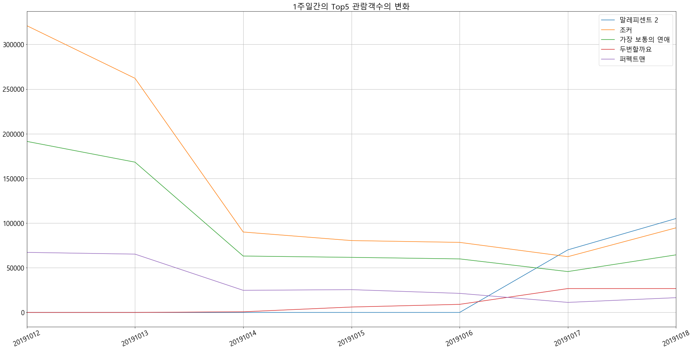

## #네이버 페이 구매내역 가져오기
**more버튼** 통해 동적으로 컨텐츠를 로드하는 페이지 형식

# 네이버 로그인

## Chromedriver 다운로드

크롬 브라우저를 제어할 수 있는 프로그램

https://chromedriver.chromium.org/downloads에서 다운로드
    
현재 사용중인 프라우저 버전에 맞는 파일 선택해야 함

## #01. 필요한 패키지 참조

> pip install --upgrade selenuim


```python
import time                                      #(내장모듈) 브라우저가 페이지를 로딩하는 동안 sleep처리를 하는 모듈
from selenium import webdriver                   # 크롬 제어를 위한 모듈.  동적요소를 제어할 수 있음
from selenium.webdriver.support.wait import WebDriverWait
from bs4 import BeautifulSoup
import pandas as pd
from matplotlib import pyplot
```

## #02.브라우저 제어를 위한 객체 생성

chromedriver.exe의 경로를 상대/절대 경로 형식으로 지정한다.

> 아래 블록이 실행되면 별도의 크롬브라우저가 실행된다. 해당 창을 닫으면 안된다.


```python
# 객체 생성
driver = webdriver.Chrome('chromedriver.exe')
# 암묵적으로 웹 자원 로드를 위해 10초까지 기다려 준다.
driver.implicitly_wait(10)
```

## #03.네이버 로그인하기

1)네이버 로그인 페이지로 이동하기


```python
# 네이버 로그인 페이지 접속
driver.get('https://nid.naver.com/nidlogin.login')
# 접속하는 동안 프로그램 대기(3초)
time.sleep(3)
```

2) 네이버 로그인 아이디, 비밀번호 입력

크롬 브라우저로 하여금 javascript 명령을 실행하도록 한다


```python
myid = 'nice00001'
mypw = ''

# -> 전체문서(document)에서 id값에 의해(ById) 요소(Element)를 가져온 후 (get) 입력값(value)을 지정
script = "document.getElementById('id').value='%s'"
driver.execute_script(script % myid)

script = "document.getElementById('pw').value='%s'"
driver.execute_script(script % mypw)
```

3) 로그인 버튼 클릭


```python
# bs4와 같은 방식으로 CSS 셀렉터가 ".bnt_global"인 요소 취득
btn = driver.find_element_by_css_selector(".btn_global")

# 취득한 버튼을 클릭시킴 --> 로그인
btn.click()

# 로그인 하는 동안 기다려 주기
time.sleep(3)
```

4) 로그인 완료 대기

로그인 후 페이지가 이동도니 후에 id속성이 account인 요소가 로드될 때 까지 최대 10초간 대기


```python
chptcha = driver.find_element_by_css_selector("#chptcha")

if chptcha:
    user_input = input()
    script = "document.getElementById('chptcha').value = '%s'"
    driver.execute_script(script % user_input)
    
    script = "document.getElementById('pw').value='%s'"
    driver.execute_script(script % mypw)
    
    #CSS 셀렉터가 ".btn_global"인 요소 취득하여 클릭함
    driver.find_element_by_css_selector(".btn_global").click()
    
    #접속하는 동안 프로그램 대기(3초)
    time.sleep(3)
```

     4FDY7C6
    

5) 로그인 완료 대기

로그인 후 메인 페이지로 이동한 후, id속성이 account인 요소가 로드될 때까지 최대 10최간 대기


```python
WebDriverWait(driver, 10).until(lambda x: x.find_element_by_id("account"))
```


    <selenium.webdriver.remote.webelement.WebElement (session="3b095f6ea489902e8790607de3d74828", element="0bd058fb-0420-430c-9d14-0b41e8b04a16")>


--------------------------------------------------------------------------
## 04. 네이버 페이 구매내역 가져오기

1) 페이지 이동


```python
#네이버 페이  메인으로 이동
driver.get("https://order.pay.naver.com/home")

#id속성이 'content'인 요소가 표시될 때까지 대기
WebDriverWait(driver, 10).until(lambda x : x.find_element_by_id("content"))
```


    <selenium.webdriver.remote.webelement.WebElement (session="3b095f6ea489902e8790607de3d74828", element="b25c0e5b-3371-4705-92f3-6c98cb7eae09")>


2) 더보기(more) 버튼이 사라질 때까지 계속해서 클릭하기


```python
# "more" 버튼이 사리질 때 까지 무한 반복
while True:
    # 버튼을 감싸고 있는 상위 요소인 "#_moreButton"를 취득 : 크롬 개발자모드에서 볼 수 있음
    more_button = driver.find_element_by_css_selector("#_moreButton")
        
    # 취득한 요소의 HTML 속성들을 딕셔너리 형태로 추출
    attrs = {}
    for item in more_button.get_property('attributes'):
        attrs[item['name']] = item['value']
        
    # more 버튼이 사라졌다면 반복 중단
    if 'style' in attrs:
        break
    
    # more 버튼을 취득하여 강제로 클릭시킴
    driver.find_element_by_css_selector(".button_viewmore").click()
    
    # 다음 컨텐츠가 로드되는 동안 약 2초간 대기
    time.sleep(1)

```

3) 크롬 브라우저에 나타나는 HTML 태그 가져오기


```python
# 가져온 소스코드를 분석하기 위해 BeautifulSoup 객체 생성
soup = BeautifulSoup(driver.page_source, 'html.parser')

#상품정보 요소들의 List를 추출
goods = soup.select('.goods_pay_item')

goods

#브라우져 닫기
#driver.quit()
```


    [<li class="goods_pay_item" id="_rowLi20190911092411CHK2019091122461801">
     <div class="goods_item">
     <a class="goods_thumb" href="/orderStatus/2019091135322511">
      </a><!--N=a:lst.detail-->
     <div class="goods_info">
     <!-- NV_MID:82192407470 -->
     <a class="goods" href="/orderStatus/2019091135322511">
     <p class="name">
     <span class="ico_pointplus"><span class="blind">포인트플러스</span></span>
     							CT202330 [제록스/검정(대용량)/정품토너] DocuPrint M225DW M225Z M265Z P225D P225DB P265DW
     						</p>
     <ul class="info">
     <li><span class="blind">상품금액</span>66,000원</li>
     <li class="date"><span class="blind">상품구매날짜</span> 2019.09.11</li>
     </ul>
     </a><!--N=a:lst.detail-->
     <span class="state _statusName">구매확정</span>
     <p class="guide">
     <!--<p class="guide notify"><b>결제 및 상세 내역 확인 및 취소요청은 <a href="#" class="point_color_green link">교보문고</a>에서 확인하실 수 있습니다.</b><br>(거래완료는 포인트 적립 완료로 확인 가능합니다.)</p>-->
     								구매가 완료되었습니다. 이용해주셔서 감사합니다.<br/>구매확정 이후 <strong>상품의 이용방법, 반품 등에 대한 문의는 판매자에게 문의해주세요.</strong>
     </p>
     </div>
     </div>
     <div class="seller_item">
     <div class="inner">
     <span class="seller">더셀렉션</span>
     <span class="tel">010-4711-9994</span>
     <a class="state_button qna _click(nmp.front.order.timeline.home.list.shoppingInquiry(/merchant/shoppingInquiry/2019091122461801)) _stopDefault" href="#">문의하기</a><!--N=a:lst.qnas-->
     </div>
     </div>
     <div class="button_item">
     <a class="state_button function _click(nmp.front.order.timeline.home.list.userActionPopup(https://shopping.naver.com/reviews/monthly-form?orderNo=2019091135322511&amp;productOrderNos=2019091122461801&amp;returnUrl=https://order.pay.naver.com/review/formCallback)) _stopDefault" href="#">한달사용리뷰쓰기</a>
     <!--N=a:lst.onemonthreview-->
     </div>
     </li>,
     <li class="goods_pay_item" id="_rowLi20190621134051CHK2019062195363581">
     <div class="goods_item">
     <a class="goods_thumb" href="/orderStatus/2019062137870581">
      </a><!--N=a:lst.detail-->
     <div class="goods_info">
     <!-- NV_MID:81391561353 -->
     <a class="goods" href="/orderStatus/2019062137870581">
     <p class="name">
     <span class="ico_pointplus"><span class="blind">포인트플러스</span></span>
     							에스트라 아토베리어 크림 100ml(아토베리어MD크림)
     						</p>
     <ul class="info">
     <li><span class="blind">상품금액</span>54,300원</li>
     <li class="date"><span class="blind">상품구매날짜</span> 2019.06.21</li>
     </ul>
     </a><!--N=a:lst.detail-->
     <span class="state _statusName">구매확정</span>
     <p class="guide">
     <!--<p class="guide notify"><b>결제 및 상세 내역 확인 및 취소요청은 <a href="#" class="point_color_green link">교보문고</a>에서 확인하실 수 있습니다.</b><br>(거래완료는 포인트 적립 완료로 확인 가능합니다.)</p>-->
     								구매가 완료되었습니다. 이용해주셔서 감사합니다.<br/>구매확정 이후 <strong>상품의 이용방법, 반품 등에 대한 문의는 판매자에게 문의해주세요.</strong>
     </p>
     </div>
     </div>
     <div class="seller_item">
     <div class="inner">
     <span class="seller">유산균나라</span>
     <span class="tel">010-9698-6954</span>
     <a class="state_button qna _click(nmp.front.order.timeline.home.list.shoppingInquiry(/merchant/shoppingInquiry/2019062195363581)) _stopDefault" href="#">문의하기</a><!--N=a:lst.qnas-->
     </div>
     </div>
     </li>,
     <li class="goods_pay_item" id="_rowLi20190619125707CHK2019061957235061">
     <div class="goods_item">
     <a class="goods_thumb" href="/orderStatus/2019061914594951">
      </a><!--N=a:lst.detail-->
     <div class="goods_info">
     <!-- NV_MID:81074495517 -->
     <a class="goods" href="/orderStatus/2019061914594951">
     <p class="name">
     <span class="ico_pointplus"><span class="blind">포인트플러스</span></span>
     							포켓몬스터 썬&amp;문/포켓몬 썬문 스페셜 소장판 디럭스 시리즈/초대왕 딱지/랜덤 1개
     						</p>
     <ul class="info">
     <li><span class="blind">상품금액</span>9,600원</li>
     <li class="date"><span class="blind">상품구매날짜</span> 2019.06.19</li>
     </ul>
     </a><!--N=a:lst.detail-->
     <span class="state _statusName">구매확정</span>
     <p class="guide">
     <!--<p class="guide notify"><b>결제 및 상세 내역 확인 및 취소요청은 <a href="#" class="point_color_green link">교보문고</a>에서 확인하실 수 있습니다.</b><br>(거래완료는 포인트 적립 완료로 확인 가능합니다.)</p>-->
     								구매가 완료되었습니다. 이용해주셔서 감사합니다.<br/>구매확정 이후 <strong>상품의 이용방법, 반품 등에 대한 문의는 판매자에게 문의해주세요.</strong>
     </p>
     </div>
     </div>
     <div class="seller_item">
     <div class="inner">
     <span class="seller">한국문구 도매센터</span>
     <span class="tel">010-7324-3113</span>
     <a class="state_button qna _click(nmp.front.order.timeline.home.list.shoppingInquiry(/merchant/shoppingInquiry/2019061957235061)) _stopDefault" href="#">문의하기</a><!--N=a:lst.qnas-->
     </div>
     </div>
     </li>,
     <li class="goods_pay_item" id="_rowLi20190618084743CHK2019061832215081">
     <div class="goods_item">
     <a class="goods_thumb" href="/orderStatus/2019061889477081">
      </a><!--N=a:lst.detail-->
     <div class="goods_info">
     <!-- NV_MID:10876129590 -->
     <a class="goods" href="/orderStatus/2019061889477081">
     <p class="name">
     <span class="ico_pointplus"><span class="blind">포인트플러스</span></span>
     							[가화행거] 5단드레스룸 커튼옷걸이행거 ,바구니형행거LB4503LD
     						</p>
     <ul class="info">
     <li><span class="blind">상품금액</span>92,900원</li>
     <li class="date"><span class="blind">상품구매날짜</span> 2019.06.18</li>
     </ul>
     </a><!--N=a:lst.detail-->
     <span class="state _statusName">구매확정</span>
     <p class="guide">
     <!--<p class="guide notify"><b>결제 및 상세 내역 확인 및 취소요청은 <a href="#" class="point_color_green link">교보문고</a>에서 확인하실 수 있습니다.</b><br>(거래완료는 포인트 적립 완료로 확인 가능합니다.)</p>-->
     								구매가 완료되었습니다. 이용해주셔서 감사합니다.<br/>구매확정 이후 <strong>상품의 이용방법, 반품 등에 대한 문의는 판매자에게 문의해주세요.</strong>
     </p>
     </div>
     </div>
     <div class="seller_item">
     <div class="inner">
     <span class="seller">가화행거샵</span>
     <span class="tel">1577-7911</span>
     <a class="state_button qna _click(nmp.front.order.timeline.home.list.shoppingInquiry(/merchant/shoppingInquiry/2019061832215081)) _stopDefault" href="#">문의하기</a><!--N=a:lst.qnas-->
     </div>
     </div>
     </li>,
     <li class="goods_pay_item" id="_rowLi20190618084743CHK2019061832215071">
     <div class="goods_item">
     <a class="goods_thumb" href="/orderStatus/2019061889477081">
      </a><!--N=a:lst.detail-->
     <div class="goods_info">
     <!-- NV_MID:10855597272 -->
     <a class="goods" href="/orderStatus/2019061889477081">
     <p class="name">
     <span class="ico_pointplus"><span class="blind">포인트플러스</span></span>
     							[가화행거]2등분바구니세트/행거부품
     						</p>
     <ul class="info">
     <li><span class="blind">상품금액</span>36,000원</li>
     <li class="date"><span class="blind">상품구매날짜</span> 2019.06.18</li>
     </ul>
     </a><!--N=a:lst.detail-->
     <span class="state _statusName">구매확정</span>
     <p class="guide">
     <!--<p class="guide notify"><b>결제 및 상세 내역 확인 및 취소요청은 <a href="#" class="point_color_green link">교보문고</a>에서 확인하실 수 있습니다.</b><br>(거래완료는 포인트 적립 완료로 확인 가능합니다.)</p>-->
     								구매가 완료되었습니다. 이용해주셔서 감사합니다.<br/>구매확정 이후 <strong>상품의 이용방법, 반품 등에 대한 문의는 판매자에게 문의해주세요.</strong>
     </p>
     </div>
     </div>
     <div class="seller_item">
     <div class="inner">
     <span class="seller">가화행거샵</span>
     <span class="tel">1577-7911</span>
     <a class="state_button qna _click(nmp.front.order.timeline.home.list.shoppingInquiry(/merchant/shoppingInquiry/2019061832215071)) _stopDefault" href="#">문의하기</a><!--N=a:lst.qnas-->
     </div>
     </div>
     </li>,
     <li class="goods_pay_item" id="_rowLi20190618084743CHK2019061832215061">
     <div class="goods_item">
     <a class="goods_thumb" href="/orderStatus/2019061889477081">
      </a><!--N=a:lst.detail-->
     <div class="goods_info">
     <!-- NV_MID:81691777190 -->
     <a class="goods" href="/orderStatus/2019061889477081">
     <p class="name">
     <span class="ico_pointplus"><span class="blind">포인트플러스</span></span>
     							[가화행거]LB기둥연결 축관파이프
     						</p>
     <ul class="info">
     <li><span class="blind">상품금액</span>5,000원</li>
     <li class="date"><span class="blind">상품구매날짜</span> 2019.06.18</li>
     </ul>
     </a><!--N=a:lst.detail-->
     <span class="state _statusName">구매확정</span>
     <p class="guide">
     <!--<p class="guide notify"><b>결제 및 상세 내역 확인 및 취소요청은 <a href="#" class="point_color_green link">교보문고</a>에서 확인하실 수 있습니다.</b><br>(거래완료는 포인트 적립 완료로 확인 가능합니다.)</p>-->
     								구매가 완료되었습니다. 이용해주셔서 감사합니다.<br/>구매확정 이후 <strong>상품의 이용방법, 반품 등에 대한 문의는 판매자에게 문의해주세요.</strong>
     </p>
     </div>
     </div>
     <div class="seller_item">
     <div class="inner">
     <span class="seller">가화행거샵</span>
     <span class="tel">1577-7911</span>
     <a class="state_button qna _click(nmp.front.order.timeline.home.list.shoppingInquiry(/merchant/shoppingInquiry/2019061832215061)) _stopDefault" href="#">문의하기</a><!--N=a:lst.qnas-->
     </div>
     </div>
     </li>,
     <li class="goods_pay_item" id="_rowLi20190618084743CHK2019061832215051">
     <div class="goods_item">
     <a class="goods_thumb" href="/orderStatus/2019061889477081">
      </a><!--N=a:lst.detail-->
     <div class="goods_info">
     <!-- NV_MID:81691777190 -->
     <a class="goods" href="/orderStatus/2019061889477081">
     <p class="name">
     <span class="ico_pointplus"><span class="blind">포인트플러스</span></span>
     							[가화행거]LB기둥연결 축관파이프
     						</p>
     <ul class="info">
     <li><span class="blind">상품금액</span>8,000원</li>
     <li class="date"><span class="blind">상품구매날짜</span> 2019.06.18</li>
     </ul>
     </a><!--N=a:lst.detail-->
     <span class="state _statusName">구매확정</span>
     <p class="guide">
     <!--<p class="guide notify"><b>결제 및 상세 내역 확인 및 취소요청은 <a href="#" class="point_color_green link">교보문고</a>에서 확인하실 수 있습니다.</b><br>(거래완료는 포인트 적립 완료로 확인 가능합니다.)</p>-->
     								구매가 완료되었습니다. 이용해주셔서 감사합니다.<br/>구매확정 이후 <strong>상품의 이용방법, 반품 등에 대한 문의는 판매자에게 문의해주세요.</strong>
     </p>
     </div>
     </div>
     <div class="seller_item">
     <div class="inner">
     <span class="seller">가화행거샵</span>
     <span class="tel">1577-7911</span>
     <a class="state_button qna _click(nmp.front.order.timeline.home.list.shoppingInquiry(/merchant/shoppingInquiry/2019061832215051)) _stopDefault" href="#">문의하기</a><!--N=a:lst.qnas-->
     </div>
     </div>
     </li>,
     <li class="goods_pay_item" id="_rowLi20190526200042CHK2019052686383741">
     <div class="goods_item">
     <a class="goods_thumb" href="/orderStatus/2019052629767221">
      </a><!--N=a:lst.detail-->
     <div class="goods_info">
     <!-- NV_MID:11150376666 -->
     <a class="goods" href="/orderStatus/2019052629767221">
     <p class="name">
     <span class="ico_pointplus"><span class="blind">포인트플러스</span></span>
     							비닐봉투 5L 10L 20L 30L 50L 70L 100L 일회용비닐봉지
     						</p>
     <ul class="info">
     <li><span class="blind">상품금액</span>6,500원</li>
     <li class="date"><span class="blind">상품구매날짜</span> 2019.05.26</li>
     </ul>
     </a><!--N=a:lst.detail-->
     <span class="state _statusName">구매확정</span>
     <p class="guide">
     <!--<p class="guide notify"><b>결제 및 상세 내역 확인 및 취소요청은 <a href="#" class="point_color_green link">교보문고</a>에서 확인하실 수 있습니다.</b><br>(거래완료는 포인트 적립 완료로 확인 가능합니다.)</p>-->
     								구매가 완료되었습니다. 이용해주셔서 감사합니다.<br/>구매확정 이후 <strong>상품의 이용방법, 반품 등에 대한 문의는 판매자에게 문의해주세요.</strong>
     </p>
     </div>
     </div>
     <div class="seller_item">
     <div class="inner">
     <span class="seller">볼트몰</span>
     <span class="tel">031-963-6614</span>
     <a class="state_button qna _click(nmp.front.order.timeline.home.list.shoppingInquiry(/merchant/shoppingInquiry/2019052686383741)) _stopDefault" href="#">문의하기</a><!--N=a:lst.qnas-->
     </div>
     </div>
     </li>,
     <li class="goods_pay_item" id="_rowLi20190524212028CHK2019052462380001">
     <div class="goods_item">
     <a class="goods_thumb" href="/orderStatus/2019052415044201">
      </a><!--N=a:lst.detail-->
     <div class="goods_info">
     <!-- NV_MID:9633524750 -->
     <a class="goods" href="/orderStatus/2019052415044201">
     <p class="name">
     <span class="ico_pointplus"><span class="blind">포인트플러스</span></span>
     							장수풍뎅이 사슴벌레 키우기세트 먹이 집
     						</p>
     <ul class="info">
     <li><span class="blind">상품금액</span>9,700원</li>
     <li class="date"><span class="blind">상품구매날짜</span> 2019.05.24</li>
     </ul>
     </a><!--N=a:lst.detail-->
     <span class="state _statusName">구매확정</span>
     <p class="guide">
     <!--<p class="guide notify"><b>결제 및 상세 내역 확인 및 취소요청은 <a href="#" class="point_color_green link">교보문고</a>에서 확인하실 수 있습니다.</b><br>(거래완료는 포인트 적립 완료로 확인 가능합니다.)</p>-->
     								구매가 완료되었습니다. 이용해주셔서 감사합니다.<br/>구매확정 이후 <strong>상품의 이용방법, 반품 등에 대한 문의는 판매자에게 문의해주세요.</strong>
     </p>
     </div>
     </div>
     <div class="seller_item">
     <div class="inner">
     <span class="seller">곤충총각</span>
     <span class="tel">010-9174-8674</span>
     <a class="state_button qna _click(nmp.front.order.timeline.home.list.shoppingInquiry(/merchant/shoppingInquiry/2019052462380001)) _stopDefault" href="#">문의하기</a><!--N=a:lst.qnas-->
     </div>
     </div>
     </li>,
     <li class="goods_pay_item" id="_rowLi20190513095104CHK2019051326435171">
     <div class="goods_item">
     <a class="goods_thumb" href="/orderStatus/2019051365304741">
      </a><!--N=a:lst.detail-->
     <div class="goods_info">
     <!-- NV_MID:82038878895 -->
     <a class="goods" href="/orderStatus/2019051365304741">
     <p class="name">
     <span class="ico_pointplus"><span class="blind">포인트플러스</span></span>
     							[현대백화점][매그제이] 심플린넨티셔츠 (J21NTT854)
     						</p>
     <ul class="info">
     <li><span class="blind">상품금액</span>26,910원</li>
     <li class="date"><span class="blind">상품구매날짜</span> 2019.05.13</li>
     </ul>
     </a><!--N=a:lst.detail-->
     <span class="state _statusName">구매확정</span>
     <p class="guide">
     <!--<p class="guide notify"><b>결제 및 상세 내역 확인 및 취소요청은 <a href="#" class="point_color_green link">교보문고</a>에서 확인하실 수 있습니다.</b><br>(거래완료는 포인트 적립 완료로 확인 가능합니다.)</p>-->
     								구매가 완료되었습니다. 이용해주셔서 감사합니다.<br/>구매확정 이후 <strong>상품의 이용방법, 반품 등에 대한 문의는 판매자에게 문의해주세요.</strong>
     </p>
     </div>
     </div>
     <div class="seller_item">
     <div class="inner">
     <span class="seller">더현대닷컴</span>
     <span class="tel">02-1833-5432</span>
     <a class="state_button qna _click(nmp.front.order.timeline.home.list.shoppingInquiry(/merchant/shoppingInquiry/2019051326435171)) _stopDefault" href="#">문의하기</a><!--N=a:lst.qnas-->
     </div>
     </div>
     </li>,
     <li class="goods_pay_item" id="_rowLi20190428223229CHK2019042843945951">
     <div class="goods_item">
     <a class="goods_thumb" href="/orderStatus/2019042892235421">
      </a><!--N=a:lst.detail-->
     <div class="goods_info">
     <!-- NV_MID:12724625931 -->
     <a class="goods" href="/orderStatus/2019042892235421">
     <p class="name">
     							에스트라 아토베리어 크림100ml(병원용MD)
     						</p>
     <ul class="info">
     <li><span class="blind">상품금액</span>27,990원</li>
     <li class="date"><span class="blind">상품구매날짜</span> 2019.04.28</li>
     </ul>
     </a><!--N=a:lst.detail-->
     <span class="state _statusName">구매확정</span>
     <p class="guide">
     <!--<p class="guide notify"><b>결제 및 상세 내역 확인 및 취소요청은 <a href="#" class="point_color_green link">교보문고</a>에서 확인하실 수 있습니다.</b><br>(거래완료는 포인트 적립 완료로 확인 가능합니다.)</p>-->
     								구매가 완료되었습니다. 이용해주셔서 감사합니다.<br/>구매확정 이후 <strong>상품의 이용방법, 반품 등에 대한 문의는 판매자에게 문의해주세요.</strong>
     </p>
     </div>
     </div>
     <div class="seller_item">
     <div class="inner">
     <span class="seller">탑스킨</span>
     <span class="tel">010-9271-6171</span>
     <a class="state_button qna _click(nmp.front.order.timeline.home.list.shoppingInquiry(/merchant/shoppingInquiry/2019042843945951)) _stopDefault" href="#">문의하기</a><!--N=a:lst.qnas-->
     </div>
     </div>
     </li>,
     <li class="goods_pay_item" id="_rowLi20190121140341CHK2019012143688771">
     <div class="goods_item">
     <a class="goods_thumb" href="/orderStatus/2019012188396841">
      </a><!--N=a:lst.detail-->
     <div class="goods_info">
     <!-- NV_MID:6229922804 -->
     <a class="goods" href="/orderStatus/2019012188396841">
     <p class="name">
     <span class="ico_pointplus"><span class="blind">포인트플러스</span></span>
     							비닐봉투 쓰레기 재활용봉투 1~100리터 무료배송
     						</p>
     <ul class="info">
     <li><span class="blind">상품금액</span>10,400원</li>
     <li class="date"><span class="blind">상품구매날짜</span> 2019.01.21</li>
     </ul>
     </a><!--N=a:lst.detail-->
     <span class="state _statusName">구매확정</span>
     <p class="guide">
     <!--<p class="guide notify"><b>결제 및 상세 내역 확인 및 취소요청은 <a href="#" class="point_color_green link">교보문고</a>에서 확인하실 수 있습니다.</b><br>(거래완료는 포인트 적립 완료로 확인 가능합니다.)</p>-->
     								구매가 완료되었습니다. 이용해주셔서 감사합니다.<br/>구매확정 이후 <strong>상품의 이용방법, 반품 등에 대한 문의는 판매자에게 문의해주세요.</strong>
     </p>
     </div>
     </div>
     <div class="seller_item">
     <div class="inner">
     <span class="seller">매직허브</span>
     <span class="tel">031-672-5845</span>
     <a class="state_button qna _click(nmp.front.order.timeline.home.list.shoppingInquiry(/merchant/shoppingInquiry/2019012143688771)) _stopDefault" href="#">문의하기</a><!--N=a:lst.qnas-->
     </div>
     </div>
     </li>,
     <li class="goods_pay_item" id="_rowLi20190121140103CHK2019012143634951">
     <div class="goods_item">
     <a class="goods_thumb" href="/orderStatus/2019012188364301">
      </a><!--N=a:lst.detail-->
     <div class="goods_info">
     <!-- NV_MID:11150376666 -->
     <a class="goods" href="/orderStatus/2019012188364301">
     <p class="name">
     <span class="ico_pointplus"><span class="blind">포인트플러스</span></span>
     							비닐봉투 5L 10L 20L 30L 50L 70L 100L 일회용비닐봉지
     						</p>
     <ul class="info">
     <li><span class="blind">상품금액</span>6,500원</li>
     <li class="date"><span class="blind">상품구매날짜</span> 2019.01.21</li>
     </ul>
     </a><!--N=a:lst.detail-->
     <span class="state _statusName">구매확정</span>
     <p class="guide">
     <!--<p class="guide notify"><b>결제 및 상세 내역 확인 및 취소요청은 <a href="#" class="point_color_green link">교보문고</a>에서 확인하실 수 있습니다.</b><br>(거래완료는 포인트 적립 완료로 확인 가능합니다.)</p>-->
     								구매가 완료되었습니다. 이용해주셔서 감사합니다.<br/>구매확정 이후 <strong>상품의 이용방법, 반품 등에 대한 문의는 판매자에게 문의해주세요.</strong>
     </p>
     </div>
     </div>
     <div class="seller_item">
     <div class="inner">
     <span class="seller">볼트몰</span>
     <span class="tel">031-963-6614</span>
     <a class="state_button qna _click(nmp.front.order.timeline.home.list.shoppingInquiry(/merchant/shoppingInquiry/2019012143634951)) _stopDefault" href="#">문의하기</a><!--N=a:lst.qnas-->
     </div>
     </div>
     </li>,
     <li class="goods_pay_item" id="_rowLi20181130223608CHK2018113069449451">
     <div class="goods_item">
     <a class="goods_thumb" href="/orderStatus/2018113050049551">
      </a><!--N=a:lst.detail-->
     <div class="goods_info">
     <!-- NV_MID:81191381062 -->
     <a class="goods" href="/orderStatus/2018113050049551">
     <p class="name">
     							움직이는 토끼모자 귀모자
     						</p>
     <ul class="info">
     <li><span class="blind">상품금액</span>4,800원</li>
     <li class="date"><span class="blind">상품구매날짜</span> 2018.11.30</li>
     </ul>
     </a><!--N=a:lst.detail-->
     <span class="state _statusName">구매확정</span>
     <p class="guide">
     <!--<p class="guide notify"><b>결제 및 상세 내역 확인 및 취소요청은 <a href="#" class="point_color_green link">교보문고</a>에서 확인하실 수 있습니다.</b><br>(거래완료는 포인트 적립 완료로 확인 가능합니다.)</p>-->
     								구매가 완료되었습니다. 이용해주셔서 감사합니다.<br/>구매확정 이후 <strong>상품의 이용방법, 반품 등에 대한 문의는 판매자에게 문의해주세요.</strong>
     </p>
     </div>
     </div>
     <div class="seller_item">
     <div class="inner">
     <span class="seller">제이킨</span>
     <span class="tel">010-5103-5484</span>
     <a class="state_button qna _click(nmp.front.order.timeline.home.list.shoppingInquiry(/merchant/shoppingInquiry/2018113069449451)) _stopDefault" href="#">문의하기</a><!--N=a:lst.qnas-->
     </div>
     </div>
     </li>,
     <li class="goods_pay_item" id="_rowLi20181122223151CHK2018112240005250">
     <div class="goods_item">
     <a class="goods_thumb" href="/orderStatus/2018112265782940">
      </a><!--N=a:lst.detail-->
     <div class="goods_info">
     <!-- NV_MID:16149207335 -->
     <a class="goods" href="/orderStatus/2018112265782940">
     <p class="name">
     							[DAMON] HS-1300 헤드셋 파우치 
     						</p>
     <ul class="info">
     <li><span class="blind">상품금액</span>16,900원</li>
     <li class="date"><span class="blind">상품구매날짜</span> 2018.11.22</li>
     </ul>
     </a><!--N=a:lst.detail-->
     <span class="state _statusName">구매확정</span>
     <p class="guide">
     <!--<p class="guide notify"><b>결제 및 상세 내역 확인 및 취소요청은 <a href="#" class="point_color_green link">교보문고</a>에서 확인하실 수 있습니다.</b><br>(거래완료는 포인트 적립 완료로 확인 가능합니다.)</p>-->
     								구매가 완료되었습니다. 이용해주셔서 감사합니다.<br/>구매확정 이후 <strong>상품의 이용방법, 반품 등에 대한 문의는 판매자에게 문의해주세요.</strong>
     </p>
     </div>
     </div>
     <div class="seller_item">
     <div class="inner">
     <span class="seller">컴퓨존</span>
     <span class="tel">02-716-5353</span>
     <a class="state_button qna _click(nmp.front.order.timeline.home.list.shoppingInquiry(/merchant/shoppingInquiry/2018112240005250)) _stopDefault" href="#">문의하기</a><!--N=a:lst.qnas-->
     </div>
     </div>
     </li>,
     <li class="goods_pay_item" id="_rowLi20181113150720CHK2018111378070321">
     <div class="goods_item">
     <a class="goods_thumb" href="/orderStatus/2018111367811651">
      </a><!--N=a:lst.detail-->
     <div class="goods_info">
     <!-- NV_MID:12936277521 -->
     <a class="goods" href="/orderStatus/2018111367811651">
     <p class="name">
     							뿌리또 알뜰종이컵 184ml  박스 1000개입
     						</p>
     <ul class="info">
     <li><span class="blind">상품금액</span>15,000원</li>
     <li class="date"><span class="blind">상품구매날짜</span> 2018.11.13</li>
     </ul>
     </a><!--N=a:lst.detail-->
     <span class="state _statusName">구매확정</span>
     <p class="guide">
     <!--<p class="guide notify"><b>결제 및 상세 내역 확인 및 취소요청은 <a href="#" class="point_color_green link">교보문고</a>에서 확인하실 수 있습니다.</b><br>(거래완료는 포인트 적립 완료로 확인 가능합니다.)</p>-->
     								구매가 완료되었습니다. 이용해주셔서 감사합니다.<br/>구매확정 이후 <strong>상품의 이용방법, 반품 등에 대한 문의는 판매자에게 문의해주세요.</strong>
     </p>
     </div>
     </div>
     <div class="seller_item">
     <div class="inner">
     <span class="seller">pulito 뿌리또</span>
     <span class="tel">080-703-0399</span>
     <a class="state_button qna _click(nmp.front.order.timeline.home.list.shoppingInquiry(/merchant/shoppingInquiry/2018111378070321)) _stopDefault" href="#">문의하기</a><!--N=a:lst.qnas-->
     </div>
     </div>
     </li>,
     <li class="goods_pay_item" id="_rowLi20181023143927CHK2018102328236761">
     <div class="goods_item">
     <a class="goods_thumb" href="/orderStatus/2018102349792141">
      </a><!--N=a:lst.detail-->
     <div class="goods_info">
     <!-- NV_MID:12819036458 -->
     <a class="goods" href="/orderStatus/2018102349792141">
     <p class="name">
     							LED 다운라이트 국내산 6인치 LG INNOTEK LED칩 [매립등 매입등 방습 욕실등 화장실등 방습등 천정매립등]
     						</p>
     <ul class="info">
     <li><span class="blind">상품금액</span>11,640원</li>
     <li class="date"><span class="blind">상품구매날짜</span> 2018.10.23</li>
     </ul>
     </a><!--N=a:lst.detail-->
     <span class="state _statusName">구매확정</span>
     <p class="guide">
     <!--<p class="guide notify"><b>결제 및 상세 내역 확인 및 취소요청은 <a href="#" class="point_color_green link">교보문고</a>에서 확인하실 수 있습니다.</b><br>(거래완료는 포인트 적립 완료로 확인 가능합니다.)</p>-->
     								구매가 완료되었습니다. 이용해주셔서 감사합니다.<br/>구매확정 이후 <strong>상품의 이용방법, 반품 등에 대한 문의는 판매자에게 문의해주세요.</strong>
     </p>
     </div>
     </div>
     <div class="seller_item">
     <div class="inner">
     <span class="seller">루온라이팅</span>
     <span class="tel">031-8029-5603</span>
     <a class="state_button qna _click(nmp.front.order.timeline.home.list.shoppingInquiry(/merchant/shoppingInquiry/2018102328236761)) _stopDefault" href="#">문의하기</a><!--N=a:lst.qnas-->
     </div>
     </div>
     </li>,
     <li class="goods_pay_item" id="_rowLi20181009221156CHK2018100993283571">
     <div class="goods_item">
     <a class="goods_thumb" href="/orderStatus/2018100913430911">
      </a><!--N=a:lst.detail-->
     <div class="goods_info">
     <!-- NV_MID:11150376666 -->
     <a class="goods" href="/orderStatus/2018100913430911">
     <p class="name">
     							비닐봉투 5L 10L 20L 30L 50L 70L 100L 일회용비닐봉지
     						</p>
     <ul class="info">
     <li><span class="blind">상품금액</span>6,500원</li>
     <li class="date"><span class="blind">상품구매날짜</span> 2018.10.09</li>
     </ul>
     </a><!--N=a:lst.detail-->
     <span class="state _statusName">구매확정</span>
     <p class="guide">
     <!--<p class="guide notify"><b>결제 및 상세 내역 확인 및 취소요청은 <a href="#" class="point_color_green link">교보문고</a>에서 확인하실 수 있습니다.</b><br>(거래완료는 포인트 적립 완료로 확인 가능합니다.)</p>-->
     								구매가 완료되었습니다. 이용해주셔서 감사합니다.<br/>구매확정 이후 <strong>상품의 이용방법, 반품 등에 대한 문의는 판매자에게 문의해주세요.</strong>
     </p>
     </div>
     </div>
     <div class="seller_item">
     <div class="inner">
     <span class="seller">볼트몰</span>
     <span class="tel">031-963-6614</span>
     <a class="state_button qna _click(nmp.front.order.timeline.home.list.shoppingInquiry(/merchant/shoppingInquiry/2018100993283571)) _stopDefault" href="#">문의하기</a><!--N=a:lst.qnas-->
     </div>
     </div>
     </li>,
     <li class="goods_pay_item" id="_rowLi20180808120931CHK2018080845264531">
     <div class="goods_item">
     <a class="goods_thumb" href="/orderStatus/2018080822936951">
      </a><!--N=a:lst.detail-->
     <div class="goods_info">
     <!-- NV_MID:12029659964 -->
     <a class="goods" href="/orderStatus/2018080822936951">
     <p class="name">
     							집벌레 권연벌레 퇴치법 끈끈이 트랩
     						</p>
     <ul class="info">
     <li><span class="blind">상품금액</span>14,300원</li>
     <li class="date"><span class="blind">상품구매날짜</span> 2018.08.08</li>
     </ul>
     </a><!--N=a:lst.detail-->
     <span class="state _statusName">구매확정</span>
     <p class="guide">
     <!--<p class="guide notify"><b>결제 및 상세 내역 확인 및 취소요청은 <a href="#" class="point_color_green link">교보문고</a>에서 확인하실 수 있습니다.</b><br>(거래완료는 포인트 적립 완료로 확인 가능합니다.)</p>-->
     								구매가 완료되었습니다. 이용해주셔서 감사합니다.<br/>구매확정 이후 <strong>상품의 이용방법, 반품 등에 대한 문의는 판매자에게 문의해주세요.</strong>
     </p>
     </div>
     </div>
     <div class="seller_item">
     <div class="inner">
     <span class="seller">바퀴제로</span>
     <span class="tel">1800-0601</span>
     <a class="state_button qna _click(nmp.front.order.timeline.home.list.shoppingInquiry(/merchant/shoppingInquiry/2018080845264531)) _stopDefault" href="#">문의하기</a><!--N=a:lst.qnas-->
     </div>
     </div>
     </li>,
     <li class="goods_pay_item" id="_rowLi20180529194841CHK2018052999590521">
     <div class="goods_item">
     <a class="goods_thumb" href="/orderStatus/2018052922035601">
      </a><!--N=a:lst.detail-->
     <div class="goods_info">
     <!-- NV_MID:11150376666 -->
     <a class="goods" href="/orderStatus/2018052922035601">
     <p class="name">
     							비닐봉투 5L 10L 20L 30L 50L 70L 100L 일회용비닐봉지
     						</p>
     <ul class="info">
     <li><span class="blind">상품금액</span>6,500원</li>
     <li class="date"><span class="blind">상품구매날짜</span> 2018.05.29</li>
     </ul>
     </a><!--N=a:lst.detail-->
     <span class="state _statusName">구매확정</span>
     <p class="guide">
     <!--<p class="guide notify"><b>결제 및 상세 내역 확인 및 취소요청은 <a href="#" class="point_color_green link">교보문고</a>에서 확인하실 수 있습니다.</b><br>(거래완료는 포인트 적립 완료로 확인 가능합니다.)</p>-->
     								구매가 완료되었습니다. 이용해주셔서 감사합니다.<br/>구매확정 이후 <strong>상품의 이용방법, 반품 등에 대한 문의는 판매자에게 문의해주세요.</strong>
     </p>
     </div>
     </div>
     <div class="seller_item">
     <div class="inner">
     <span class="seller">볼트몰</span>
     <span class="tel">031-963-6614</span>
     <a class="state_button qna _click(nmp.front.order.timeline.home.list.shoppingInquiry(/merchant/shoppingInquiry/2018052999590521)) _stopDefault" href="#">문의하기</a><!--N=a:lst.qnas-->
     </div>
     </div>
     </li>,
     <li class="goods_pay_item" id="_rowLi20180402104139CHK2018040222915080">
     <div class="goods_item">
     <a class="goods_thumb" href="/orderStatus/2018040272609810">
      </a><!--N=a:lst.detail-->
     <div class="goods_info">
     <!-- NV_MID:11867081558 -->
     <a class="goods" href="/orderStatus/2018040272609810">
     <p class="name">
     							핸드폰목걸이줄 분실방지 여행필수품
     						</p>
     <ul class="info">
     <li><span class="blind">상품금액</span>8,000원</li>
     <li class="date"><span class="blind">상품구매날짜</span> 2018.04.02</li>
     </ul>
     </a><!--N=a:lst.detail-->
     <span class="state _statusName value_color_red">반품환불완료</span>
     <p class="guide">
     <!--<p class="guide notify"><b>결제 및 상세 내역 확인 및 취소요청은 <a href="#" class="point_color_green link">교보문고</a>에서 확인하실 수 있습니다.</b><br>(거래완료는 포인트 적립 완료로 확인 가능합니다.)</p>-->
     								환불처리가 완료되었습니다. [반품정보]버튼을 눌러 상세내용을 확인하세요.
     					</p>
     </div>
     </div>
     <div class="seller_item">
     <div class="inner">
     <span class="seller">대한몰</span>
     <span class="tel">070-4740-3401</span>
     <a class="state_button qna _click(nmp.front.order.timeline.home.list.shoppingInquiry(/merchant/shoppingInquiry/2018040222915080)) _stopDefault" href="#">문의하기</a><!--N=a:lst.qnas-->
     </div>
     </div>
     <div class="button_item">
     <a class="state_button function _click(nmp.front.order.timeline.home.list.userActionPopup(/o/orderStatus/deliveryTracking/2018040222915080/BACK_DELIVERY/api)) _stopDefault" href="#">반송조회</a>
     <!--N=a:lst.retracking-->
     <a class="state_button function _click(nmp.front.order.timeline.home.list.userActionPopup(/claim/detail/2018040222915080)) _stopDefault" href="#">반품정보</a>
     <!--N=a:lst.returndetail-->
     </div>
     </li>,
     <li class="goods_pay_item" id="_rowLi20180202181241CHK2018020296015041">
     <div class="goods_item">
     <a class="goods_thumb" href="/orderStatus/2018020261893071">
      </a><!--N=a:lst.detail-->
     <div class="goods_info">
     <!-- NV_MID:11150376666 -->
     <a class="goods" href="/orderStatus/2018020261893071">
     <p class="name">
     							비닐봉투 10L 20L 30L 40L 50L 70L 75L 100L 일회용비닐봉지
     						</p>
     <ul class="info">
     <li><span class="blind">상품금액</span>6,580원</li>
     <li class="date"><span class="blind">상품구매날짜</span> 2018.02.02</li>
     </ul>
     </a><!--N=a:lst.detail-->
     <span class="state _statusName">구매확정</span>
     <p class="guide">
     <!--<p class="guide notify"><b>결제 및 상세 내역 확인 및 취소요청은 <a href="#" class="point_color_green link">교보문고</a>에서 확인하실 수 있습니다.</b><br>(거래완료는 포인트 적립 완료로 확인 가능합니다.)</p>-->
     								구매가 완료되었습니다. 이용해주셔서 감사합니다.<br/>구매확정 이후 <strong>상품의 이용방법, 반품 등에 대한 문의는 판매자에게 문의해주세요.</strong>
     </p>
     </div>
     </div>
     <div class="seller_item">
     <div class="inner">
     <span class="seller">볼트몰</span>
     <span class="tel">031-963-6614</span>
     <a class="state_button qna _click(nmp.front.order.timeline.home.list.shoppingInquiry(/merchant/shoppingInquiry/2018020296015041)) _stopDefault" href="#">문의하기</a><!--N=a:lst.qnas-->
     </div>
     </div>
     </li>,
     <li class="goods_pay_item" id="_rowLi20180202181002CHK2018020295993291">
     <div class="goods_item">
     <a class="goods_thumb" href="/orderStatus/2018020261879131">
      </a><!--N=a:lst.detail-->
     <div class="goods_info">
     <!-- NV_MID:11150376666 -->
     <a class="goods" href="/orderStatus/2018020261879131">
     <p class="name">
     							비닐봉투 10L 20L 30L 40L 50L 70L 75L 100L 일회용비닐봉지
     						</p>
     <ul class="info">
     <li><span class="blind">상품금액</span>6,580원</li>
     <li class="date"><span class="blind">상품구매날짜</span> 2018.02.02</li>
     </ul>
     </a><!--N=a:lst.detail-->
     <span class="state _statusName value_color_red">취소완료</span>
     <p class="guide">
     <!--<p class="guide notify"><b>결제 및 상세 내역 확인 및 취소요청은 <a href="#" class="point_color_green link">교보문고</a>에서 확인하실 수 있습니다.</b><br>(거래완료는 포인트 적립 완료로 확인 가능합니다.)</p>-->
     								취소처리가 완료 되었습니다.
     					</p>
     </div>
     </div>
     <div class="seller_item">
     <div class="inner">
     <span class="seller">볼트몰</span>
     <span class="tel">031-963-6614</span>
     <a class="state_button qna _click(nmp.front.order.timeline.home.list.shoppingInquiry(/merchant/shoppingInquiry/2018020295993291)) _stopDefault" href="#">문의하기</a><!--N=a:lst.qnas-->
     </div>
     </div>
     <div class="button_item">
     <a class="state_button function _click(nmp.front.order.timeline.home.list.userActionPopup(/claim/detail/2018020295993291)) _stopDefault" href="#">취소정보</a>
     <!--N=a:lst.canceldetail-->
     </div>
     </li>,
     <li class="goods_pay_item" id="_rowLi20180114171223CHK2018011447002040">
     <div class="goods_item">
     <a class="goods_thumb" href="/orderStatus/2018011497575630">
      </a><!--N=a:lst.detail-->
     <div class="goods_info">
     <!-- NV_MID: -->
     <a class="goods" href="/orderStatus/2018011497575630">
     <p class="name">
     							찹쌀손약과
     						</p>
     <ul class="info">
     <li><span class="blind">상품금액</span>42,000원</li>
     <li class="date"><span class="blind">상품구매날짜</span> 2018.01.14</li>
     </ul>
     </a><!--N=a:lst.detail-->
     <span class="state _statusName">구매확정</span>
     <p class="guide">
     <!--<p class="guide notify"><b>결제 및 상세 내역 확인 및 취소요청은 <a href="#" class="point_color_green link">교보문고</a>에서 확인하실 수 있습니다.</b><br>(거래완료는 포인트 적립 완료로 확인 가능합니다.)</p>-->
     								구매가 완료되었습니다. 이용해주셔서 감사합니다.<br/>구매확정 이후 <strong>상품의 이용방법, 반품 등에 대한 문의는 판매자에게 문의해주세요.</strong>
     </p>
     </div>
     </div>
     <div class="seller_item">
     <div class="inner">
     <span class="seller">강정이넘치는집</span>
     <span class="tel">02-563-1400</span>
     <a class="state_button qna _click(nmp.front.order.timeline.home.list.shoppingInquiry(/merchant/shoppingInquiry/2018011447002040)) _stopDefault" href="#">문의하기</a><!--N=a:lst.qnas-->
     </div>
     </div>
     </li>,
     <li class="goods_pay_item" id="_rowLi20180114171223CHK2018011447002030">
     <div class="goods_item">
     <a class="goods_thumb" href="/orderStatus/2018011497575630">
      </a><!--N=a:lst.detail-->
     <div class="goods_info">
     <!-- NV_MID: -->
     <a class="goods" href="/orderStatus/2018011497575630">
     <p class="name">
     							찹쌀 생강 유과 (수제한과)
     						</p>
     <ul class="info">
     <li><span class="blind">상품금액</span>12,000원</li>
     <li class="date"><span class="blind">상품구매날짜</span> 2018.01.14</li>
     </ul>
     </a><!--N=a:lst.detail-->
     <span class="state _statusName">구매확정</span>
     <p class="guide">
     <!--<p class="guide notify"><b>결제 및 상세 내역 확인 및 취소요청은 <a href="#" class="point_color_green link">교보문고</a>에서 확인하실 수 있습니다.</b><br>(거래완료는 포인트 적립 완료로 확인 가능합니다.)</p>-->
     								구매가 완료되었습니다. 이용해주셔서 감사합니다.<br/>구매확정 이후 <strong>상품의 이용방법, 반품 등에 대한 문의는 판매자에게 문의해주세요.</strong>
     </p>
     </div>
     </div>
     <div class="seller_item">
     <div class="inner">
     <span class="seller">강정이넘치는집</span>
     <span class="tel">02-563-1400</span>
     <a class="state_button qna _click(nmp.front.order.timeline.home.list.shoppingInquiry(/merchant/shoppingInquiry/2018011447002030)) _stopDefault" href="#">문의하기</a><!--N=a:lst.qnas-->
     </div>
     </div>
     </li>,
     <li class="goods_pay_item" id="_rowLi20171123183910CHK2017112376516651">
     <div class="goods_item">
     <a class="goods_thumb" href="/orderStatus/2017112377105261">
      </a><!--N=a:lst.detail-->
     <div class="goods_info">
     <!-- NV_MID:11691829237 -->
     <a class="goods" href="/orderStatus/2017112377105261">
     <p class="name">
     							카드결제가능-증명사진,여권사진 온라인 주문 출력 및 인화 모바일 신청
     						</p>
     <ul class="info">
     <li><span class="blind">상품금액</span>5,000원</li>
     <li class="date"><span class="blind">상품구매날짜</span> 2017.11.23</li>
     </ul>
     </a><!--N=a:lst.detail-->
     <span class="state _statusName">구매확정</span>
     <p class="guide">
     <!--<p class="guide notify"><b>결제 및 상세 내역 확인 및 취소요청은 <a href="#" class="point_color_green link">교보문고</a>에서 확인하실 수 있습니다.</b><br>(거래완료는 포인트 적립 완료로 확인 가능합니다.)</p>-->
     								구매가 완료되었습니다. 이용해주셔서 감사합니다.<br/>구매확정 이후 <strong>상품의 이용방법, 반품 등에 대한 문의는 판매자에게 문의해주세요.</strong>
     </p>
     </div>
     </div>
     <div class="seller_item">
     <div class="inner">
     <span class="seller">글로우스튜디오</span>
     <span class="tel">070-4200-2916</span>
     <a class="state_button qna _click(nmp.front.order.timeline.home.list.shoppingInquiry(/merchant/shoppingInquiry/2017112376516651)) _stopDefault" href="#">문의하기</a><!--N=a:lst.qnas-->
     </div>
     </div>
     </li>]


## #04. 네이버 페이 주문내역 데이터 분석

1)가져온 HTML로부터 주문내역에 대한 리스트 생성


```python
# 수집 결과를 저장하기 위해 빈 리스트 생성
pay_list = []

#상품정보의 수 만큼 반복
for g in goods:
    name = g.select(".name")[0].text.strip()
    name = name.replace("\n", " ")
    name = name.replace("\t", "")
    name = name.strip()
    #print(name)
    
    price = g.select(".info>li:first-child")[0].text.strip()
    price = price.replace("상품금액","")
    price = price.replace(",", "")
    price = price.replace("원","")
    price = int(price)
    #print(price)
    
    date = g.select(".info > .date")[0].text.strip()
    date = date.replace("상품구매날짜","")
    date = date.strip()
    #print(date)
    
    seller = g.select(".seller")[0].text.strip()
    #print(seller)
    
    seller_tel = g.select(".tel")[0].text.strip()
    #print(select_tel)
    
    #추출한 정보를 딕셔너리로 묶음.
    good_dict = {'구매날짜':date, '상품명':name, '금액':price, '판매처':seller, '연락처':seller_tel}
    #print(good_dict)
    
    #딕셔너리를 리스트에 병함
    pay_list.append(good_dict)
    
pay_list
    
    
```


    [{'구매날짜': '2019.09.11',
      '상품명': '포인트플러스 CT202330 [제록스/검정(대용량)/정품토너] DocuPrint M225DW M225Z M265Z P225D P225DB P265DW',
      '금액': 66000,
      '판매처': '더셀렉션',
      '연락처': '010-4711-9994'},
     {'구매날짜': '2019.06.21',
      '상품명': '포인트플러스 에스트라 아토베리어 크림 100ml(아토베리어MD크림)',
      '금액': 54300,
      '판매처': '유산균나라',
      '연락처': '010-9698-6954'},
     {'구매날짜': '2019.06.19',
      '상품명': '포인트플러스 포켓몬스터 썬&문/포켓몬 썬문 스페셜 소장판 디럭스 시리즈/초대왕 딱지/랜덤 1개',
      '금액': 9600,
      '판매처': '한국문구 도매센터',
      '연락처': '010-7324-3113'},
     {'구매날짜': '2019.06.18',
      '상품명': '포인트플러스 [가화행거] 5단드레스룸 커튼옷걸이행거 ,바구니형행거LB4503LD',
      '금액': 92900,
      '판매처': '가화행거샵',
      '연락처': '1577-7911'},
     {'구매날짜': '2019.06.18',
      '상품명': '포인트플러스 [가화행거]2등분바구니세트/행거부품',
      '금액': 36000,
      '판매처': '가화행거샵',
      '연락처': '1577-7911'},
     {'구매날짜': '2019.06.18',
      '상품명': '포인트플러스 [가화행거]LB기둥연결 축관파이프',
      '금액': 5000,
      '판매처': '가화행거샵',
      '연락처': '1577-7911'},
     {'구매날짜': '2019.06.18',
      '상품명': '포인트플러스 [가화행거]LB기둥연결 축관파이프',
      '금액': 8000,
      '판매처': '가화행거샵',
      '연락처': '1577-7911'},
     {'구매날짜': '2019.05.26',
      '상품명': '포인트플러스 비닐봉투 5L 10L 20L 30L 50L 70L 100L 일회용비닐봉지',
      '금액': 6500,
      '판매처': '볼트몰',
      '연락처': '031-963-6614'},
     {'구매날짜': '2019.05.24',
      '상품명': '포인트플러스 장수풍뎅이 사슴벌레 키우기세트 먹이 집',
      '금액': 9700,
      '판매처': '곤충총각',
      '연락처': '010-9174-8674'},
     {'구매날짜': '2019.05.13',
      '상품명': '포인트플러스 [현대백화점][매그제이] 심플린넨티셔츠 (J21NTT854)',
      '금액': 26910,
      '판매처': '더현대닷컴',
      '연락처': '02-1833-5432'},
     {'구매날짜': '2019.04.28',
      '상품명': '에스트라 아토베리어 크림100ml(병원용MD)',
      '금액': 27990,
      '판매처': '탑스킨',
      '연락처': '010-9271-6171'},
     {'구매날짜': '2019.01.21',
      '상품명': '포인트플러스 비닐봉투 쓰레기 재활용봉투 1~100리터 무료배송',
      '금액': 10400,
      '판매처': '매직허브',
      '연락처': '031-672-5845'},
     {'구매날짜': '2019.01.21',
      '상품명': '포인트플러스 비닐봉투 5L 10L 20L 30L 50L 70L 100L 일회용비닐봉지',
      '금액': 6500,
      '판매처': '볼트몰',
      '연락처': '031-963-6614'},
     {'구매날짜': '2018.11.30',
      '상품명': '움직이는 토끼모자 귀모자',
      '금액': 4800,
      '판매처': '제이킨',
      '연락처': '010-5103-5484'},
     {'구매날짜': '2018.11.22',
      '상품명': '[DAMON] HS-1300 헤드셋 파우치',
      '금액': 16900,
      '판매처': '컴퓨존',
      '연락처': '02-716-5353'},
     {'구매날짜': '2018.11.13',
      '상품명': '뿌리또 알뜰종이컵 184ml  박스 1000개입',
      '금액': 15000,
      '판매처': 'pulito 뿌리또',
      '연락처': '080-703-0399'},
     {'구매날짜': '2018.10.23',
      '상품명': 'LED 다운라이트 국내산 6인치 LG INNOTEK LED칩 [매립등 매입등 방습 욕실등 화장실등 방습등 천정매립등]',
      '금액': 11640,
      '판매처': '루온라이팅',
      '연락처': '031-8029-5603'},
     {'구매날짜': '2018.10.09',
      '상품명': '비닐봉투 5L 10L 20L 30L 50L 70L 100L 일회용비닐봉지',
      '금액': 6500,
      '판매처': '볼트몰',
      '연락처': '031-963-6614'},
     {'구매날짜': '2018.08.08',
      '상품명': '집벌레 권연벌레 퇴치법 끈끈이 트랩',
      '금액': 14300,
      '판매처': '바퀴제로',
      '연락처': '1800-0601'},
     {'구매날짜': '2018.05.29',
      '상품명': '비닐봉투 5L 10L 20L 30L 50L 70L 100L 일회용비닐봉지',
      '금액': 6500,
      '판매처': '볼트몰',
      '연락처': '031-963-6614'},
     {'구매날짜': '2018.04.02',
      '상품명': '핸드폰목걸이줄 분실방지 여행필수품',
      '금액': 8000,
      '판매처': '대한몰',
      '연락처': '070-4740-3401'},
     {'구매날짜': '2018.02.02',
      '상품명': '비닐봉투 10L 20L 30L 40L 50L 70L 75L 100L 일회용비닐봉지',
      '금액': 6580,
      '판매처': '볼트몰',
      '연락처': '031-963-6614'},
     {'구매날짜': '2018.02.02',
      '상품명': '비닐봉투 10L 20L 30L 40L 50L 70L 75L 100L 일회용비닐봉지',
      '금액': 6580,
      '판매처': '볼트몰',
      '연락처': '031-963-6614'},
     {'구매날짜': '2018.01.14',
      '상품명': '찹쌀손약과',
      '금액': 42000,
      '판매처': '강정이넘치는집',
      '연락처': '02-563-1400'},
     {'구매날짜': '2018.01.14',
      '상품명': '찹쌀 생강 유과 (수제한과)',
      '금액': 12000,
      '판매처': '강정이넘치는집',
      '연락처': '02-563-1400'},
     {'구매날짜': '2017.11.23',
      '상품명': '카드결제가능-증명사진,여권사진 온라인 주문 출력 및 인화 모바일 신청',
      '금액': 5000,
      '판매처': '글로우스튜디오',
      '연락처': '070-4200-2916'}]


2) 데이터프레임으로 변환


```python
df = pd.DataFrame(pay_list)
df
```


<div>
<style scoped>
    .dataframe tbody tr th:only-of-type {
        vertical-align: middle;
    }

    .dataframe tbody tr th {
        vertical-align: top;
    }

    .dataframe thead th {
        text-align: right;
    }
</style>
<table border="1" class="dataframe">
  <thead>
    <tr style="text-align: right;">
      <th></th>
      <th>구매날짜</th>
      <th>상품명</th>
      <th>금액</th>
      <th>판매처</th>
      <th>연락처</th>
    </tr>
  </thead>
  <tbody>
    <tr>
      <td>0</td>
      <td>2019.09.11</td>
      <td>포인트플러스 CT202330 [제록스/검정(대용량)/정품토너] DocuPrint M...</td>
      <td>66000</td>
      <td>더셀렉션</td>
      <td>010-4711-9994</td>
    </tr>
    <tr>
      <td>1</td>
      <td>2019.06.21</td>
      <td>포인트플러스 에스트라 아토베리어 크림 100ml(아토베리어MD크림)</td>
      <td>54300</td>
      <td>유산균나라</td>
      <td>010-9698-6954</td>
    </tr>
    <tr>
      <td>2</td>
      <td>2019.06.19</td>
      <td>포인트플러스 포켓몬스터 썬&amp;문/포켓몬 썬문 스페셜 소장판 디럭스 시리즈/초대왕 딱지...</td>
      <td>9600</td>
      <td>한국문구 도매센터</td>
      <td>010-7324-3113</td>
    </tr>
    <tr>
      <td>3</td>
      <td>2019.06.18</td>
      <td>포인트플러스 [가화행거] 5단드레스룸 커튼옷걸이행거 ,바구니형행거LB4503LD</td>
      <td>92900</td>
      <td>가화행거샵</td>
      <td>1577-7911</td>
    </tr>
    <tr>
      <td>4</td>
      <td>2019.06.18</td>
      <td>포인트플러스 [가화행거]2등분바구니세트/행거부품</td>
      <td>36000</td>
      <td>가화행거샵</td>
      <td>1577-7911</td>
    </tr>
    <tr>
      <td>5</td>
      <td>2019.06.18</td>
      <td>포인트플러스 [가화행거]LB기둥연결 축관파이프</td>
      <td>5000</td>
      <td>가화행거샵</td>
      <td>1577-7911</td>
    </tr>
    <tr>
      <td>6</td>
      <td>2019.06.18</td>
      <td>포인트플러스 [가화행거]LB기둥연결 축관파이프</td>
      <td>8000</td>
      <td>가화행거샵</td>
      <td>1577-7911</td>
    </tr>
    <tr>
      <td>7</td>
      <td>2019.05.26</td>
      <td>포인트플러스 비닐봉투 5L 10L 20L 30L 50L 70L 100L 일회용비닐봉지</td>
      <td>6500</td>
      <td>볼트몰</td>
      <td>031-963-6614</td>
    </tr>
    <tr>
      <td>8</td>
      <td>2019.05.24</td>
      <td>포인트플러스 장수풍뎅이 사슴벌레 키우기세트 먹이 집</td>
      <td>9700</td>
      <td>곤충총각</td>
      <td>010-9174-8674</td>
    </tr>
    <tr>
      <td>9</td>
      <td>2019.05.13</td>
      <td>포인트플러스 [현대백화점][매그제이] 심플린넨티셔츠 (J21NTT854)</td>
      <td>26910</td>
      <td>더현대닷컴</td>
      <td>02-1833-5432</td>
    </tr>
    <tr>
      <td>10</td>
      <td>2019.04.28</td>
      <td>에스트라 아토베리어 크림100ml(병원용MD)</td>
      <td>27990</td>
      <td>탑스킨</td>
      <td>010-9271-6171</td>
    </tr>
    <tr>
      <td>11</td>
      <td>2019.01.21</td>
      <td>포인트플러스 비닐봉투 쓰레기 재활용봉투 1~100리터 무료배송</td>
      <td>10400</td>
      <td>매직허브</td>
      <td>031-672-5845</td>
    </tr>
    <tr>
      <td>12</td>
      <td>2019.01.21</td>
      <td>포인트플러스 비닐봉투 5L 10L 20L 30L 50L 70L 100L 일회용비닐봉지</td>
      <td>6500</td>
      <td>볼트몰</td>
      <td>031-963-6614</td>
    </tr>
    <tr>
      <td>13</td>
      <td>2018.11.30</td>
      <td>움직이는 토끼모자 귀모자</td>
      <td>4800</td>
      <td>제이킨</td>
      <td>010-5103-5484</td>
    </tr>
    <tr>
      <td>14</td>
      <td>2018.11.22</td>
      <td>[DAMON] HS-1300 헤드셋 파우치</td>
      <td>16900</td>
      <td>컴퓨존</td>
      <td>02-716-5353</td>
    </tr>
    <tr>
      <td>15</td>
      <td>2018.11.13</td>
      <td>뿌리또 알뜰종이컵 184ml  박스 1000개입</td>
      <td>15000</td>
      <td>pulito 뿌리또</td>
      <td>080-703-0399</td>
    </tr>
    <tr>
      <td>16</td>
      <td>2018.10.23</td>
      <td>LED 다운라이트 국내산 6인치 LG INNOTEK LED칩 [매립등 매입등 방습 ...</td>
      <td>11640</td>
      <td>루온라이팅</td>
      <td>031-8029-5603</td>
    </tr>
    <tr>
      <td>17</td>
      <td>2018.10.09</td>
      <td>비닐봉투 5L 10L 20L 30L 50L 70L 100L 일회용비닐봉지</td>
      <td>6500</td>
      <td>볼트몰</td>
      <td>031-963-6614</td>
    </tr>
    <tr>
      <td>18</td>
      <td>2018.08.08</td>
      <td>집벌레 권연벌레 퇴치법 끈끈이 트랩</td>
      <td>14300</td>
      <td>바퀴제로</td>
      <td>1800-0601</td>
    </tr>
    <tr>
      <td>19</td>
      <td>2018.05.29</td>
      <td>비닐봉투 5L 10L 20L 30L 50L 70L 100L 일회용비닐봉지</td>
      <td>6500</td>
      <td>볼트몰</td>
      <td>031-963-6614</td>
    </tr>
    <tr>
      <td>20</td>
      <td>2018.04.02</td>
      <td>핸드폰목걸이줄 분실방지 여행필수품</td>
      <td>8000</td>
      <td>대한몰</td>
      <td>070-4740-3401</td>
    </tr>
    <tr>
      <td>21</td>
      <td>2018.02.02</td>
      <td>비닐봉투 10L 20L 30L 40L 50L 70L 75L 100L 일회용비닐봉지</td>
      <td>6580</td>
      <td>볼트몰</td>
      <td>031-963-6614</td>
    </tr>
    <tr>
      <td>22</td>
      <td>2018.02.02</td>
      <td>비닐봉투 10L 20L 30L 40L 50L 70L 75L 100L 일회용비닐봉지</td>
      <td>6580</td>
      <td>볼트몰</td>
      <td>031-963-6614</td>
    </tr>
    <tr>
      <td>23</td>
      <td>2018.01.14</td>
      <td>찹쌀손약과</td>
      <td>42000</td>
      <td>강정이넘치는집</td>
      <td>02-563-1400</td>
    </tr>
    <tr>
      <td>24</td>
      <td>2018.01.14</td>
      <td>찹쌀 생강 유과 (수제한과)</td>
      <td>12000</td>
      <td>강정이넘치는집</td>
      <td>02-563-1400</td>
    </tr>
    <tr>
      <td>25</td>
      <td>2017.11.23</td>
      <td>카드결제가능-증명사진,여권사진 온라인 주문 출력 및 인화 모바일 신청</td>
      <td>5000</td>
      <td>글로우스튜디오</td>
      <td>070-4200-2916</td>
    </tr>
  </tbody>
</table>
</div>


3)구매날짜를 DataTime 객체로 변환

구매날짜 컬럼에 대한 타입 확인


```python
df['구매날짜']
```


    0     2019.09.11
    1     2019.06.21
    2     2019.06.19
    3     2019.06.18
    4     2019.06.18
    5     2019.06.18
    6     2019.06.18
    7     2019.05.26
    8     2019.05.24
    9     2019.05.13
    10    2019.04.28
    11    2019.01.21
    12    2019.01.21
    13    2018.11.30
    14    2018.11.22
    15    2018.11.13
    16    2018.10.23
    17    2018.10.09
    18    2018.08.08
    19    2018.05.29
    20    2018.04.02
    21    2018.02.02
    22    2018.02.02
    23    2018.01.14
    24    2018.01.14
    25    2017.11.23
    Name: 구매날짜, dtype: object


구매날짜 컬럼 타입 변환

구매날짜 컬럼 데이터와 현재 형식(format)을 알려주면 그 형식에서 년,월,일을 추출하여 날짜 객체로 반환한다


```python
df['구매날짜'] = pd.to_datetime(df['구매날짜'], format=('%Y.%m.%d'))
df['구매날짜']
```


    0    2019-09-11
    1    2019-06-21
    2    2019-06-19
    3    2019-06-18
    4    2019-06-18
    5    2019-06-18
    6    2019-06-18
    7    2019-05-26
    8    2019-05-24
    9    2019-05-13
    10   2019-04-28
    11   2019-01-21
    12   2019-01-21
    13   2018-11-30
    14   2018-11-22
    15   2018-11-13
    16   2018-10-23
    17   2018-10-09
    18   2018-08-08
    19   2018-05-29
    20   2018-04-02
    21   2018-02-02
    22   2018-02-02
    23   2018-01-14
    24   2018-01-14
    25   2017-11-23
    Name: 구매날짜, dtype: datetime64[ns]


4)구매 날짜별 정렬


```python
df.sort_values('구매날짜',inplace=True)
df
```


<div>
<style scoped>
    .dataframe tbody tr th:only-of-type {
        vertical-align: middle;
    }

    .dataframe tbody tr th {
        vertical-align: top;
    }

    .dataframe thead th {
        text-align: right;
    }
</style>
<table border="1" class="dataframe">
  <thead>
    <tr style="text-align: right;">
      <th></th>
      <th>구매날짜</th>
      <th>상품명</th>
      <th>금액</th>
      <th>판매처</th>
      <th>연락처</th>
    </tr>
  </thead>
  <tbody>
    <tr>
      <td>25</td>
      <td>2017-11-23</td>
      <td>카드결제가능-증명사진,여권사진 온라인 주문 출력 및 인화 모바일 신청</td>
      <td>5000</td>
      <td>글로우스튜디오</td>
      <td>070-4200-2916</td>
    </tr>
    <tr>
      <td>23</td>
      <td>2018-01-14</td>
      <td>찹쌀손약과</td>
      <td>42000</td>
      <td>강정이넘치는집</td>
      <td>02-563-1400</td>
    </tr>
    <tr>
      <td>24</td>
      <td>2018-01-14</td>
      <td>찹쌀 생강 유과 (수제한과)</td>
      <td>12000</td>
      <td>강정이넘치는집</td>
      <td>02-563-1400</td>
    </tr>
    <tr>
      <td>22</td>
      <td>2018-02-02</td>
      <td>비닐봉투 10L 20L 30L 40L 50L 70L 75L 100L 일회용비닐봉지</td>
      <td>6580</td>
      <td>볼트몰</td>
      <td>031-963-6614</td>
    </tr>
    <tr>
      <td>21</td>
      <td>2018-02-02</td>
      <td>비닐봉투 10L 20L 30L 40L 50L 70L 75L 100L 일회용비닐봉지</td>
      <td>6580</td>
      <td>볼트몰</td>
      <td>031-963-6614</td>
    </tr>
    <tr>
      <td>20</td>
      <td>2018-04-02</td>
      <td>핸드폰목걸이줄 분실방지 여행필수품</td>
      <td>8000</td>
      <td>대한몰</td>
      <td>070-4740-3401</td>
    </tr>
    <tr>
      <td>19</td>
      <td>2018-05-29</td>
      <td>비닐봉투 5L 10L 20L 30L 50L 70L 100L 일회용비닐봉지</td>
      <td>6500</td>
      <td>볼트몰</td>
      <td>031-963-6614</td>
    </tr>
    <tr>
      <td>18</td>
      <td>2018-08-08</td>
      <td>집벌레 권연벌레 퇴치법 끈끈이 트랩</td>
      <td>14300</td>
      <td>바퀴제로</td>
      <td>1800-0601</td>
    </tr>
    <tr>
      <td>17</td>
      <td>2018-10-09</td>
      <td>비닐봉투 5L 10L 20L 30L 50L 70L 100L 일회용비닐봉지</td>
      <td>6500</td>
      <td>볼트몰</td>
      <td>031-963-6614</td>
    </tr>
    <tr>
      <td>16</td>
      <td>2018-10-23</td>
      <td>LED 다운라이트 국내산 6인치 LG INNOTEK LED칩 [매립등 매입등 방습 ...</td>
      <td>11640</td>
      <td>루온라이팅</td>
      <td>031-8029-5603</td>
    </tr>
    <tr>
      <td>15</td>
      <td>2018-11-13</td>
      <td>뿌리또 알뜰종이컵 184ml  박스 1000개입</td>
      <td>15000</td>
      <td>pulito 뿌리또</td>
      <td>080-703-0399</td>
    </tr>
    <tr>
      <td>14</td>
      <td>2018-11-22</td>
      <td>[DAMON] HS-1300 헤드셋 파우치</td>
      <td>16900</td>
      <td>컴퓨존</td>
      <td>02-716-5353</td>
    </tr>
    <tr>
      <td>13</td>
      <td>2018-11-30</td>
      <td>움직이는 토끼모자 귀모자</td>
      <td>4800</td>
      <td>제이킨</td>
      <td>010-5103-5484</td>
    </tr>
    <tr>
      <td>12</td>
      <td>2019-01-21</td>
      <td>포인트플러스 비닐봉투 5L 10L 20L 30L 50L 70L 100L 일회용비닐봉지</td>
      <td>6500</td>
      <td>볼트몰</td>
      <td>031-963-6614</td>
    </tr>
    <tr>
      <td>11</td>
      <td>2019-01-21</td>
      <td>포인트플러스 비닐봉투 쓰레기 재활용봉투 1~100리터 무료배송</td>
      <td>10400</td>
      <td>매직허브</td>
      <td>031-672-5845</td>
    </tr>
    <tr>
      <td>10</td>
      <td>2019-04-28</td>
      <td>에스트라 아토베리어 크림100ml(병원용MD)</td>
      <td>27990</td>
      <td>탑스킨</td>
      <td>010-9271-6171</td>
    </tr>
    <tr>
      <td>9</td>
      <td>2019-05-13</td>
      <td>포인트플러스 [현대백화점][매그제이] 심플린넨티셔츠 (J21NTT854)</td>
      <td>26910</td>
      <td>더현대닷컴</td>
      <td>02-1833-5432</td>
    </tr>
    <tr>
      <td>8</td>
      <td>2019-05-24</td>
      <td>포인트플러스 장수풍뎅이 사슴벌레 키우기세트 먹이 집</td>
      <td>9700</td>
      <td>곤충총각</td>
      <td>010-9174-8674</td>
    </tr>
    <tr>
      <td>7</td>
      <td>2019-05-26</td>
      <td>포인트플러스 비닐봉투 5L 10L 20L 30L 50L 70L 100L 일회용비닐봉지</td>
      <td>6500</td>
      <td>볼트몰</td>
      <td>031-963-6614</td>
    </tr>
    <tr>
      <td>6</td>
      <td>2019-06-18</td>
      <td>포인트플러스 [가화행거]LB기둥연결 축관파이프</td>
      <td>8000</td>
      <td>가화행거샵</td>
      <td>1577-7911</td>
    </tr>
    <tr>
      <td>5</td>
      <td>2019-06-18</td>
      <td>포인트플러스 [가화행거]LB기둥연결 축관파이프</td>
      <td>5000</td>
      <td>가화행거샵</td>
      <td>1577-7911</td>
    </tr>
    <tr>
      <td>4</td>
      <td>2019-06-18</td>
      <td>포인트플러스 [가화행거]2등분바구니세트/행거부품</td>
      <td>36000</td>
      <td>가화행거샵</td>
      <td>1577-7911</td>
    </tr>
    <tr>
      <td>3</td>
      <td>2019-06-18</td>
      <td>포인트플러스 [가화행거] 5단드레스룸 커튼옷걸이행거 ,바구니형행거LB4503LD</td>
      <td>92900</td>
      <td>가화행거샵</td>
      <td>1577-7911</td>
    </tr>
    <tr>
      <td>2</td>
      <td>2019-06-19</td>
      <td>포인트플러스 포켓몬스터 썬&amp;문/포켓몬 썬문 스페셜 소장판 디럭스 시리즈/초대왕 딱지...</td>
      <td>9600</td>
      <td>한국문구 도매센터</td>
      <td>010-7324-3113</td>
    </tr>
    <tr>
      <td>1</td>
      <td>2019-06-21</td>
      <td>포인트플러스 에스트라 아토베리어 크림 100ml(아토베리어MD크림)</td>
      <td>54300</td>
      <td>유산균나라</td>
      <td>010-9698-6954</td>
    </tr>
    <tr>
      <td>0</td>
      <td>2019-09-11</td>
      <td>포인트플러스 CT202330 [제록스/검정(대용량)/정품토너] DocuPrint M...</td>
      <td>66000</td>
      <td>더셀렉션</td>
      <td>010-4711-9994</td>
    </tr>
  </tbody>
</table>
</div>


5)년,월 별로 그룹화

"년/월"형식의 값을 갖는 추출한 새로운 컬럼 생성


```python
#DateTime 객체인 구매날짜 컬럼값으로 strftime() 함수를 사용
df['년/월'] = df['구매날짜'].dt.strftime('%Y/%m')
df
```


<div>
<style scoped>
    .dataframe tbody tr th:only-of-type {
        vertical-align: middle;
    }

    .dataframe tbody tr th {
        vertical-align: top;
    }

    .dataframe thead th {
        text-align: right;
    }
</style>
<table border="1" class="dataframe">
  <thead>
    <tr style="text-align: right;">
      <th></th>
      <th>구매날짜</th>
      <th>상품명</th>
      <th>금액</th>
      <th>판매처</th>
      <th>연락처</th>
      <th>년/월</th>
    </tr>
  </thead>
  <tbody>
    <tr>
      <td>25</td>
      <td>2017-11-23</td>
      <td>카드결제가능-증명사진,여권사진 온라인 주문 출력 및 인화 모바일 신청</td>
      <td>5000</td>
      <td>글로우스튜디오</td>
      <td>070-4200-2916</td>
      <td>2017/11</td>
    </tr>
    <tr>
      <td>23</td>
      <td>2018-01-14</td>
      <td>찹쌀손약과</td>
      <td>42000</td>
      <td>강정이넘치는집</td>
      <td>02-563-1400</td>
      <td>2018/01</td>
    </tr>
    <tr>
      <td>24</td>
      <td>2018-01-14</td>
      <td>찹쌀 생강 유과 (수제한과)</td>
      <td>12000</td>
      <td>강정이넘치는집</td>
      <td>02-563-1400</td>
      <td>2018/01</td>
    </tr>
    <tr>
      <td>22</td>
      <td>2018-02-02</td>
      <td>비닐봉투 10L 20L 30L 40L 50L 70L 75L 100L 일회용비닐봉지</td>
      <td>6580</td>
      <td>볼트몰</td>
      <td>031-963-6614</td>
      <td>2018/02</td>
    </tr>
    <tr>
      <td>21</td>
      <td>2018-02-02</td>
      <td>비닐봉투 10L 20L 30L 40L 50L 70L 75L 100L 일회용비닐봉지</td>
      <td>6580</td>
      <td>볼트몰</td>
      <td>031-963-6614</td>
      <td>2018/02</td>
    </tr>
    <tr>
      <td>20</td>
      <td>2018-04-02</td>
      <td>핸드폰목걸이줄 분실방지 여행필수품</td>
      <td>8000</td>
      <td>대한몰</td>
      <td>070-4740-3401</td>
      <td>2018/04</td>
    </tr>
    <tr>
      <td>19</td>
      <td>2018-05-29</td>
      <td>비닐봉투 5L 10L 20L 30L 50L 70L 100L 일회용비닐봉지</td>
      <td>6500</td>
      <td>볼트몰</td>
      <td>031-963-6614</td>
      <td>2018/05</td>
    </tr>
    <tr>
      <td>18</td>
      <td>2018-08-08</td>
      <td>집벌레 권연벌레 퇴치법 끈끈이 트랩</td>
      <td>14300</td>
      <td>바퀴제로</td>
      <td>1800-0601</td>
      <td>2018/08</td>
    </tr>
    <tr>
      <td>17</td>
      <td>2018-10-09</td>
      <td>비닐봉투 5L 10L 20L 30L 50L 70L 100L 일회용비닐봉지</td>
      <td>6500</td>
      <td>볼트몰</td>
      <td>031-963-6614</td>
      <td>2018/10</td>
    </tr>
    <tr>
      <td>16</td>
      <td>2018-10-23</td>
      <td>LED 다운라이트 국내산 6인치 LG INNOTEK LED칩 [매립등 매입등 방습 ...</td>
      <td>11640</td>
      <td>루온라이팅</td>
      <td>031-8029-5603</td>
      <td>2018/10</td>
    </tr>
    <tr>
      <td>15</td>
      <td>2018-11-13</td>
      <td>뿌리또 알뜰종이컵 184ml  박스 1000개입</td>
      <td>15000</td>
      <td>pulito 뿌리또</td>
      <td>080-703-0399</td>
      <td>2018/11</td>
    </tr>
    <tr>
      <td>14</td>
      <td>2018-11-22</td>
      <td>[DAMON] HS-1300 헤드셋 파우치</td>
      <td>16900</td>
      <td>컴퓨존</td>
      <td>02-716-5353</td>
      <td>2018/11</td>
    </tr>
    <tr>
      <td>13</td>
      <td>2018-11-30</td>
      <td>움직이는 토끼모자 귀모자</td>
      <td>4800</td>
      <td>제이킨</td>
      <td>010-5103-5484</td>
      <td>2018/11</td>
    </tr>
    <tr>
      <td>12</td>
      <td>2019-01-21</td>
      <td>포인트플러스 비닐봉투 5L 10L 20L 30L 50L 70L 100L 일회용비닐봉지</td>
      <td>6500</td>
      <td>볼트몰</td>
      <td>031-963-6614</td>
      <td>2019/01</td>
    </tr>
    <tr>
      <td>11</td>
      <td>2019-01-21</td>
      <td>포인트플러스 비닐봉투 쓰레기 재활용봉투 1~100리터 무료배송</td>
      <td>10400</td>
      <td>매직허브</td>
      <td>031-672-5845</td>
      <td>2019/01</td>
    </tr>
    <tr>
      <td>10</td>
      <td>2019-04-28</td>
      <td>에스트라 아토베리어 크림100ml(병원용MD)</td>
      <td>27990</td>
      <td>탑스킨</td>
      <td>010-9271-6171</td>
      <td>2019/04</td>
    </tr>
    <tr>
      <td>9</td>
      <td>2019-05-13</td>
      <td>포인트플러스 [현대백화점][매그제이] 심플린넨티셔츠 (J21NTT854)</td>
      <td>26910</td>
      <td>더현대닷컴</td>
      <td>02-1833-5432</td>
      <td>2019/05</td>
    </tr>
    <tr>
      <td>8</td>
      <td>2019-05-24</td>
      <td>포인트플러스 장수풍뎅이 사슴벌레 키우기세트 먹이 집</td>
      <td>9700</td>
      <td>곤충총각</td>
      <td>010-9174-8674</td>
      <td>2019/05</td>
    </tr>
    <tr>
      <td>7</td>
      <td>2019-05-26</td>
      <td>포인트플러스 비닐봉투 5L 10L 20L 30L 50L 70L 100L 일회용비닐봉지</td>
      <td>6500</td>
      <td>볼트몰</td>
      <td>031-963-6614</td>
      <td>2019/05</td>
    </tr>
    <tr>
      <td>6</td>
      <td>2019-06-18</td>
      <td>포인트플러스 [가화행거]LB기둥연결 축관파이프</td>
      <td>8000</td>
      <td>가화행거샵</td>
      <td>1577-7911</td>
      <td>2019/06</td>
    </tr>
    <tr>
      <td>5</td>
      <td>2019-06-18</td>
      <td>포인트플러스 [가화행거]LB기둥연결 축관파이프</td>
      <td>5000</td>
      <td>가화행거샵</td>
      <td>1577-7911</td>
      <td>2019/06</td>
    </tr>
    <tr>
      <td>4</td>
      <td>2019-06-18</td>
      <td>포인트플러스 [가화행거]2등분바구니세트/행거부품</td>
      <td>36000</td>
      <td>가화행거샵</td>
      <td>1577-7911</td>
      <td>2019/06</td>
    </tr>
    <tr>
      <td>3</td>
      <td>2019-06-18</td>
      <td>포인트플러스 [가화행거] 5단드레스룸 커튼옷걸이행거 ,바구니형행거LB4503LD</td>
      <td>92900</td>
      <td>가화행거샵</td>
      <td>1577-7911</td>
      <td>2019/06</td>
    </tr>
    <tr>
      <td>2</td>
      <td>2019-06-19</td>
      <td>포인트플러스 포켓몬스터 썬&amp;문/포켓몬 썬문 스페셜 소장판 디럭스 시리즈/초대왕 딱지...</td>
      <td>9600</td>
      <td>한국문구 도매센터</td>
      <td>010-7324-3113</td>
      <td>2019/06</td>
    </tr>
    <tr>
      <td>1</td>
      <td>2019-06-21</td>
      <td>포인트플러스 에스트라 아토베리어 크림 100ml(아토베리어MD크림)</td>
      <td>54300</td>
      <td>유산균나라</td>
      <td>010-9698-6954</td>
      <td>2019/06</td>
    </tr>
    <tr>
      <td>0</td>
      <td>2019-09-11</td>
      <td>포인트플러스 CT202330 [제록스/검정(대용량)/정품토너] DocuPrint M...</td>
      <td>66000</td>
      <td>더셀렉션</td>
      <td>010-4711-9994</td>
      <td>2019/09</td>
    </tr>
  </tbody>
</table>
</div>


"년/월"컬럼과 "가격"컬럼만 추출


```python
result_df = df.filter(['년/월','금액'])
result_df
```


<div>
<style scoped>
    .dataframe tbody tr th:only-of-type {
        vertical-align: middle;
    }

    .dataframe tbody tr th {
        vertical-align: top;
    }

    .dataframe thead th {
        text-align: right;
    }
</style>
<table border="1" class="dataframe">
  <thead>
    <tr style="text-align: right;">
      <th></th>
      <th>년/월</th>
      <th>금액</th>
    </tr>
  </thead>
  <tbody>
    <tr>
      <td>25</td>
      <td>2017/11</td>
      <td>5000</td>
    </tr>
    <tr>
      <td>23</td>
      <td>2018/01</td>
      <td>42000</td>
    </tr>
    <tr>
      <td>24</td>
      <td>2018/01</td>
      <td>12000</td>
    </tr>
    <tr>
      <td>22</td>
      <td>2018/02</td>
      <td>6580</td>
    </tr>
    <tr>
      <td>21</td>
      <td>2018/02</td>
      <td>6580</td>
    </tr>
    <tr>
      <td>20</td>
      <td>2018/04</td>
      <td>8000</td>
    </tr>
    <tr>
      <td>19</td>
      <td>2018/05</td>
      <td>6500</td>
    </tr>
    <tr>
      <td>18</td>
      <td>2018/08</td>
      <td>14300</td>
    </tr>
    <tr>
      <td>17</td>
      <td>2018/10</td>
      <td>6500</td>
    </tr>
    <tr>
      <td>16</td>
      <td>2018/10</td>
      <td>11640</td>
    </tr>
    <tr>
      <td>15</td>
      <td>2018/11</td>
      <td>15000</td>
    </tr>
    <tr>
      <td>14</td>
      <td>2018/11</td>
      <td>16900</td>
    </tr>
    <tr>
      <td>13</td>
      <td>2018/11</td>
      <td>4800</td>
    </tr>
    <tr>
      <td>12</td>
      <td>2019/01</td>
      <td>6500</td>
    </tr>
    <tr>
      <td>11</td>
      <td>2019/01</td>
      <td>10400</td>
    </tr>
    <tr>
      <td>10</td>
      <td>2019/04</td>
      <td>27990</td>
    </tr>
    <tr>
      <td>9</td>
      <td>2019/05</td>
      <td>26910</td>
    </tr>
    <tr>
      <td>8</td>
      <td>2019/05</td>
      <td>9700</td>
    </tr>
    <tr>
      <td>7</td>
      <td>2019/05</td>
      <td>6500</td>
    </tr>
    <tr>
      <td>6</td>
      <td>2019/06</td>
      <td>8000</td>
    </tr>
    <tr>
      <td>5</td>
      <td>2019/06</td>
      <td>5000</td>
    </tr>
    <tr>
      <td>4</td>
      <td>2019/06</td>
      <td>36000</td>
    </tr>
    <tr>
      <td>3</td>
      <td>2019/06</td>
      <td>92900</td>
    </tr>
    <tr>
      <td>2</td>
      <td>2019/06</td>
      <td>9600</td>
    </tr>
    <tr>
      <td>1</td>
      <td>2019/06</td>
      <td>54300</td>
    </tr>
    <tr>
      <td>0</td>
      <td>2019/09</td>
      <td>66000</td>
    </tr>
  </tbody>
</table>
</div>


"년/월"컬럼값이 동일한 항목끼리 그룹핑, 가격필드는 합계


```python
result_df = df.groupby('년/월').sum()
result_df
```


<div>
<style scoped>
    .dataframe tbody tr th:only-of-type {
        vertical-align: middle;
    }

    .dataframe tbody tr th {
        vertical-align: top;
    }

    .dataframe thead th {
        text-align: right;
    }
</style>
<table border="1" class="dataframe">
  <thead>
    <tr style="text-align: right;">
      <th></th>
      <th>금액</th>
    </tr>
    <tr>
      <th>년/월</th>
      <th></th>
    </tr>
  </thead>
  <tbody>
    <tr>
      <td>2017/11</td>
      <td>5000</td>
    </tr>
    <tr>
      <td>2018/01</td>
      <td>54000</td>
    </tr>
    <tr>
      <td>2018/02</td>
      <td>13160</td>
    </tr>
    <tr>
      <td>2018/04</td>
      <td>8000</td>
    </tr>
    <tr>
      <td>2018/05</td>
      <td>6500</td>
    </tr>
    <tr>
      <td>2018/08</td>
      <td>14300</td>
    </tr>
    <tr>
      <td>2018/10</td>
      <td>18140</td>
    </tr>
    <tr>
      <td>2018/11</td>
      <td>36700</td>
    </tr>
    <tr>
      <td>2019/01</td>
      <td>16900</td>
    </tr>
    <tr>
      <td>2019/04</td>
      <td>27990</td>
    </tr>
    <tr>
      <td>2019/05</td>
      <td>43110</td>
    </tr>
    <tr>
      <td>2019/06</td>
      <td>205800</td>
    </tr>
    <tr>
      <td>2019/09</td>
      <td>66000</td>
    </tr>
  </tbody>
</table>
</div>


## #05.분석결과 시각화


```python
# 한글폰트, 그래픽 크기 설정
pyplot.rcParams["font.family"] = 'NanumGothic'
pyplot.rcParams["font.size"] = 16
pyplot.rcParams["figure.figsize"] = (24,12)


result_df.plot(rot=30, marker="o")
pyplot.grid()
pyplot.legend()
pyplot.title("네이버페이를 통한 지출현황")
pyplot.xlabel("가격")
pyplot.ylabel("년/월")

xpos = list(range(0, len(result_df.index)))
xvars = list(result_df.index)
pyplot.xticks(xpos, xvars)


# 그래프의 각 좌표에 텍스트 표시하기
for i, v in enumerate(list(result_df['금액'])):
    txt = "%d만원" % (v/10000)
    pyplot.text(i, v, txt, fontsize=14, color ='#ff0000', horizontalalignment='center', verticalalignment='bottom')
    
pyplot.show()
```





```python

```


```python

```


```python

```


```python

```
